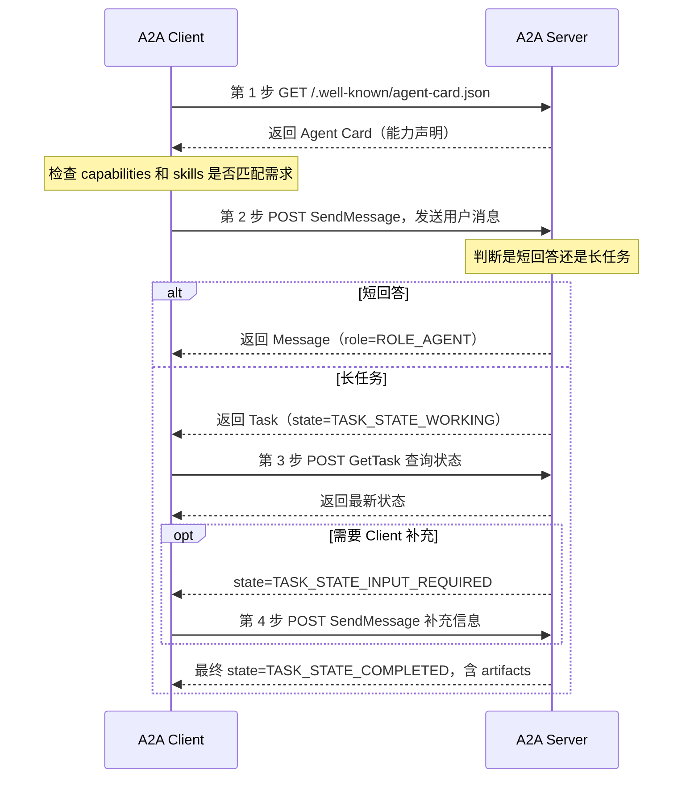

# 协议总览

> **协议详解篇第一节。** [入门篇](./getting-started/00-what-is-a2a.md) 你已经知道 A2A 是什么、两个核心角色、Agent Card 的作用，也跑通了第一次调用。本节给你一张「**协议全景地图**」——把 A2A 的数据模型、通信基础、典型流程、安全和实现脉络一次性串起来。
>
> **本节你将学到**：四大核心对象（Message/Part/Task/Artifact）、JSON-RPC 2.0 通信基础、一次完整的 A2A 流程（发现→发送→处理→补充→产物）、安全边界、从零实现 Server 的清单。
>
> **一句话比喻**：如果入门篇教你「怎么打电话」，本节教你「整个电话系统的网络架构」——从信件格式（Message）到通话流程（生命周期）到保密规则（安全）。

A2A 的全称是 Agent2Agent。它是一套让不同框架、不同语言、不同厂商实现的 AI Agent 互相发现、互相发送任务、交换进度和返回结果的开放协议。

::: tip 本节是地图，不是手册
本节力求让你**看清 A2A 全貌**，每个对象/方法的细节（字段、示例、边界情况）在后续 5 篇专题里展开。看完本节你应该知道「这块东西归哪一章查」。
:::

## 1. A2A 的基础数据模型

A2A 重点围绕四个对象组织：Message、Part、Task、Artifact。

::: tip 四个对象的比喻
把一次 A2A 协作想象成**外包一个项目**：
- **Message** = 你们互通的邮件
- **Part** = 邮件里的附件（文本/文件/数据）
- **Task** = 一个有进度可追踪的工作单
- **Artifact** = 最终交付的成果物
:::

### 1.1 Message

Message 是一次对话消息。它通常包含：

- `messageId`：消息唯一 ID
- `role`：消息角色（**`ROLE_USER`** 来自 Client，**`ROLE_AGENT`** 来自 Server）
- `parts`：消息内容块数组
- `contextId`：可选，用于把一组交互归到同一个上下文
- `taskId`：可选，用于继续某个任务

示例：

```json
{
  "kind": "message",
  "messageId": "msg-001",
  "role": "ROLE_USER",
  "parts": [
    { "text": "请审查这个 PR 的安全风险" }
  ]
}
```

### 1.2 Part

Part 是 Message 或 Artifact 里的内容块。**v1.0 用单一 `Part` 对象**，每个 Part 必须包含 `text` / `raw` / `url` / `data` 四者之一：

| 字段 | 含义 |
|------|------|
| `text` | 纯文本字符串 |
| `raw` | 原始字节（base64 编码的文件内容） |
| `url` | 文件的 URL 引用 |
| `data` | 结构化 JSON 数据 |

示例：结构化数据 Part。

```json
{
  "data": {
    "repository": "example/api",
    "pullRequest": 42
  }
}
```

::: warning v0.x → v1.0 重要变化
旧版 A2A 用 `kind: text/file/data` 来区分 Part 类型，v1.0 **移除了 `kind` discriminator**。现在用「字段名本身」区分——含 `text` 就是文本 Part，含 `data` 就是数据 Part。看到老资料的 `{"kind":"text","text":"..."}` 是 v0.x 写法。
:::

### 1.3 Task

Task 是一次可追踪的工作单元。A2A 特别适合长任务，例如：

- 生成一份报告
- 分析一个代码库
- 等待用户补充信息
- 调用外部系统完成审批

Task 通常包含：

- `id`：任务 ID
- `contextId`：上下文 ID
- `status`：当前状态
- `artifacts`：任务产物
- `history`：可选消息历史
- `metadata`：扩展元数据

#### Task 状态机（v1.0 完整枚举）

| 状态 | 含义 | 是否终态 |
|------|------|---------|
| `TASK_STATE_UNSPECIFIED` | 未指定 | — |
| `TASK_STATE_SUBMITTED` | 已提交，等待处理 | — |
| `TASK_STATE_WORKING` | 正在处理 | — |
| `TASK_STATE_INPUT_REQUIRED` | 需要 Client 补充输入（可中断） | — |
| `TASK_STATE_AUTH_REQUIRED` | 需要完成认证或授权（可中断） | — |
| `TASK_STATE_COMPLETED` | ✅ 已成功完成 | **终态** |
| `TASK_STATE_FAILED` | ❌ 执行失败 | **终态** |
| `TASK_STATE_CANCELED` | 已取消（注意单 L） | **终态** |
| `TASK_STATE_REJECTED` | 被拒绝执行 | **终态** |

::: tip 四个终态
**completed / failed / canceled / rejected** 是终态——进入这四个状态后，任务不能再发消息。`input-required` 和 `auth-required` 是「可中断」状态，Client 补充输入或完成认证后任务可以继续。
:::

### 1.4 Artifact

Artifact 是 Agent 产生的结果（**交付物**）。它可以是：

- 文本回答
- 报告文件
- 图表
- JSON 数据
- 中间产物或最终产物

示例：

```json
{
  "artifactId": "artifact-001",
  "name": "security_review",
  "parts": [
    { "text": "发现 2 个高风险问题和 3 个中风险问题。" }
  ]
}
```

## 2. 通信基础：HTTP + JSON-RPC 2.0

A2A v1.0 支持多种**协议绑定**：JSON-RPC、gRPC、HTTP/REST，以及自定义绑定。最常见的是 **JSON-RPC 2.0 over HTTP**。

一个最小请求：

```json
{
  "jsonrpc": "2.0",
  "id": "req-001",
  "method": "SendMessage",
  "params": {
    "message": {
      "kind": "message",
      "messageId": "msg-001",
      "role": "ROLE_USER",
      "parts": [
        { "text": "你好，请介绍你的能力" }
      ]
    }
  }
}
```

成功响应可能直接返回 Message：

```json
{
  "jsonrpc": "2.0",
  "id": "req-001",
  "result": {
    "kind": "message",
    "messageId": "msg-002",
    "role": "ROLE_AGENT",
    "parts": [
      { "text": "我可以审查代码、分析日志并生成报告。" }
    ]
  }
}
```

也可能返回 Task：

```json
{
  "jsonrpc": "2.0",
  "id": "req-001",
  "result": {
    "kind": "task",
    "id": "task-001",
    "contextId": "ctx-001",
    "status": { "state": "TASK_STATE_WORKING" }
  }
}
```

## 3. 常见协议操作

| 方法（v1.0 PascalCase） | 用途 | 详细文档 |
|------------------------|------|---------|
| `SendMessage` | 发送一条消息，等待 Message 或 Task 返回 | [协议方法 §3](./03-protocol-methods.md) |
| `SendStreamingMessage` | 发送消息，通过 SSE 流式接收多个事件 | 同上 |
| `GetTask` | 查询某个任务的当前状态和结果 | 同上 |
| `ListTasks` | 列出任务（v1.0 新增） | 同上 |
| `CancelTask` | 取消正在执行的任务 | 同上 |
| `SubscribeToTask` | 订阅已有任务的更新 | 同上 |
| `CreateTaskPushNotificationConfig` 等 | 配置 Push Notification 回调 | 同上 |

::: warning v0.x → v1.0 方法名变化
- `message/send` → **`SendMessage`**
- `message/stream` → **`SendStreamingMessage`**
- `tasks/get` → **`GetTask`**
- `tasks/cancel` → **`CancelTask`**
- 新增：**`ListTasks`**、**`SubscribeToTask`**
- `tasks/pushNotification/set` → **`CreateTaskPushNotificationConfig`**（+ Get/List/Delete 一整套）

v1.0 全面 PascalCase 化，对齐 gRPC 命名风格。
:::

### 3.1 `SendMessage`

发送一条消息，等待远程 Agent 返回结果。结果可以是：

- 直接 Message：适合短回答
- Task：适合长任务或需要后续查询

### 3.2 `SendStreamingMessage`

发送消息，并通过流式方式接收多个事件（通常用 SSE）。适用于：

- 实时显示进度
- 返回部分结果
- 长时间运行任务

### 3.3 `GetTask`

查询某个任务的当前状态和结果。

```json
{
  "jsonrpc": "2.0",
  "id": "req-002",
  "method": "GetTask",
  "params": { "id": "task-001" }
}
```

### 3.4 `CancelTask`

请求取消正在执行的任务。

```json
{
  "jsonrpc": "2.0",
  "id": "req-003",
  "method": "CancelTask",
  "params": { "id": "task-001" }
}
```

### 3.5 Push Notification

对于很长的任务，Client 不一定一直保持连接。A2A 支持通过 `CreateTaskPushNotificationConfig` 配置回调，让 Server 在任务变化时回调 Client 指定地址。

实现时要格外注意：

- 回调 URL 必须校验
- 通知内容不能泄露敏感数据
- 应有签名、认证或来源校验
- 失败重试要有上限

## 4. 一次典型 A2A 流程



### 4.1 发现远程 Agent

Client 读取 Agent Card：

```text
GET https://agents.example.com/.well-known/agent-card.json
```

Client 检查：

- Agent 名称和描述是否匹配需求
- 是否支持需要的输入输出模态
- 是否支持 streaming
- 是否需要认证
- 是否有合适的 skill

### 4.2 发送消息

Client 调用 `SendMessage` 或 `SendStreamingMessage`。短任务用前者，长任务或需要进度展示用后者。

### 4.3 处理返回

如果返回 Message，说明远程 Agent 已直接完成回答。

如果返回 Task，Client 保存：`contextId`、`taskId`、当前状态。后续可以通过 `GetTask` 查询，也可以在同一 `contextId` 中继续发消息。

### 4.4 补充输入

如果状态是 `TASK_STATE_INPUT_REQUIRED`，说明远程 Agent 需要更多信息（缺少文件、需要选择范围、需要用户确认、参数不够明确等）。Client 应把问题展示给用户，再把补充内容作为新 Message 发回。

### 4.5 获取最终产物

当状态进入 `TASK_STATE_COMPLETED`，Client 读取 Task 的 `artifacts`。这些 Artifact 才是远程 Agent 的**可消费结果**。

## 5. 安全和权限边界

A2A 让 Agent 能互相协作，但不意味着彼此完全信任。核心原则详见 [安全架构](./04-security-architecture.md)。

### 5.1 认证

远程 Agent 应通过 Agent Card 声明安全要求。生产环境常见方式：Bearer Token、OAuth 2.0、mTLS、企业 API 网关。

### 5.2 授权

认证只说明「是谁」，授权才说明「能做什么」。Client 调用前应确认：这个 Agent 是否允许访问该用户的数据、这个任务是否允许委派给外部系统、返回结果是否可以进入当前上下文。

### 5.3 数据最小化

不要把完整对话、全部文件、所有客户信息直接发给远程 Agent。**只发送完成任务必需的数据。**

### 5.4 不暴露内部推理

A2A 的一个重要原则是 **opaque execution（不透明执行）**：Agent 可以协作，但不需要公开内部思考、私有工具、记忆或编排策略。

### 5.5 人类确认

如果远程 Agent 的结果会触发高风险动作（发邮件、创建工单、修改生产数据、提交代码、执行付款），Host 或 A2A Client 应该把动作展示给用户确认。

## 6. 从 0 实现一个 A2A Server 的清单

第一版不要做复杂。建议先做**只读、无副作用** Agent。

最小能力：

1. 提供 `/.well-known/agent-card.json`
2. 提供 JSON-RPC HTTP 入口
3. 支持 `SendMessage`
4. 能返回简单 Message
5. 错误时返回标准 JSON-RPC error

第二阶段加入：

1. 返回 Task
2. 实现 `GetTask`
3. 实现 `CancelTask`
4. 支持 `SendStreamingMessage`
5. 产出 Artifact

第三阶段再考虑：

1. 认证和授权
2. Push Notification
3. 多租户隔离
4. 审计日志
5. OpenTelemetry 追踪
6. 限流和超时

详见 [实现指南](./05-implementation-guide.md)。

## 7. 常见误区

### 误区一：A2A 是工具调用协议

不是。A2A 的抽象对象是 Agent、Message、Task 和 Artifact。工具调用更适合由 Agent 内部处理。

### 误区二：所有请求都应该变成 Task

不是。短响应直接返回 Message 更简单。只有长任务、需要进度、需要补充输入或异步执行时才需要 Task。

### 误区三：Agent Card 只是文档

不是。Agent Card 是**机器可读的发现与能力声明**。Client 应根据它决定是否连接、如何认证、是否启用流式等。

### 误区四：远程 Agent 可以信任

不能默认信任。远程 Agent 的输出要当作外部输入处理，敏感动作必须经过权限控制和确认。

## 8. 核心术语速查

| 术语 | 含义 |
|------|------|
| A2A | Agent2Agent，智能体到智能体通信协议 |
| A2A Client | 发起请求、委派任务的一方 |
| A2A Server (Remote Agent) | 接收请求、执行任务的一方 |
| Agent Card | 远程 Agent 的机器可读能力说明 |
| Skill | Agent Card 中声明的一项能力 |
| Message | 一条对话消息（role 为 ROLE_USER 或 ROLE_AGENT） |
| Part | Message 或 Artifact 中的内容块（text/raw/url/data） |
| Task | 可追踪的工作单元 |
| Task Status | Task 的当前状态（TASK_STATE_ 前缀枚举） |
| Artifact | Agent 产生的结果或产物 |
| Context ID | 把多条消息和任务归为同一交互上下文的 ID |
| Streaming | 通过流式事件返回进度和中间结果 |
| Push Notification | 长任务状态变化时回调 Client 的机制 |

## 动手实验

1. **跑通流程图**：找一个开源 A2A Server 示例（官方仓库有 Python/JS 实现），按本节流程图走一遍——GET Card → SendMessage → 看返回 Message 还是 Task → 必要时 GetTask。
2. **触发 Task**：构造一个需要长时间处理的请求（如「分析这段长代码」），观察返回从 Message 变成 Task，状态从 `TASK_STATE_WORKING` 流转到 `TASK_STATE_COMPLETED`。
3. **状态枚举对照**：把本节的 Task 状态表打印出来贴在显示器旁，实际调一个会走到 `TASK_STATE_INPUT_REQUIRED` 的场景，体会「可中断」状态。
4. **Agent Card 解读**：找一个真实 A2A Agent 的 Card，逐字段对照本节术语表，找出它的 skills、capabilities、supportedInterfaces。

## 接下来

- [Agent 发现与名片](./01-agent-discovery-card.md) —— Agent Card 全字段深入
- [消息与任务模型](./02-message-task-model.md) —— Message/Part/Task/Artifact 完整模型
- [协议方法](./03-protocol-methods.md) —— 所有 JSON-RPC 方法详解
- [安全架构](./04-security-architecture.md) —— 认证授权、数据最小化、人类确认
- [实现指南](./05-implementation-guide.md) —— 从零实现 Server 与 Client

## 官方参考

- A2A 最新规范：https://a2a-protocol.org/latest/specification/
- A2A 任务生命周期：https://a2a-protocol.org/latest/topics/life-of-a-task/
- A2A 官方仓库：https://github.com/a2aproject/A2A


