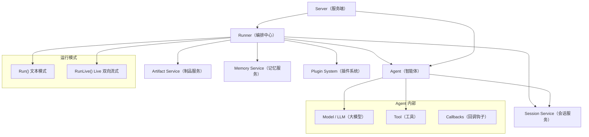
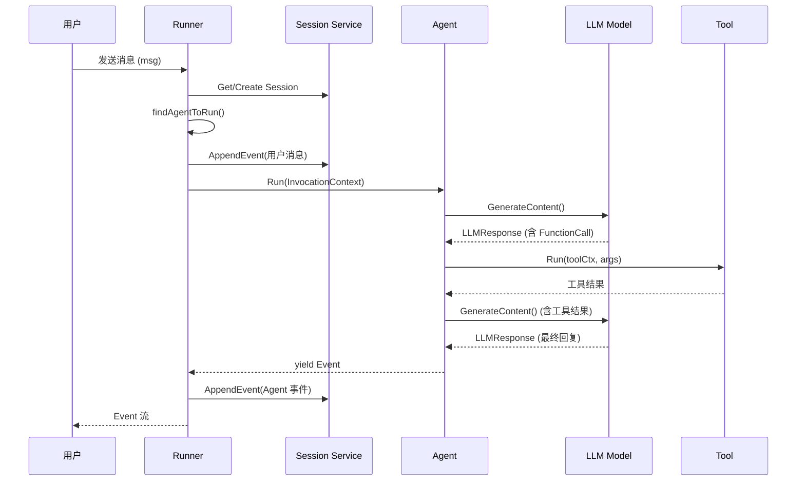
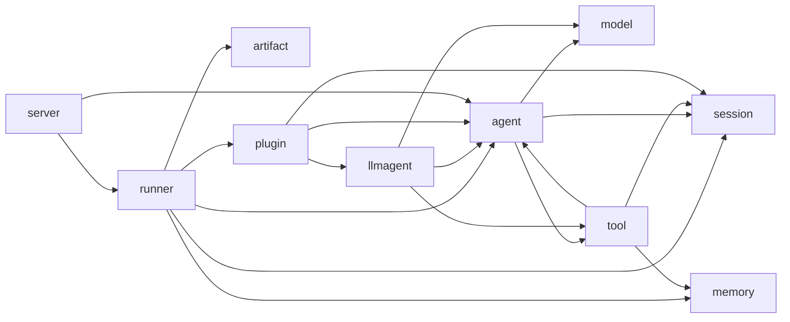
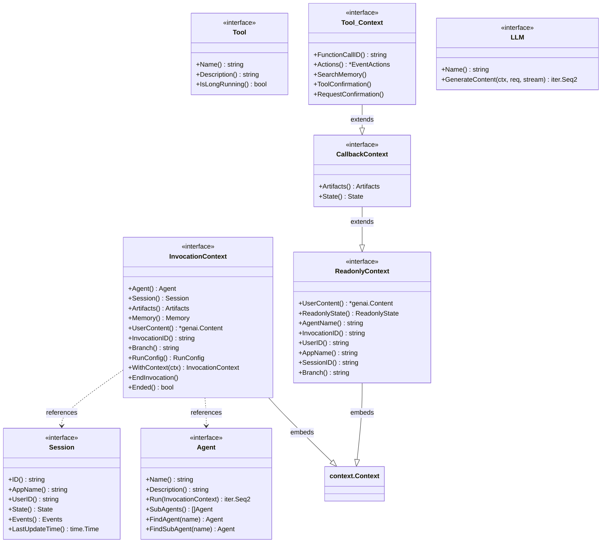

# ADK-Go 整体架构

## 架构总览

ADK-Go 采用分层架构设计，以 Runner 为编排中心，连接各个核心模块。以下是模块关系总览图：



Runner 是整个框架的编排中心，它负责：
1. 根据 Session 历史找到应该处理当前消息的 Agent
2. 构建 InvocationContext，注入 Session、Artifact、Memory 等依赖
3. 驱动 Agent 执行，收集事件流
4. 将非 Partial 事件持久化到 Session Service
5. 触发 Plugin 的生命周期回调

## 核心数据流

一次典型的用户请求处理流程如下：



对应的代码入口在 `source/runner/runner.go:131` 的 `Runner.Run()` 方法。关键步骤：

1. **获取会话**：通过 `sessionService.Get()` 获取已有会话，若启用 `AutoCreateSession` 则自动创建。
2. **定位 Agent**：调用 `findAgentToRun()` 根据会话历史中的最后一条非用户事件，确定应继续对话的 Agent。
3. **构建上下文**：创建 `InvocationContext`，注入 Agent、Session、Artifacts、Memory 等依赖。
4. **写入用户消息**：通过 `appendMessageToSession()` 将用户消息作为事件持久化。
5. **驱动 Agent 执行**：通过 `for event, err := range agentToRun.Run(ctx)` 消费 Agent 的事件迭代器。
6. **持久化事件**：对非 Partial 的事件调用 `sessionService.AppendEvent()` 持久化。
7. **Plugin 拦截**：在事件流中插入 Plugin 的 `RunOnEventCallback()` 处理。

## 模块依赖关系图



值得注意的是 `tool` 包依赖 `agent` 和 `session` 包——这是因为 `tool.Context` 接口嵌入了 `agent.CallbackContext`，使得工具可以访问会话状态和搜索记忆。

## 接口层次

ADK-Go 的核心接口通过 Go 的接口组合（interface embedding）构建层次关系：



关键设计点：
- `InvocationContext` 嵌入 `context.Context`，可在 Go 的 context 传播链中传递。
- `CallbackContext` 继承 `ReadonlyContext`，增加对 Artifacts 和 State 的写权限。
- `tool.Context` 继承 `CallbackContext`，增加 `FunctionCallID()`、`Actions()`、`SearchMemory()` 等工具专用方法。
- `Agent` 接口的 `Run()` 方法返回惰性迭代器，消费者通过 `for range` 消费事件。

## 事件模型

Event 是 ADK-Go 中信息传递的核心数据结构（`source/session/session.go:89`）：

```go
type Event struct {
    model.LLMResponse          // 嵌入 LLM 响应

    ID        string           // 事件唯一 ID
    Timestamp time.Time        // 时间戳
    InvocationID string        // 所属调用的 ID
    Branch    string           // 分支标识（如 "agent_1.agent_2"）
    Author    string           // 事件作者（Agent 名或 "user"）

    Actions   EventActions     // 事件附带的行为
    LongRunningToolIDs []string // 长运行工具 ID 列表
}
```

其中 `EventActions` 包含：

| 字段 | 说明 |
|------|------|
| `StateDelta` | 状态变更（map[string]any） |
| `ArtifactDelta` | 制品变更（文件名 → 版本号） |
| `RequestedToolConfirmations` | 人机确认请求 |
| `SkipSummarization` | 跳过工具响应摘要 |
| `TransferToAgent` | 转移到指定 Agent |
| `Escalate` | 向上级 Agent 升级 |

### IsFinalResponse 判断逻辑

`IsFinalResponse()` 方法（`source/session/session.go:124`）用于判断一个事件是否是 Agent 的最终响应：

```go
func (e *Event) IsFinalResponse() bool {
    if (e.Actions.SkipSummarization) || len(e.LongRunningToolIDs) > 0 {
        return true
    }
    return !hasFunctionCalls(&e.LLMResponse) &&
           !hasFunctionResponses(&e.LLMResponse) &&
           !e.LLMResponse.Partial &&
           !hasTrailingCodeExecutionResult(&e.LLMResponse)
}
```

判断逻辑：如果事件设置了 `SkipSummarization` 或包含长运行工具，则直接为最终响应。否则，只有当事件不包含 FunctionCall、不包含 FunctionResponse、不是 Partial 流式片段、且没有代码执行结果时，才视为最终响应。

## Invocation 生命周期

ADK-Go 定义了三个层次的执行单元（`source/agent/context.go:26-58`）：

```
┌─────────────────────── invocation ──────────────────────────┐
│ ┌──────────── llm_agent_call_1 ────────────┐ ┌─ agent_call_2 ─┐
│ │ ┌──── step_1 ────────┐ ┌───── step_2 ──────┐ │                │
│ │ [call_llm] [call_tool] [call_llm] [transfer] │                │
│ │ └────────────────────┘ └───────────────────┘ │                │
│ └──────────────────────────────────────────────┘ └──────────────┘
└─────────────────────────────────────────────────────────────────┘
```

- **Invocation（调用）**：从用户消息开始，到最终响应结束。由 `Runner.Run()` 处理。一个 Invocation 可包含多个 Agent Call（当 Agent 之间发生转移时）。
- **Agent Call（Agent 调用）**：由 `Agent.Run()` 处理，在 `Run()` 返回时结束。
- **Step（步骤）**：一次 LLM 调用 + 可能的工具调用。LLMAgent 在循环中执行 Step，直到生成最终响应、转移到其他 Agent 或调用 `EndInvocation()`。

调用 `EndInvocation()` 可以在任何层次提前终止执行，这在回调中特别有用——例如 `BeforeAgentCallback` 返回非空内容时会自动调用 `EndInvocation()`。

## 可扩展性设计

ADK-Go 通过 Service 接口和 Plugin 系统实现可扩展性：

### Service 接口

三个核心 Service 接口均可替换实现：

```go
// 会话服务 - 管理会话的 CRUD 和事件持久化
type Service interface {
    Create(ctx, req) (*CreateResponse, error)
    Get(ctx, req) (*GetResponse, error)
    List(ctx, req) (*ListResponse, error)
    Delete(ctx, req) error
    AppendEvent(ctx, session, event) error
}

// 记忆服务 - 管理跨会话的语义记忆
type Service interface {
    AddSessionToMemory(ctx, session) error
    SearchMemory(ctx, req) (*SearchResponse, error)
}

// 制品服务 - 管理二进制制品的存储
type Service interface {
    Save(ctx, req) (*SaveResponse, error)
    Load(ctx, req) (*LoadResponse, error)
    Delete(ctx, req) error
    List(ctx, req) (*ListResponse, error)
    Versions(ctx, req) (*VersionsResponse, error)
    GetArtifactVersion(ctx, req) (*GetArtifactVersionResponse, error)
}
```

ADK-Go 内置了基于内存的 InMemory 实现，适合开发调试。生产环境可以替换为 Redis、PostgreSQL、GCS 等后端。

### Plugin 系统

Plugin 提供了全局生命周期钩子：

| 回调 | 触发时机 | 用途 |
|------|---------|------|
| `BeforeRunCallback` | Runner.Run() 开始前 | 请求拦截、参数校验 |
| `AfterRunCallback` | Runner.Run() 结束后 | 日志、指标收集 |
| `OnEventCallback` | 每个事件产生时 | 事件修改、审计 |
| `OnUserMessageCallback` | 用户消息写入前 | 消息过滤、改写 |
| `BeforeAgentCallback` | Agent 执行前 | Agent 级拦截 |
| `AfterAgentCallback` | Agent 执行后 | Agent 级后处理 |

Plugin 通过 `plugininternal.PluginManager` 统一管理，回调按注册顺序执行，任何回调返回非空结果都会中断后续回调链。
