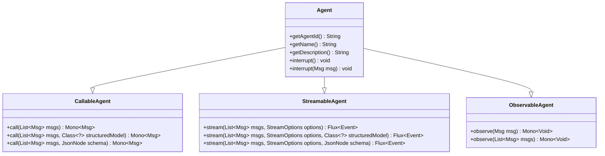
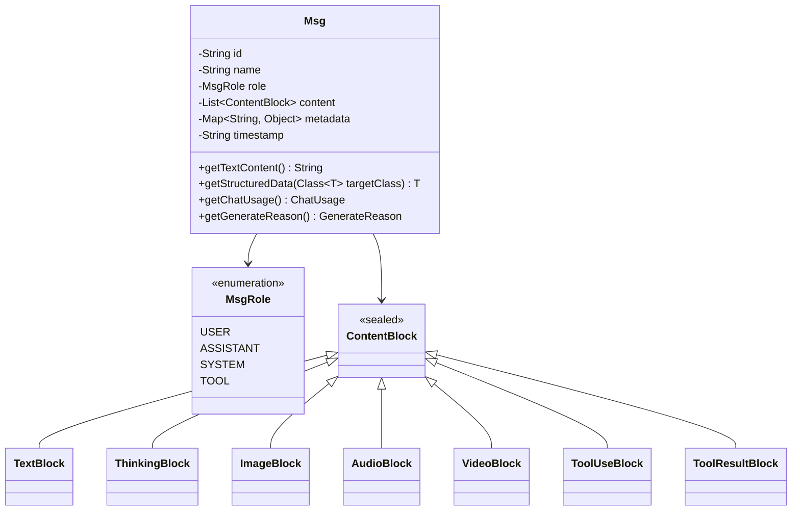
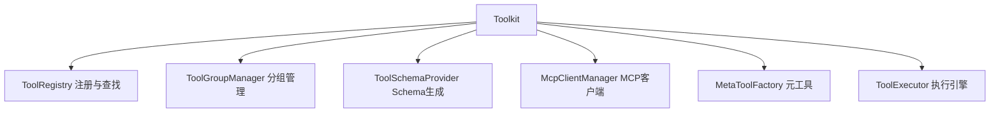
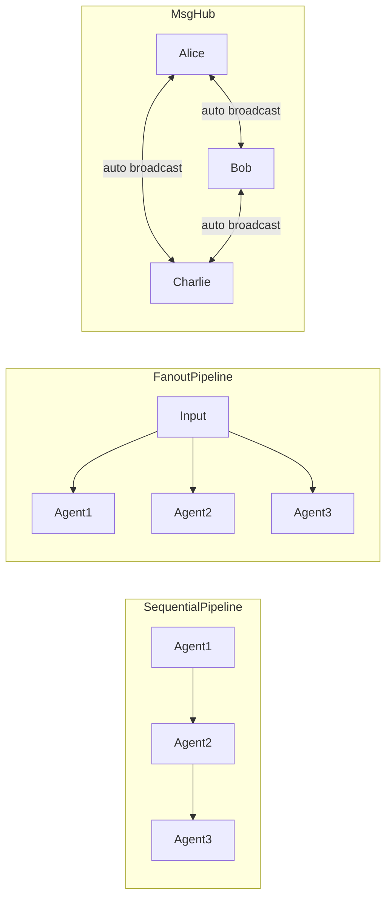

# AgentScope Java 项目总览

## 1. 项目简介

AgentScope Java 是阿里巴巴开源的 AI Agent 框架的 Java 实现，基于 **Project Reactor** 响应式编程模型构建。该框架提供了一套完整的 Agent 开发工具链，涵盖模型调用、工具集成、记忆管理、Hook 事件观测以及多 Agent 编排等核心能力。

与 Python 版本的 AgentScope 不同，Java 版本从零开始设计，充分利用 JVM 生态中的响应式流（Reactor）、密封类型（sealed class）、注解处理（annotation processing）等特性，在类型安全和异步性能方面做了深度优化。

**核心仓库路径**：`agentscope-core/src/main/java/io/agentscope/core/`

## 2. 设计哲学

### 2.1 响应式优先

整个框架基于 Project Reactor 构建，核心数据流以 `Mono<Msg>` 和 `Flux<Event>` 为一等公民：

- **同步调用**：`Agent.call() → Mono<Msg>`（`CallableAgent.java:114`）
- **流式调用**：`Agent.stream() → Flux<Event>`（`StreamableAgent.java:131`）
- **观察模式**：`Agent.observe() → Mono<Void>`（`ObservableAgent.java:44`）

响应式模型带来的优势：
- 天然支持 LLM 流式输出（SSE），无需额外适配
- 非阻塞 I/O，适合高并发场景
- 背压（backpressure）支持，防止消费者过载

### 2.2 类型安全

框架广泛使用 Java 17+ 的 sealed class/interface 和泛型，确保编译期类型检查：

- **ContentBlock 密封类型**（`ContentBlock.java:54`）：7 种内容块通过 `permits` 子句穷举，支持 switch 模式匹配
- **HookEvent 密封类型**（`HookEvent.java:74`）：6 种事件基类，保证 Hook 实现覆盖所有场景
- **泛型约束**：`<T extends HookEvent> Mono<T> onEvent(T event)`（`Hook.java:147`）

### 2.3 可观测性

Hook 事件体系是框架的核心观测机制，12 种事件时机覆盖 Agent 执行的全生命周期（`HookEventType.java:27`）：

| 事件类型 | 触发时机 | 可修改 |
|---------|---------|-------|
| PRE_CALL | Agent 开始处理前 | 是 |
| POST_CALL | Agent 完成处理后 | 是 |
| PRE_REASONING | LLM 推理前 | 是 |
| POST_REASONING | LLM 推理完成后 | 是 |
| REASONING_CHUNK | LLM 流式输出中 | 否 |
| PRE_ACTING | 工具执行前 | 是 |
| POST_ACTING | 工具执行完成后 | 是 |
| ACTING_CHUNK | 工具流式输出中 | 否 |
| ERROR | 发生错误时 | 否 |
| PRE_SUMMARY | 摘要生成前 | 是 |
| POST_SUMMARY | 摘要生成后 | 是 |
| SUMMARY_CHUNK | 摘要流式输出中 | 否 |

## 3. 核心概念

### 3.1 Agent 接口组合

Agent 采用接口组合设计，由三个正交能力接口组合而成（`Agent.java:41`）：



- **CallableAgent**（`CallableAgent.java:35`）：核心调用能力，支持普通调用和结构化输出
- **StreamableAgent**（`StreamableAgent.java:36`）：流式事件发射能力
- **ObservableAgent**（`ObservableAgent.java:36`）：被动观察能力，用于多 Agent 协作
- **Agent**（`Agent.java:41`）：组合接口，加入身份标识（agentId/name）和中断机制

**关键实现类**：
- `ReActAgent`（`ReActAgent.java:140`）：核心 ReAct 循环实现，具备记忆、工具调用、结构化输出能力
- `UserAgent`（`UserAgent.java:68`）：用户输入代理，桥接外部输入与消息系统
- `AgentBase`（`AgentBase.java:93`）：抽象基类，提供 Hook 管理、中断处理、MsgHub 订阅等基础设施

### 3.2 Msg + ContentBlock

**Msg**（`Msg.java:53`）是框架中所有通信的基本单元，包含角色（role）、内容块列表（content）、元数据（metadata）和时间戳：



7 种 ContentBlock（`ContentBlock.java:54-60`）：
- **TextBlock**：纯文本内容
- **ThinkingBlock**：推理/思考内容（如 DeepSeek 的思维链）
- **ImageBlock**：图片（URL 或 Base64）
- **AudioBlock**：音频（URL 或 Base64）
- **VideoBlock**：视频（URL 或 Base64）
- **ToolUseBlock**：工具调用请求
- **ToolResultBlock**：工具执行结果

MsgRole（`MsgRole.java:35`）定义了 4 种角色：USER、ASSISTANT、SYSTEM、TOOL。

### 3.3 Model 模型体系

**Model**（`Model.java:22`）接口定义了模型的核心契约——流式推理：

```java
Flux<ChatResponse> stream(List<Msg> messages, List<ToolSchema> tools, GenerateOptions options);
```

5 种内置模型实现：

| 模型类 | 供应商 | 关键特性 |
|-------|-------|---------|
| `OpenAIChatModel` | OpenAI | 标准 OpenAI API 兼容 |
| `DashScopeChatModel` | 阿里云 DashScope | 支持 qwen 系列模型 |
| `GeminiChatModel` | Google Gemini | Gemini API 适配 |
| `AnthropicChatModel` | Anthropic | Claude 系列模型 |
| `OllamaChatModel` | Ollama | 本地模型部署 |

**ModelRegistry**（`ModelRegistry.java:35`）是模型注册与解析中心，支持三种解析路径：
1. 命名注册：`ModelRegistry.register("my-model", modelInstance)`（`:114`）
2. Provider 模式：`ModelRegistry.resolve("openai:gpt-4o")`（`:142`）
3. 自定义工厂：`ModelRegistry.registerFactory("custom:.+", factory)`（`:129`）

内置 Provider 自动读取环境变量：`OPENAI_API_KEY`、`DASHSCOPE_API_KEY`、`GEMINI_API_KEY`、`ANTHROPIC_API_KEY`、`OLLAMA_BASE_URL`（`ModelRegistry.java:43-106`）。

### 3.4 Tool 工具体系

工具体系采用 **注解驱动 + 门面模式** 设计：

**@Tool 注解**（`Tool.java:60`）标注方法为可调用工具：
```java
@Tool(name = "get_weather", description = "获取天气信息")
public String getWeather(@ToolParam(name = "city", description = "城市名") String city) { ... }
```

**@ToolParam 注解**（`ToolParam.java:62`）描述工具参数，支持 required 和 description 属性。

**Toolkit**（`Toolkit.java:66`）是工具管理的门面类，内部委托给多个专职管理器：



**MCP 集成**（`McpTool.java:57`）：通过 `McpClientWrapper` 桥接 MCP 协议工具，支持预设参数注入和结果转换。

**SubAgent 工具**（`SubAgentTool`）：将子 Agent 注册为工具，支持多轮会话和事件转发。

### 3.5 Hook 事件体系

Hook（`Hook.java:117`）接口采用统一事件模型，所有事件通过单一 `onEvent` 方法分发：

```java
<T extends HookEvent> Mono<T> onEvent(T event);
```

Hook 特性：
- **优先级排序**（`Hook.java:183`）：`priority()` 值越小优先级越高，默认 100
- **可修改事件**：带 setter 的事件（如 PreReasoningEvent）允许 Hook 修改执行上下文
- **只通知事件**：无 setter 的事件（如 ReasoningChunkEvent）仅用于观测
- **工具注册**（`Hook.java:163`）：`tools()` 方法返回 Hook 附带的工具列表，构建时自动注册
- **系统消息统一管理**（`HookEvent.java:140-204`）：所有事件共享 `systemMsg` 字段，通过 `appendSystemContent()` 追加

### 3.6 Memory 记忆体系

**Memory**（`Memory.java:29`）接口定义短期记忆的核心操作：`addMessage`、`getMessages`、`deleteMessage`、`clear`。

**InMemoryMemory**（`InMemoryMemory.java`）：基于 `ArrayList` 的默认内存实现。

**LongTermMemory**（`LongTermMemory.java:67`）接口定义长期记忆的两个核心操作：
- `record(List<Msg>)`：记录消息到长期记忆
- `retrieve(Msg)`：根据输入检索相关记忆

长期记忆支持三种模式（`LongTermMemoryMode`）：
- **STATIC_CONTROL**：框架自动调用 record/retrieve
- **AGENT_CONTROL**：Agent 通过 LongTermMemoryTools 主动管理
- **BOTH**：两种模式并存

扩展实现包括 **ReMe**（`agentscope-extensions-reme`）长期记忆方案。

### 3.7 Pipeline 编排

Pipeline（`Pipeline.java:29`）接口定义了 Agent 编排的基本契约：

- **SequentialPipeline**（`SequentialPipeline.java:39`）：链式执行，前一 Agent 输出作为后一 Agent 输入
- **FanoutPipeline**（`FanoutPipeline.java:49`）：扇出执行，同一输入广播到多个 Agent，收集所有结果
- **MsgHub**（`MsgHub.java:100`）：消息中心，自动广播参与者消息，支持 try-with-resources 生命周期管理



## 4. 模块总览表

| 包路径 | 职责 | 关键类 |
|-------|------|-------|
| `io.agentscope.core.agent` | Agent 接口与基类 | `Agent`, `AgentBase`, `CallableAgent`, `StreamableAgent`, `ObservableAgent` |
| `io.agentscope.core.agent.user` | 用户输入代理 | `UserAgent`, `UserInputBase`, `StreamUserInput` |
| `io.agentscope.core.agent.accumulator` | 流式内容累加器 | `TextAccumulator`, `ThinkingAccumulator`, `ToolCallsAccumulator` |
| `io.agentscope.core.message` | 消息与内容块 | `Msg`, `ContentBlock`, `TextBlock`, `ToolUseBlock`, `ToolResultBlock` |
| `io.agentscope.core.model` | LLM 模型适配 | `Model`, `ModelRegistry`, `OpenAIChatModel`, `DashScopeChatModel` |
| `io.agentscope.core.tool` | 工具注解与注册 | `@Tool`, `@ToolParam`, `Toolkit`, `AgentTool`, `ToolExecutor` |
| `io.agentscope.core.tool.mcp` | MCP 协议集成 | `McpTool`, `McpClientWrapper`, `McpClientBuilder` |
| `io.agentscope.core.tool.subagent` | 子Agent工具 | `SubAgentTool`, `SubAgentProvider`, `SubAgentConfig` |
| `io.agentscope.core.hook` | 事件观测与拦截 | `Hook`, `HookEvent`, `HookEventType`, `PreReasoningEvent` |
| `io.agentscope.core.memory` | 记忆管理 | `Memory`, `InMemoryMemory`, `LongTermMemory` |
| `io.agentscope.core.pipeline` | Agent 编排 | `SequentialPipeline`, `FanoutPipeline`, `MsgHub` |
| `io.agentscope.core.session` | 会话持久化 | `Session`, `InMemorySession`, `JsonSession` |
| `io.agentscope.core.state` | 状态管理 | `State`, `StateModule`, `StatePersistence` |
| `io.agentscope.core.tracing` | 链路追踪 | `Tracer`, `TracerRegistry`, `NoopTracer` |
| `io.agentscope.core.shutdown` | 优雅停机 | `GracefulShutdownManager`, `GracefulShutdownHook` |
| `io.agentscope.core.rag` | 检索增强生成 | `Knowledge`, `GenericRAGHook`, `KnowledgeRetrievalTools` |
| `io.agentscope.core.skill` | 技能管理 | `SkillBox`, `SkillRegistry`, `AgentSkill` |
| `io.agentscope.core.plan` | 计划笔记本 | `PlanNotebook` |
| `io.agentscope.core.interruption` | 中断上下文 | `InterruptContext`, `InterruptSource` |

## 5. 与 adk-go/eino 对比

| 维度 | AgentScope Java | Google adk-go | 字节 Eino |
|------|----------------|---------------|----------|
| **编程范式** | 响应式（Mono/Flux） | 迭代器/Channel | 迭代器/流式 |
| **类型安全** | sealed class + 泛型 | Go interface | Go interface |
| **工具定义** | @Tool 注解 + 反射 | 函数签名推断 | 接口声明 |
| **事件体系** | 12 种 Hook 事件，优先级排序 | 回调函数 | 回调函数 |
| **模型适配** | 5 种内置 + 注册中心 | OpenAI 为主 | OpenAI 为主 |
| **编排模式** | Sequential/Fanout/MsgHub | Pipeline/Workflow | Chain/Graph |
| **生态优势** | JVM 生态成熟库丰富 | Go 轻量高性能 | Go 云原生友好 |
| **流式支持** | 原生 Reactor 背压 | goroutine + channel | goroutine + channel |
| **状态管理** | Session + StateModule | 无内置 | 无内置 |
| **中断恢复** | AtomicBoolean + interrupt flag | Context cancel | Context cancel |

**AgentScope Java 的差异化优势**：
1. **响应式全栈**：从模型调用到工具执行，全链路 Reactor，天然适配 WebFlux/Spring WebFlux
2. **注解驱动工具**：`@Tool` + `@ToolParam` 声明式定义，零样板代码
3. **JVM 生态**：可直接集成 Spring Boot、GraalVM、Hadoop、Spark 等企业级中间件
4. **密封类型**：编译期穷举检查，避免遗漏分支，提升代码可靠性
5. **Hook 可修改性**：事件不仅是观测，更可通过 setter 修改执行行为（注入提示词、拦截工具调用等）
