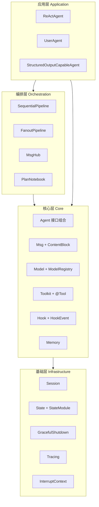
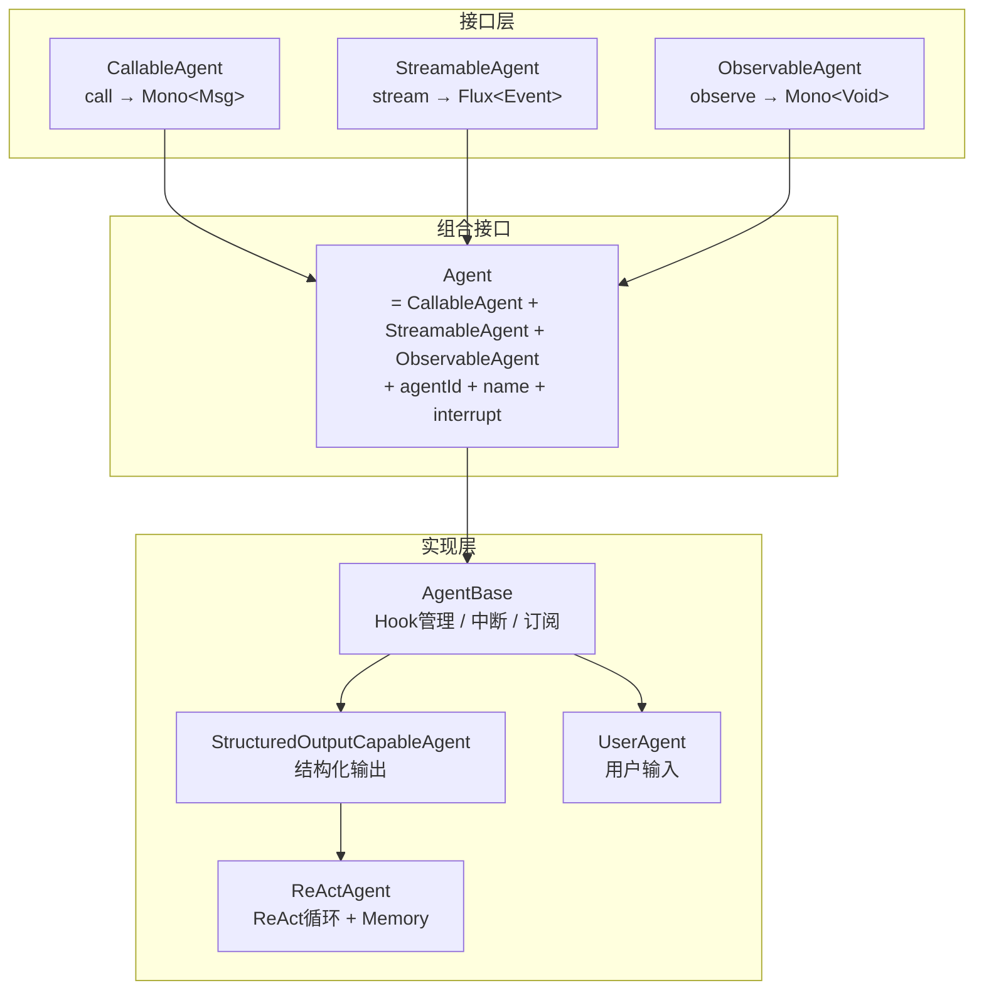
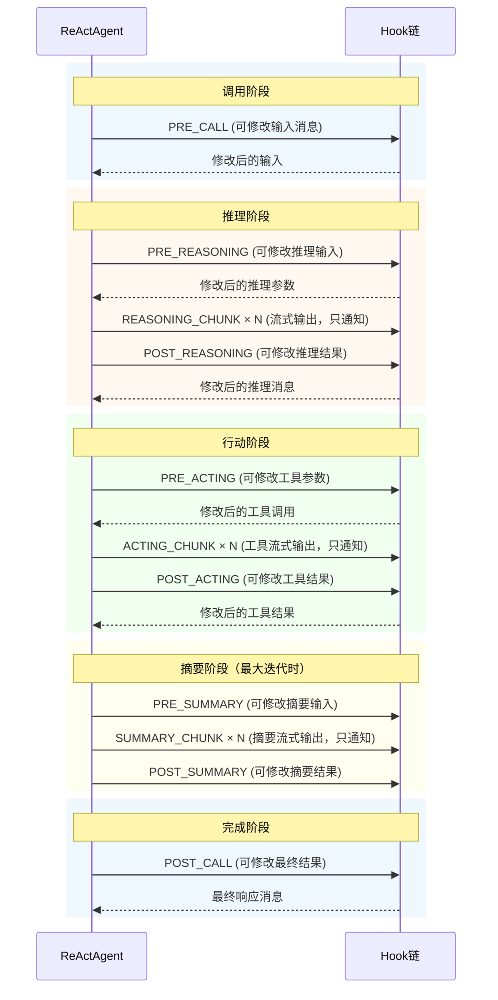
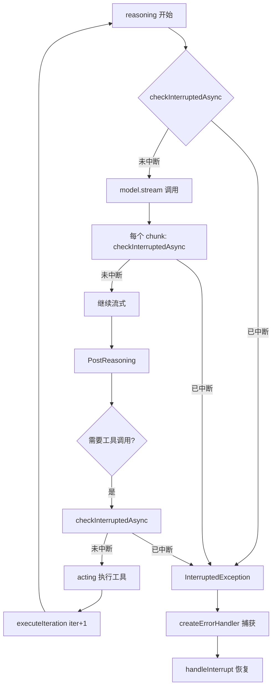
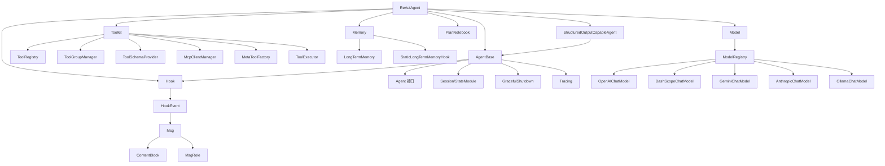

# AgentScope Java 整体架构文档

## 1. 分层架构

AgentScope Java 采用四层架构设计，各层职责清晰，依赖方向自上而下：



### 1.1 应用层

应用层提供面向场景的 Agent 实现：

- **ReActAgent**（`ReActAgent.java:140`）：ReAct（Reasoning + Acting）循环的核心实现，是框架中使用最广泛的 Agent。它在每次迭代中依次执行推理（调用 LLM）和行动（执行工具），直到任务完成或达到最大迭代次数。
- **UserAgent**（`UserAgent.java:68`）：用户输入代理，通过可插拔的 `UserInputBase` 适配不同输入源（控制台、Web UI 等）。
- **StructuredOutputCapableAgent**（`StructuredOutputCapableAgent.java`）：支持结构化输出的 Agent 基类，通过 `StructuredOutputHook` 实现类型安全的输出解析。

### 1.2 编排层

编排层提供多 Agent 协作模式：

- **SequentialPipeline**（`SequentialPipeline.java:39`）：链式编排，前一个 Agent 的输出作为后一个 Agent 的输入
- **FanoutPipeline**（`FanoutPipeline.java:49`）：扇出编排，同一输入并行/串行分发到多个 Agent
- **MsgHub**（`MsgHub.java:100`）：消息中心，参与者之间自动广播消息，实现对话式协作

### 1.3 核心层

核心层定义框架的基本抽象和契约，是所有上层组件的基础：

- **Agent 接口组合**：CallableAgent + StreamableAgent + ObservableAgent → Agent
- **Msg + ContentBlock**：消息与 7 种内容块的密封类型体系
- **Model + ModelRegistry**：模型抽象与注册解析中心
- **Toolkit + @Tool**：注解驱动的工具管理与执行
- **Hook + HookEvent**：12 种事件的观测与拦截体系
- **Memory**：短期记忆 + 长期记忆

### 1.4 基础层

基础层提供横切关注点支持：

- **Session**（`Session.java`）：会话持久化抽象，支持 InMemorySession、JsonSession、MySQL 扩展
- **StateModule**（`StateModule`）：状态管理接口，所有可持久化组件的统一抽象
- **GracefulShutdownManager**（`GracefulShutdownManager`）：优雅停机管理，确保正在执行的 Agent 完成当前任务
- **Tracer**（`Tracer.java`）：链路追踪接口，默认 NoopTracer
- **InterruptContext**（`InterruptContext`）：中断上下文，区分用户中断与系统中断

## 2. 数据流模型

AgentScope Java 基于 Project Reactor 的 Mono/Flux 构建数据流，三种调用模式对应不同的流类型：

```mermaid
sequenceDiagram
    participant User as 调用者
    participant Agent as AgentBase
    participant Hook as Hook链
    participant Model as Model
    participant Tool as Toolkit

    Note over User,Tool: call() 同步调用模式
    User->>Agent: call(List&lt;Msg&gt;)
    Agent->>Agent: acquireExecution()
    Agent->>Hook: notifyPreCall(msgs)
    Hook-->>Agent: tail messages
    Agent->>Agent: doCall(msgs)
    Agent->>Agent: reasoning(iter)
    Agent->>Hook: notifyPreReasoningEvent
    Hook-->>Agent: modified input
    Agent->>Model: model.stream(messages, tools, options)
    Model-->>Agent: Flux&lt;ChatResponse&gt;
    Agent->>Hook: notifyPostReasoning(msg)
    Hook-->>Agent: modified msg
    Agent->>Agent: isFinished?
    alt 有工具调用
        Agent->>Hook: notifyPreActingHooks(toolCalls)
        Hook-->>Agent: modified toolCalls
        Agent->>Tool: callTools(toolCalls)
        Tool-->>Agent: List&lt;ToolResultBlock&gt;
        Agent->>Hook: notifyPostActingHook(result)
        Hook-->>Agent: modified result
        Agent->>Agent: executeIteration(iter+1)
    else 无工具调用
        Agent->>Hook: notifyPostCall(finalMsg)
        Hook-->>Agent: modified finalMsg
        Agent->>Agent: releaseExecution()
        Agent-->>User: Mono&lt;Msg&gt;
    end
```

### 2.1 Agent.call() → Mono\<Msg\>

同步调用是 Agent 的核心交互方式。调用链路（`AgentBase.java:182-201`）：

```java
// AgentBase.call() 的 Mono.using 模式
Mono.using(
    this::acquireExecution,          // 获取执行锁
    resource -> {
        beforeAgentExecution(msgs);  // 绑定 RuntimeContext
        return notifyPreCall(msgs)   // PreCall Hook
            .flatMap(this::doCall)   // 子类实现
            .flatMap(this::notifyPostCall) // PostCall Hook
            .onErrorResume(errorHandler);  // 错误处理
    },
    this::releaseExecution,          // 释放执行锁
    true
);
```

关键设计点：
- `Mono.using` 保证 `releaseExecution` 在任何终止场景（成功/错误/取消）下都会执行（`AgentBase.java:435-439`）
- `acquireExecution` 使用 `AtomicBoolean` 防止同一 Agent 实例并发执行（`AgentBase.java:411-426`）
- `GracefulShutdownManager` 在获取执行锁时注册请求，确保优雅停机时等待完成

### 2.2 Agent.stream() → Flux\<Event\>

流式调用通过 `StreamingHook` 将内部 Hook 事件转换为外部 Event 流（`AgentBase.java:897-947`）：

```java
Flux.<Event>create(sink -> {
    StreamingHook streamingHook = new StreamingHook(sink, options);
    addHook(streamingHook);                        // 临时 Hook
    Mono.defer(() -> callSupplier.get())
        .doFinally(signal -> hooks.remove(streamingHook))  // 清理 Hook
        .subscribe(finalMsg -> {
            if (options.shouldStream(EventType.AGENT_RESULT)) {
                sink.next(new Event(EventType.AGENT_RESULT, finalMsg, true));
            }
            sink.complete();
        }, sink::error);
}, FluxSink.OverflowStrategy.BUFFER)
.publishOn(Schedulers.boundedElastic());
```

Event 类型（`EventType.java:24`）包括：REASONING、TOOL_RESULT、HINT、AGENT_RESULT、SUMMARY、ALL。

### 2.3 Agent.observe() → Mono\<Void\>

观察模式用于多 Agent 协作中被动接收消息（`AgentBase.java:824-841`）：

- `UserAgent` 的 `doObserve` 是空操作（不存储观察到的消息）
- `ReActAgent` 的 `doObserve` 将消息添加到 Memory（`ReActAgent.java:1178-1183`）
- MsgHub 通过 `observe()` 实现参与者之间的消息广播

## 3. Agent 接口组合



**AgentBase**（`AgentBase.java:93`）作为抽象基类，提供：
- **Hook 管理**：`addHook`/`removeHook`/`getSortedHooks`，按 priority 排序（`:590-592`）
- **中断机制**：`interruptFlag`（AtomicBoolean）+ `userInterruptMessage`（AtomicReference）（`:107-108`）
- **MsgHub 订阅**：`hubSubscribers`（ConcurrentHashMap），支持多 Hub 订阅（`:104`）
- **RuntimeContext**：绑定到 Hook 的运行时上下文，用于传递请求级元数据（`:116`）
- **系统 Hook**：`GracefulShutdownHook` 作为系统级 Hook 自动注册（`:101-103`）

**ReActAgent** 的继承链：`Agent → AgentBase → StructuredOutputCapableAgent → ReActAgent`

## 4. Hook 事件体系

### 4.1 事件时序图

以下展示 ReActAgent 单次迭代的完整 Hook 事件时序：



### 4.2 Hook 执行机制

Hook 的核心执行逻辑（`AgentBase.java:661-720`，`ReActAgent.java:1031-1037`）：

```java
// 顺序执行所有 Hook，每个 Hook 可修改事件
private <T extends HookEvent> Mono<T> notifyHooks(T event) {
    Mono<T> result = Mono.just(event);
    for (Hook hook : getSortedHooks()) {
        result = result.flatMap(hook::onEvent);  // 链式调用
    }
    return result;
}
```

### 4.3 系统消息生命周期

HookEvent 中的 `systemMsg` 字段在整个调用生命周期中被精心管理（`HookEvent.java:43-66`）：

1. `seedSystemMsg()`：从 `sysPrompt` 创建初始系统消息（`ReActAgent.java:211-220`）
2. `PreCallEvent`：Hook 可修改系统消息
3. `consumeSystemMsgAfterPreCall()`：冻结系统消息作为本次调用的基线（`ReActAgent.java:223-225`）
4. `PreReasoningEvent`：每次推理前从冻结基线创建副本，Hook 可追加迭代内容
5. 推理调用前：系统消息被 prepend 到输入消息列表

这种设计确保每次迭代的系统消息从干净的基线开始，避免 Hook 追加内容跨迭代累积。

## 5. 中断机制

AgentScope Java 提供协作式中断机制，核心实现在 `AgentBase.java:107-108`：

```java
private final AtomicBoolean interruptFlag = new AtomicBoolean(false);
private final AtomicReference<Msg> userInterruptMessage = new AtomicReference<>(null);
```

### 5.1 中断触发

```java
// 用户中断（Agent.java:72-81）
agent.interrupt();          // 无消息中断
agent.interrupt(userMsg);   // 附带用户消息的中断

// 系统中断（AgentBase.java:342-345）
agent.interrupt(InterruptSource.SYSTEM);  // 优雅停机触发
```

### 5.2 中断检查

`checkInterruptedAsync()`（`AgentBase.java:372-379`）在 ReAct 循环的关键检查点被调用：



### 5.3 中断恢复

`handleInterrupt`（`ReActAgent.java:1158-1175`）区分两种中断源：

- **用户中断**（InterruptSource.USER）：生成恢复消息并添加到 Memory，返回给调用者
- **系统中断**（InterruptSource.SYSTEM）：触发 `GracefulShutdownManager.saveOnInterruptObserved()`，抛出 `AgentShuttingDownException`

## 6. 模块依赖图



### 6.1 核心依赖关系说明

- **ReActAgent** 是最核心的实现类，依赖几乎所有核心模块
- **AgentBase** 作为抽象基类，仅依赖 Hook、Session、Shutdown、Tracing 等横切关注点
- **Toolkit** 采用组合模式，将注册、分组、Schema、MCP、执行等职责拆分到独立管理器
- **Memory** 的长期记忆扩展通过 Hook（`StaticLongTermMemoryHook`）集成，而非直接依赖
- **Model** 的各种实现通过 `ModelRegistry` 解耦，Agent 只依赖 `Model` 接口

### 6.2 扩展模块

```
agentscope-core/          核心模块
agentscope-extensions/
  ├── extensions-reme/         ReMe 长期记忆
  ├── extensions-rag-simple/   简单 RAG 实现（Milvus/Qdrant/PgVector/ES）
  ├── extensions-session-mysql/  MySQL 会话存储
  └── extensions-nacos-a2a/    Nacos A2A 注册发现
agentscope-harness/       运行时 Harness（文件系统/Shell/子Agent工具）
agentscope-examples/      示例应用
```
