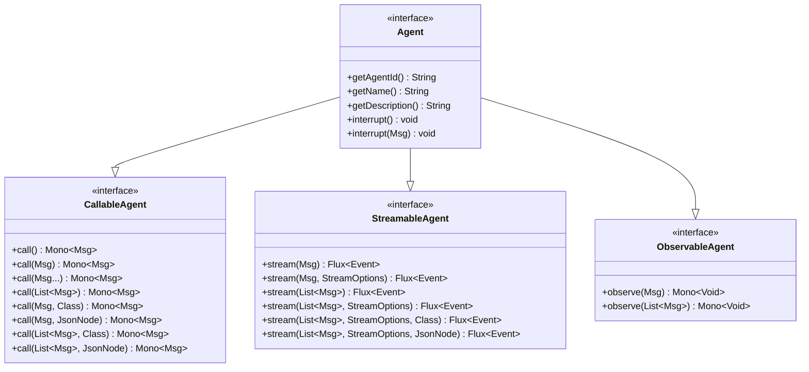
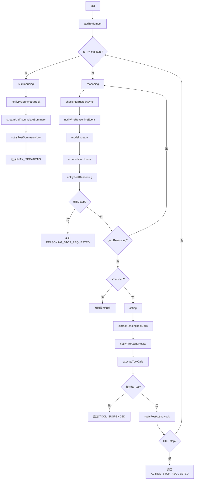

# io.agentscope.core.agent — Agent 体系详解

## 1. 接口层次与组合关系

`Agent` 是框架的核心契约接口，通过组合三个能力接口定义完整的 Agent 行为：



### 1.1 CallableAgent — 调用能力

定义 Agent 的核心调用能力，所有重载最终委托给核心抽象方法（`agent/CallableAgent.java`）：

| 方法签名 | 行号 | 说明 |
|---------|------|------|
| `call()` | :42 | 基于当前状态继续生成，委托给 `call(List.of())` |
| `call(JsonNode schema)` | :52 | 基于当前状态 + JSON Schema 结构化输出 |
| `call(Class<?> structuredModel)` | :62 | 基于当前状态 + Java 类结构化输出 |
| `call(Msg msg)` | :72 | 单条消息处理，空安全 |
| `call(Msg msg, Class<?>)` | :83 | 单条消息 + 结构化模型 |
| `call(Msg msg, JsonNode)` | :94 | 单条消息 + JSON Schema |
| `call(Msg... msgs)` | :104 | 变参消息处理 |
| `call(List<Msg> msgs)` | :114 | **核心抽象方法**，处理消息列表 |
| `call(List<Msg>, Class<?>)` | :126 | **核心抽象方法**，结构化输出（Class） |
| `call(List<Msg>, JsonNode)` | :138 | **核心抽象方法**，结构化输出（Schema） |

### 1.2 StreamableAgent — 流式能力

提供实时事件流，返回 `Flux<Event>`（`agent/StreamableAgent.java`）：

| 方法签名 | 行号 | 说明 |
|---------|------|------|
| `stream(StreamOptions)` | :44 | 基于当前状态流式生成 |
| `stream(Class<?>)` | :54 | 流式 + 结构化模型 |
| `stream(StreamOptions, Class<?>)` | :65 | 流式 + 选项 + 结构化模型 |
| `stream(Msg)` | :75 | 单条消息流式，默认选项 |
| `stream(Msg, StreamOptions)` | :86 | 单条消息 + 选项 |
| `stream(Msg, StreamOptions, Class<?>)` | :98 | 单条消息 + 选项 + 结构化 |
| `stream(Msg, StreamOptions, JsonNode)` | :110 | 单条消息 + 选项 + Schema |
| `stream(List<Msg>)` | :120 | 消息列表，默认选项 |
| `stream(List<Msg>, StreamOptions)` | :131 | **核心抽象方法** |
| `stream(List<Msg>, StreamOptions, Class<?>)` | :141 | **核心抽象方法**，结构化 |
| `stream(List<Msg>, StreamOptions, JsonNode)` | :151 | **核心抽象方法**，Schema |

### 1.3 ObservableAgent — 观察能力

允许 Agent 接收消息但不生成回复，用于多 Agent 协作场景（`agent/ObservableAgent.java`）：

| 方法签名 | 行号 | 说明 |
|---------|------|------|
| `observe(Msg msg)` | :44 | 观察单条消息 |
| `observe(List<Msg> msgs)` | :52 | 观察多条消息 |

典型场景：被动监听对话流、多 Agent 共享上下文、Pipeline 观察者模式。

### 1.4 Agent — 顶层接口

组合三个能力接口，并添加身份和中断方法（`agent/Agent.java`）：

| 方法签名 | 行号 | 说明 |
|---------|------|------|
| `getAgentId()` | :48 | 获取唯一标识符 |
| `getName()` | :55 | 获取名称 |
| `getDescription()` | :62 | 获取描述（默认 `"Agent(id) name"`） |
| `interrupt()` | :72 | 协作式中断，设置中断标志 |
| `interrupt(Msg msg)` | :81 | 中断并附带用户消息 |

---
## 2. AgentBase — 抽象基类

`AgentBase` 实现 `Agent` 接口和 `StateModule`，提供所有 Agent 共享的基础设施（`agent/AgentBase.java:93`）。

### 2.1 核心字段

| 字段 | 行号 | 类型 | 说明 |
|------|------|------|------|
| `agentId` | :95 | `String` | UUID 唯一标识 |
| `name` | :96 | `String` | Agent 名称 |
| `description` | :97 | `String` | Agent 描述 |
| `running` | :98 | `AtomicBoolean` | 执行互斥锁，防止并发调用 |
| `checkRunning` | :99 | `boolean` | 是否启用运行状态检查（默认 `true`） |
| `hooks` | :100 | `List<Hook>` | 实例级 Hook 列表（`CopyOnWriteArrayList`） |
| `systemHooks` | :101 | `static List<Hook>` | 系统级 Hook，含 `GracefulShutdownHook` |
| `hubSubscribers` | :104 | `Map<String, List<AgentBase>>` | MsgHub 订阅者映射 |
| `interruptFlag` | :107 | `AtomicBoolean` | 中断标志 |
| `userInterruptMessage` | :108 | `AtomicReference<Msg>` | 中断时附带的用户消息 |
| `interruptSource` | :111 | `AtomicReference<InterruptSource>` | 中断来源（USER / SYSTEM） |
| `runtimeContextAwareHooks` | :114 | `CopyOnWriteArrayList` | 需要运行时上下文的 Hook |
| `currentRuntimeContext` | :116 | `AtomicReference<RuntimeContext>` | 当前调用的运行时上下文 |

### 2.2 call() 模板方法

`call()` 是 `final` 方法，通过 `Mono.using` 管理执行生命周期（`AgentBase.java:182`）：

```java
// AgentBase.java:182-201 -- call() 核心流程
public final Mono<Msg> call(List<Msg> msgs) {
    return Mono.using(
        this::acquireExecution,            // 1. 获取执行锁 + 重置中断标志
        resource -> {
            beforeAgentExecution(msgs);     // 2. 子类前置回调
            return TracerRegistry.get()
                .callAgent(this, msgs, () ->
                    notifyPreCall(msgs)      // 3. PreCall Hook 通知
                        .flatMap(this::doCall)  // 4. 子类实现核心逻辑
                        .flatMap(this::notifyPostCall) // 5. PostCall Hook + 广播
                        .onErrorResume(createErrorHandler(msgs)) // 6. 错误/中断处理
                );
        },
        this::releaseExecution,             // 7. 释放执行锁 + 清理
        true);
}
```

**关键设计**：`doCall()` 是抽象方法（`:272`），子类实现具体逻辑；`call()` 保证 `acquireExecution/releaseExecution` 成对执行。

### 2.3 doCall() 重载

| 方法 | 行号 | 说明 |
|------|------|------|
| `doCall(List<Msg>)` | :272 | **抽象方法**，子类必须实现 |
| `doCall(List<Msg>, Class<?>)` | :283 | 默认抛 `UnsupportedOperationException` |
| `doCall(List<Msg>, JsonNode)` | :298 | 默认抛 `UnsupportedOperationException` |

### 2.4 acquireExecution / releaseExecution

`acquireExecution()`（`:411`）执行 CAS 检查防止并发，重置中断标志，注册优雅停机请求。`releaseExecution()`（`:435`）在 `Mono.using` 中作为清理函数，无论成功/错误/取消都会执行。

---
## 3. ReActAgent — 推理-执行循环

`ReActAgent` 是框架的核心实现，采用 ReAct（Reasoning + Acting）模式迭代执行（`ReActAgent.java:140`）。



### 3.1 核心字段

| 字段 | 行号 | 类型 | 说明 |
|------|------|------|------|
| `memory` | :148 | `Memory` | 对话记忆存储 |
| `sysPrompt` | :149 | `String` | 系统提示词 |
| `model` | :150 | `Model` | 大语言模型实例 |
| `maxIters` | :151 | `int` | 最大推理-执行迭代次数（默认 10） |
| `modelExecutionConfig` | :152 | `ExecutionConfig` | 模型调用超时/重试配置 |
| `toolExecutionConfig` | :153 | `ExecutionConfig` | 工具执行超时/重试配置 |
| `generateOptions` | :154 | `GenerateOptions` | LLM 生成参数（temperature 等） |
| `planNotebook` | :155 | `PlanNotebook` | 计划笔记本 |
| `toolExecutionContext` | :156 | `ToolExecutionContext` | 工具执行上下文（DI） |
| `statePersistence` | :157 | `StatePersistence` | 状态持久化配置 |
| `currentSystemMsg` | :167 | `AtomicReference<Msg>` | 每次调用的系统消息 |

### 3.2 Builder 模式

`ReActAgent` 通过 Builder 构建（`ReActAgent.java:1229`）：

```java
ReActAgent agent = ReActAgent.builder()
    .name("\u52a9\u624b")                           // :1272 \u5fc5\u987b
    .sysPrompt("\u4f60\u662f\u4e00\u4e2a\u6709\u7528\u7684\u52a9\u624b")           // :1293 \u7cfb\u7edf\u63d0\u793a\u8bcd
    .model(model)                           // :1304 \u5fc5\u987b\uff0c\u5927\u6a21\u578b\u5b9e\u4f8b
    .toolkit(toolkit)                       // :1315 \u5de5\u5177\u96c6
    .memory(new InMemoryMemory())           // :1326 \u9ed8\u8ba4 InMemoryMemory
    .maxIters(10)                           // :1337 \u6700\u5927\u8fed\u4ee3\u6b21\u6570
    .hook(myHook)                           // :1354 \u6dfb\u52a0 Hook
    .enableMetaTool(true)                   // :1385 \u542f\u7528\u5143\u5de5\u5177
    .enablePendingToolRecovery(true)        // :1405 \u542f\u7528\u6302\u8d77\u5de5\u5177\u81ea\u52a8\u6062\u590d
    .modelExecutionConfig(execConfig)       // :1421 \u6a21\u578b\u8c03\u7528\u914d\u7f6e
    .toolExecutionConfig(toolExecConfig)    // :1437 \u5de5\u5177\u6267\u884c\u914d\u7f6e
    .generateOptions(genOpts)               // :1470 \u751f\u6210\u53c2\u6570
    .structuredOutputReminder(reminder)     // :1481 \u7ed3\u6784\u5316\u8f93\u51fa\u63d0\u9192\u6a21\u5f0f
    .planNotebook(notebook)                 // :1498 \u8ba1\u5212\u7b14\u8bb0\u672c
    .skillBox(skillBox)                     // :1515 \u6280\u80fd\u7bb1
    .longTermMemory(ltm)                    // :1531 \u957f\u671f\u8bb0\u5fc6
    .longTermMemoryMode(LongTermMemoryMode.BOTH) // :1550
    .longTermMemoryAsyncRecord(true)        // :1573 \u5f02\u6b65\u8bb0\u5f55
    .statePersistence(persistence)          // :1600 \u72b6\u6001\u6301\u4e45\u5316\u914d\u7f6e
    .knowledge(knowledge)                   // :1626 RAG \u77e5\u8bc6\u5e93
    .ragMode(RAGMode.GENERIC)              // :1652 RAG \u6a21\u5f0f
    .retrieveConfig(retrieveConfig)         // :1665 \u68c0\u7d22\u914d\u7f6e
    .toolExecutionContext(ctx)              // :1683 \u5de5\u5177\u6267\u884c\u4e0a\u4e0b\u6587
    .build();                               // :1694 \u6784\u5efa\u5b9e\u4f8b
```

`build()` 方法（`:1694`）执行：深拷贝 Toolkit -> 注册 Hook 声明的工具 -> 配置 MetaTool -> 配置 PendingToolRecoveryHook -> 配置长期记忆 -> 配置 RAG -> 配置 PlanNotebook -> 配置 SkillBox -> 创建实例。
