# io.agentscope.core.message — 消息包文档

消息包是 AgentScope 框架中 Agent 之间、Agent 与用户之间、Agent 与工具之间通信的核心抽象。每条消息由角色（`MsgRole`）、内容块列表（`List<ContentBlock>`）和元数据（`Map<String, Object>`）组成，支持文本、图片、音频、视频、思维链、工具调用等多种内容类型。

---

## 1. Msg 类

**源码**: `Msg.java`

`Msg` 是框架中的核心不可变消息对象，实现了 `State` 接口（`Msg.java:53`）。消息是 Agent 之间、用户与 Agent 之间、Agent 与工具之间的主要通信单元。类标注 `@JsonIgnoreProperties(ignoreUnknown = true)`（`Msg.java:52`），反序列化时忽略未知属性。

### 1.1 字段定义

| 字段 | 类型 | 行号 | 说明 |
|------|------|------|------|
| `id` | `String` | `Msg.java:61` | 消息唯一标识符，由 Builder 自动生成 UUID |
| `name` | `String` | `Msg.java:63` | 可选的消息名称，可用于标识发送者（如 Agent 名称） |
| `role` | `MsgRole` | `Msg.java:65` | 消息角色枚举（USER / ASSISTANT / SYSTEM / TOOL） |
| `content` | `List<ContentBlock>` | `Msg.java:67` | 内容块列表，不可变列表，线程安全 |
| `metadata` | `Map<String, Object>` | `Msg.java:69` | 可选元数据映射，存储生成原因、Token 用量、结构化输出等 |
| `timestamp` | `String` | `Msg.java:71` | 消息时间戳，格式 `yyyy-MM-dd HH:mm:ss.SSS` |

此外还定义了常量：

- `METADATA_GENERATE_REASON`（`Msg.java:56`）：元数据键 `"agentscope_generate_reason"`，存储消息的生成原因，值为 `GenerateReason` 枚举名称字符串
- `TIMESTAMP_FORMATTER`（`Msg.java:58-59`）：时间戳格式化器，使用系统默认时区

### 1.2 构造函数

构造函数为 `private`，通过 `@JsonCreator` 注解支持 Jackson 反序列化（`Msg.java:83-110`）：

```java
@JsonCreator
private Msg(
        @JsonProperty("id") String id,
        @JsonProperty("name") String name,
        @JsonProperty("role") MsgRole role,
        @JsonProperty("content") List<ContentBlock> content,
        @JsonProperty("metadata") Map<String, Object> metadata,
        @JsonProperty("timestamp") String timestamp)
```

构造函数对内容列表做了防御性处理：过滤 null 元素后转为不可变列表（`Msg.java:94-97`）；元数据创建新 `HashMap` 并跳过 null 键值（`Msg.java:98-108`）。

### 1.3 Builder 模式

`Msg` 通过内部 `Builder` 类创建（`Msg.java:500-654`），Builder 字段与默认值如下：

| 字段 | 默认值 | 行号 |
|------|--------|------|
| `id` | 随机 UUID | `Msg.java:502` |
| `name` | `null` | `Msg.java:504` |
| `role` | `MsgRole.USER` | `Msg.java:506` |
| `content` | `List.of()` | `Msg.java:508` |
| `metadata` | `Map.of()` | `Msg.java:510` |
| `timestamp` | 当前时间格式化 | `Msg.java:512` |

Builder 构造时自动调用 `randomId()`（`Msg.java:518`）生成 UUID。

Builder 方法：

| 方法 | 行号 | 说明 |
|------|------|------|
| `id(String)` | `Msg.java:527` | 设置消息 ID |
| `name(String)` | `Msg.java:545` | 设置消息名称 |
| `role(MsgRole)` | `Msg.java:556` | 设置消息角色 |
| `content(List<ContentBlock>)` | `Msg.java:566` | 设置内容块列表 |
| `content(ContentBlock)` | `Msg.java:577` | 设置单个内容块（自动包装为列表） |
| `content(ContentBlock...)` | `Msg.java:587` | 设置可变参数内容块 |
| `textContent(String)` | `Msg.java:597` | 便捷方法：直接设置文本内容，内部创建 `TextBlock` |
| `metadata(Map<String, Object>)` | `Msg.java:607` | 设置元数据 |
| `timestamp(String)` | `Msg.java:618` | 设置时间戳，null 时自动生成 |
| `generateReason(GenerateReason)` | `Msg.java:633` | 设置生成原因（写入 metadata） |
| `build()` | `Msg.java:651` | 构建不可变 Msg 实例 |

`generateReason()` 方法（`Msg.java:633-643`）会将 metadata 从不可变 Map 转为可变 HashMap 后写入生成原因，若 metadata 为空则创建新 HashMap。

### 1.4 内容操作方法

| 方法 | 行号 | 说明 |
|------|------|------|
| `hasContentBlocks(Class<T>)` | `Msg.java:184` | 类型安全检查消息中是否包含指定类型的内容块 |
| `getContentBlocks(Class<T>)` | `Msg.java:197` | 类型安全获取所有指定类型的内容块列表 |
| `getFirstContentBlock()` | `Msg.java:211` | 获取第一个内容块，空则返回 null |
| `getFirstContentBlock(Class<T>)` | `Msg.java:224` | 类型安全获取第一个指定类型的内容块 |
| `getTextContent()` | `Msg.java:382` | 提取所有 TextBlock 的文本并用换行连接 |

以上方法均标注 `@Transient` 和 `@JsonIgnore`，不参与序列化。

`getContentBlocks()` 和 `getFirstContentBlock(Class<T>)` 使用 `TypeUtils.safeCast()` 进行安全类型转换（`Msg.java:200`、`Msg.java:228`）。

### 1.5 结构化数据方法

| 方法 | 行号 | 说明 |
|------|------|------|
| `hasStructuredData()` | `Msg.java:239` | 检查元数据中是否包含 `STRUCTURED_OUTPUT` 键 |
| `getStructuredData(Class<T>)` | `Msg.java:269` | 将元数据中的结构化输出转换为指定类型的 POJO |
| `getStructuredData(boolean)` | `Msg.java:344` | 将结构化输出转为 `Map<String, Object>`，参数控制是否返回可变 Map |

`getStructuredData(Class<T>)` 典型用法（`Msg.java:251-259`）：

```java
// 定义结构化输出类
public class TaskPlan {
    public String goal;
    public int priority;
}

// 从 Agent 调用中获取结构化输出
Msg msg = userAgent.call(null, TaskPlan.class).block();
TaskPlan plan = msg.getStructuredData(TaskPlan.class);
```

`getStructuredData(Class<T>)` 内部使用 `JsonUtils.getJsonCodec().convertValue()` 进行转换（`Msg.java:282`），若转换失败抛出 `IllegalArgumentException`（`Msg.java:284`）。

`getStructuredData(boolean)` 适用于动态 Schema 处理场景，`mutable=true` 时直接返回原始 Map 引用，`mutable=false` 时通过 Jackson 深拷贝返回不可变 Map。

### 1.6 其他便捷方法

| 方法 | 行号 | 说明 |
|------|------|------|
| `getChatUsage()` | `Msg.java:413` | 从元数据获取 Token 用量统计，支持从 `Map` 自动转换为 `ChatUsage` |
| `getGenerateReason()` | `Msg.java:467` | 获取消息生成原因，默认返回 `MODEL_STOP` |
| `withGenerateReason(GenerateReason)` | `Msg.java:494` | 创建新 Msg 实例并更新生成原因（不可变修改） |

`getChatUsage()` 有两种形式的反序列化（`Msg.java:417-433`）：若元数据中的值已是 `ChatUsage` 实例则直接返回；若是 `Map` 则自动构建 `ChatUsage`（提取 `inputTokens`、`outputTokens`、`time` 字段）并回写元数据。

`getGenerateReason()` 从元数据中读取（`Msg.java:471`），支持 `String`（`Msg.java:472`）和 `GenerateReason`（`Msg.java:479`）两种类型的值，解析失败时默认返回 `MODEL_STOP`。

`withGenerateReason()` 返回新的 `Msg` 实例（`Msg.java:495-498`），保持原始消息不变，符合不可变设计。
## 2. MsgRole 枚举

**源码**: `MsgRole.java`

定义消息参与者在对话中的角色（`MsgRole.java:35`），共 4 个枚举值：

| 枚举值 | 行号 | 说明 | 使用场景 |
|--------|------|------|----------|
| `USER` | `MsgRole.java:42` | 用户角色 | 来自人类用户或外部输入的消息，包含用户的问题、命令或输入数据 |
| `ASSISTANT` | `MsgRole.java:50` | 助手角色 | AI Agent 或助手生成的消息，包含响应、推理或动作 |
| `SYSTEM` | `MsgRole.java:58` | 系统角色 | 系统指令、提示词或配置消息，包含设置指令、上下文信息或系统级指令 |
| `TOOL` | `MsgRole.java:66` | 工具角色 | 包含工具执行结果或响应的消息，包含返回值、错误消息或状态信息 |

角色在 LLM API 调用中决定消息的格式化方式，不同的 API（OpenAI、Anthropic、Gemini 等）对角色有不同的处理逻辑。Builder 中 `role` 默认为 `USER`（`Msg.java:506`）。

---

## 3. ContentBlock 密封类

**源码**: `ContentBlock.java`

`ContentBlock` 是所有内容块的密封基类（`ContentBlock.java:54`），实现了 `State` 接口。通过 Java `sealed` 关键字限制子类，确保编译时穷尽性检查。

### 3.1 密封类声明

```java
public sealed class ContentBlock implements State
        permits TextBlock,
                ImageBlock,
                AudioBlock,
                VideoBlock,
                ThinkingBlock,
                ToolUseBlock,
                ToolResultBlock {}
```

permits 列表（`ContentBlock.java:55-61`）明确限定只有 7 个子类可以继承。所有子类声明为 `final`，不可进一步扩展。

### 3.2 Jackson 多态注解配置

```java
@JsonTypeInfo(use = JsonTypeInfo.Id.NAME, include = JsonTypeInfo.As.PROPERTY, property = "type")
@JsonSubTypes({
    @JsonSubTypes.Type(value = TextBlock.class, name = "text"),
    @JsonSubTypes.Type(value = ThinkingBlock.class, name = "thinking"),
    @JsonSubTypes.Type(value = ImageBlock.class, name = "image"),
    @JsonSubTypes.Type(value = AudioBlock.class, name = "audio"),
    @JsonSubTypes.Type(value = VideoBlock.class, name = "video"),
    @JsonSubTypes.Type(value = ToolUseBlock.class, name = "tool_use"),
    @JsonSubTypes.Type(value = ToolResultBlock.class, name = "tool_result")
})
```

- `@JsonTypeInfo`（`ContentBlock.java:44`）：使用 `Id.NAME` 策略，以 `"type"` 属性作为类型判别符（discriminator），`As.PROPERTY` 表示 type 作为 JSON 对象的一个字段嵌入
- `@JsonSubTypes`（`ContentBlock.java:45-53`）：注册 7 种子类型及其 JSON 类型名称映射

各类型的 JSON discriminator 值汇总：

| Java 类型 | JSON type 值 | 行号 |
|-----------|-------------|------|
| `TextBlock` | `"text"` | `ContentBlock.java:46` |
| `ThinkingBlock` | `"thinking"` | `ContentBlock.java:47` |
| `ImageBlock` | `"image"` | `ContentBlock.java:48` |
| `AudioBlock` | `"audio"` | `ContentBlock.java:49` |
| `VideoBlock` | `"video"` | `ContentBlock.java:50` |
| `ToolUseBlock` | `"tool_use"` | `ContentBlock.java:51` |
| `ToolResultBlock` | `"tool_result"` | `ContentBlock.java:52` |
## 4. 7 种 ContentBlock 详解

### 4.1 TextBlock — 纯文本内容

**源码**: `TextBlock.java`

最基础的内容块类型，用于承载纯文本信息。

| 字段 | 类型 | 行号 | JSON 属性 | 说明 |
|------|------|------|-----------|------|
| `text` | `String` | `TextBlock.java:33` | `"text"` | 文本内容，不可为 null（null 转为空字符串） |

- 构造函数：`@JsonCreator`（`TextBlock.java:41`），`null` 文本自动转为空字符串
- `toString()` 返回 `text` 内容（`TextBlock.java:55`），方便日志输出
- Builder：`TextBlock.builder().text("内容").build()`（`TextBlock.java:64-94`）

**使用场景**：用户消息文本、助手响应文本、系统提示词、工具结果文本描述等。

**JSON 示例**：

```json
{
  "type": "text",
  "text": "你好，请问有什么可以帮助你的？"
}
```

### 4.2 ThinkingBlock — 思维链推理内容

**源码**: `ThinkingBlock.java`

用于捕获 Agent 在采取行动之前的内部推理过程，在 ReAct Agent 等推理密集型系统中特别有用，可透明展示 Agent 的决策过程。

| 字段 | 类型 | 行号 | JSON 属性 | 说明 |
|------|------|------|-----------|------|
| `thinking` | `String` | `ThinkingBlock.java:42` | `"thinking"` | 推理/思考内容，null 转为空字符串 |
| `metadata` | `Map<String, Object>` | `ThinkingBlock.java:43` | `"metadata"` | 可选元数据，存储额外推理信息 |

常量：

- `METADATA_REASONING_DETAILS`（`ThinkingBlock.java:40`）：值为 `"reasoningDetails"`，用于存储 OpenRouter/Gemini 的推理详情列表（包含 `reasoning.text`、`reasoning.encrypted`、`reasoning.summary`），在将消息格式化回 API 时需保留和恢复

- 构造函数：`@JsonCreator`（`ThinkingBlock.java:52-57`），对 metadata 做防御性拷贝（`new HashMap<>(metadata)`）
- Builder：`ThinkingBlock.builder().thinking("分析中...").metadata(detailsMap).build()`（`ThinkingBlock.java:89-132`）

**使用场景**：ReAct Agent 的推理步骤、深度思考模型（如 o1）的思考过程、调试分析 Agent 决策逻辑。

**JSON 示例**：

```json
{
  "type": "thinking",
  "thinking": "用户询问天气，我需要调用天气查询工具...",
  "metadata": {
    "reasoningDetails": ["..."]
  }
}
```

### 4.3 ImageBlock — 图片内容

**源码**: `ImageBlock.java`

支持 URL 或 Base64 编码的图片内容，是多模态 AI 交互的基础。

| 字段 | 类型 | 行号 | JSON 属性 | 说明 |
|------|------|------|-----------|------|
| `source` | `Source` | `ImageBlock.java:39` | `"source"` | 图片来源（URL 或 Base64），不可为 null |
| `minPixels` | `Integer` | `ImageBlock.java:41` | `"min_pixels"` | 输入图片的最小像素阈值 |
| `maxPixels` | `Integer` | `ImageBlock.java:43` | `"max_pixels"` | 输入图片的最大像素阈值 |

- 类标注 `@JsonInclude(JsonInclude.Include.NON_NULL)`（`ImageBlock.java:36`），null 字段不序列化
- 公开构造函数：`new ImageBlock(Source source)`（`ImageBlock.java:51`），仅设置 source
- Jackson 构造函数：`@JsonCreator`（`ImageBlock.java:64-71`），支持全部字段反序列化
- `source` 不允许为 null（`ImageBlock.java:68`），否则抛出 `NullPointerException`
- Builder：`ImageBlock.builder().source(urlSource).minPixels(256).maxPixels(1344).build()`（`ImageBlock.java:105-162`）

**使用场景**：图片理解、截图分析、图表解读、视觉问答等。

**JSON 示例**：

```json
{
  "type": "image",
  "source": {
    "type": "url",
    "url": "https://example.com/photo.jpg"
  },
  "min_pixels": 256,
  "max_pixels": 1344
}
```

### 4.4 AudioBlock — 音频内容

**源码**: `AudioBlock.java`

支持 URL 或 Base64 编码的音频内容。

| 字段 | 类型 | 行号 | JSON 属性 | 说明 |
|------|------|------|-----------|------|
| `source` | `Source` | `AudioBlock.java:37` | `"source"` | 音频来源（URL 或 Base64），不可为 null |

- 构造函数：`@JsonCreator`（`AudioBlock.java:46`），`source` 不允许为 null，否则抛出 `NullPointerException`
- Builder：`AudioBlock.builder().source(audioSource).build()`（`AudioBlock.java:64-95`）

**使用场景**：语音识别、音频分析、语音交互等。

**JSON 示例**：

```json
{
  "type": "audio",
  "source": {
    "type": "base64",
    "media_type": "audio/mpeg",
    "data": "//uQxAAAAAAAAAAAAAAAAAAAAAA..."
  }
}
```

### 4.5 VideoBlock — 视频内容

**源码**: `VideoBlock.java`

支持 URL 或 Base64 编码的视频内容，是最高级的多模态内容块，拥有最多的配置参数。

| 字段 | 类型 | 行号 | JSON 属性 | 说明 |
|------|------|------|-----------|------|
| `source` | `Source` | `VideoBlock.java:38` | `"source"` | 视频来源（URL 或 Base64） |
| `fps` | `Float` | `VideoBlock.java:40` | `"fps"` | 每秒帧数，范围 [0.1, 10]，默认 2.0 |
| `maxFrames` | `Integer` | `VideoBlock.java:42` | `"max_frames"` | 从视频中捕获的最大帧数 |
| `minPixels` | `Integer` | `VideoBlock.java:44` | `"min_pixels"` | 输入视频帧的最小像素阈值 |
| `maxPixels` | `Integer` | `VideoBlock.java:46` | `"max_pixels"` | 输入视频帧的最大像素阈值 |
| `totalPixels` | `Integer` | `VideoBlock.java:48` | `"total_pixels"` | 所有提取帧的总像素限制（单帧像素 x 总帧数） |

- 类标注 `@JsonInclude(JsonInclude.Include.NON_NULL)`（`VideoBlock.java:35`）
- 公开构造函数：`new VideoBlock(Source source)`（`VideoBlock.java:55`），仅设置 source
- Jackson 构造函数：`@JsonCreator`（`VideoBlock.java:70-83`），支持全部字段反序列化
- Builder：`VideoBlock.builder().source(videoSource).fps(2.0f).maxFrames(20).build()`（`VideoBlock.java:143-238`）

**使用场景**：视频分析、演示文稿理解、监控画面解读、教学视频分析等。

**JSON 示例**：

```json
{
  "type": "video",
  "source": {
    "type": "url",
    "url": "https://example.com/demo.mp4"
  },
  "fps": 2.0,
  "max_frames": 20
}
```
### 4.6 ToolUseBlock — 工具调用请求

**源码**: `ToolUseBlock.java`

当 Agent 请求执行工具时使用此内容块，包含工具的唯一标识符、名称、输入参数，以及可选的原始内容（用于流式工具调用）和提供商特定元数据。

| 字段 | 类型 | 行号 | JSON 属性 | 说明 |
|------|------|------|-----------|------|
| `id` | `String` | `ToolUseBlock.java:39` | `"id"` | 工具调用的唯一标识符 |
| `name` | `String` | `ToolUseBlock.java:40` | `"name"` | 要执行的工具名称 |
| `input` | `Map<String, Object>` | `ToolUseBlock.java:41` | `"input"` | 工具输入参数，防御性拷贝为不可变 Map |
| `content` | `String` | `ToolUseBlock.java:42` | `"content"` | 流式工具调用的原始内容，可为 null |
| `metadata` | `Map<String, Object>` | `ToolUseBlock.java:43` | `"metadata"` | 提供商特定元数据，防御性拷贝为不可变 Map |

常量：

- `METADATA_THOUGHT_SIGNATURE`（`ToolUseBlock.java:37`）：值为 `"thoughtSignature"`，用于存储 Gemini 的 thought signature（byte[] 值），在后续请求中需回传

构造函数重载：

| 构造函数 | 行号 | 说明 |
|----------|------|------|
| `ToolUseBlock(String id, String name, Map input, Map metadata)` | `ToolUseBlock.java:53` | 基本构造，content 为 null |
| `ToolUseBlock(String id, String name, Map input)` | `ToolUseBlock.java:65` | 无 metadata 便捷构造 |
| `ToolUseBlock(String id, String name, Map input, String content, Map metadata)` | `ToolUseBlock.java:79` | 完整构造，`@JsonCreator` |

`input` 和 `metadata` 字段均通过 `Collections.unmodifiableMap(new HashMap<>(...))` 做防御性拷贝（`ToolUseBlock.java:88-96`），确保不可变性。

**使用场景**：Agent 调用外部工具（如搜索、计算、API 调用）、流式工具调用响应、Gemini 工具调用附加 thought signature。

**JSON 示例**：

```json
{
  "type": "tool_use",
  "id": "call_abc123",
  "name": "get_weather",
  "input": {
    "city": "北京",
    "unit": "celsius"
  },
  "content": null,
  "metadata": {
    "thoughtSignature": "..."
  }
}
```

### 4.7 ToolResultBlock — 工具执行结果

**源码**: `ToolResultBlock.java`

表示工具执行的返回结果。此类具有双重用途：
1. **作为工具方法的返回值**：`id` 和 `name` 为 null
2. **作为消息中的 ContentBlock**：`id` 和 `name` 必须设置，与对应的 `ToolUseBlock` 匹配

| 字段 | 类型 | 行号 | JSON 属性 | 说明 |
|------|------|------|-----------|------|
| `id` | `String` | `ToolResultBlock.java:40` | `"id"` | 工具调用 ID，与 ToolUseBlock.id 对应 |
| `name` | `String` | `ToolResultBlock.java:41` | `"name"` | 工具名称，与 ToolUseBlock.name 对应 |
| `output` | `List<ContentBlock>` | `ToolResultBlock.java:42` | `"output"` | 工具输出内容块列表，不可变 |
| `metadata` | `Map<String, Object>` | `ToolResultBlock.java:43` | `"metadata"` | 可选元数据，不可变 |

常量：

- `METADATA_SUSPENDED`（`ToolResultBlock.java:38`）：值为 `"agentscope_suspended"`，标记此结果为挂起状态，等待外部执行

构造函数与静态工厂方法：

| 方法 | 行号 | 说明 |
|------|------|------|
| `@JsonCreator` 构造函数 | `ToolResultBlock.java:46` | Jackson 反序列化用 |
| `ToolResultBlock(String id, String name, ContentBlock output)` | `ToolResultBlock.java:64` | 单个内容块输出 |
| `ToolResultBlock(String id, String name, List<ContentBlock> output)` | `ToolResultBlock.java:75` | 内容块列表输出 |
| `suspended(ToolUseBlock, ToolSuspendException)` | `ToolResultBlock.java:139` | 从异常创建挂起结果 |
| `suspended(ToolUseBlock)` | `ToolResultBlock.java:157` | 创建默认挂起结果 |
| `text(String)` | `ToolResultBlock.java:167` | 创建纯文本结果（id/name 为 null） |
| `error(String)` | `ToolResultBlock.java:178` | 创建错误结果（前缀 "Error: "） |
| `of(ContentBlock)` | `ToolResultBlock.java:192` | 创建仅输出的结果 |
| `of(List<ContentBlock>)` | `ToolResultBlock.java:202` | 创建仅输出的结果（列表） |
| `of(ContentBlock, Map)` | `ToolResultBlock.java:213` | 创建带元数据的结果 |
| `of(List<ContentBlock>, Map)` | `ToolResultBlock.java:224` | 创建带元数据的结果（列表） |
| `of(String id, String name, ContentBlock)` | `ToolResultBlock.java:236` | 创建消息用的结果 |
| `of(String id, String name, List<ContentBlock>)` | `ToolResultBlock.java:248` | 创建消息用的结果（列表） |
| `of(String id, String name, ContentBlock, Map)` | `ToolResultBlock.java:261` | 完整字段 |
| `of(String id, String name, List<ContentBlock>, Map)` | `ToolResultBlock.java:276` | 完整字段（列表） |
| `withIdAndName(String id, String name)` | `ToolResultBlock.java:288` | 为现有结果设置 id 和 name |

`output` 通过 `List.copyOf()` 做防御性拷贝（`ToolResultBlock.java:53`），`metadata` 通过 `Map.copyOf()` 做防御性拷贝（`ToolResultBlock.java:54`）。

`isSuspended()` 方法（`ToolResultBlock.java:125`）检查 metadata 中 `METADATA_SUSPENDED` 是否为 `true`，用于判断工具是否需要外部执行。

**使用场景**：工具方法返回值、工具执行结果传递给 LLM、挂起工具等待用户执行（HITL）。

**JSON 示例**：

```json
{
  "type": "tool_result",
  "id": "call_abc123",
  "name": "get_weather",
  "output": [
    {
      "type": "text",
      "text": "北京当前气温 25°C，晴天"
    }
  ],
  "metadata": {}
}
```
## 5. Source 体系

**源码**: `Source.java`、`URLSource.java`、`Base64Source.java`

`Source` 是媒体来源的基类（`Source.java:32`），同样使用 Jackson 多态注解进行序列化/反序列化。

### 5.1 Source 基类

```java
@JsonTypeInfo(use = JsonTypeInfo.Id.NAME, include = JsonTypeInfo.As.PROPERTY, property = "type")
@JsonSubTypes({
    @JsonSubTypes.Type(value = URLSource.class, name = "url"),
    @JsonSubTypes.Type(value = Base64Source.class, name = "base64")
})
public class Source {}
```

- `@JsonTypeInfo`（`Source.java:27`）：以 `"type"` 属性作为类型判别符
- `@JsonSubTypes`（`Source.java:28-31`）：注册 `url` 和 `base64` 两种子类型

| Java 类型 | JSON type 值 | 行号 |
|-----------|-------------|------|
| `URLSource` | `"url"` | `Source.java:29` |
| `Base64Source` | `"base64"` | `Source.java:30` |

### 5.2 URLSource — URL 引用

**源码**: `URLSource.java`

通过 URL 引用媒体文件，支持远程 HTTP/HTTPS URL 和本地文件 URL。

| 字段 | 类型 | 行号 | JSON 属性 | 说明 |
|------|------|------|-----------|------|
| `url` | `String` | `URLSource.java:41` | `"url"` | 媒体文件的 URL 地址，不可为 null |

支持的 URL 格式：
- 远程 URL：`https://example.com/image.jpg`
- 本地文件：`file:///absolute/path/to/file.jpg`

- 构造函数：`@JsonCreator`（`URLSource.java:50`），`url` 不允许为 null
- Builder：`URLSource.builder().url("https://...").build()`（`URLSource.java:68-99`）

**优势**：对于大文件更高效，支持流式加载，无需将全部内容加载到内存。

**JSON 示例**：

```json
{
  "type": "url",
  "url": "https://example.com/image.jpg"
}
```

### 5.3 Base64Source — Base64 编码

**源码**: `Base64Source.java`

将媒体文件直接以 Base64 编码嵌入消息中，遵循标准 MIME 类型约定。

| 字段 | 类型 | 行号 | JSON 属性 | 说明 |
|------|------|------|-----------|------|
| `mediaType` | `String` | `Base64Source.java:41-42` | `"media_type"` | MIME 类型（如 `"image/jpeg"`），不可为 null |
| `data` | `String` | `Base64Source.java:44` | `"data"` | Base64 编码的媒体数据，不可为 null |

常见 MIME 类型：
- 图片：`image/jpeg`、`image/png`、`image/gif`
- 音频：`audio/mpeg`、`audio/wav`、`audio/ogg`
- 视频：`video/mp4`、`video/avi`、`video/mov`

- 构造函数：`@JsonCreator`（`Base64Source.java:54-58`），两个字段均不允许为 null
- Builder：`Base64Source.builder().mediaType("image/jpeg").data(base64Str).build()`（`Base64Source.java:83-127`）

**适用场景**：需要将媒体文件直接嵌入消息中，而非通过 URL 引用时使用。

**JSON 示例**：

```json
{
  "type": "base64",
  "media_type": "image/png",
  "data": "iVBORw0KGgoAAAANSUhEUgAA..."
}
```

---

## 6. GenerateReason 枚举

**源码**: `GenerateReason.java`

表示 Agent 生成消息的原因（`GenerateReason.java:36`），帮助用户理解 Agent 执行的上下文和状态，不同原因指示不同的后续操作。

| 枚举值 | 行号 | 说明 | 出现时机 |
|--------|------|------|----------|
| `MODEL_STOP` | `GenerateReason.java:39` | 模型正常停止 | 任务完成，模型未返回工具调用，直接输出最终结果 |
| `TOOL_CALLS` | `GenerateReason.java:42` | 模型返回了工具调用 | Agent 内部工具调用，框架会自动继续执行（用户通常不直接看到此状态） |
| `STRUCTURED_OUTPUT` | `GenerateReason.java:45` | 结构化输出完成 | 使用 `generate_response` 工具完成结构化输出 |
| `TOOL_SUSPENDED` | `GenerateReason.java:48` | 工具执行被挂起 | 外部工具需要用户手动执行（HITL 场景），调用方需处理挂起的工具 |
| `REASONING_STOP_REQUESTED` | `GenerateReason.java:51` | 推理阶段被 Hook 停止 | 通过 `PostReasoningEvent.stopAgent()` 在推理阶段请求停止 |
| `ACTING_STOP_REQUESTED` | `GenerateReason.java:54` | 行动阶段被 Hook 停止 | 通过 `PostActingEvent.stopAgent()` 在行动阶段请求停止 |
| `INTERRUPTED` | `GenerateReason.java:57` | Agent 被中断 | Agent 执行过程中被外部中断 |
| `MAX_ITERATIONS` | `GenerateReason.java:60` | 达到最大迭代次数 | Agent 循环达到配置的最大迭代限制，强制停止 |

典型用法（`GenerateReason.java:26-34`）：

```java
Msg response = agent.call(userMsg).block();
switch (response.getGenerateReason()) {
    case MODEL_STOP -> System.out.println("任务完成");
    case TOOL_SUSPENDED -> handleSuspendedTools(response);
    case REASONING_STOP_REQUESTED -> handleHumanReview(response);
    // ...
}
```

---

## 7. MessageMetadataKeys 常量

**源码**: `MessageMetadataKeys.java`

定义消息元数据中使用的标准键常量（`MessageMetadataKeys.java:24`），确保框架内一致性，避免魔法字符串。该类构造函数为 private（`MessageMetadataKeys.java:26`），不可实例化。

| 常量 | 行号 | 值 | 类型 | 说明 |
|------|------|----|------|------|
| `BYPASS_MULTIAGENT_HISTORY_MERGE` | `MessageMetadataKeys.java:48` | `"_bypass_multiagent_history_merge"` | Boolean | 标记消息在多 Agent 格式化器中跳过历史合并，保持为独立消息 |
| `STRUCTURED_OUTPUT_REMINDER` | `MessageMetadataKeys.java:59` | `"_structured_output_reminder"` | Boolean | 内部使用，ReActAgent 标记临时提醒消息，引导模型使用 `generate_response` 工具 |
| `STRUCTURED_OUTPUT_REMINDER_TYPE` | `MessageMetadataKeys.java:71` | `"_structured_output_reminder_type"` | String | 内部使用，存储 `StructuredOutputReminder` 模式（如 TOOL_CHOICE、PROMPT） |
| `CHAT_USAGE` | `MessageMetadataKeys.java:92` | `"_chat_usage"` | ChatUsage | Token 用量统计，包含输入/输出 Token 数和耗时 |
| `STRUCTURED_OUTPUT` | `MessageMetadataKeys.java:107` | `"_structured_output"` | Map / POJO | 结构化输出数据，由 `generate_response` 工具生成 |
| `CACHE_CONTROL` | `MessageMetadataKeys.java:133` | `"_cache_control"` | Boolean | 标记消息启用提示缓存，格式化器将添加 `cache_control: {"type": "ephemeral"}` |

### 7.1 BYPASS_MULTIAGENT_HISTORY_MERGE

在多 Agent 对话中，格式化器默认会将消息合并到对话历史中。设置此标记为 `true` 的消息将保持独立，不被合并。

```java
Map<String, Object> metadata = new HashMap<>();
metadata.put(MessageMetadataKeys.BYPASS_MULTIAGENT_HISTORY_MERGE, true);
Msg msg = Msg.builder()
    .role(MsgRole.USER)
    .content(TextBlock.builder().text("重要提醒").build())
    .metadata(metadata)
    .build();
```

### 7.2 CHAT_USAGE

存储模型调用的 Token 用量信息，可通过 `Msg.getChatUsage()` 便捷访问：

```java
Msg msg = agent.call(userMsg).block();
ChatUsage usage = msg.getChatUsage();
if (usage != null) {
    System.out.println("输入 Token: " + usage.getInputTokens());
    System.out.println("输出 Token: " + usage.getOutputTokens());
    System.out.println("总 Token: " + usage.getTotalTokens());
    System.out.println("耗时: " + usage.getTime() + "s");
}
```

### 7.3 STRUCTURED_OUTPUT

存储结构化输出数据，通过 `Msg.getStructuredData()` 提取：

```java
Msg msg = agent.call(userMsg, WeatherResponse.class).block();
WeatherResponse response = msg.getStructuredData(WeatherResponse.class);
```

### 7.4 CACHE_CONTROL

手动标记消息启用提示缓存。手动标记优先于自动缓存策略（`GenerateOptions.getCacheControl()`），不会被自动策略覆盖。

```java
Map<String, Object> metadata = new HashMap<>();
metadata.put(MessageMetadataKeys.CACHE_CONTROL, true);
Msg msg = Msg.builder()
    .role(MsgRole.USER)
    .textContent("需要缓存的重要上下文...")
    .metadata(metadata)
    .build();
```
## 8. Jackson 序列化机制

### 8.1 多态反序列化配置

消息包中有两个多态序列化层次：

**ContentBlock 层次**（`ContentBlock.java:44-53`）：

- 使用 `@JsonTypeInfo(use = JsonTypeInfo.Id.NAME, include = JsonTypeInfo.As.PROPERTY, property = "type")` 配置
- `Id.NAME`：通过逻辑名称（而非全限定类名）标识子类型，更紧凑安全
- `As.PROPERTY`：类型信息作为 JSON 对象的一个属性 `"type"` 嵌入，而非外层包装
- 7 种子类型通过 `@JsonSubTypes.Type` 注册，每种映射一个字符串名称

**Source 层次**（`Source.java:27-31`）：

- 相同的 `@JsonTypeInfo` 策略
- 2 种子类型：`url` 和 `base64`

### 8.2 Type Discriminator 机制

反序列化时，Jackson 读取 JSON 中的 `"type"` 字段值，根据 `@JsonSubTypes` 注册的映射表确定目标 Java 类型：

```
JSON "type": "text"        -> TextBlock.class
JSON "type": "thinking"    -> ThinkingBlock.class
JSON "type": "image"       -> ImageBlock.class
JSON "type": "audio"       -> AudioBlock.class
JSON "type": "video"       -> VideoBlock.class
JSON "type": "tool_use"    -> ToolUseBlock.class
JSON "type": "tool_result" -> ToolResultBlock.class
JSON "type": "url"         -> URLSource.class
JSON "type": "base64"      -> Base64Source.class
```

序列化时自动添加 `"type"` 字段；反序列化时根据该字段路由到正确的子类构造函数。

### 8.3 其他 Jackson 注解

| 注解 | 位置 | 说明 |
|------|------|------|
| `@JsonIgnoreProperties(ignoreUnknown = true)` | `Msg.java:52` | 忽略 JSON 中未知属性，增强前向兼容性 |
| `@JsonInclude(JsonInclude.Include.NON_NULL)` | `ImageBlock.java:36`、`VideoBlock.java:35` | null 字段不序列化，减少 JSON 体积 |
| `@JsonCreator` + `@JsonProperty` | 所有 ContentBlock 子类 | 指定 Jackson 反序列化使用的构造函数和属性映射 |
| `@Transient` + `@JsonIgnore` | `Msg` 便捷方法 | 计算属性不参与序列化 |

---

## 9. Mermaid 类图

```mermaid
classDiagram
    class State {
        <<interface>>
    }

    class ContentBlock {
        <<sealed>>
    }
    ContentBlock --|> State

    class TextBlock {
        <<final>>
        -String text
        +getText() String
        +builder() Builder
    }
    TextBlock --|> ContentBlock

    class ThinkingBlock {
        <<final>>
        -String thinking
        -Map~String,Object~ metadata
        +getThinking() String
        +getMetadata() Map
        +builder() Builder
    }
    ThinkingBlock --|> ContentBlock

    class ImageBlock {
        <<final>>
        -Source source
        -Integer minPixels
        -Integer maxPixels
        +getSource() Source
        +builder() Builder
    }
    ImageBlock --|> ContentBlock

    class AudioBlock {
        <<final>>
        -Source source
        +getSource() Source
        +builder() Builder
    }
    AudioBlock --|> ContentBlock

    class VideoBlock {
        <<final>>
        -Source source
        -Float fps
        -Integer maxFrames
        -Integer minPixels
        -Integer maxPixels
        -Integer totalPixels
        +getSource() Source
        +builder() Builder
    }
    VideoBlock --|> ContentBlock

    class ToolUseBlock {
        <<final>>
        -String id
        -String name
        -Map~String,Object~ input
        -String content
        -Map~String,Object~ metadata
        +getId() String
        +getName() String
        +getInput() Map
        +builder() Builder
    }
    ToolUseBlock --|> ContentBlock

    class ToolResultBlock {
        <<final>>
        -String id
        -String name
        -List~ContentBlock~ output
        -Map~String,Object~ metadata
        +getId() String
        +getName() String
        +getOutput() List
        +isSuspended() boolean
        +text(String) ToolResultBlock
        +error(String) ToolResultBlock
        +of(...) ToolResultBlock
        +builder() Builder
    }
    ToolResultBlock --|> ContentBlock

    class Source {
        <<class>>
    }

    class URLSource {
        -String url
        +getUrl() String
        +builder() Builder
    }
    URLSource --|> Source

    class Base64Source {
        -String mediaType
        -String data
        +getMediaType() String
        +getData() String
        +builder() Builder
    }
    Base64Source --|> Source

    ImageBlock --> Source
    AudioBlock --> Source
    VideoBlock --> Source

    class Msg {
        -String id
        -String name
        -MsgRole role
        -List~ContentBlock~ content
        -Map~String,Object~ metadata
        -String timestamp
        +builder() Builder
        +getTextContent() String
        +getStructuredData(Class~T~) T
        +getChatUsage() ChatUsage
        +getGenerateReason() GenerateReason
        +withGenerateReason(GenerateReason) Msg
    }
    Msg --|> State
    Msg --> MsgRole
    Msg --> ContentBlock

    class MsgRole {
        <<enumeration>>
        USER
        ASSISTANT
        SYSTEM
        TOOL
    }

    class GenerateReason {
        <<enumeration>>
        MODEL_STOP
        TOOL_CALLS
        STRUCTURED_OUTPUT
        TOOL_SUSPENDED
        REASONING_STOP_REQUESTED
        ACTING_STOP_REQUESTED
        INTERRUPTED
        MAX_ITERATIONS
    }
```



---

## 10. 代码示例

### 10.1 构建纯文本消息

```java
// 用户文本消息
Msg userMsg = Msg.builder()
    .role(MsgRole.USER)
    .textContent("请帮我查询北京的天气")
    .build();

// 系统提示消息
Msg systemMsg = Msg.builder()
    .role(MsgRole.SYSTEM)
    .textContent("你是一个天气查询助手")
    .build();
```

### 10.2 构建多模态消息（图片 + 文本）

```java
// 使用 URL 引用图片
Msg imageMsg = Msg.builder()
    .role(MsgRole.USER)
    .content(
        TextBlock.builder().text("这张图片里有什么？").build(),
        ImageBlock.builder()
            .source(URLSource.builder().url("https://example.com/photo.jpg").build())
            .build()
    )
    .build();

// 使用 Base64 编码图片
Msg base64ImageMsg = Msg.builder()
    .role(MsgRole.USER)
    .content(
        TextBlock.builder().text("请分析这张图片").build(),
        ImageBlock.builder()
            .source(Base64Source.builder()
                .mediaType("image/png")
                .data(base64EncodedImageData)
                .build())
            .minPixels(256)
            .maxPixels(1344)
            .build()
    )
    .build();
```

### 10.3 构建音频/视频消息

```java
// 音频消息
Msg audioMsg = Msg.builder()
    .role(MsgRole.USER)
    .content(
        TextBlock.builder().text("请转录这段音频").build(),
        AudioBlock.builder()
            .source(URLSource.builder().url("https://example.com/speech.mp3").build())
            .build()
    )
    .build();

// 视频消息（带帧率控制）
Msg videoMsg = Msg.builder()
    .role(MsgRole.USER)
    .content(
        TextBlock.builder().text("分析这个视频的内容").build(),
        VideoBlock.builder()
            .source(URLSource.builder().url("https://example.com/demo.mp4").build())
            .fps(2.0f)
            .maxFrames(20)
            .build()
    )
    .build();
```

### 10.4 构建工具调用消息

```java
// Agent 请求调用工具
Msg toolUseMsg = Msg.builder()
    .role(MsgRole.ASSISTANT)
    .name("weather_agent")
    .content(
        ThinkingBlock.builder().thinking("用户询问天气，需要调用查询工具").build(),
        ToolUseBlock.builder()
            .id("call_abc123")
            .name("get_weather")
            .input(Map.of("city", "北京", "unit", "celsius"))
            .build()
    )
    .build();
```

### 10.5 构建工具结果消息

```java
// 工具执行成功结果
Msg toolResultMsg = Msg.builder()
    .role(MsgRole.TOOL)
    .content(
        ToolResultBlock.of(
            "call_abc123",
            "get_weather",
            TextBlock.builder().text("北京当前气温 25°C，晴天").build()
        )
    )
    .build();

// 工具方法返回值（id/name 为 null，由框架后续填充）
ToolResultBlock result = ToolResultBlock.text("查询成功");

// 工具执行错误
ToolResultBlock errorResult = ToolResultBlock.error("API 调用超时");

// 挂起工具（HITL 场景）
ToolResultBlock suspendedResult = ToolResultBlock.suspended(toolUseBlock);
```

### 10.6 提取消息内容

```java
Msg response = agent.call(userMsg).block();

// 提取纯文本
String text = response.getTextContent();

// 检查并提取思维链
if (response.hasContentBlocks(ThinkingBlock.class)) {
    List<ThinkingBlock> thoughts = response.getContentBlocks(ThinkingBlock.class);
    thoughts.forEach(t -> System.out.println("思考: " + t.getThinking()));
}

// 提取工具调用
List<ToolUseBlock> toolCalls = response.getContentBlocks(ToolUseBlock.class);

// 提取结构化输出
if (response.hasStructuredData()) {
    TaskPlan plan = response.getStructuredData(TaskPlan.class);
}

// 查看 Token 用量
ChatUsage usage = response.getChatUsage();

// 检查生成原因
GenerateReason reason = response.getGenerateReason();
if (reason == GenerateReason.TOOL_SUSPENDED) {
    // 处理挂起的工具
}
```

---

## 线程安全

`Msg` 和所有 `ContentBlock` 子类型**不可变**，可安全并发读取。具体保障：
- `Msg.content`：通过 `toList()` 创建不可变列表（`Msg.java:94-97`）
- `Msg.metadata`：创建新 `HashMap` 副本（`Msg.java:98`）
- `ToolUseBlock.input/metadata`：`Collections.unmodifiableMap` 包装（`ToolUseBlock.java:88-96`）
- `ToolResultBlock.output/metadata`：`List.copyOf()` 和 `Map.copyOf()` 包装（`ToolResultBlock.java:53-54`）
- `ThinkingBlock.metadata`：`new HashMap<>()` 防御性拷贝（`ThinkingBlock.java:56`）

---

## 相关文档

- [核心包](../core.md)
