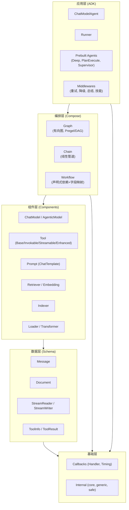
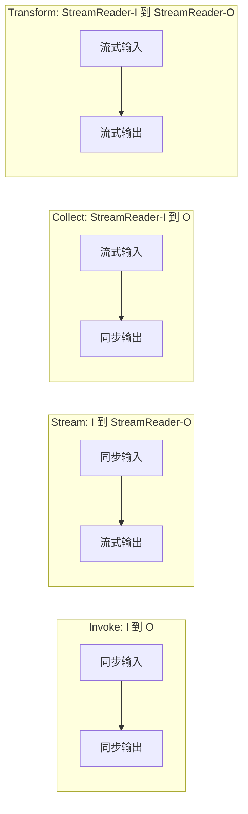
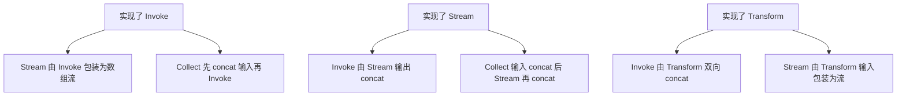
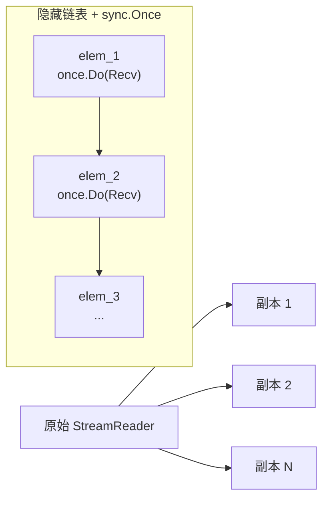
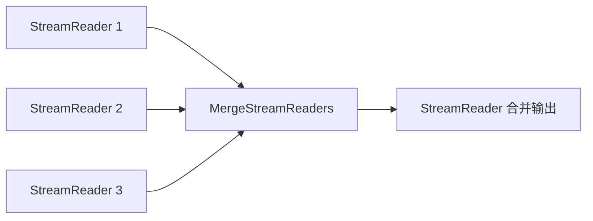
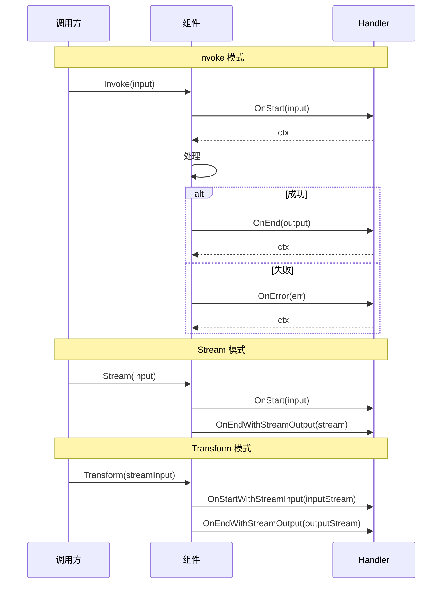
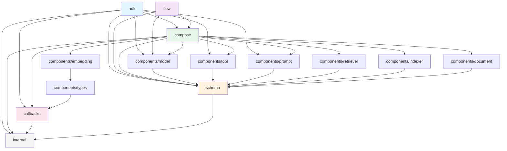

# Eino 架构详解

> 本文档详细阐述 Eino 框架的整体架构设计、数据流模型、流式处理机制、组件类型系统、回调体系和模块依赖关系。

## 1. 架构总览

Eino 采用分层架构设计，从上至下分为 5 层，每层仅依赖其下层（或同层），形成清晰的依赖单向性：



**层次职责**：

| 层次 | 职责 | 关键约束 |
|------|------|---------|
| 应用层 | Agent 创建、执行、多 Agent 协作 | 仅面向 Agent 场景 |
| 编排层 | 组件组装、数据流自动降级 | 编译后统一为 `Runnable[I,O]` |
| 组件层 | 标准化接口定义 | 接口稳定，实现可替换 |
| 数据层 | 跨组件共享数据结构 | 不可变语义，无业务逻辑 |
| 基础层 | 回调、泛型工具、安全处理 | 不依赖上层任何包 |

---

## 2. 数据流模型

`Runnable[I, O]` 接口（`compose/runnable.go:32-37`）定义了 4 种数据流模式，覆盖所有组件交互场景：



### 2.1 四种模式详解

```go
// compose/runnable.go:32-37
type Runnable[I, O any] interface {
    // 同步调用：输入一个完整值，返回一个完整值
    Invoke(ctx context.Context, input I, opts ...Option) (output O, err error)

    // 流式输出：输入一个完整值，返回流式读取器
    Stream(ctx context.Context, input I, opts ...Option) (output *schema.StreamReader[O], err error)

    // 流式输入收集：收集流式输入，返回完整结果
    Collect(ctx context.Context, input *schema.StreamReader[I], opts ...Option) (output O, err error)

    // 流式转换：流式输入到流式输出
    Transform(ctx context.Context, input *schema.StreamReader[I], opts ...Option) (output *schema.StreamReader[O], err error)
}
```

### 2.2 自动降级机制

当组件只实现了部分模式时，框架自动通过降级补全所有 4 种模式（`compose/runnable.go:336-400`）：



降级优先级在 `newRunnablePacker`（`compose/runnable.go:336`）中定义：

1. **Invoke**: 优先使用原始实现，否则 Stream → Collect → Transform 降级
2. **Stream**: 优先使用原始实现，否则 Transform → Invoke → Collect 降级
3. **Collect**: 优先使用原始实现，否则 Transform → Invoke → Stream 降级
4. **Transform**: 优先使用原始实现，否则 Stream → Collect → Invoke 降级

降级的核心思想：流式数据可通过 `concatStreamReader` 合并为同步值（`compose/runnable.go:182-192`），同步值可通过 `StreamReaderFromArray` 包装为单元素流（`schema/stream.go:461`）。

---

## 3. StreamReader 机制

`schema.StreamReader[T]` 是 Eino 流式处理的核心原语，定义于 `schema/stream.go:168-180`。

### 3.1 Pipe 创建流

`Pipe[T](cap)` 创建一对 StreamWriter/StreamReader（`schema/stream.go:99-102`）：

```go
// 创建容量为 3 的流
sr, sw := schema.Pipe[string](3)

// 写入端（通常在 goroutine 中）
go func() {
    defer sw.Close()
    for i := 0; i < 10; i++ {
        if sw.Send(fmt.Sprintf("chunk_%d", i), nil) {
            break // 流已关闭
        }
    }
}()

// 读取端
defer sr.Close()
for {
    chunk, err := sr.Recv()
    if errors.Is(err, io.EOF) {
        break
    }
    if err != nil {
        log.Fatal(err)
    }
    fmt.Println(chunk)
}
```

底层 `stream[T]` 结构（`schema/stream.go:375-382`）使用 channel 实现：

```go
type stream[T any] struct {
    items  chan streamItem[T]  // 数据通道
    closed chan struct{}       // 关闭信号
}
```

### 3.2 五种 Reader 类型

`StreamReader` 内部分为 5 种实现类型（`schema/stream.go:357-363`），通过 `readerType` 枚举区分：

```go
const (
    readerTypeStream      readerType = iota  // 基础 channel 流
    readerTypeArray                           // 数组包装
    readerTypeMultiStream                     // 多流合并
    readerTypeWithConvert                     // 类型转换
    readerTypeChild                           // Copy 产生的子流
)
```

`StreamReader` 结构体使用联合体模式（`schema/stream.go:168-180`）：

```go
type StreamReader[T any] struct {
    typ readerType
    st  *stream[T]                   // readerTypeStream
    ar  *arrayReader[T]              // readerTypeArray
    msr *multiStreamReader[T]        // readerTypeMultiStream
    srw *streamReaderWithConvert[T]  // readerTypeWithConvert
    csr *childStreamReader[T]        // readerTypeChild
}
```

`Recv()` 方法根据 `typ` 分派到对应实现（`schema/stream.go:195-210`）。这种设计避免了接口分派的开销，同时保持类型安全。

### 3.3 Copy(n) Fan-out 扇出

`Copy(n)` 将一个流复制为 n 个独立读取器（`schema/stream.go:261-275`），每个副本独立消费相同数据：

```go
// 将一个流扇出给 2 个消费者
copies := sr.Copy(2)
sr1, sr2 := copies[0], copies[1]
defer sr1.Close()
defer sr2.Close()
```

实现原理（`schema/stream.go:792-821`）：使用隐藏链表 `cpStreamElement` + `sync.Once` 实现惰性求值。首个到达某个元素的子流负责调用原始 `sr.Recv()` 并将结果写入节点，后续子流直接读取已填充的节点：

```go
// schema/stream.go:848-855 惰性求值核心
elem.once.Do(func() {
    t, err = p.sr.Recv()           // 首次访问时从原始流读取
    elem.item = streamItem[T]{chunk: t, err: err}
    if err != io.EOF {
        elem.next = &cpStreamElement[T]{}  // 挂载下一个空节点
        p.subStreamList[idx] = elem.next
    }
})
```



当所有子流都 Close 后，原始流才会被 Close（`schema/stream.go:868-881`），避免资源泄漏。

### 3.4 MergeStreamReaders Fan-in 扇入

`MergeStreamReaders` 将多个流合并为一个（`schema/stream.go:912-960`）：

```go
// 合并多个检索器的结果流
merged := schema.MergeStreamReaders([]*schema.StreamReader[string]{stream1, stream2, stream3})
defer merged.Close()
```



实现细节（`schema/stream.go:504-512`）：

- 少于 `maxSelectNum` 个流时使用 Go `select` 多路复用
- 超过时使用 `reflect.Select` 动态选择
- 所有源流耗尽后返回 `io.EOF`

命名版本 `MergeNamedStreamReaders`（`schema/stream.go:990`）在某个源流 EOF 时返回 `SourceEOF` 错误，携带源名称：

```go
namedStreams := map[string]*schema.StreamReader[string]{
    "agent_a": srA,
    "agent_b": srB,
}
merged := schema.MergeNamedStreamReaders(namedStreams)
defer merged.Close()
for {
    chunk, err := merged.Recv()
    if errors.Is(err, io.EOF) { break }
    if name, ok := schema.GetSourceName(err); ok {
        fmt.Printf("Agent %s 完成\n", name)
        continue
    }
    if err != nil { return err }
    process(chunk)
}
```

### 3.5 StreamReaderWithConvert 类型转换

`StreamReaderWithConvert` 对流中每个元素应用转换函数（`schema/stream.go:691-697`）：

```go
// int 流转 string 流
intReader := schema.StreamReaderFromArray([]int{0, 1, 2, 3})
strReader := schema.StreamReaderWithConvert(intReader,
    func(i int) (string, error) {
        if i == 0 {
            return "", schema.ErrNoValue  // 跳过零值
        }
        return fmt.Sprintf("val_%d", i), nil
    })
defer strReader.Close()
// 输出: "val_1", "val_2", "val_3"
```

可选配置项（`schema/stream.go:653-668`）：

- `WithErrWrapper(wrapper)`: 包装非 EOF 错误，返回 nil 时跳过错误块
- `WithOnEOF(fn)`: 流结束时的回调，可注入额外值或错误

### 3.6 ErrNoValue 过滤机制

`ErrNoValue`（`schema/stream.go:47`）是特殊的哨兵错误，转换函数返回它时元素被静默丢弃：

```go
var ErrNoValue = errors.New("no value")

// 在 StreamReaderWithConvert 中使用
outStream = schema.StreamReaderWithConvert(s,
    func(src string) (string, error) {
        if len(src) == 0 {
            return "", schema.ErrNoValue  // 跳过空块
        }
        return src, nil
    })
```

内部实现（`schema/stream.go:732-734`）：当转换函数返回 `ErrNoValue` 时，不向调用者暴露错误，而是继续读取下一个元素。

---

## 4. 组件类型系统

`components/types.go` 定义了组件的类别常量和元信息接口。

### 4.1 Component 常量

```go
// components/types.go:66-87
const (
    ComponentOfPrompt        Component = "ChatTemplate"
    ComponentOfAgenticPrompt Component = "AgenticChatTemplate"
    ComponentOfChatModel     Component = "ChatModel"
    ComponentOfAgenticModel  Component = "AgenticModel"
    ComponentOfEmbedding     Component = "Embedding"
    ComponentOfIndexer       Component = "Indexer"
    ComponentOfRetriever     Component = "Retriever"
    ComponentOfLoader        Component = "Loader"
    ComponentOfTransformer   Component = "DocumentTransformer"
    ComponentOfTool          Component = "Tool"
)
```

这些常量在回调系统中用于标识组件类别，使 Handler 能按类别过滤而不依赖具体实现。ADK 额外定义了 `ComponentOfAgent = "Agent"` 和 `ComponentOfAgenticAgent = "AgenticAgent"`（`adk/interface.go:33-37`）。

### 4.2 Typer 接口

```go
// components/types.go:29-31
type Typer interface {
    GetType() string  // 返回实现名称，如 "OpenAIChatModel"
}
```

组件实现 `Typer` 后，DevOps 工具的显示名称变为 `{GetType()}{ComponentKind}`，如 `OpenAIChatModel`。

### 4.3 Checker 接口

```go
// components/types.go:50-52
type Checker interface {
    IsCallbacksEnabled() bool
}
```

组件实现 `Checker` 并返回 `true` 时，框架跳过自动回调包装，由组件自行控制回调时机。适用于需要精确控制回调点的场景，如流式输出中间状态。

---

## 5. Callback 体系

### 5.1 Handler 接口

```go
// callbacks/interface.go:85
type Handler = callbacks.Handler
```

Handler 接口包含 5 个方法，对应 5 种回调时机。每个方法接收上一个时机返回的 `context.Context`，支持在同一 Handler 内传递状态。

**重要约束**：

- 不同 Handler 之间无执行顺序保证
- 流式回调收到的是 StreamReader 的拷贝，Handler **必须 Close** 其拷贝
- 不要修改 Input/Output 值，所有下游节点和 Handler 共享同一指针

### 5.2 五种回调时机



| 时机 | 源码位置 | 输入类型 | 触发模式 |
|------|---------|---------|---------|
| `TimingOnStart` | `callbacks/interface.go:117` | `CallbackInput` | Invoke |
| `TimingOnEnd` | `callbacks/interface.go:120` | `CallbackOutput` | Invoke |
| `TimingOnError` | `callbacks/interface.go:124` | `error` | 任意 |
| `TimingOnStartWithStreamInput` | `callbacks/interface.go:128` | `*StreamReader[CallbackInput]` | Collect/Transform |
| `TimingOnEndWithStreamOutput` | `callbacks/interface.go:133` | `*StreamReader[CallbackOutput]` | Stream/Transform |

### 5.3 TimingChecker 优化

实现 `Needed(timing CallbackTiming) bool` 的 Handler 可声明自己只关注特定时机（`callbacks/interface.go:145`）。框架据此跳过不需要的流拷贝和 goroutine 分配，避免不必要的性能开销。

### 5.4 全局与局部 Handler

```go
// 全局 Handler：进程初始化时注册，优先级最高
callbacks.AppendGlobalHandlers(tracingHandler, metricsHandler)

// 局部 Handler：单次图执行时传入
runnable, _ := graph.Compile(compose.WithCallbacks(loggingHandler))
```

### 5.5 RunInfo 上下文

每次回调都携带 `RunInfo`（`callbacks/interface.go:41`），包含三个字段：

| 字段 | 说明 | 示例 |
|------|------|------|
| `Name` | 业务名称（用户指定） | "my_chat_node" |
| `Type` | 实现标识（组件自报） | "OpenAI" |
| `Component` | 类别常量 | `ComponentOfChatModel` |

---

## 6. 模块依赖图



**依赖要点**：

1. **Schema 是零依赖核心**：仅依赖 `internal` 的泛型和安全处理工具，不依赖任何业务包
2. **Components 扇出依赖 Schema**：每个组件包只依赖 Schema + 自身 Option，互不引用
3. **Compose 聚合所有组件**：编排层需要将任意组件类型包装为 `composableRunnable`
4. **ADK 纵向穿透**：应用层直接依赖编排层、组件层、回调层和基础层
5. **Callbacks 横切关注点**：被编排层和组件类型系统共同依赖，但不依赖上层
