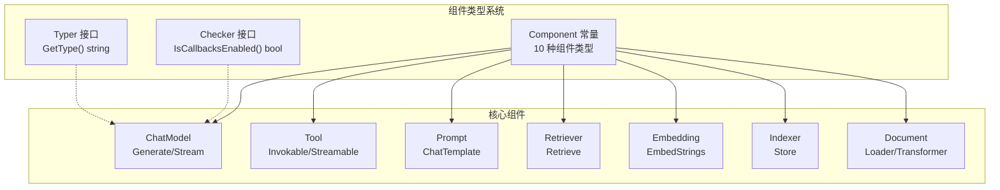

# Eino 组件层详解

组件层是 Eino 框架的核心抽象层，定义了 7 大组件接口。所有上层编排（Graph、Chain、Workflow）均基于这些接口构建，每个组件只需实现自身关注的能力，框架自动处理数据流适配。



## 1. 组件类型系统

> 源码位置：`components/types.go`

### 1.1 Component 常量

`Component` 类型定义了框架识别的所有组件类别（`components/types.go:67-87`）：

| 常量 | 值 | 说明 |
|------|-----|------|
| `ComponentOfPrompt` | `"ChatTemplate"` | 聊天模板组件 |
| `ComponentOfAgenticPrompt` | `"AgenticChatTemplate"` | Agentic 模板组件 |
| `ComponentOfChatModel` | `"ChatModel"` | 聊天模型组件 |
| `ComponentOfAgenticModel` | `"AgenticModel"` | Agentic 模型组件 |
| `ComponentOfEmbedding` | `"Embedding"` | 向量嵌入组件 |
| `ComponentOfIndexer` | `"Indexer"` | 索引存储组件 |
| `ComponentOfRetriever` | `"Retriever"` | 检索组件 |
| `ComponentOfLoader` | `"Loader"` | 文档加载组件 |
| `ComponentOfTransformer` | `"DocumentTransformer"` | 文档转换组件 |
| `ComponentOfTool` | `"Tool"` | 工具组件 |

### 1.2 Typer 接口

`Typer` 接口为组件提供可读的类型名称（`components/types.go:29-31`）：

```go
type Typer interface {
    GetType() string
}
```

实现 `Typer` 后，组件在 DevOps 工具（可视化调试器、IDE 插件、仪表盘）中的完整显示名称变为 `"{GetType()}{ComponentKind}"`，例如 `"OpenAIChatModel"`。`utils.InferTool` 等构造器也使用此接口设置工具实例的显示名称。

### 1.3 Checker 接口

`Checker` 接口控制框架的自动回调插桩是否激活（`components/types.go:50-52`）：

```go
type Checker interface {
    IsCallbacksEnabled() bool
}
```

当 `IsCallbacksEnabled()` 返回 `true` 时，框架跳过默认的 `OnStart/OnEnd` 包裹，信任组件自身在正确时机调用回调。适用于需要精确控制回调时序的场景，例如流式输出需要在流中间触发回调而非仅完成时。

## 2. ChatModel 聊天模型

> 源码位置：`components/model/interface.go`

### 2.1 messageType 类型约束

`messageType` 是密封的类型约束，仅允许 `*schema.Message` 和 `*schema.AgenticMessage`（`components/model/interface.go:27-29`）：

```go
type messageType interface {
    *schema.Message | *schema.AgenticMessage
}
```

这一设计确保 BaseModel 的泛型参数只能在标准消息和 Agentic 消息之间选择，在编译期即杜绝非法类型。

### 2.2 BaseModel 泛型基接口

`BaseModel[M]` 是模型的泛型基接口（`components/model/interface.go:36-39`）：

```go
type BaseModel[M messageType] interface {
    Generate(ctx context.Context, input []M, opts ...Option) (M, error)
    Stream(ctx context.Context, input []M, opts ...Option) (*schema.StreamReader[M], error)
}
```

两种交互模式：
- **Generate**：阻塞等待模型返回完整响应
- **Stream**：返回 `StreamReader`，逐块增量获取模型输出

### 2.3 三种模型接口

| 接口 | 定义位置 | 说明 |
|------|---------|------|
| `BaseChatModel` | `interface.go:71` | `= BaseModel[*schema.Message]`，标准聊天模型类型别名 |
| `ToolCallingChatModel` | `interface.go:99-103` | 扩展 `BaseChatModel`，通过 `WithTools` 返回新实例，并发安全 |
| `AgenticModel` | `interface.go:109` | `= BaseModel[*schema.AgenticMessage]`，Agentic 模型类型别名 |

**已弃用**：`ChatModel` 接口（`interface.go:80-87`）通过 `BindTools` 原地修改实例，存在并发竞争。应使用 `ToolCallingChatModel.WithTools` 替代：

```go
// 并发安全：WithTools 返回新实例
base, _ := openai.NewChatModel(ctx, cfg)       // 共享基础实例
withSearch, _ := base.WithTools([]*schema.ToolInfo{searchTool})
withCalc, _ := base.WithTools([]*schema.ToolInfo{calcTool})
```

## 3. Tool 工具

> 源码位置：`components/tool/interface.go`

工具接口体系按"元数据 → 可调用 → 流式 → 增强"逐层递进：

### 3.1 接口层次

| 接口 | 定义位置 | 说明 |
|------|---------|------|
| `BaseTool` | `interface.go:32-34` | 元数据接口，`Info()` 返回 `ToolInfo` |
| `InvokableTool` | `interface.go:42-47` | 可调用，`InvokableRun(ctx, jsonArgs)` 返回 `string` |
| `StreamableTool` | `interface.go:53-57` | 流式可调用，`StreamableRun()` 返回 `StreamReader[string]` |
| `EnhancedInvokableTool` | `interface.go:67-70` | 增强调用，参数为 `ToolArgument`，返回 `ToolResult`（支持多模态） |
| `EnhancedStreamableTool` | `interface.go:76-79` | 增强流式，返回 `StreamReader[*ToolResult]` |

当工具同时实现标准和增强接口时，ToolsNode 优先使用增强接口。

### 3.2 工具构造工具

`components/tool/utils/` 提供便捷的构造函数，通过泛型自动推断 JSON Schema：

**InferTool**（`invokable_func.go:46-53`）：从函数签名推断参数 Schema

```go
// 定义输入结构体
type SearchInput struct {
    Query string `json:"query" jsonschema:"description=搜索关键词"`
}

// 从函数自动推断 ToolInfo
searchTool, err := utils.InferTool[SearchInput, string](
    "web_search", "搜索互联网",
    func(ctx context.Context, input SearchInput) (string, error) {
        return doSearch(input.Query), nil
    },
)
```

- **InferEnhancedTool**：类似 `InferTool`，但返回 `EnhancedInvokableTool`，支持多模态输出
- **NewTool**：手动传入 `ToolInfo`，适用于无法通过结构体推断的场景

## 4. Prompt 模板

> 源码位置：`components/prompt/interface.go`

| 接口 | 定义位置 | 说明 |
|------|---------|------|
| `ChatTemplate` | `interface.go:43-45` | `Format(ctx, vs)` → `[]*schema.Message` |
| `AgenticChatTemplate` | `interface.go:48-50` | `Format(ctx, vs)` → `[]*schema.AgenticMessage` |

`Format` 接收 `map[string]any` 变量映射，将模板中的占位符替换为实际值。模板中存在但 `vs` 中缺失的变量会产生运行时错误。在 Graph/Chain 中，ChatTemplate 通常位于 ChatModel 之前。

## 5. Retriever 检索器

> 源码位置：`components/retriever/interface.go`

```go
type Retriever interface {
    Retrieve(ctx context.Context, query string, opts ...Option) ([]*schema.Document, error)
}
```

（`interface.go:48-50`）接收自然语言查询，返回按相关性排序的 `Document` 列表。当设置 `Options.Embedding` 时，实现将查询转为向量再搜索；嵌入模型必须与索引时一致。`Options.TopK` 限制返回数量，`Options.ScoreThreshold` 过滤低分结果。

## 6. Embedding 向量嵌入

> 源码位置：`components/embedding/interface.go`

```go
type Embedder interface {
    EmbedStrings(ctx context.Context, texts []string, opts ...Option) ([][]float64, error)
}
```

（`interface.go:37-38`）批量将文本转为密集向量。`embeddings[i]` 对应 `texts[i]` 的向量，向量维度由底层模型固定。Indexer 和 Retriever 必须使用相同模型，维度不匹配会导致语义相似度计算失败。

## 7. Indexer 索引器

> 源码位置：`components/indexer/interface.go`

```go
type Indexer interface {
    Store(ctx context.Context, docs []*schema.Document, opts ...Option) (ids []string, err error)
}
```

（`interface.go:37-39`）批量存储文档，返回后端分配的 ID。当提供 `Options.Embedding` 时，存储前自动生成向量。`Options.SubIndexes` 可将文档写入同一存储的逻辑分区。

## 8. Document Loader/Transformer

> 源码位置：`components/document/interface.go`

### 8.1 Source 结构体

```go
type Source struct {
    URI string  // 本地文件路径或远程 URL
}
```

（`interface.go:27-29`）标识文档的外部位置。

### 8.2 Loader 接口

```go
type Loader interface {
    Load(ctx context.Context, src Source, opts ...LoaderOption) ([]*schema.Document, error)
}
```

（`interface.go:43-45`）从外部源读取内容，返回 `Document` 列表。格式解析通常委托给 `parser.Parser`（通过 `WithParserOptions` 配置）。

### 8.3 Transformer 接口

```go
type Transformer interface {
    Transform(ctx context.Context, src []*schema.Document, opts ...TransformerOption) ([]*schema.Document, error)
}
```

（`interface.go:53-55`）对文档切片执行拆分、过滤、合并或重排序。实现应保留已有 MetaData 并合并而非覆盖。

## 9. Option 模式

每个组件包都遵循统一的 Option 模式，通过 `xxx_option.go` 文件定义：

```go
// 组件包内的 Option 类型
type Option struct {
    // 包含该组件特有的可选配置
}

// 通过 WithXxx 函数创建 Option
func WithTopK(k int) Option { ... }
```

调用时以可变参数传入，未设置的选项使用零值默认行为：

```go
docs, _ := retriever.Retrieve(ctx, "query", retriever.WithTopK(5))
embeddings, _ := embedder.EmbedStrings(ctx, texts, embedding.WithBatchSize(32))
```

这种模式使得接口定义保持简洁（只需 `opts ...Option`），同时扩展性良好，新增选项无需修改接口签名。
