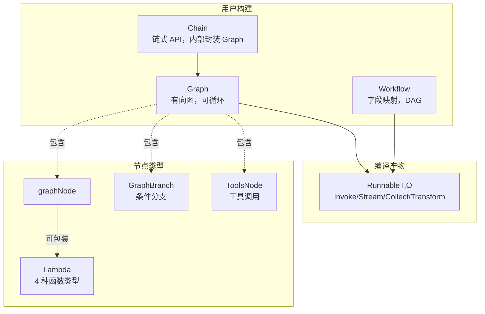

# Eino 编排层详解

编排层是 Eino 框架的核心引擎，提供 Graph/Chain/Workflow 三种编排方式。它们的共同抽象是 Runnable 接口——所有可编排对象编译后都成为 Runnable，统一支持 Invoke/Stream/Collect/Transform 四种数据流模式。



## 1. Runnable 接口

> 源码位置：`compose/runnable.go`

`Runnable` 是 Eino 编排的核心抽象（`compose/runnable.go:32-37`）：

```go
type Runnable[I, O any] interface {
    Invoke(ctx context.Context, input I, opts ...Option) (output O, err error)
    Stream(ctx context.Context, input I, opts ...Option) (output *schema.StreamReader[O], err error)
    Collect(ctx context.Context, input *schema.StreamReader[I], opts ...Option) (output O, err error)
    Transform(ctx context.Context, input *schema.StreamReader[I], opts ...Option) (output *schema.StreamReader[O], err error)
}
```

四种数据流模式对应输入输出的"单值"或"流"：

| 方法 | 输入 | 输出 | 形象 |
|------|------|------|------|
| `Invoke` | 单值 | 单值 | `ping → pong` |
| `Stream` | 单值 | 流 | `ping → stream out` |
| `Collect` | 流 | 单值 | `stream in → pong` |
| `Transform` | 流 | 流 | `stream in → stream out` |

### 自动降级机制

Runnable 的核心创新是**自动降级**：组件只需实现一种或多种方法，框架自动适配其他模式。例如组件仅实现 `Stream()`，调用方仍可使用 `Invoke()`——框架会读取流并拼接为单值。

在 `compose/runnable.go:336-400` 的 `newRunnablePacker` 中，按优先级（直接实现 > 通过其他方法转换）填充四种模式：

- `i` 缺失 → 通过 `s` (invokeByStream)、`c` (invokeByCollect)、`t` (invokeByTransform) 实现
- `s` 缺失 → 通过 `t` (streamByTransform)、`i` (streamByInvoke)、`c` (streamByCollect) 实现
- 同理 `c`、`t`

这一设计让组件实现者无需关心调用方式，编排层自动桥接。

## 2. Graph 有向图编排

> 源码位置：`compose/graph.go`

### 2.1 START/END 常量

Graph 中所有节点连接的起点和终点（`compose/graph.go:37, 40`）：

```go
const START = "start"
const END = "end"
```

### 2.2 运行模式：Pregel vs DAG

`graphRunType` 控制图的运行模式（`compose/graph.go:43-49`）：

```go
const (
    runTypePregel graphRunType = "Pregel"  // 适合大规模图，支持循环
    runTypeDAG    graphRunType = "DAG"     // 有向无环图
)
```

- **Pregel**：兼容 `NodeTriggerType.AnyPredecessor`，支持节点循环执行（适合 Agent 多轮迭代）
- **DAG**：兼容 `NodeTriggerType.AllPredecessor`，无环（适合 Workflow）

### 2.3 节点触发模式

`NodeTriggerMode` 定义于 `compose/types.go:42-46`：

```go
const (
    AnyPredecessor NodeTriggerMode = "any_predecessor"  // 任一前驱完成即触发
    AllPredecessor NodeTriggerMode = "all_predecessor"  // 所有前驱完成才触发
)
```

### 2.4 graph 结构体

`graph` 结构体（`compose/graph.go:57-89`）维护图的全部元数据：

```go
type graph struct {
    nodes        map[string]*graphNode        // 节点表（key → 节点）
    controlEdges map[string][]string          // 控制流边
    dataEdges    map[string][]string          // 数据流边
    branches     map[string][]*GraphBranch    // 分支
    startNodes   []string
    endNodes     []string

    stateType      reflect.Type               // 状态类型
    stateGenerator func(ctx context.Context) any

    // 字段映射记录
    fieldMappingRecords map[string][]*FieldMapping
    // ...
}
```

### 2.5 添加节点的方法

Graph 提供针对每种组件类型的强类型添加方法：

```go
graph := compose.NewGraph[map[string]any, *schema.Message]()

// 添加各类组件节点
graph.AddChatTemplateNode("template", chatTemplate)
graph.AddChatModelNode("model", chatModel)
graph.AddToolsNode("tools", toolsNode)
graph.AddRetrieverNode("retriever", retriever)
graph.AddIndexerNode("indexer", indexer)
graph.AddEmbeddingNode("embedding", embedder)
graph.AddLoaderNode("loader", loader)
graph.AddDocumentTransformerNode("transformer", transformer)
graph.AddLambdaNode("lambda", lambda)
graph.AddGraphNode("subgraph", subGraph)
```

### 2.6 边与分支

```go
// 添加边
graph.AddEdge(compose.START, "template")
graph.AddEdge("template", "model")
graph.AddEdge("model", compose.END)

// 添加条件分支
branch := compose.NewGraphBranch(
    func(ctx context.Context, msg *schema.Message) (string, error) {
        if len(msg.ToolCalls) > 0 {
            return "tools", nil
        }
        return compose.END, nil
    },
    map[string]bool{"tools": true, compose.END: true},
)
graph.AddBranch("model", branch)
```

## 3. Chain 链式编排

> 源码位置：`compose/chain.go`

### 3.1 NewChain 构造

`NewChain` 创建一个内部封装 Graph 的链（`compose/chain.go:37-45`）：

```go
func NewChain[I, O any](opts ...NewGraphOption) *Chain[I, O] {
    ch := &Chain[I, O]{
        gg: NewGraph[I, O](opts...),
    }
    ch.gg.cmp = ComponentOfChain
    return ch
}
```

### 3.2 链式 API

Chain 提供 `AppendXxx` 系列方法（注释见 `compose/chain.go:72-82`），按顺序追加节点，自动连接前驱：

```go
chain := compose.NewChain[map[string]any, *schema.Message]()

chain.
    AppendChatTemplate(chatTemplate).
    AppendChatModel(chatModel).
    AppendToolsNode(toolsNode).
    AppendLambda(parseLambda)

r, err := chain.Compile(ctx)
output, err := r.Invoke(ctx, map[string]any{"query": "你好"})
```

### 3.3 并行与分支

```go
chain.AppendParallel(parallel)  // 并行执行多个分支
chain.AppendBranch(branch)      // 条件分支
chain.AppendGraph(subChain)     // 嵌套子链
```

Chain 内部本质是 Graph 的语法糖：每次 `Append` 实际是向底层 Graph 添加节点并自动连接 `preNodeKeys → 新节点`。Compile 时调用 `addEndIfNeeded` 将最后的前驱连接到 `END`。

## 4. Workflow 字段映射编排

> 源码位置：`compose/workflow.go`

### 4.1 NewWorkflow 构造

```go
func NewWorkflow[I, O any](opts ...NewGraphOption) *Workflow[I, O]
```

（`compose/workflow.go:61-79`）创建底层为 `NodeTriggerMode=AllPredecessor` 的 Graph，**不支持循环**。

### 4.2 WorkflowNode 结构

```go
type WorkflowNode struct {
    g                *graph
    key              string
    addInputs        []func() error
    staticValues     map[string]any
    dependencySetter func(fromNodeKey string, typ dependencyType)
    mappedFieldPath  map[string]any
}
```

（`compose/workflow.go:34-41`）每个节点维护其输入声明、静态值和依赖关系。

### 4.3 字段映射代替 AddEdge

Workflow 的最大特色是**字段级数据连接**，无需 `AddEdge`，通过 `AddInput` + `FromField`/`ToField`/`MapFields` 声明字段映射（`compose/field_mapping.go:65-90`）：

```mermaid
graph LR
    A[节点 A<br/>output: {Query, Topic}] -->|FromField Query| B[节点 B<br/>input: string]
    A -->|MapFields Topic→Category| C[节点 C<br/>input: {Category}]
    A -->|ToField Result| D[节点 D<br/>input: {Result, Other}]
```

```go
wf := compose.NewWorkflow[InputT, OutputT]()

wf.AddChatModelNode("model", chatModel)
wf.AddLambdaNode("extract", extractor).
    AddInput("model", compose.FromField("Content"))  // 取模型输出的 Content 字段

wf.AddToolsNode("tools", toolsNode).
    AddInput("model", compose.MapFields("ToolCalls", "tool_calls"))

wf.End().AddInput("tools", compose.ToField("results"))
```

三种映射函数：

| 函数 | 含义 |
|------|------|
| `FromField(from)` | 前驱的某个字段作为后继的整个输入（排他性） |
| `ToField(to)` | 前驱的整个输出作为后继的某个字段 |
| `MapFields(from, to)` | 前驱字段映射到后继字段 |

## 5. Lambda 节点

> 源码位置：`compose/types_lambda.go`

### 5.1 四种函数类型

`compose/types_lambda.go:27-39` 定义了与 Runnable 四种模式对应的函数类型：

```go
type Invoke[I, O, TOption any]    func(ctx context.Context, input I, opts ...TOption) (O, error)
type Stream[I, O, TOption any]    func(ctx context.Context, input I, opts ...TOption) (*schema.StreamReader[O], error)
type Collect[I, O, TOption any]   func(ctx context.Context, input *schema.StreamReader[I], opts ...TOption) (O, error)
type Transform[I, O, TOption any] func(ctx context.Context, input *schema.StreamReader[I], opts ...TOption) (*schema.StreamReader[O], error)
```

### 5.2 Lambda 构造器

```go
// 同步函数
parseLambda := compose.InvokableLambda(
    func(ctx context.Context, msg *schema.Message) (MyStruct, error) {
        // 解析消息为结构体
        return parseMsg(msg)
    },
)

// 流式输出
streamLambda := compose.StreamableLambda(
    func(ctx context.Context, input string) (*schema.StreamReader[string], error) {
        return startStreaming(input)
    },
)

// 多模式同时实现（自动降级）
lambda, err := compose.AnyLambda(invokeFunc, streamFunc, nil, nil)
```

## 6. Branch 条件分支

> 源码位置：`compose/branch.go`

`compose/branch.go:28-38` 定义了三种分支条件函数：

```go
// 单选分支：从输入决定下一个节点
type GraphBranchCondition[T any] func(ctx context.Context, in T) (endNode string, err error)

// 流式单选分支
type StreamGraphBranchCondition[T any] func(ctx context.Context, in *schema.StreamReader[T]) (endNode string, err error)

// 多选分支：可同时触发多个节点
type GraphMultiBranchCondition[T any] func(ctx context.Context, in T) (endNode map[string]bool, err error)
```

典型应用：根据 ChatModel 输出是否包含 ToolCalls 决定走工具调用还是直接结束：

```go
branch := compose.NewGraphBranch(
    func(ctx context.Context, msg *schema.Message) (string, error) {
        if len(msg.ToolCalls) > 0 {
            return "tools", nil
        }
        return compose.END, nil
    },
    map[string]bool{"tools": true, compose.END: true},
)
graph.AddBranch("model", branch)
```

## 7. State 状态管理

> 源码位置：`compose/state.go`

### 7.1 GenLocalState

定义状态生成函数（`compose/state.go:30`）：

```go
type GenLocalState[S any] func(ctx context.Context) (state S)
```

编译时通过 `WithGenLocalState` 选项注入。

### 7.2 StatePreHandler / StatePostHandler

节点执行前后修改状态（`compose/state.go:42-46`）：

```go
type StatePreHandler[I, S any]  func(ctx context.Context, in I, state S) (I, error)
type StatePostHandler[O, S any] func(ctx context.Context, out O, state S) (O, error)
```

### 7.3 ProcessState 并发安全状态访问

`ProcessState` 是推荐的状态访问方式（`compose/state.go:165-173`）：

```go
func ProcessState[S any](ctx context.Context, handler func(context.Context, S) error) error
```

特性：
- **并发安全**：自动加锁，handler 执行期间持有互斥锁
- **嵌套图查找**：当前图未找到时，向父级图查找（支持嵌套图访问父状态）
- **词法作用域**：内层同类型状态遮蔽外层

```go
lambda := compose.InvokableLambda(
    func(ctx context.Context, in string) (string, error) {
        err := compose.ProcessState[*MyState](ctx, func(ctx context.Context, s *MyState) error {
            s.Count++  // 安全修改状态
            return nil
        })
        return in, err
    },
)
```

## 8. Checkpoint 持久化

> 源码位置：`compose/checkpoint.go`

### 8.1 CheckPointStore

```go
type CheckPointStore = core.CheckPointStore
```

（`compose/checkpoint.go:51`）抽象的检查点存储接口，可对接 Redis、文件系统等。

### 8.2 编译选项与运行选项

```go
// 编译时配置 Store（compose/checkpoint.go:59-77）
WithCheckPointStore(store)     // 设置检查点存储
WithSerializer(serializer)     // 设置序列化器

// 运行时配置 ID
WithCheckPointID("session-001")            // 加载和写入 ID
WithWriteToCheckPointID("session-002")     // 写入到不同 ID（分叉）
WithForceNewRun()                          // 忽略已有检查点
```

```go
r, _ := graph.Compile(ctx, compose.WithCheckPointStore(store))

// 首次运行
out, _ := r.Invoke(ctx, input, compose.WithCheckPointID("conv-001"))

// 断点续跑
out, _ = r.Invoke(ctx, nil, compose.WithCheckPointID("conv-001"))
```

## 9. Interrupt 中断机制

> 源码位置：`compose/interrupt.go`

### 9.1 编译时中断点

```go
// 在指定节点之前中断（compose/interrupt.go:31-35）
WithInterruptBeforeNodes([]string{"tools"})

// 在指定节点之后中断（compose/interrupt.go:38-42）
WithInterruptAfterNodes([]string{"model"})
```

### 9.2 已弃用：InterruptAndRerun

```go
var InterruptAndRerun = deprecatedInterruptAndRerun
```

（`compose/interrupt.go:45-47`）旧式中断错误，已被 `Interrupt(ctx, info)` 和 `StatefulInterrupt(ctx, info, state)` 取代。

### 9.3 新式中断 API

```go
// 简单中断（不保存状态）
return compose.Interrupt(ctx, "等待用户审核")

// 有状态中断（保存重启所需上下文）
return compose.StatefulInterrupt(ctx, "等待审核", &myState)

// 复合中断（适用于 ToolsNode 等聚合节点）
return compose.CompositeInterrupt(ctx, info, state, subErr1, subErr2)
```

中断后，配合 Checkpoint 可实现 Human-in-the-loop 工作流：保存进度 → 等待人工输入 → 从中断点续跑。

## 10. ToolsNode 工具调用节点

> 源码位置：`compose/tool_node.go`

### 10.1 ToolsNode 结构

```go
type ToolsNode struct {
    tuple                       *toolsTuple
    tools                       []tool.BaseTool
    unknownToolHandler          func(ctx context.Context, name, input string) (string, error)
    executeSequentially         bool
    toolArgumentsHandler        func(ctx context.Context, name, input string) (string, error)
    toolCallMiddlewares         []InvokableToolMiddleware
    streamToolCallMiddlewares   []StreamableToolMiddleware
    enhancedToolCallMiddlewares []EnhancedInvokableToolMiddleware
    // ...
}
```

（`compose/tool_node.go:71-90`）节点接收带 `ToolCalls` 的 AssistantMessage，并行执行工具，返回 `[]*schema.Message`（ToolMessage 数组）。

### 10.2 AgenticToolsNode

```go
func NewAgenticToolsNode(ctx context.Context, conf *ToolsNodeConfig) (*AgenticToolsNode, error)

type AgenticToolsNode struct {
    inner *ToolsNode
}
```

（`compose/agentic_tools_node.go:32-42`）`AgenticToolsNode` 是 `ToolsNode` 在 `AgenticMessage` 上的包装：输入输出类型为 `*schema.AgenticMessage`，内部转换为标准 ToolCall 后委托给 `ToolsNode` 执行，再转换回 AgenticMessage。

## 总结

Eino 的编排层通过 Runnable 统一抽象 + 自动降级机制，让组件实现者只关心业务逻辑，编排者按需选择 Graph（灵活、可循环）、Chain（简洁、线性）、Workflow（DAG、字段级映射）三种风格。配合 State、Checkpoint、Interrupt 等高阶能力，可构建从简单 RAG 到复杂 Agent 的全谱系应用。
