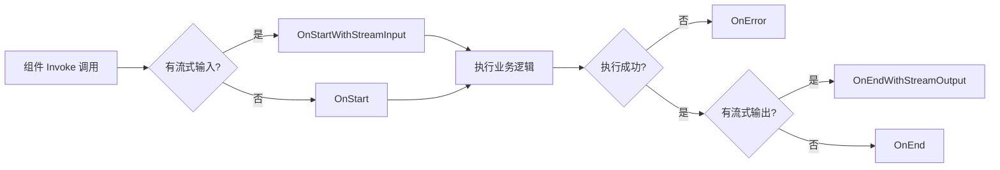

# Eino 回调体系 - 可观测性与扩展机制

Eino 的回调（Callbacks）体系是框架的**横切关注点**实现，为日志、监控、链路追踪、调试等可观测性需求提供统一接入点。它运行在组件执行的关键时机，但不侵入业务逻辑。

## 1. 回调架构总览

Eino 在每个组件（ChatModel、Tool、Retriever、Lambda、Graph 等）的执行过程中，会在 5 个时机触发已注册的 Handler。这套机制对一切组件、子图与 Lambda 节点同样适用。



每个 Handler 在不同时机收到的 `RunInfo` 都标识了当前组件的元信息（名称、类型、组件类别），便于在统一 Handler 中按组件分流处理。

## 2. 核心类型

回调相关的对外类型定义于 `callbacks/interface.go`，均为对 `internal/callbacks` 内部实现的类型别名（type alias），以保持 API 稳定且实现解耦。

### 2.1 RunInfo - 触发回调的实体描述

`RunInfo`（`callbacks/interface.go:41`）记录了"是谁触发了这次回调"，Handler 几乎都需要先检查它：

- **Name**：业务语义名，由用户通过 `compose.WithNodeName` 或 `InitCallbacks` 显式指定。在图中即节点名，独立组件未设置时为空串。
- **Type**：实现身份，例如 `"OpenAI"`。由组件实现 `components.Typer` 接口给出；未实现则通过反射回退为结构体或函数名。
- **Component**：分类常量，如 `components.ComponentOfChatModel`。Lambda 固定为 `"Lambda"`，图固定为 `"Graph"` / `"Chain"` / `"Workflow"`。可用它来按"组件大类"分支处理，而无需关心具体实现。

> 注意：Handler 之间没有保证执行顺序，所以应当依靠 `RunInfo` 而不是"第几个被调用"来做过滤。

### 2.2 CallbackInput / CallbackOutput - 类型安全的载荷转换

`CallbackInput`（`callbacks/interface.go:55`）和 `CallbackOutput`（`callbacks/interface.go:60`）都是**组件特定**的载荷类型，本质是 `any`。直接断言会因组件不同而出错，**必须**通过组件包提供的 `ConvCallbackInput` / `ConvCallbackOutput` 进行安全转换 —— 类型不匹配时返回 `nil`，可优雅跳过：

```go
// 仅关心 ChatModel 的输入
modelInput := model.ConvCallbackInput(in)
if modelInput == nil {
    return ctx // 当前组件不是 ChatModel，直接放行
}
log.Printf("prompt: %v", modelInput.Messages)
```

### 2.3 Handler 接口 - 5 个方法

`Handler`（`callbacks/interface.go:85`）是统一的回调处理器接口，必须实现 5 个方法：

| 方法 | 时机 | 入参类型 |
|------|------|---------|
| `OnStart` | 同步启动 | `CallbackInput` |
| `OnEnd` | 成功结束 | `CallbackOutput` |
| `OnError` | 发生错误 | `error` |
| `OnStartWithStreamInput` | 流式输入启动 | `*schema.StreamReader[CallbackInput]` |
| `OnEndWithStreamOutput` | 流式输出结束 | `*schema.StreamReader[CallbackOutput]` |

每个方法都接收上一时机返回的 `context.Context`，便于**同一 Handler** 在 `OnStart` 和 `OnEnd` 之间通过 `context.WithValue` 传递状态（如开始时间戳）。但**不同 Handler** 之间没有 context 传递关系，也没有执行顺序保证。

### 2.4 TimingChecker 接口 - Needed 优化

`TimingChecker`（`callbacks/interface.go:145`）是 `Handler` 的可选附加接口，方法签名为：

```go
Needed(ctx context.Context, info *RunInfo, timing CallbackTiming) bool
```

框架在每次组件调用前会询问 Handler"你关心这个时机吗？"。如果返回 `false`，则跳过该时机对应的开销：例如流式时机需要拷贝整条流（额外 goroutine + channel），跳过可显著降低高频路径的成本。

通过 `NewHandlerBuilder` 或 `utils/callbacks.NewHandlerHelper` 构造的 Handler 会**自动**实现 `TimingChecker`，只对实际注册了回调函数的时机返回 `true`。

## 3. 五种回调时机

`CallbackTiming` 枚举定义于 `callbacks/interface.go:111-134`，共 5 个常量：

### 3.1 TimingOnStart（`interface.go:117`）

组件开始处理前触发，参数为完整非流式输入值。最常用：记录开始时间、入参校验、链路追踪打点。

### 3.2 TimingOnEnd（`interface.go:120`）

组件成功返回后触发，参数为输出值。**仅在成功路径触发**，发生错误时不会回调。

### 3.3 TimingOnError（`interface.go:123`）

组件返回非 nil 错误时触发。**注意**：流式输出过程中发生的错误（如生产者 panic）**不会**通过此时机报告，而是表现为消费者从 `StreamReader` 读取时返回错误。这意味着流式 Handler 必须自行处理流读取过程中的错误。

### 3.4 TimingOnStartWithStreamInput（`interface.go:127`）

组件接收到**流式输入**时触发（即 `Collect` / `Transform` 范式）。Handler 收到的是已经**拷贝过**的私有流副本，**必须在使用后 Close**，否则上游流无法被释放，导致整条 pipeline 的 goroutine / 内存泄漏。

### 3.5 TimingOnEndWithStreamOutput（`interface.go:132`）

组件产生**流式输出**时触发（即 `Stream` / `Transform` 范式）。同样收到的是私有流副本，必须 `Close`。这是实现"流式 Token 计费""流式日志采集"等场景的核心时机。

## 4. 全局 Handler 注册

全局 Handler 在进程级生效，会跟随**每一次**组件调用执行，**优先级高于**通过 `compose.WithCallbacks` 注册的单次调用 Handler。

### 4.1 AppendGlobalHandlers（推荐）

`callbacks/interface.go:103-105`：

```go
func AppendGlobalHandlers(handlers ...Handler) {
    callbacks.GlobalHandlers = append(callbacks.GlobalHandlers, handlers...)
}
```

**线程不安全**，必须在程序启动期（如 `main` 或 `TestMain`）一次性调用完毕，禁止在图执行运行中调用，否则会产生数据竞争。

### 4.2 InitCallbackHandlers（已废弃）

`callbacks/interface.go:91-93`：

```go
// Deprecated: Use AppendGlobalHandlers instead.
func InitCallbackHandlers(handlers []Handler) {
    callbacks.GlobalHandlers = handlers
}
```

会**整体覆盖**已有的全局 Handler 列表，新代码请改用 `AppendGlobalHandlers`。

## 5. HandlerBuilder - 按需注册的便利构造器

完整实现 `Handler` 接口的 5 个方法略显繁琐。`callbacks/handler_builder.go` 提供链式构造器，只为关心的时机注册函数即可，构造出的 Handler 会自动实现 `TimingChecker` 跳过未注册的时机：

```go
handler := callbacks.NewHandlerBuilder().
    OnStartFn(func(ctx context.Context, info *callbacks.RunInfo, input callbacks.CallbackInput) context.Context {
        // 只在 ChatModel 上做事
        mi := model.ConvCallbackInput(input)
        if mi != nil {
            log.Printf("[%s] model start, %d messages", info.Name, len(mi.Messages))
        }
        return ctx
    }).
    OnEndFn(func(ctx context.Context, info *callbacks.RunInfo, output callbacks.CallbackOutput) context.Context {
        mo := model.ConvCallbackOutput(output)
        if mo != nil && mo.Message != nil && mo.Message.ResponseMeta != nil {
            log.Printf("[%s] tokens=%d", info.Name, mo.Message.ResponseMeta.Usage.TotalTokens)
        }
        return ctx
    }).
    Build()
```

参考实现：`handler_builder.go:90-105` 中的 `Needed` 方法，根据各字段是否非 nil 决定该时机是否被需要。

## 6. 流式处理的关键规则

流式时机（`OnStartWithStreamInput` / `OnEndWithStreamOutput`）涉及到 Go 的 channel 和 goroutine 资源管理，使用时必须遵循以下铁律：

### 6.1 必须 Close 流副本

Eino 通过 `schema.StreamReader.Copy(n)` 给每个需要流的 Handler 派发一份独立副本。每份副本背后是一个独立的 channel，**任何一份没被关闭，源流就无法回收**，整条 pipeline 都会泄漏。

```go
.OnEndWithStreamOutputFn(func(ctx context.Context, info *callbacks.RunInfo,
    output *schema.StreamReader[callbacks.CallbackOutput]) context.Context {
    defer output.Close() // 关键：无论是否消费完都要 Close
    for {
        chunk, err := output.Recv()
        if err == io.EOF { break }
        if err != nil { /* 流式错误在此处理 */ break }
        _ = chunk
    }
    return ctx
})
```

### 6.2 不可修改 Input / Output

下游所有节点与 Handler 共享同一指针（**直接赋值，非深拷贝**）。在 Handler 中修改 Input/Output 会引发**数据竞争**，特别是在并发图执行时。

### 6.3 Handler 间无执行顺序保证

不同 Handler 收到回调的顺序未定义，**不要**依赖某个 Handler 先于另一个执行。同一 Handler 内的 `OnStart` 与 `OnEnd` 之间可以通过 `context.WithValue` 安全传递状态，因为框架会把 `OnStart` 返回的 ctx 透传给后续时机。

## 7. 完整使用示例 - 自定义 Tracing Handler

下面这个示例展示如何在生产中实现一个**轻量级链路追踪 Handler**：在 `OnStart` 记录开始时间，在 `OnEnd` / `OnError` 计算耗时并打印 Span 信息。

```go
package main

import (
    "context"
    "log"
    "time"

    "github.com/cloudwego/eino/callbacks"
)

type spanStartKey struct{}

// NewTracingHandler 构建一个会为每个组件打 Span 的全局 Handler
func NewTracingHandler() callbacks.Handler {
    return callbacks.NewHandlerBuilder().
        OnStartFn(func(ctx context.Context, info *callbacks.RunInfo, _ callbacks.CallbackInput) context.Context {
            // 把 start time 放进 ctx，OnEnd / OnError 可以取回
            return context.WithValue(ctx, spanStartKey{}, time.Now())
        }).
        OnEndFn(func(ctx context.Context, info *callbacks.RunInfo, _ callbacks.CallbackOutput) context.Context {
            start, _ := ctx.Value(spanStartKey{}).(time.Time)
            log.Printf("[OK ] name=%s type=%s component=%s cost=%v",
                info.Name, info.Type, info.Component, time.Since(start))
            return ctx
        }).
        OnErrorFn(func(ctx context.Context, info *callbacks.RunInfo, err error) context.Context {
            start, _ := ctx.Value(spanStartKey{}).(time.Time)
            log.Printf("[ERR] name=%s type=%s component=%s cost=%v err=%v",
                info.Name, info.Type, info.Component, time.Since(start), err)
            return ctx
        }).
        Build()
}

func main() {
    // 程序启动期一次性注册全局 Handler
    callbacks.AppendGlobalHandlers(NewTracingHandler())

    // 后续创建并运行任何 graph / agent / 单组件，都会自动被追踪
    // ...
}
```

由于该 Handler 没有注册流式时机的回调函数，框架在执行流式组件时会通过 `Needed` 探测并**完全跳过**对应的流拷贝与 goroutine 开销 —— 这正是 `TimingChecker` 优化的价值所在。

---

**小结**：Eino 的 Callback 体系通过"5 个时机 + RunInfo + 安全类型转换 + TimingChecker 优化 + 流式资源契约"五个支柱，构建出一个既强大又高效的横切观测平面。生产实践中推荐使用 `AppendGlobalHandlers + HandlerBuilder` 的组合方式，把链路追踪、指标采集、错误监控集中实现，业务代码彻底解耦。
