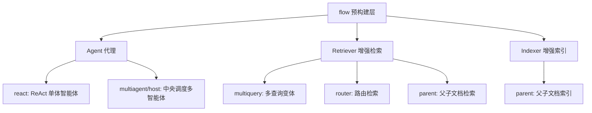
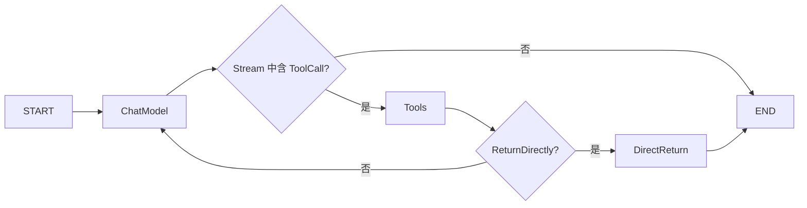
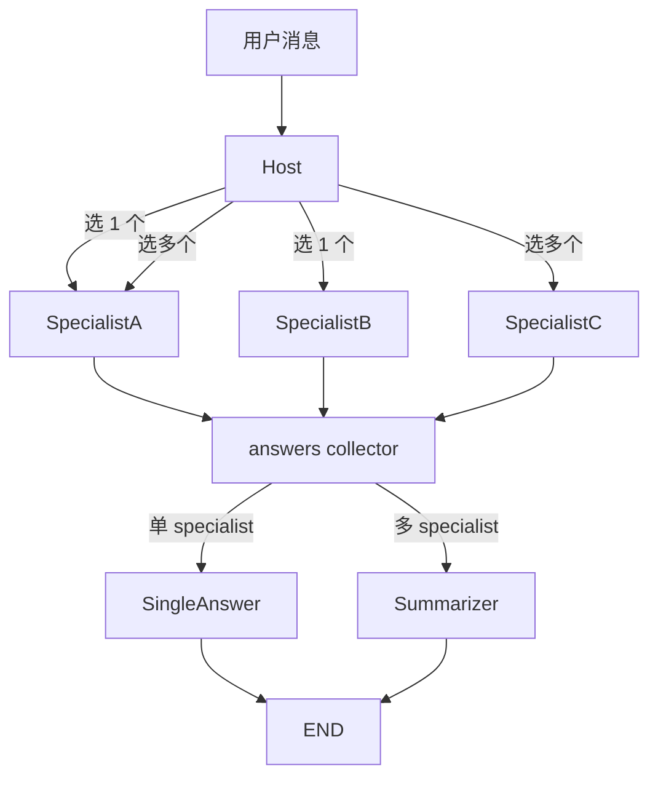
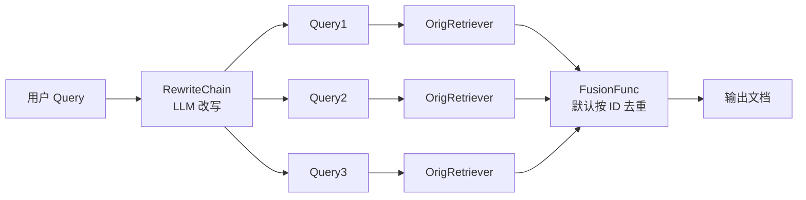
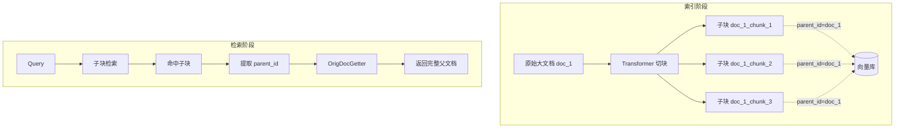

# Eino Flow - 预构建流程层

`flow` 包是 Eino 在 `compose` 基础设施之上提供的**预构建高层流程**层。开发者不必从零搭建图（Graph），可直接使用 Agent 模式、检索增强（RAG）模式等开箱即用的成品，再通过 Option 注入业务逻辑。

## 1. Flow 总览

`flow` 包按职能分为三类，全部基于 `compose.Graph` 实现：



源码目录结构（`/flow/`）：

- `agent/react/`：ReAct 单体智能体
- `agent/multiagent/host/`：Host 模式多智能体
- `retriever/multiquery/`：MultiQuery 检索器
- `retriever/router/`：Router 检索器
- `retriever/parent/`、`indexer/parent/`：父子文档检索/索引

## 2. React Agent - ReAct 单体智能体

源码位于 `flow/agent/react/`。ReAct 模式（**Reason → Act → Observe** 循环）是当前最主流的 Agent 工程范式：模型推理 → 选工具 → 看结果 → 再推理 …… 直至给出最终回答。

### 2.1 流程结构

ReAct Agent 内部构造为一个 `compose.Graph[[]*schema.Message, *schema.Message]`，包含两个核心节点（`react.go:127-130`、`react.go:243-247`）：

- `nodeKeyModel`（`"chat"` / 默认节点名 `ChatModel`）：调用 ChatModel
- `nodeKeyTools`（`"tools"` / 默认节点名 `Tools`）：执行被模型选中的工具



分支判定见 `react.go:369-380`（模型输出后判断是否调用工具）和 `react.go:428-443`（工具执行后判断是否立即返回）。

### 2.2 状态（State）

`flow/agent/react/react.go:56-59` 定义了贯穿一次会话的 state：

```go
type state struct {
    Messages                 []*schema.Message // 累积的对话历史
    ReturnDirectlyToolCallID string            // 标记某工具调用为"直接返回"
}
```

state 通过 `compose.WithGenLocalState` 注入图（`react.go:329-331`）；同时使用 `schema.RegisterName` 注册类型名 `"_eino_react_state"`（`react.go:61-63`），用于跨进程恢复 / Checkpoint 场景的反序列化。

### 2.3 工具结果收集中间件

`newToolResultCollectorMiddleware`（`react.go:65-125`）注入了一个 `compose.ToolMiddleware`，在工具执行链路中拦截结果并转发给"流式工具结果发送器"（`toolResultSenders`）。它针对**4 种工具调用范式**分别处理：

| 字段 | 类型 | 时机 |
|------|------|------|
| `Invokable` | `InvokableToolEndpoint` | 同步工具 |
| `Streamable` | `StreamableToolEndpoint` | 流式工具（需 `Copy(2)` 复制流，一份发回外部、一份留给原 pipeline）|
| `EnhancedInvokable` | `EnhancedInvokableToolEndpoint` | 同步增强工具（多模态结果）|
| `EnhancedStreamable` | `EnhancedStreamableToolEndpoint` | 流式增强工具 |

`toolResultSenders` 结构定义见 `react.go:34-40`，包含四种 sender 函数。它通过 `setToolResultSendersToCtx` / `getToolResultSendersFromCtx`（`react.go:44-54`）借助 context 在图启动时注入、工具执行时取出，避免对图结构本身做侵入式修改。

### 2.4 配置选项

`AgentConfig`（`react.go:136-190`）核心字段：

- `ToolCallingModel`：推荐的支持原生 Tool Calling 的模型
- `ToolsConfig`：工具配置
- `MessageModifier`：每次模型调用前对 input 做修改（如注入 system prompt）
- `MessageRewriter`：每次模型调用前对 **state 中累积的全部历史**做改写（如压缩历史以适配上下文窗口）
- `MaxStep`：最大步数（默认节点数 + 10 = 12）
- `ToolReturnDirectly`：声明哪些工具被调用后直接返回，不再交还给模型
- `StreamToolCallChecker`：自定义流式输出中如何探测 ToolCall（默认实现仅检查首个非空 chunk，不适用于 Claude 这类先输出文本后输出 ToolCall 的模型）

`flow/agent/react/option.go` 提供链路级别的 AgentOption：

- `WithToolOptions` / `WithChatModelOptions`：透传到底层组件 Option
- `WithTools(ctx, tools...)`（`option.go:92-107`）：一次性同时配置 ChatModel 工具 schema 和 ToolsNode 工具实现
- `WithMessageFuture()`（`option.go:151`）：以"异步消息流"形式获取 Agent 执行过程中每一步模型输出与工具结果（用于实时 UI 推送）

### 2.5 用法示例

```go
agent, err := react.NewAgent(ctx, &react.AgentConfig{
    ToolCallingModel: chatModel,
    ToolsConfig: compose.ToolsNodeConfig{Tools: []tool.BaseTool{searchTool, calcTool}},
    MaxStep: 10,
})
if err != nil { return err }

msg, err := agent.Generate(ctx, []*schema.Message{
    schema.UserMessage("帮我查上海明天的天气并换算成华氏度"),
})
```

## 3. MultiAgent Host - 中央调度多智能体

源码位于 `flow/agent/multiagent/host/`。**Host 模式**用一个中央 Host Agent 决定将任务"路由 / 转交"给若干 Specialist Agent，再可选地通过 Summarizer 把多个 Specialist 的输出汇总成单条回复。



### 3.1 核心类型

`flow/agent/multiagent/host/types.go`：

- `MultiAgent`（`types.go:35-39`）：封装好的 `compose.Runnable`，提供 `Generate` / `Stream` 接口
- `MultiAgentConfig`（`types.go:76-102`）：包含 `Host`、`[]*Specialist`、可选的 `Summarizer`
- `Host`（`types.go:150-156`）：必须是支持 Tool Calling 的 ChatModel，因为 Host 通过工具调用机制选 Specialist
- `Specialist`（`types.go:165-173`）：可以是 ChatModel，或任意 `Invokable` / `Streamable`（典型地，每个 Specialist 本身可以是一个 react.Agent）
- `AgentMeta`（`types.go:131-134`）：Specialist 的元信息 `Name` + `IntendedUse`（Host 用其选择该 Specialist 的理由）
- `Summarizer`（`types.go:177-180`）：当 Host 选中多个 Specialist 时，对它们的输出做汇总

### 3.2 节点结构

`flow/agent/multiagent/host/compose.go:29-37` 中定义了图节点常量：

- `defaultHostNodeKey = "host"`：Host 节点
- `specialistsAnswersCollectorNodeKey`：透传收集节点
- `singleIntentAnswerNodeKey`：仅一个 Specialist 时的直答路径
- `multiIntentSummarizeNodeKey`：多 Specialist 时的汇总路径
- `map2ListConverterNodeKey`：把 `map[name][]Message` 展平为 `[]Message`

## 4. MultiQuery Retriever - 多查询变体检索

源码位于 `flow/retriever/multiquery/multi_query.go`。原理：用 LLM 将用户原始 query 改写为若干**语义等价但表述不同**的变体，对每个变体并行检索后再去重融合，显著提升召回率。



### 4.1 配置 `Config`（`multi_query.go:130-151`）

- `RewriteLLM` + `RewriteTemplate` + `QueryVar` + `LLMOutputParser`：基于 LLM 的改写链路（默认 prompt 见 `multi_query.go:36-40`，按 `\n` 拆分输出）
- 或 `RewriteHandler`：自定义函数式改写（优先级高于 LLM 路径）
- `MaxQueriesNum`：截断多余变体，默认 5
- `OrigRetriever`：实际执行单 query 检索的下层 Retriever
- `FusionFunc`：融合多个查询结果列表（默认按 `Document.ID` 去重，见 `multi_query.go:45-57`）

### 4.2 执行流程

`Retrieve` 实现（`multi_query.go:161-195`）：

1. 通过 `queryRunner.Invoke` 改写得到多个 query
2. 截断到 `MaxQueriesNum`
3. 用 `utils.ConcurrentRetrieveWithCallback` 并发调用 `OrigRetriever`
4. 把所有结果交给 `fusionFunc` 融合，并在融合环节挂上独立的 `RunInfo`（`Type: "FusionFunc"`，见 `multi_query.go:202-211`）触发回调

## 5. Router Retriever - 路由检索

源码位于 `flow/retriever/router/router.go`。当系统中存在多个**职能不同**的 Retriever（如商品库、文档库、FAQ 库）时，由"路由函数"决定本次 query 应去查哪些库，再融合结果。

### 5.1 配置 `Config`（`router.go:106-113`）

- `Retrievers map[string]retriever.Retriever`：所有候选 Retriever，按名字索引
- `Router func(ctx, query) ([]string, error)`：返回被选中的 Retriever 名字列表。**未设置时默认查询所有 Retriever**（见 `router.go:82-91`）
- `FusionFunc func(ctx, map[name][]Document) ([]Document, error)`：融合函数，默认实现是 **Reciprocal Rank Fusion (RRF)**（`router.go:33-65`），公式 `score = sum(1 / (rank + 60))`

### 5.2 执行流程

`Retrieve`（`router.go:122-170`）依次：

1. 调用 `router` 选 Retriever（携带独立 `RunInfo: Type="Router"`）
2. 校验返回名字至少一个、且都已注册
3. 用 `utils.ConcurrentRetrieveWithCallback` 并发取回结果
4. 调用 `fusionFunc` 融合（携带独立 `RunInfo: Type="FusionFunc"`）

Router 与 MultiQuery 一样，在 router / fusion 两个内部环节都通过 `callbacks.ReuseHandlers` + 专用 `RunInfo` 把回调挂载好，使外部 Handler 可以精细观测每一步。

## 6. Parent Retriever / Indexer - 父子文档模式

源码位于 `flow/retriever/parent/parent.go` 和 `flow/indexer/parent/parent.go`。

### 6.1 问题背景

RAG 中存在经典矛盾：
- 文档**切小**：embedding 更聚焦 → 检索更准，但召回片段**上下文不足**
- 文档**切大**：上下文完整 → 但向量稀释，检索精度下降

**Parent 模式**两全其美：**用小块做索引和检索，用大块做生成**。



### 6.2 Parent Indexer

`flow/indexer/parent/parent.go` 实现 `indexer.Indexer` 接口。

**配置 `Config`（`parent.go:31-63`）**：
- `Indexer`：底层真正写入向量库的实现
- `Transformer`：切块器（如 `RecursiveCharacterTextSplitter`）
- `ParentIDKey`：将父文档 ID 写到子文档 metadata 的哪个 key（如 `"parent_id"`）
- `SubIDGenerator`：根据父 ID 与子块数量生成唯一子 ID（如 `["doc_1_chunk_1", ...]`）

**核心 `Store`（`parent.go:115-161`）算法**：

1. 调用 `transformer.Transform` 切块；切完后所有子块的 `ID` 仍是父 ID
2. 遍历子块：当 `subDoc.ID` 与 `currentID` 不同，说明上一批父文档处理完毕，对其调用 `SubIDGenerator` 生成新 ID 并回写
3. 最后一段同样处理
4. 把改写后的子块整体送入底层 `indexer.Store`

### 6.3 Parent Retriever

`flow/retriever/parent/parent.go` 实现 `retriever.Retriever` 接口。

**配置 `Config`（`parent.go:28-48`）**：
- `Retriever`：底层子块检索器
- `ParentIDKey`：与 Indexer 配置保持一致
- `OrigDocGetter func(ctx, ids) ([]Document, error)`：根据父 ID 拉取完整父文档（一般查关系型数据库 / 文档库）

**核心 `Retrieve`（`parent.go:90-104`）算法**：

1. 调用底层 `Retriever` 拿到子块命中结果
2. 从每个子块 metadata 中取出 `ParentIDKey` 对应的父 ID，**去重**
3. 调用 `OrigDocGetter` 一次性取回所有父文档并返回

注意：子文档 metadata 缺失 `ParentIDKey` 的会被忽略（见 `parent.go:97-101` 的 `ok` 判断）。

### 6.4 完整使用示例

```go
// 1. 索引侧：使用 Parent Indexer 切块并写库
parentIdx, _ := parentindexer.NewIndexer(ctx, &parentindexer.Config{
    Indexer:     milvusIndexer,
    Transformer: splitter,
    ParentIDKey: "parent_id",
    SubIDGenerator: func(ctx context.Context, parentID string, num int) ([]string, error) {
        ids := make([]string, num)
        for i := range ids { ids[i] = fmt.Sprintf("%s_chunk_%d", parentID, i+1) }
        return ids, nil
    },
})
_, _ = parentIdx.Store(ctx, []*schema.Document{bigDoc})

// 2. 检索侧：使用 Parent Retriever，自动还原大文档
parentRetr, _ := parentretriever.NewRetriever(ctx, &parentretriever.Config{
    Retriever:   milvusRetriever,
    ParentIDKey: "parent_id",
    OrigDocGetter: func(ctx context.Context, ids []string) ([]*schema.Document, error) {
        return docStore.GetByIDs(ctx, ids)
    },
})
docs, _ := parentRetr.Retrieve(ctx, "什么是 Eino")
```

---

**小结**：`flow` 包把"通用 Agent 工程模式 / RAG 模式"沉淀为可直接调用的高层组件。开发者既能用 `react.NewAgent` 几行代码起跑一个智能体，也能用 `multiquery` / `router` / `parent` 组合出生产级 RAG 流水线，复杂业务则可通过 `ExportGraph` 把整个 Flow 作为子图嵌入更大的 `compose.Graph`，实现"高层封装 + 底层可控"的完美平衡。
