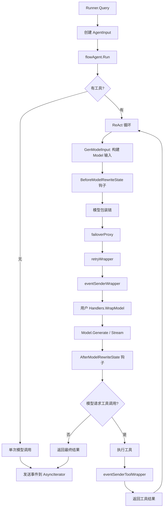

# Eino ADK Agent 开发套件

## 1. ADK 总览

`adk/` 包是 Eino 基于 `compose` 构建的高层 Agent 抽象。它封装了 ReAct 循环（Model → Tool → Model）、多 Agent 编排、中断/恢复、重试与故障转移等复杂逻辑，提供简洁的 Agent 构建与运行 API。

ADK 的核心设计原则：

- **泛型消息类型**：通过 `MessageType` 约束支持 `*schema.Message` 和 `*schema.AgenticMessage` 两种消息模型
- **流式优先**：所有 Agent 的 `Run` 方法返回 `*AsyncIterator[*TypedAgentEvent[M]]`，天然支持流式输出
- **可组合性**：Agent 可通过 `AgentTool` 包装为 Tool，供其他 Agent 调用
- **可扩展性**：通过 `ChatModelAgentMiddleware` 接口注入自定义逻辑

## 2. 核心接口

### 2.1 MessageType（adk/interface.go:43-45）

`MessageType` 是 ADK 的密封类型约束，限定 ADK 只接受两种消息类型：

```go
// adk/interface.go:43-45
type MessageType interface {
    *schema.Message | *schema.AgenticMessage
}
```

所有泛型函数对这两种类型做穷举 switch，外部包无法扩展。

### 2.2 TypedAgent[M]（adk/interface.go:453-464）

Agent 的核心接口：

```go
// adk/interface.go:453-464
type TypedAgent[M MessageType] interface {
    Name(ctx context.Context) string
    Description(ctx context.Context) string
    Run(ctx context.Context, input *TypedAgentInput[M], options ...AgentRunOption) *AsyncIterator[*TypedAgentEvent[M]]
}
```

- `Name` / `Description`：Agent 标识，用作 `AgentTool` 的工具名和描述
- `Run`：执行 Agent，返回事件异步迭代器

`Agent = TypedAgent[*schema.Message]`（adk/interface.go:467）

### 2.3 TypedAgentInput（adk/interface.go:440-443）

```go
// adk/interface.go:440-443
type TypedAgentInput[M MessageType] struct {
    Messages        []M
    EnableStreaming  bool
}
```

### 2.4 TypedAgentEvent（adk/interface.go:419-435）

Agent 执行过程中产生的每个事件：

```go
// adk/interface.go:419-435
type TypedAgentEvent[M MessageType] struct {
    AgentName string
    RunPath   []RunStep
    Output    *TypedAgentOutput[M]
    Action    *AgentAction
    Err       error
}
```

### 2.5 TypedAgentOutput（adk/interface.go:320-324）

```go
// adk/interface.go:320-324
type TypedAgentOutput[M MessageType] struct {
    MessageOutput    *TypedMessageVariant[M]
    CustomizedOutput any
}
```

### 2.6 TypedMessageVariant（adk/interface.go:73-98）

消息变体，承载完整消息或流式读取器：

```go
// adk/interface.go:73-98
type TypedMessageVariant[M MessageType] struct {
    IsStreaming    bool
    Message        M
    MessageStream  *schema.StreamReader[M]
    Role           schema.RoleType
    AgenticRole    schema.AgenticRoleType
    ToolName       string
}
```

- `Role`：仅对 `*schema.Message` 有意义，标识事件来源（`schema.Assistant` 或 `schema.Tool`）
- `AgenticRole`：仅对 `*schema.AgenticMessage` 有意义
- `ToolName`：仅当 `Role == schema.Tool` 时非空，标识产出此事件的工具名

### 2.7 AgentAction（adk/interface.go:357-369）

Agent 可发出的动作信号：

```go
// adk/interface.go:357-369
type AgentAction struct {
    Exit            bool
    Interrupted     *InterruptInfo
    TransferToAgent *TransferToAgentAction
    BreakLoop       *BreakLoopAction
    CustomizedAction any
}
```

- `Exit`：终止 Agent 执行
- `Interrupted`：中断执行（用于人工确认等场景）
- `TransferToAgent`：移交到另一个 Agent（**不推荐**）
- `BreakLoop`：终止 Loop Agent 循环
- `CustomizedAction`：用户自定义动作

### 2.8 ResumableAgent（adk/interface.go:481-487）

支持中断恢复的 Agent 接口：

```go
// adk/interface.go:481-487
type TypedResumableAgent[M MessageType] interface {
    TypedAgent[M]
    Resume(ctx context.Context, info *ResumeInfo, opts ...AgentRunOption) *AsyncIterator[*TypedAgentEvent[M]]
}
```

### 2.9 OnSubAgents（adk/interface.go:474-479）

子 Agent 注册与转移接口（**不推荐**，建议使用 `AgentTool`）：

```go
// adk/interface.go:474-479
type OnSubAgents interface {
    OnSetSubAgents(ctx context.Context, subAgents []Agent) error
    OnSetAsSubAgent(ctx context.Context, parent Agent) error
    OnDisallowTransferToParent(ctx context.Context) error
}
```

## 3. TypedRunner（adk/runner.go）

`TypedRunner` 是执行 Agent 的主入口，管理 Agent 生命周期（启动、恢复、检查点）。

### 3.1 结构体（adk/runner.go:55-59）

```go
// adk/runner.go:55-59
type TypedRunner[M MessageType] struct {
    a               TypedAgent[M]
    enableStreaming  bool
    store           CheckPointStore
}
```

### 3.2 构造函数（adk/runner.go:89-100）

```go
// adk/runner.go:89-91
func NewRunner(_ context.Context, conf RunnerConfig) *Runner

// adk/runner.go:94-100
func NewTypedRunner[M MessageType](conf TypedRunnerConfig[M]) *TypedRunner[M]
```

### 3.3 执行方法

- `Run`（adk/runner.go:102-105）：传入消息列表，启动执行
- `Query`（adk/runner.go:108-115）：便捷方法，传入字符串查询，自动转为用户消息
- `Resume`（adk/runner.go:124-127）：从检查点恢复，隐式恢复所有中断点
- `ResumeWithParams`（adk/runner.go:147-149）：带参数恢复，可指定恢复特定中断点

## 4. ChatModelAgent（adk/chatmodel.go）

`ChatModelAgent` 是 ADK 中最常用的 Agent 类型，实现了经典的 ReAct 循环：**Model → Tool → Model**。

### 4.1 配置项（adk/chatmodel.go:260-415）

```go
// adk/chatmodel.go:260-415
type TypedChatModelAgentConfig[M MessageType] struct {
    Name               string
    Description        string
    Instruction        string
    Model              model.BaseModel[M]
    ToolsConfig        ToolsConfig
    GenModelInput      TypedGenModelInput[M]
    Exit               tool.BaseTool
    OutputKey          string
    MaxIterations      int
    Middlewares        []AgentMiddleware
    Handlers           []TypedChatModelAgentMiddleware[M]
    ModelRetryConfig   *TypedModelRetryConfig[M]
    ModelFailoverConfig *ModelFailoverConfig[M]
}
```

### 4.2 中间件执行顺序

Model 调用生命周期（由外到内）：

1. `AgentMiddleware.BeforeChatModel`（hook）
2. `ChatModelAgentMiddleware.BeforeModelRewriteState`（hook，可修改 state）
3. `failoverModelWrapper`（内部 — 模型故障转移）
4. `retryModelWrapper`（内部 — 重试）
5. `eventSenderModelWrapper`（内部 — 发送模型响应事件）
6. `ChatModelAgentMiddleware.WrapModel`（wrapper，首个注册为最外层）
7. `callbackInjectionModelWrapper`（内部 — 注入回调）
8. `failoverProxyModel` / `Model.Generate|Stream`
9. `ChatModelAgentMiddleware.AfterModelRewriteState`（hook）
10. `AgentMiddleware.AfterChatModel`（hook）

### 4.3 ToolsConfig（adk/chatmodel.go:136-156）

```go
// adk/chatmodel.go:136-156
type ToolsConfig struct {
    compose.ToolsNodeConfig
    ReturnDirectly     map[string]bool
    EmitInternalEvents bool
}
```

`ReturnDirectly` 中的工具名意味着：当该工具被调用后，Agent 立即返回，不再进入下一轮 Model 调用。

### 4.4 无工具模式

当 `ToolsConfig` 中没有注册任何工具时，`ChatModelAgent` 自动退化为单次模型调用（无 ReAct 循环），走 `buildNoToolsRunFunc`（adk/chatmodel.go:976-1077）。

### 4.5 ChatModelAgentMiddleware

推荐使用接口式中间件 `ChatModelAgentMiddleware` 替代旧的 `AgentMiddleware`。它提供以下钩子：

- `BeforeAgent`：Agent 运行前，可修改指令和工具列表
- `AfterAgent`：Agent 运行后
- `BeforeModelRewriteState`：模型调用前，可修改 state（消息、工具信息）
- `AfterModelRewriteState`：模型调用后
- `WrapModel`：包装模型调用链
- `WrapInvokableToolCall` / `WrapStreamableToolCall`：包装工具调用

## 5. AgentTool（adk/agent_tool.go）

`AgentTool` 将 Agent 包装为 Tool，使其可被其他 Agent 作为工具调用：

```go
// adk/agent_tool.go:93-104
func NewAgentTool(_ context.Context, agent Agent, options ...AgentToolOption) tool.BaseTool
```

要求 Agent 必须有非空的 `Name` 和 `Description`。

**Action 作用域**：内部 Agent 发出的动作在 AgentTool 边界内被限定：
- `Interrupted`：通过 `CompositeInterrupt` 向上传播
- `Exit` / `TransferToAgent` / `BreakLoop`：不传播到父 Agent

可选配置：
- `WithFullChatHistoryAsInput()`：使用完整聊天历史作为子 Agent 输入
- `WithAgentInputSchema(schema)`：自定义输入参数 Schema

## 6. WorkflowAgent（adk/workflow.go）

WorkflowAgent 提供三种多 Agent 编排模式（adk/workflow.go:32-37）：

| 模式 | 常量 | 说明 |
|------|------|------|
| Sequential | `workflowAgentModeSequential` | 顺序执行子 Agent |
| Loop | `workflowAgentModeLoop` | 循环执行子 Agent |
| Parallel | `workflowAgentModeParallel` | 并行执行子 Agent |

**不推荐**：Workflow Agent 基于全上下文共享的 Agent 转移模式，实证效果不佳。建议使用 `ChatModelAgent + AgentTool` 或 `DeepAgent`。

构造函数：
- `NewSequentialAgent`（adk/workflow.go:686-688）
- `NewParallelAgent`（adk/workflow.go:695-697）
- `NewLoopAgent`（adk/workflow.go:704-706）

## 7. Wrappers（adk/wrappers.go）

`buildModelWrappers`（adk/wrappers.go:52-79）构建模型包装链：

```
原始 Model → failoverProxy(可选) → callbackInjection → stateModelWrapper
```

`stateModelWrapper` 是核心包装层，负责：
- 调用 `BeforeModelRewriteState` / `AfterModelRewriteState` 钩子
- 应用 `AgentMiddleware.BeforeChatModel` / `AfterChatModel`
- 管理 `ChatModelAgentState`（消息、工具信息）
- 包装 Generate/Stream 端点，注入重试、事件发送、Handler 包装

## 8. Retry 和 Failover

### 8.1 Retry（adk/retry_chatmodel.go）

重试配置 `TypedModelRetryConfig[M]`（adk/retry_chatmodel.go:222-253）：

| 字段 | 说明 |
|------|------|
| `MaxRetries` | 最大重试次数 |
| `ShouldRetry` | 判断是否重试的回调（推荐） |
| `IsRetryAble` | 判断错误是否可重试（已废弃） |
| `BackoffFunc` | 退避函数，默认指数退避（100ms 基数，最大 10s） |

`ShouldRetry` 回调接收 `TypedRetryContext[M]`，可访问：
- 输入/输出消息、错误信息
- 当前重试次数

返回 `TypedRetryDecision[M]`，支持：
- `Retry`：是否重试
- `RewriteError`：重写错误
- `ModifiedInputMessages`：修改下次重试的输入
- `AdditionalOptions`：附加模型选项
- `Backoff`：自定义退避时长
- `RejectReason`：拒绝原因（附加到 `WillRetryError`）

### 8.2 Failover（adk/failover_chatmodel.go）

故障转移配置 `ModelFailoverConfig[M]`（adk/failover_chatmodel.go:171-210）：

| 字段 | 说明 |
|------|------|
| `MaxRetries` | 最大故障转移次数 |
| `ShouldFailover` | 判断是否需要故障转移 |
| `GetFailoverModel` | 获取备用模型及可选的输入消息变换 |

故障转移流程：
1. 首先尝试上次成功的模型
2. 失败后调用 `GetFailoverModel` 获取备用模型
3. 成功后记住该模型作为下次首选

## 9. Language 配置（adk/config.go）

```go
// adk/config.go:31-35
func SetLanguage(lang Language) error
```

设置 ADK 内置提示词的语言，支持 `LanguageEnglish` 和 `LanguageChinese`。默认为英文。

## 10. Run 流程图


