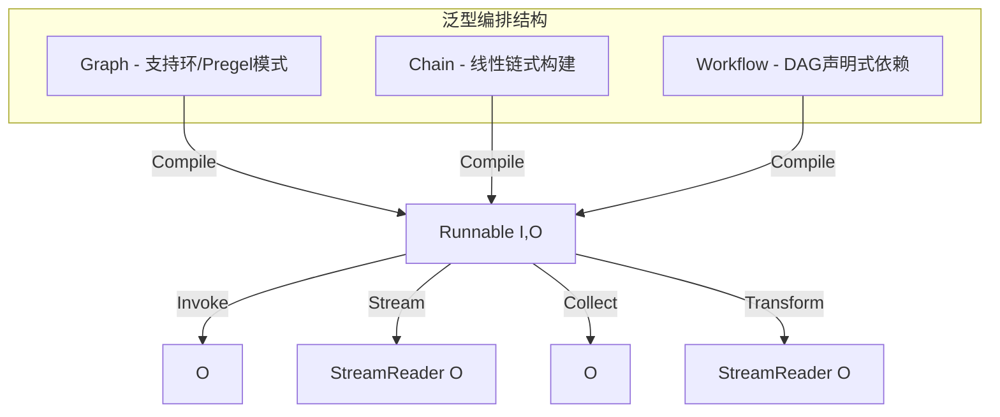
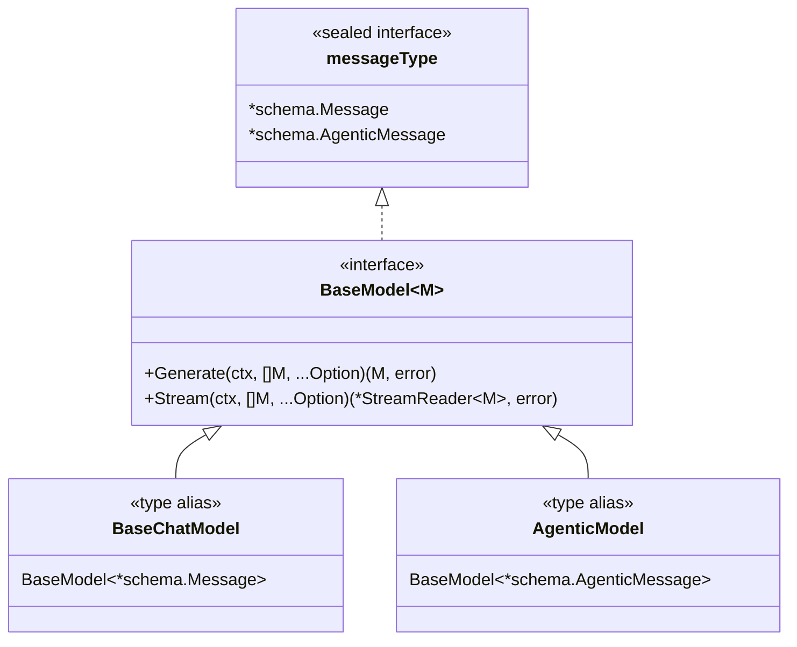
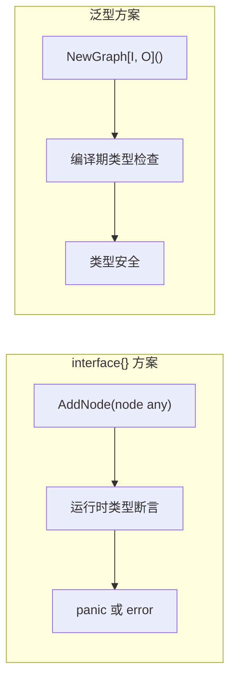

# Go 泛型在 Eino 框架中的应用

## 1. 为什么 Eino 需要泛型

Eino 是一个 AI 应用编排框架，核心操作是将各种组件（模型、检索器、工具等）组合成有向图或链。组合的关键挑战是**类型安全**：


如果使用 `interface{}`，上图中每个箭头都是 `any` 类型，类型错误只能在运行时发现。Eino 利用 Go 1.18+ 的泛型实现了：

- **编译期类型检查**：Graph/Chain 的输入输出类型在创建时确定
- **消除类型断言**：组件间的数据流通过类型参数传递，无需运行时 `.(Type)` 断言
- **安全的流式处理**：`StreamReader[T]` 保证了流数据的类型一致性
- **自动模式降级**：`runnablePacker[I, O, TOption]` 能在四种数据流模式间自动转换

## 2. Go 泛型基础回顾

### 2.1 类型参数

```go
// 泛型函数
func Pipe[T any](cap int) (*StreamReader[T], *StreamWriter[T])

// 泛型结构体
type StreamReader[T any] struct { ... }

// 多类型参数
func StreamReaderWithConvert[T, D any](sr *StreamReader[T], convert func(T) (D, error)) *StreamReader[D]
```

### 2.2 类型约束

```go
// 内置约束
// any  = interface{} 的别名
// comparable = 支持 == 和 != 的类型

// 自定义约束接口（联合类型）
type messageType interface {
    *schema.Message | *schema.AgenticMessage
}

// Eino 中的泛型约束接口
type reader[T any] interface {
    recv() (T, error)
    close()
}
```

### 2.3 类型推断

Go 编译器能根据上下文推断类型参数，大多数场景无需显式指定：

```go
// 编译器推断 T = string, D = map[string]any
ret := schema.StreamReaderWithConvert(srp.sr, func(v string) (map[string]any, error) {
    return map[string]any{key: v}, nil
})
```
## 3. Eino 中的泛型应用

### 3.1 StreamReader[T] -- 类型安全的流式读取器

`StreamReader[T]` 是 Eino 流式数据处理的核心抽象，定义在 `schema/stream.go:168`：

```go
// schema/stream.go:168
type StreamReader[T any] struct {
    typ readerType
    st  *stream[T]
    ar  *arrayReader[T]
    msr *multiStreamReader[T]
    srw *streamReaderWithConvert[T]
    csr *childStreamReader[T]
}
```

**核心方法**：

```go
// schema/stream.go:195 - 接收一个 T 类型的值
func (sr *StreamReader[T]) Recv() (T, error)

// schema/stream.go:229 - 关闭读取器
func (sr *StreamReader[T]) Close()

// schema/stream.go:261 - 扇出为 n 个独立读取器
func (sr *StreamReader[T]) Copy(n int) []*StreamReader[T]
```

**创建方式**（均为泛型函数）：

```go
// schema/stream.go:99 - 从管道创建
func Pipe[T any](cap int) (*StreamReader[T], *StreamWriter[T])

// schema/stream.go:461 - 从数组创建
func StreamReaderFromArray[T any](arr []T) *StreamReader[T]

// schema/stream.go:691 - 类型转换
func StreamReaderWithConvert[T, D any](sr *StreamReader[T], convert func(T) (D, error)) *StreamReader[D]

// schema/stream.go:912 - 合并多个流
func MergeStreamReaders[T any](srs []*StreamReader[T]) *StreamReader[T]

// schema/stream.go:990 - 命名合并
func MergeNamedStreamReaders[T any](srs map[string]*StreamReader[T]) *StreamReader[T]
```

`StreamReader[T]` 的内部 `stream[T]` 基于 channel 实现（`schema/stream.go:375`）：

```go
// schema/stream.go:375
type stream[T any] struct {
    items chan streamItem[T]   // 缓冲通道，携带 T 类型的数据
    closed chan struct{}       // 关闭信号
    automaticClose bool
    closedFlag     *uint32
}

// schema/stream.go:384
type streamItem[T any] struct {
    chunk T
    err   error
}
```

**使用示例**：

```go
// 创建管道
sr, sw := schema.Pipe[string](3)

// 发送端（goroutine 1）
go func() {
    defer sw.Close()
    sw.Send("hello", nil)
    sw.Send("world", nil)
}()

// 接收端（goroutine 2）
defer sr.Close()
for {
    chunk, err := sr.Recv()
    if errors.Is(err, io.EOF) {
        break
    }
    if err != nil {
        panic(err)
    }
    fmt.Println(chunk)
}
```
### 3.2 Graph[I, O] / Chain[I, O] -- 编排泛型

#### Graph[I, O]

`Graph[I, O]` 是 Eino 最核心的编排结构，输入类型 `I` 和输出类型 `O` 在创建时确定（`compose/generic_graph.go:93`）：

```go
// compose/generic_graph.go:93
type Graph[I, O any] struct {
    *graph
}
```

创建时指定类型参数（`compose/generic_graph.go:72`）：

```go
// compose/generic_graph.go:72
func NewGraph[I, O any](opts ...NewGraphOption) *Graph[I, O] {
    options := &newGraphOptions{}
    for _, opt := range opts {
        opt(options)
    }
    g := &Graph[I, O]{
        newGraphFromGeneric[I, O](
            ComponentOfGraph,
            options.withState,
            options.stateType,
            opts,
        ),
    }
    return g
}
```

`Compile` 方法返回类型安全的 `Runnable[I, O]`（`compose/generic_graph.go:123`）：

```go
// compose/generic_graph.go:123
func (g *Graph[I, O]) Compile(ctx context.Context, opts ...GraphCompileOption) (Runnable[I, O], error)
```

内部通过 `newGraphFromGeneric` 将类型信息注入到底层 `graph` 结构（`compose/graph.go:100`）：

```go
// compose/graph.go:100
func newGraphFromGeneric[I, O any](
    cmp component,
    stateGenerator func(ctx context.Context) any,
    stateType reflect.Type,
    opts []NewGraphOption,
) *graph {
    return newGraph(&newGraphConfig{
        inputType:      generic.TypeOf[I](),      // 保存输入类型
        outputType:     generic.TypeOf[O](),      // 保存输出类型
        gh:             newGenericHelper[I, O](),  // 创建类型助手
        cmp:            cmp,
        stateType:      stateType,
        stateGenerator: stateGenerator,
        newOpts:        opts,
    })
}
```

#### Chain[I, O]

`Chain[I, O]` 是对 `Graph[I, O]` 的链式封装（`compose/chain.go:72`）：

```go
// compose/chain.go:72
type Chain[I, O any] struct {
    err error
    gg  *Graph[I, O]
    nodeIdx int
    preNodeKeys []string
    hasEnd bool
}
```

创建时同样需要指定输入输出类型（`compose/chain.go:37`）：

```go
// compose/chain.go:37
func NewChain[I, O any](opts ...NewGraphOption) *Chain[I, O] {
    ch := &Chain[I, O]{
        gg: NewGraph[I, O](opts...),
    }
    ch.gg.cmp = ComponentOfChain
    return ch
}
```

`Compile` 返回 `Runnable[I, O]`（`compose/chain.go:157`）：

```go
// compose/chain.go:157
func (c *Chain[I, O]) Compile(ctx context.Context, opts ...GraphCompileOption) (Runnable[I, O], error)
```

#### Workflow[I, O]

`Workflow[I, O]` 是 DAG 模式的编排（`compose/workflow.go:45`）：

```go
// compose/workflow.go:45
type Workflow[I, O any] struct {
    g                *graph
    workflowNodes    map[string]*WorkflowNode
    workflowBranches []*WorkflowBranch
    dependencies     map[string]map[string]dependencyType
}
```

三种编排结构的对比：


### 3.3 Runnable[I, O] -- 统一执行接口

`Runnable[I, O]` 是所有编排结构编译后的产物，支持四种数据流模式（`compose/runnable.go:32`）：

```go
// compose/runnable.go:32
type Runnable[I, O any] interface {
    Invoke(ctx context.Context, input I, opts ...Option) (output O, err error)
    Stream(ctx context.Context, input I, opts ...Option) (output *schema.StreamReader[O], err error)
    Collect(ctx context.Context, input *schema.StreamReader[I], opts ...Option) (output O, err error)
    Transform(ctx context.Context, input *schema.StreamReader[I], opts ...Option) (output *schema.StreamReader[O], err error)
}
```

这四种模式构成了完整的输入输出组合：

| 模式 | 输入 | 输出 | 场景 |
|------|------|------|------|
| Invoke | `I` | `O` | 一次性调用 |
| Stream | `I` | `*StreamReader[O]` | 流式输出 |
| Collect | `*StreamReader[I]` | `O` | 流式输入合并 |
| Transform | `*StreamReader[I]` | `*StreamReader[O]` | 流到流转换 |

### 3.4 BaseModel[M] -- 模型接口的泛型设计

Eino 的模型接口采用**密封约束**模式，定义在 `components/model/interface.go:27`：

```go
// components/model/interface.go:27
type messageType interface {
    *schema.Message | *schema.AgenticMessage
}

// components/model/interface.go:36
type BaseModel[M messageType] interface {
    Generate(ctx context.Context, input []M, opts ...Option) (M, error)
    Stream(ctx context.Context, input []M, opts ...Option) (*schema.StreamReader[M], error)
}
```

通过类型别名实现向后兼容（`components/model/interface.go:71`）：

```go
// components/model/interface.go:71
type BaseChatModel = BaseModel[*schema.Message]

// components/model/interface.go:109
type AgenticModel = BaseModel[*schema.AgenticMessage]
```

这种设计允许同一个 `BaseModel` 接口同时支持两种消息类型，避免了代码重复。



### 3.5 Lambda 函数的泛型设计

Eino 的 Lambda 节点使用三个类型参数（`compose/types_lambda.go:27`）：

```go
// compose/types_lambda.go:27
type Invoke[I, O, TOption any] func(ctx context.Context, input I, opts ...TOption) (output O, err error)

// compose/types_lambda.go:30
type Stream[I, O, TOption any] func(ctx context.Context,
    input I, opts ...TOption) (output *schema.StreamReader[O], err error)

// compose/types_lambda.go:34
type Collect[I, O, TOption any] func(ctx context.Context,
    input *schema.StreamReader[I], opts ...TOption) (output O, err error)

// compose/types_lambda.go:38
type Transform[I, O, TOption any] func(ctx context.Context,
    input *schema.StreamReader[I], opts ...TOption) (output *schema.StreamReader[O], err error)
```

创建 Lambda 的便捷函数（`compose/types_lambda.go:105`）：

```go
// compose/types_lambda.go:105 - 仅实现 Invoke
func InvokableLambda[I, O any](i InvokeWOOpt[I, O], opts ...LambdaOpt) *Lambda

// compose/types_lambda.go:119 - 仅实现 Stream
func StreamableLambda[I, O any](s StreamWOOpt[I, O], opts ...LambdaOpt) *Lambda

// compose/types_lambda.go:174 - 任意组合
func AnyLambda[I, O, TOption any](
    i Invoke[I, O, TOption], s Stream[I, O, TOption],
    c Collect[I, O, TOption], t Transform[I, O, TOption],
    opts ...LambdaOpt,
) (*Lambda, error)
```
### 3.6 Component 到 GraphNode 的泛型转换

`toComponentNode` 是组件注册的核心泛型函数（`compose/component_to_graph_node.go:29`）：

```go
// compose/component_to_graph_node.go:29
func toComponentNode[I, O, TOption any](
    node any,
    componentType component,
    invoke Invoke[I, O, TOption],
    stream Stream[I, O, TOption],
    collect Collect[I, O, TOption],
    transform Transform[I, O, TOption],
    opts ...GraphAddNodeOpt,
) (*graphNode, *graphAddNodeOpts)
```

具体组件的转换示例（`compose/component_to_graph_node.go:93`）：

```go
// compose/component_to_graph_node.go:93
func toChatModelNode(node model.BaseChatModel, opts ...GraphAddNodeOpt) (*graphNode, *graphAddNodeOpts) {
    return toComponentNode(
        node,
        components.ComponentOfChatModel,
        node.Generate,     // Invoke: 输入 []*schema.Message，输出 *schema.Message
        node.Stream,       // Stream: 输入 []*schema.Message，输出 *StreamReader[*schema.Message]
        nil,               // ChatModel 不实现 Collect
        nil,               // ChatModel 不实现 Transform
        opts...)
}
```

### 3.7 Stream Reader 的泛型打包/拆包

在 Graph 内部，`StreamReader` 需要擦除类型信息以便在 `any` 层面传递。`compose/stream_reader.go` 提供了泛型打包机制：

```go
// compose/stream_reader.go:37 - 打包器，将 StreamReader[T] 适配为 streamReader 接口
type streamReaderPacker[T any] struct {
    sr *schema.StreamReader[T]
}

// compose/stream_reader.go:111 - 打包：StreamReader[T] -> streamReader
func packStreamReader[T any](sr *schema.StreamReader[T]) streamReader {
    return streamReaderPacker[T]{sr}
}

// compose/stream_reader.go:115 - 拆包：streamReader -> StreamReader[T]
func unpackStreamReader[T any](isr streamReader) (*schema.StreamReader[T], bool) {
    c, ok := isr.(streamReaderPacker[T])
    if ok {
        return c.sr, true
    }
    typ := generic.TypeOf[T]()
    if typ.Kind() == reflect.Interface {
        // 接口类型需要通过转换拆包
        return schema.StreamReaderWithConvert(isr.toAnyStreamReader(), func(t any) (T, error) {
            return t.(T), nil
        }), true
    }
    return nil, false
}
```

### 3.8 WithGenLocalState[S] -- 状态泛型

Graph 支持通过泛型注入局部状态（`compose/generic_graph.go:37`）：

```go
// compose/generic_graph.go:37
func WithGenLocalState[S any](gls GenLocalState[S]) NewGraphOption {
    return func(ngo *newGraphOptions) {
        ngo.withState = func(ctx context.Context) any {
            return gls(ctx)
        }
        ngo.stateType = generic.TypeOf[S]()
    }
}
```

使用示例：

```go
type MyState struct {
    Counter int
    Cache   map[string]any
}

graph := compose.NewGraph[string, string](
    compose.WithGenLocalState(func(ctx context.Context) *MyState {
        return &MyState{Cache: make(map[string]any)}
    }),
)
```

### 3.9 Agent 选项的泛型封装

`flow/agent/agent_option.go:48` 展示了泛型在选项模式中的应用：

```go
// flow/agent/agent_option.go:48
func WrapImplSpecificOptFn[T any](optFn func(*T)) AgentOption {
    return AgentOption{
        implSpecificOptFn: optFn,
    }
}

// flow/agent/agent_option.go:55
func GetImplSpecificOptions[T any](base *T, opts ...AgentOption) *T {
    if base == nil {
        base = new(T)
    }
    for i := range opts {
        opt := opts[i]
        if opt.implSpecificOptFn != nil {
            optFn, ok := opt.implSpecificOptFn.(func(*T))
            if ok {
                optFn(base)
            }
        }
    }
    return base
}
```

`WrapImplSpecificOptFn[T]` 将泛型类型的选项函数包装为 `AgentOption`，内部用 `any` 存储。`GetImplSpecificOptions[T]` 则通过类型断言安全地还原。这种模式在 Go 泛型不支持方法泛型时尤为有用。

### 3.10 genericHelper[I, O] -- 运行时类型桥接

`compose/generic_helper.go:28` 定义了泛型到运行时的桥梁：

```go
// compose/generic_helper.go:28
func newGenericHelper[I, O any]() *genericHelper {
    return &genericHelper{
        inputStreamFilter:  defaultStreamMapFilter[I],
        outputStreamFilter: defaultStreamMapFilter[O],
        inputConverter: handlerPair{
            invoke:    defaultValueChecker[I],
            transform: defaultStreamConverter[I],
        },
        outputConverter: handlerPair{
            invoke:    defaultValueChecker[O],
            transform: defaultStreamConverter[O],
        },
        // ... 其他字段
        inputZeroValue:   zeroValueFromGeneric[I],
        outputZeroValue:  zeroValueFromGeneric[O],
        inputEmptyStream:  emptyStreamFromGeneric[I],
        outputEmptyStream: emptyStreamFromGeneric[O],
    }
}
```

`genericHelper` 在编译期通过 `newGenericHelper[I, O]()` 创建，将泛型类型信息转化为运行时可用的函数闭包。例如 `defaultValueChecker[T]`（`compose/generic_helper.go:236`）：

```go
// compose/generic_helper.go:236
func defaultValueChecker[T any](v any) (any, error) {
    nValue, ok := v.(T)
    if !ok {
        var t T
        return nil, fmt.Errorf("runtime type check fail, expected type: %T, actual type: %T", t, v)
    }
    return nValue, nil
}
```

这是泛型与 `interface{}` 桥接的核心模式：**编译期绑定类型参数，运行期执行类型断言**。

### 3.11 internal/generic -- 泛型工具库

`internal/generic/generic.go` 提供了泛型基础工具：

```go
// internal/generic/generic.go:56 - 获取类型的 reflect.Type
func TypeOf[T any]() reflect.Type {
    return reflect.TypeOf((*T)(nil)).Elem()
}

// internal/generic/generic.go:27 - 创建类型 T 的实例
func NewInstance[T any]() T {
    typ := TypeOf[T]()
    switch typ.Kind() {
    case reflect.Map:
        return reflect.MakeMap(typ).Interface().(T)
    case reflect.Slice, reflect.Array:
        return reflect.MakeSlice(typ, 0, 0).Interface().(T)
    case reflect.Ptr:
        // 递归创建指针指向的实例
        // ...
    default:
        var t T
        return t
    }
}

// internal/generic/generic.go:68 - 泛型 Pair
type Pair[F, S any] struct {
    First  F
    Second S
}

// internal/generic/generic.go:74 - 泛型切片反转
func Reverse[S ~[]E, E any](s S) S

// internal/generic/generic.go:84 - 泛型 Map 复制
func CopyMap[K comparable, V any](src map[K]V) map[K]V
```
## 4. 泛型约束模式

Eino 中使用了多种泛型约束模式：

### 4.1 `any` 约束 -- 无限制

最常见的约束，几乎所有泛型结构都使用：

```go
type StreamReader[T any] struct { ... }     // schema/stream.go:168
type Graph[I, O any] struct { ... }          // compose/generic_graph.go:93
type Chain[I, O any] struct { ... }          // compose/chain.go:72
type Lambda struct { executor *composableRunnable }  // 无泛型参数，内部通过闭包持有
```

### 4.2 密封联合类型约束

`components/model/interface.go:27` 使用联合类型限制消息类型：

```go
type messageType interface {
    *schema.Message | *schema.AgenticMessage
}
```

这种密封约束确保只有预定义的类型可以满足，编译器会在非法使用时报告错误。

### 4.3 接口约束

`schema/stream.go:742` 使用包含方法的接口作为约束：

```go
type reader[T any] interface {
    recv() (T, error)
    close()
}
```

结合泛型函数使用（`schema/stream.go:747`）：

```go
func toStream[T any, Reader reader[T]](r Reader) *stream[T]
```

`Reader` 约束要求实现 `recv()` 和 `close()` 方法，且返回类型与 `T` 关联。

### 4.4 comparable 约束

`internal/generic/generic.go:84` 使用 `comparable` 约束 map 的键类型：

```go
func CopyMap[K comparable, V any](src map[K]V) map[K]V
```

### 4.5 近似约束（波浪号）

`internal/generic/generic.go:74` 使用 `~[]E` 约束允许底层类型为切片的类型：

```go
func Reverse[S ~[]E, E any](s S) S
```

## 5. 类型推断技巧

### 5.1 从函数参数推断

```go
// 无需指定 T，从 arr 推断
sr := schema.StreamReaderFromArray([]string{"a", "b"})  // T = string

// 从 convert 函数推断 T 和 D
ret := schema.StreamReaderWithConvert(sr, func(v string) (int, error) {
    return len(v), nil
})  // T = string, D = int
```

### 5.2 从结构体字段推断

```go
// 从 gls 函数签名推断 S
compose.WithGenLocalState(func(ctx context.Context) *MyState {
    return &MyState{}
})  // S = *MyState
```

### 5.3 显式指定（必要时）

```go
// 创建空的 StreamReader 需要显式指定类型
sr, sw := schema.Pipe[string](3)

// 创建 Graph/Chain 必须显式指定
graph := compose.NewGraph[string, *schema.Message]()
chain := compose.NewChain[string, string]()
```

## 6. 泛型 vs interface{}

### 6.1 Eino 选择泛型的原因



| 对比维度 | interface{} | 泛型 |
|---------|------------|------|
| 类型检查时机 | 运行时 | 编译期 |
| 错误发现 | panic / error | 编译错误 |
| IDE 支持 | 无自动补全 | 完整补全 |
| 运行时开销 | 需要类型断言 | 零开销（单态化/双态化） |
| 代码可读性 | 需查看文档 | 类型签名即文档 |

### 6.2 Eino 的混合策略

Eino 并非完全摒弃 `interface{}`，而是在**外层使用泛型保证类型安全，内层使用 `interface{}` 实现灵活编排**：

```go
// 外层：泛型接口，类型安全
type Runnable[I, O any] interface {
    Invoke(ctx context.Context, input I, opts ...Option) (output O, err error)
}

// 内层：any 类型，灵活编排
type composableRunnable struct {
    i invoke  // type invoke func(ctx context.Context, input any, opts ...any) (output any, err error)
    t transform
}
```

`composableRunnable` 内部使用 `any`，但通过 `genericHelper` 的闭包在运行时执行类型检查（`compose/generic_helper.go:236`）。这种设计在保持编译期类型安全的同时，允许 Graph 内部以统一的方式处理不同类型的节点。

### 6.3 StreamReader 的类型擦除与恢复

`packStreamReader` / `unpackStreamReader` 是类型擦除的典型实现。Graph 运行时需要将 `StreamReader[T]` 作为 `any` 传递，但通过 `streamReaderPacker[T]` 类型守卫，可以在拆包时安全恢复原始类型：

```go
// 打包时保存类型信息
func packStreamReader[T any](sr *schema.StreamReader[T]) streamReader {
    return streamReaderPacker[T]{sr}  // T 被编码到 streamReaderPacker[T] 的类型中
}

// 拆包时通过类型断言恢复
func unpackStreamReader[T any](isr streamReader) (*schema.StreamReader[T], bool) {
    c, ok := isr.(streamReaderPacker[T])  // 只有 T 匹配时才成功
    if ok {
        return c.sr, true
    }
    return nil, false
}
```

## 7. 常见陷阱

### 7.1 不支持方法泛型

Go 不允许方法有自己的类型参数。Eino 通过**函数泛型**绕过这一限制：

```go
// 错误：Go 不支持方法泛型
// func (g *Graph) AddNode[I, O any](key string, node SomeInterface[I, O]) error

// 正确：使用包级泛型函数
func toComponentNode[I, O, TOption any](node any, ...) (*graphNode, *graphAddNodeOpts)
```

这就是为什么 `compose/graph.go:426` 的注释指出：

```go
// compose/graph.go:426
// due to the lack of supporting method generics, we need to use function generics
// to generate Lambda run as Runnable[I, O].
```

### 7.2 不能对泛型类型参数做类型断言

```go
// 错误：不能断言类型参数
// var x T = ...
// y, ok := x.(SomeType)  // 编译错误

// 正确：先转为 any，再断言
var v any = input
in, ok := v.(I)  // compose/runnable.go:112
```

Eino 在 `composableRunnable` 的 `i` 函数中大量使用此模式（`compose/runnable.go:112`）。

### 7.3 泛型类型的 nil 处理

当 `nil` 被赋给 `any` 类型时，原始类型信息丢失。Eino 在 `compose/runnable.go:116` 专门处理了这个问题：

```go
// compose/runnable.go:116
if input == nil && reflect.TypeOf((*I)(nil)).Elem().Kind() == reflect.Interface {
    var i I
    in = i  // 创建一个 nil 的 I 类型值
} else {
    panic(newUnexpectedInputTypeErr(inputType, reflect.TypeOf(input)))
}
```

### 7.4 泛型结构体的嵌入限制

`Graph[I, O]` 嵌入 `*graph`（`compose/generic_graph.go:94`），但 `graph` 本身不是泛型的。类型信息通过 `genericHelper` 和 `reflect.Type` 在初始化时注入：

```go
type Graph[I, O any] struct {
    *graph  // 非泛型的内部结构
}
```

这种设计意味着 `graph` 内部无法直接使用 `I` 和 `O`，必须通过反射和闭包间接操作。

### 7.5 StreamReader 的单次消费

`StreamReader[T]` 是**单消费**的（`schema/stream.go:143`），读取后不能重放。如需多消费者，必须先 `Copy`：

```go
// 错误：直接读取后无法再次读取
// chunk1, _ := sr.Recv()
// chunk2, _ := sr.Recv()  // 可能遗漏数据

// 正确：先 Copy 再分别读取
copies := sr.Copy(2)
// copies[0] 给消费者 A
// copies[1] 给消费者 B
```

### 7.6 泛型不能用于类型断言的 switch

```go
// 错误：不能在 type switch 中使用类型参数
// switch v := x.(type) {
// case T:  // 编译错误
// }

// Eino 的做法：使用 reflect.Type 比较
result := checkAssignable(g.getNodeOutputType(startNode), branch.inputType)
// compose/graph.go:505
```

## 8. 总结

```mermaid
mindmap
  root((Eino 泛型体系))
    核心泛型结构
      StreamReader[T]
        Pipe[T]
        StreamReaderWithConvert[T,D]
        MergeStreamReaders[T]
      Graph[I,O]
      Chain[I,O]
      Workflow[I,O]
      Runnable[I,O]
    组件泛型
      BaseModel[M messageType]
      Invoke[I,O,TOption]
      Stream[I,O,TOption]
    辅助机制
      genericHelper[I,O]
      streamReaderPacker[T]
      packStreamReader[T]
      unpackStreamReader[T]
    工具库
      TypeOf[T]
      NewInstance[T]
      CopyMap[K,V]
      Reverse[S~[]E,E]
    约束模式
      any
      messageType 密封联合
      reader[T] 接口约束
      comparable
      S~[]E 近似约束
```

Eino 的泛型设计遵循**外层泛型、内层 any**的务实策略：

1. **用户侧**全部使用泛型（`Graph[I,O]`、`Runnable[I,O]`、`StreamReader[T]`），确保编译期类型安全
2. **框架内部**使用 `any` + 闭包类型检查，实现灵活的图编排
3. **桥接层**通过 `packStreamReader`/`unpackStreamReader`、`genericHelper` 等机制连接两个世界

这种分层设计使 Eino 既获得了泛型的类型安全，又保持了框架内部的灵活性，是 Go 泛型在实际工程中的优秀实践案例。
