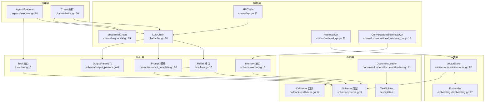
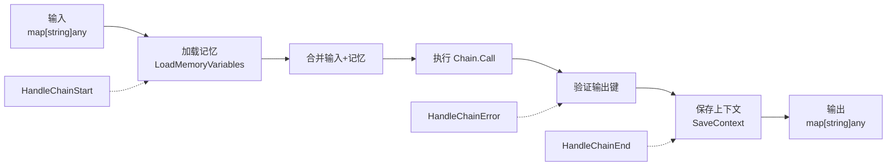
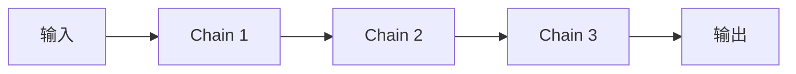
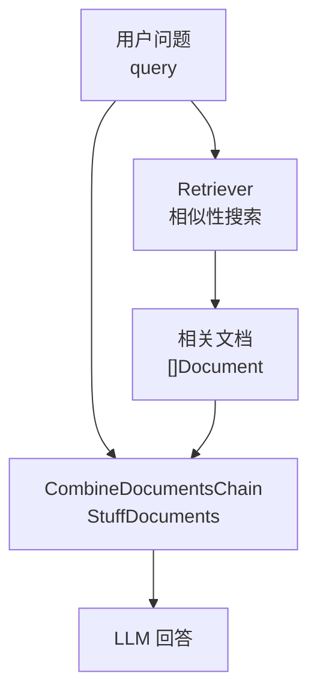
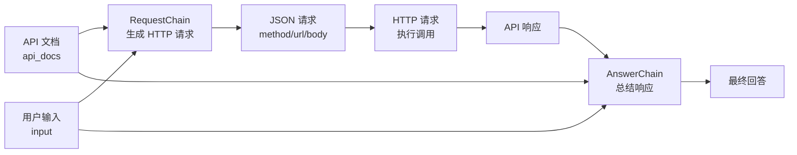
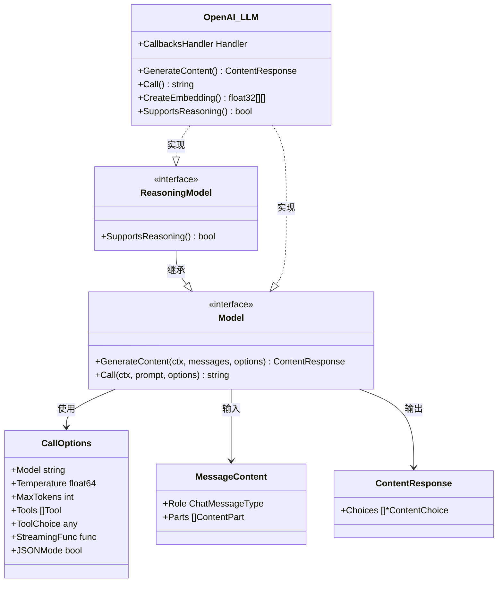
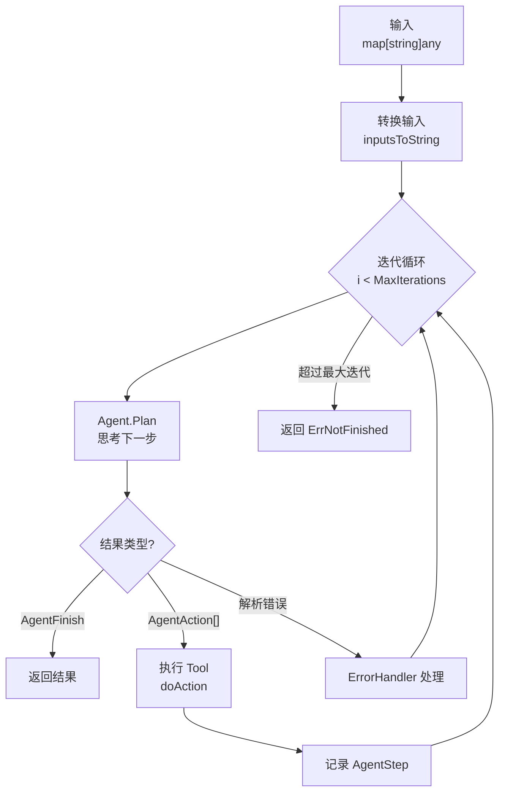
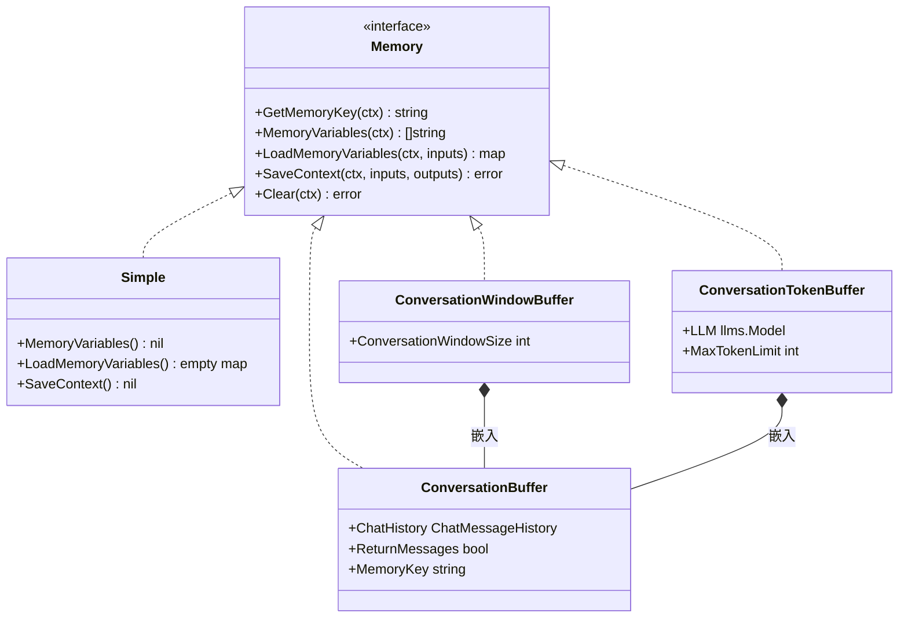
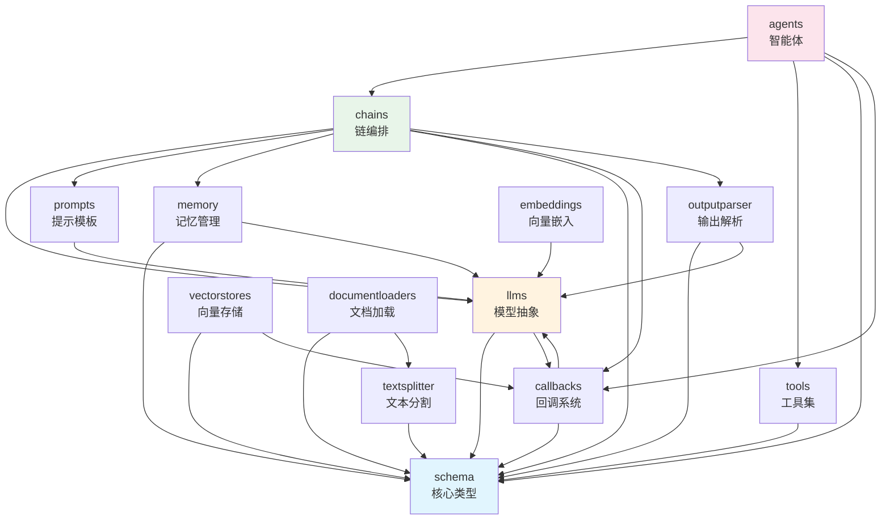

# LangChainGo 整体架构文档

## 1. 分层架构

LangChainGo 采用经典的分层架构，从上到下分为五层：



**各层职责**：

- **应用层**：用户直接交互的入口。`Executor` 驱动 Agent 的 Observe→Think→Act 循环；`chains.Call` 是统一的 Chain 调用入口
- **编排层**：不同策略的 Chain 实现，将核心层组件组合成工作流
- **核心层**：框架的五大核心抽象——模型、提示、记忆、工具、输出解析
- **基础层**：类型定义、回调系统、文档加载与分割
- **存储层**：向量存储与嵌入模型，支撑 RAG 场景

## 2. Chain 编排模型

### 2.1 数据流模型

所有 Chain 的输入输出均为 `map[string]any`，形成基于字典的数据流管道：



这是 `chains.Call` 函数（`chains/chains.go:30-67`）的核心流程：

1. 将用户输入与 Memory 加载的变量合并
2. 触发 `HandleChainStart` 回调
3. 调用具体 Chain 的 `Call` 方法
4. 验证输出键是否完整
5. 保存上下文到 Memory
6. 触发 `HandleChainEnd` 回调

### 2.2 LLMChain 内部流程

`LLMChain`（`chains/llm.go:16-24`）是最基础的链，其 `Call` 方法（`chains/llm.go:53-70`）：

```go
func (c LLMChain) Call(ctx context.Context, values map[string]any, ...) (map[string]any, error) {
    // 1. 使用 Prompt 模板格式化输入
    promptValue, err := c.Prompt.FormatPrompt(values)
    // 2. 调用 LLM 生成
    result, err := llms.GenerateFromSinglePrompt(ctx, c.LLM, promptValue.String(), ...)
    // 3. 使用 OutputParser 解析输出
    finalOutput, err := c.OutputParser.ParseWithPrompt(result, promptValue)
    return map[string]any{c.OutputKey: finalOutput}, nil
}
```

### 2.3 SequentialChain 顺序编排

`SequentialChain`（`chains/sequential.go:19-24`）将多条链串联执行，前链的输出作为后链的输入：



其 `Call` 方法（`chains/sequential.go:101-113`）简洁地遍历链列表：

```go
for _, chain := range c.chains {
    outputs, err = Call(ctx, chain, inputs, options...)
    inputs = outputs  // 前链输出作为后链输入
}
```

### 2.4 RetrievalQA 检索问答链



`RetrievalQA`（`chains/retrieval_qa.go:21-34`）的 `Call`（`chains/retrieval_qa.go:62-86`）：

1. 从输入中提取查询字符串
2. 调用 `Retriever.GetRelevantDocuments` 检索相关文档
3. 将文档和问题传给 `CombineDocumentsChain`
4. 可选返回源文档

### 2.5 APIChain API 调用链



APIChain（`chains/api.go:32-36`）包含两条子链：`RequestChain` 让 LLM 根据文档生成请求参数，`AnswerChain` 让 LLM 总结 API 响应。

## 3. Model 接口体系



### 3.1 消息体系

`MessageContent`（`llms/generatecontent.go:14-17`）采用 `Role + []ContentPart` 结构，支持多模态内容：

- `TextContent` — 纯文本（`llms/generatecontent.go:54-56`）
- `ImageURLContent` — 图片 URL（`llms/generatecontent.go:65-68`）
- `BinaryContent` — 二进制数据（`llms/generatecontent.go:77-80`）
- `ToolCall` — 工具调用请求（`llms/generatecontent.go:98-105`）
- `ToolCallResponse` — 工具调用结果（`llms/generatecontent.go:110-117`）

### 3.2 OpenAI 实现

`openai.LLM`（`llms/openai/openaillm.go:16-20`）同时实现了 `Model` 和 `ReasoningModel` 接口。其 `GenerateContent` 方法（`llms/openai/openaillm.go:104`）处理了：

- 模型能力检测（o1/o3 不支持 system 消息）
- 多模态内容转换
- 工具调用提取
- 推理模型支持
- 流式输出回调
- Web Search 集成

## 4. Agent 执行循环

### 4.1 Executor 循环



`Executor.Call`（`agents/executor.go:50-75`）实现迭代循环，`doIteration`（`agents/executor.go:77-118`）处理单次迭代：

1. 调用 `Agent.Plan` 获取下一步行动
2. 如果返回 `AgentFinish`，直接结束
3. 如果返回 `[]AgentAction`，逐个执行工具并记录步骤
4. 如果解析出错，交给 `ErrorHandler` 处理

### 4.2 Agent Plan 流程

以 `OneShotZeroAgent` 为例（`agents/mrkl.go:62-101`）：

```go
func (a *OneShotZeroAgent) Plan(...) ([]schema.AgentAction, *schema.AgentFinish, error) {
    // 1. 构建完整输入（加入 agent_scratchpad）
    fullInputs["agent_scratchpad"] = constructMrklScratchPad(intermediateSteps)
    // 2. 设置停止词，防止 LLM 继续生成
    predictOptions := []chains.ChainCallOption{
        chains.WithStopWords([]string{"\nObservation:", "\n\tObservation:"}),
    }
    // 3. 调用 LLMChain 预测
    output, err := chains.Predict(ctx, a.Chain, fullInputs, predictOptions...)
    // 4. 解析输出：Action/Action Input 或 Final Answer
    return a.parseOutput(output)
}
```

### 4.3 四种 Agent 对比

| Agent | 决策方式 | 最终答案标识 | 适用场景 |
|-------|----------|-------------|---------|
| `OneShotZeroAgent` | ReAct 提示 | `"Final Answer:"` | 工具调用为主 |
| `ConversationalAgent` | 对话式提示 | `"AI:"` | 对话+工具 |
| `OpenAIFunctionsAgent` | Function Calling | 无 tool_calls | OpenAI 原生工具调用 |

`OpenAIFunctionsAgent`（`agents/openai_functions_agent.go:20-32`）不使用 LLMChain，而是直接调用 `LLM.GenerateContent` 并传入 `llms.WithFunctions`（`agents/openai_functions_agent.go:153`），然后解析 `ContentResponse.Choices[0].ToolCalls`。

## 5. Memory 管理策略



### 5.1 ConversationBuffer

完整对话缓冲（`memory/buffer.go:16-25`），保存所有历史消息。`LoadMemoryVariables`（`memory/buffer.go:44-66`）可返回 `[]ChatMessage` 或格式化字符串。

### 5.2 ConversationWindowBuffer

滑动窗口缓冲（`memory/window_buffer.go:18-21`），嵌入 `ConversationBuffer` 并限制窗口大小。默认保留最近 5 轮对话（`memory/window_buffer.go:12`）。`SaveContext` 时自动裁剪（`memory/window_buffer.go:72-90`）。

### 5.3 ConversationTokenBuffer

Token 限制缓冲（`memory/token_buffer.go:11-15`），按 Token 数量控制记忆大小。`SaveContext` 时计算当前 Token 数（`memory/token_buffer.go:48-86`），超出限制则从最早消息开始删除。

### 5.4 Memory 与 Chain 的协作

Chain 在 `Call` 函数中自动管理 Memory（`chains/chains.go:30-67`）：

```go
// 调用前：从 Memory 加载变量，合并到输入
newValues, _ := c.GetMemory().LoadMemoryVariables(ctx, inputValues)
for key, value := range newValues {
    fullValues[key] = value
}

// 调用后：保存上下文到 Memory
c.GetMemory().SaveContext(ctx, inputValues, outputValues)
```

## 6. 模块依赖图



**关键依赖关系**：

1. `schema` 是最基础的包，定义了 `Memory`、`Document`、`AgentAction`、`Retriever` 等核心类型，几乎被所有包依赖
2. `llms` 依赖 `schema` 和 `callbacks`，是模型层的基础
3. `chains` 是编排核心，依赖 `llms`、`prompts`、`memory`、`outputparser`
4. `agents` 依赖 `chains` 和 `tools`，处于架构最顶层
5. `vectorstores` 和 `embeddings` 构成独立的 RAG 存储子系统
6. `documentloaders` 和 `textsplitter` 构成文档处理子系统
