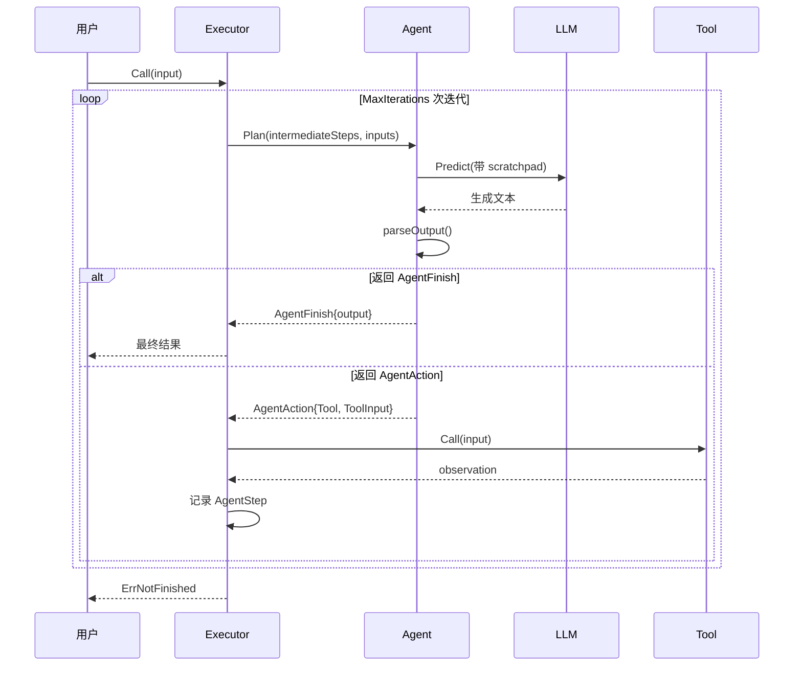
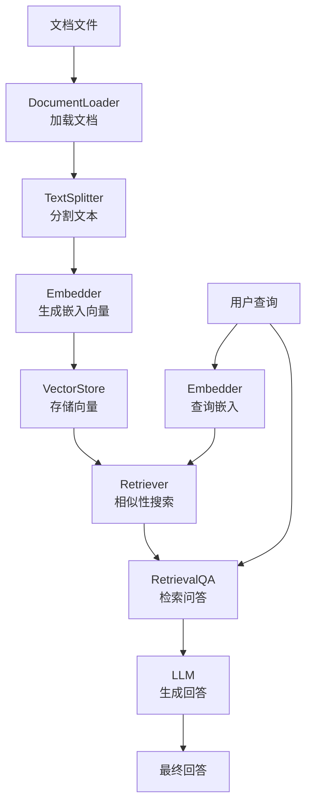

# LangChainGo 快速入门

## 1. 环境准备

### 1.1 Go 版本

LangChainGo 要求 Go 1.24+（见 `go.mod:3`）。确认版本：

```bash
go version
# go version go1.24.x darwin/amd64
```

### 1.2 安装

```bash
go get github.com/tmc/langchaingo@latest
```

得益于 Go 模块图剪枝（`go.mod:7-12`），导入特定包不会拉入全部依赖。例如：

```bash
# 只需 OpenAI 依赖
go get github.com/tmc/langchaingo/llms/openai
# 只需 Chroma 依赖
go get github.com/tmc/langchaingo/vectorstores/chroma
```

### 1.3 API Key 配置

OpenAI 默认从环境变量读取（`llms/openai/openaillm_option.go:9`）：

```bash
export OPENAI_API_KEY="sk-xxx"
export OPENAI_MODEL="gpt-4"  # 可选，默认 gpt-3.5-turbo
export OPENAI_BASE_URL="https://api.openai.com/v1"  # 可选，支持代理
```

也可通过代码显式传入（`llms/openai/openaillm_option.go:63`）。

## 2. 最简 LLM 调用

### 2.1 使用 Call 方法

`Call` 是向后兼容的纯文本接口（`llms/llms.go:21-28`）：

```go
package main

import (
    "context"
    "fmt"
    "log"

    "github.com/tmc/langchaingo/llms"
    "github.com/tmc/langchaingo/llms/openai"
)

func main() {
    // 创建 OpenAI LLM 实例
    // New 函数定义：llms/openai/openaillm.go:86
    llm, err := openai.New(openai.WithToken("sk-xxx"))
    if err != nil {
        log.Fatal(err)
    }

    // 使用 Call 进行纯文本调用
    // Call 内部调用 GenerateFromSinglePrompt（llms/llms.go:47）
    completion, err := llm.Call(context.Background(), "你好，请用一句话介绍 Go 语言")
    if err != nil {
        log.Fatal(err)
    }
    fmt.Println(completion)
}
```

### 2.2 使用 GenerateContent 方法

`GenerateContent` 是更通用的多模态接口（`llms/llms.go:16-19`）：

```go
// 构造消息列表（llms/generatecontent.go:14-17）
messages := []llms.MessageContent{
    llms.TextParts(llms.ChatMessageTypeSystem, "你是一个有帮助的助手"),
    llms.TextParts(llms.ChatMessageTypeHuman, "Go 语言的并发模型是什么？"),
}

// 调用 GenerateContent，支持完整的 CallOptions（llms/options.go:10-76）
resp, err := llm.GenerateContent(
    context.Background(),
    messages,
    llms.WithTemperature(0.7),
    llms.WithMaxTokens(500),
)
if err != nil {
    log.Fatal(err)
}
// ContentResponse 结构定义：llms/generatecontent.go:123-125
fmt.Println(resp.Choices[0].Content)
```

### 2.3 流式输出

通过 `WithStreamingFunc` 选项（`llms/options.go:199-204`）实现流式输出：

```go
var sb strings.Builder
_, err := llm.GenerateContent(
    context.Background(),
    []llms.MessageContent{
        llms.TextParts(llms.ChatMessageTypeHuman, "讲一个长故事"),
    },
    llms.WithStreamingFunc(func(ctx context.Context, chunk []byte) error {
        sb.Write(chunk)
        fmt.Print(string(chunk))  // 实时输出
        return nil
    }),
)
```

## 3. 创建 Chain

### 3.1 LLMChain — 最基础的链

`LLMChain`（`chains/llm.go:16`）组合 Prompt + LLM + OutputParser：

```go
package main

import (
    "context"
    "fmt"
    "log"

    "github.com/tmc/langchaingo/chains"
    "github.com/tmc/langchaingo/llms/openai"
    "github.com/tmc/langchaingo/prompts"
)

func main() {
    // 创建 LLM
    llm, err := openai.New()
    if err != nil {
        log.Fatal(err)
    }

    // 创建提示模板
    // NewPromptTemplate 定义：prompts/prompt_template.go:53
    // 默认使用 Go 模板语法（TemplateFormatGoTemplate）
    prompt := prompts.NewPromptTemplate(
        "讲一个关于{{.topic}}的笑话",
        []string{"topic"},
    )

    // 创建 LLMChain
    // NewLLMChain 定义：chains/llm.go:32
    chain := chains.NewLLMChain(llm, prompt)

    // 调用链
    // chains.Call 定义：chains/chains.go:30
    result, err := chains.Call(
        context.Background(),
        chain,
        map[string]any{"topic": "Go 语言"},
        chains.WithTemperature(0.8),
    )
    if err != nil {
        log.Fatal(err)
    }
    fmt.Println(result["text"])  // 默认输出键为 "text"（chains/llm.go:14）
}
```

### 3.2 SequentialChain — 顺序链

将多条链串联执行（`chains/sequential.go:19`）：

```go
// 第一条链：将主题翻译成英文
translatePrompt := prompts.NewPromptTemplate(
    "将以下中文翻译为英文：{{.chinese}}",
    []string{"chinese"},
)
translateChain := chains.NewLLMChain(llm, translatePrompt)

// 第二条链：用英文写一首诗
poemPrompt := prompts.NewPromptTemplate(
    "写一首关于{{.text}}的英文短诗",
    []string{"text"},
)
poemChain := chains.NewLLMChain(llm, poemPrompt)

// 串联：translateChain 的输出 "text" 作为 poemChain 的输入 "text"
// NewSequentialChain 定义：chains/sequential.go:26
seqChain, err := chains.NewSequentialChain(
    []chains.Chain{translateChain, poemChain},
    []string{"chinese"},    // 整体输入键
    []string{"text"},       // 整体输出键
)
if err != nil {
    log.Fatal(err)
}

result, err := chains.Call(
    context.Background(),
    seqChain,
    map[string]any{"chinese": "春天"},
)
```

### 3.3 APIChain — API 调用链

`APIChain`（`chains/api.go:32`）让 LLM 根据文档生成 API 请求：

```go
// NewAPIChain 定义：chains/api.go:42
apiChain := chains.NewAPIChain(llm, http.DefaultClient)

result, err := chains.Call(
    context.Background(),
    apiChain,
    map[string]any{
        "api_docs": "GET /weather?city={city} - 获取城市天气",
        "input":    "北京今天天气怎么样？",
    },
)
```

## 4. 创建 Agent

### 4.1 OneShotZeroAgent

基于 ReAct 模式的 Agent（`agents/mrkl.go:26`）：

```go
package main

import (
    "context"
    "fmt"
    "log"

    "github.com/tmc/langchaingo/agents"
    "github.com/tmc/langchaingo/llms/openai"
    "github.com/tmc/langchaingo/tools"
)

func main() {
    llm, err := openai.New()
    if err != nil {
        log.Fatal(err)
    }

    // 准备工具列表
    // Tool 接口定义：tools/tool.go:6-9
    agentTools := []tools.Tool{
        // 使用内置计算器工具
        // Calculator 实现了 Tool 接口
        tools.Calculator{},
    }

    // 创建 OneShotAgent
    // NewOneShotAgent 定义：agents/mrkl.go:43
    agent := agents.NewOneShotAgent(llm, agentTools)

    // 创建 Executor
    // NewExecutor 定义：agents/executor.go:34
    executor := agents.NewExecutor(agent)

    // 执行
    // Executor 实现了 chains.Chain 接口（agents/executor.go:29）
    result, err := chains.Call(
        context.Background(),
        executor,
        map[string]any{"input": "123 * 456 等于多少？"},
    )
    if err != nil {
        log.Fatal(err)
    }
    fmt.Println(result["output"])
}
```

### 4.2 OpenAIFunctionsAgent

使用 OpenAI 原生 Function Calling（`agents/openai_functions_agent.go:20`）：

```go
// NewOpenAIFunctionsAgent 定义：agents/openai_functions_agent.go:37
agent := agents.NewOpenAIFunctionsAgent(llm, agentTools)

executor := agents.NewExecutor(
    agent,
    agents.WithMaxIterations(10),        // 最大迭代次数（agents/options.go:93）
    agents.WithReturnIntermediateSteps(),  // 返回中间步骤（agents/options.go:137）
)

result, err := chains.Call(
    context.Background(),
    executor,
    map[string]any{"input": "帮我计算 2 的 10 次方"},
)
```

### 4.3 ConversationalAgent

带对话历史的 Agent（`agents/conversational.go:29`）：

```go
// 创建带对话记忆的 Agent
agent := agents.NewConversationalAgent(llm, agentTools)

// 使用 ConversationBuffer 作为记忆
// NewConversationBuffer 定义：memory/buffer.go:31
buffer := memory.NewConversationBuffer()

executor := agents.NewExecutor(
    agent,
    agents.WithMemory(buffer),  // agents/options.go:144
)
```

### 4.4 Agent 执行循环详解



关键代码位于 `agents/executor.go:50-75`（循环）和 `agents/executor.go:77-118`（单次迭代）。

## 5. RAG 流程

### 5.1 完整 RAG 示例



### 5.2 代码实现

```go
package main

import (
    "context"
    "fmt"
    "log"

    "github.com/tmc/langchaingo/chains"
    "github.com/tmc/langchaingo/documentloaders"
    "github.com/tmc/langchaingo/embeddings"
    "github.com/tmc/langchaingo/llms/openai"
    "github.com/tmc/langchaingo/textsplitter"
    "github.com/tmc/langchaingo/vectorstores/chroma"
)

func main() {
    ctx := context.Background()
    llm, _ := openai.New()

    // 1. 加载文档
    // Loader 接口定义：documentloaders/documentloaders.go:11
    loader := documentloaders.NewText(file)
    docs, _ := loader.LoadAndSplit(ctx,
        textsplitter.NewRecursiveCharacter(),
    )

    // 2. 创建嵌入模型
    // NewEmbedder 定义：embeddings/embedding.go:13
    embedder, _ := embeddings.NewEmbedder(llm)

    // 3. 创建向量存储并添加文档
    store, _ := chroma.New(
        chroma.WithChromaURL("http://localhost:8000"),
        chroma.WithEmbedder(embedder),
    )
    store.AddDocuments(ctx, docs)

    // 4. 创建检索器
    // ToRetriever 定义：vectorstores/vectorstores.go:47
    retriever := vectorstores.ToRetriever(store, 5)

    // 5. 创建 RetrievalQA 链
    // NewRetrievalQAFromLLM 定义：chains/retrieval_qa.go:53
    qaChain := chains.NewRetrievalQAFromLLM(llm, retriever)

    // 6. 执行问答
    result, _ := chains.Call(ctx, qaChain, map[string]any{
        "query": "Go 语言的并发模型是什么？",
    })
    fmt.Println(result["text"])
}
```

### 5.3 带对话历史的 RAG

`ConversationalRetrievalQA`（`chains/conversational_retrieval_qa.go:18`）在 RetrievalQA 基础上增加对话记忆。它先通过 `CondenseQuestionChain` 将当前问题和历史对话压缩为独立问题，再进行检索：

```go
// NewConversationalRetrievalQAFromLLM 定义：
// chains/conversational_retrieval_qa.go:76
buffer := memory.NewConversationBuffer()
qaChain := chains.NewConversationalRetrievalQAFromLLM(
    llm, retriever, buffer,
)

// 第一轮
result1, _ := chains.Call(ctx, qaChain, map[string]any{
    "question": "什么是 goroutine？",
})

// 第二轮 — 能理解"它"指代 goroutine
result2, _ := chains.Call(ctx, qaChain, map[string]any{
    "question": "它和线程有什么区别？",
})
```

## 6. 常见问题

### Q1: 如何更换 LLM 提供商？

所有提供商实现相同的 `llms.Model` 接口，只需替换 `New` 函数：

```go
// OpenAI
llm, _ := openai.New(openai.WithToken("sk-xxx"))

// Ollama（本地）
import "github.com/tmc/langchaingo/llms/ollama"
llm, _ := ollama.New(ollama.WithModel("llama3"))

// Anthropic
import "github.com/tmc/langchaingo/llms/anthropic"
llm, _ := anthropic.New(anthropic.WithToken("sk-ant-xxx"))
```

### Q2: 如何自定义 Agent 的提示词？

通过 `WithPromptPrefix`、`WithPromptFormatInstructions`、`WithPromptSuffix` 选项（`agents/options.go:107-126`）：

```go
agent := agents.NewOneShotAgent(llm, agentTools,
    agents.WithPromptPrefix("你是一个专业的数据分析助手"),
    agents.WithPromptFormatInstructions("使用以下格式..."),
)
```

### Q3: Chain 执行出错怎么办？

Chain 内置完整的错误处理机制：

- 输入验证：`validateInputs` 检查必需键（`chains/chains.go:237-243`）
- 输出验证：`validateOutputs` 检查输出键（`chains/chains.go:246-253`）
- 回调通知：出错时触发 `HandleChainError`（`chains/chains.go:52-54`）
- Agent 解析错误：`ParserErrorHandler` 允许自定义恢复策略（`agents/executor.go:85-94`）

### Q4: 如何并行执行 Chain？

使用 `Apply` 函数（`chains/chains.go:168`）并行执行多条链，默认 5 个 worker：

```go
inputs := []map[string]any{
    {"topic": "Go"},
    {"topic": "Python"},
    {"topic": "Rust"},
}
results, err := chains.Apply(ctx, chain, inputs, 3)  // 3 个 worker
```

### Q5: 如何自定义 Tool？

实现 `tools.Tool` 接口（`tools/tool.go:6-9`）即可：

```go
type WeatherTool struct{}

func (t WeatherTool) Name() string { return "weather" }
func (t WeatherTool) Description() string { return "获取指定城市的天气信息" }
func (t WeatherTool) Call(ctx context.Context, input string) (string, error) {
    // 调用天气 API
    return fmt.Sprintf("%s 今天晴天，25°C", input), nil
}
```

### Q6: 如何处理流式输出？

在 Chain 层级设置 `WithStreamingFunc`（`chains/options.go:94-99`）：

```go
result, err := chains.Call(ctx, chain, input,
    chains.WithStreamingFunc(func(ctx context.Context, chunk []byte) error {
        fmt.Print(string(chunk))
        return nil
    }),
)
```

`ChainCallOption` 会自动转换为 `llms.CallOption`（`chains/options.go:167-214`），包括 `StreamingFunc` 的传递。
