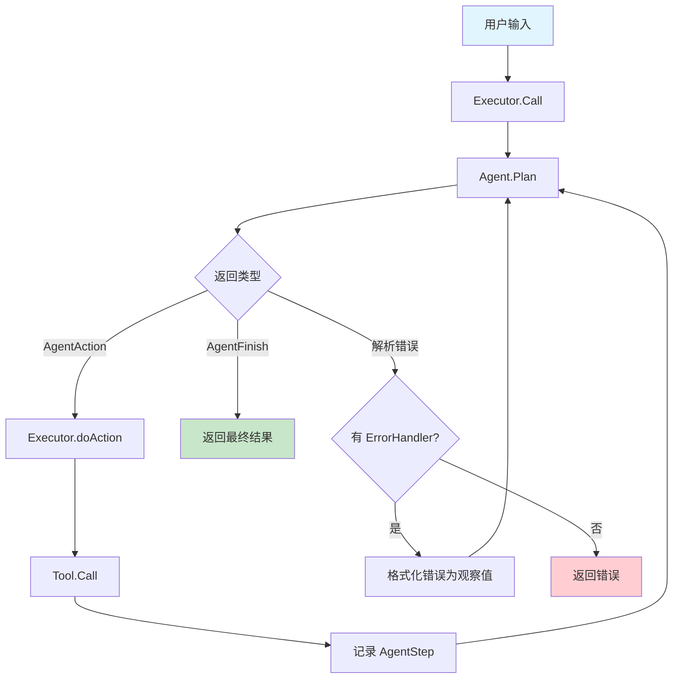

# Agent 体系详解

langchaingo 的 agents 包实现了基于 LLM 的自主决策系统，采用 Observe-Think-Act 循环模式。本文从源码层面深入解析 Agent 接口、执行器、MRKL 排序器、对话式代理和 OpenAI 函数代理。

---

## 1. Agent 接口

**源码位置**: agents/agents.go:12-20

```go
type Agent interface {
    Plan(ctx context.Context, intermediateSteps []schema.AgentStep, inputs map[string]string, options ...chains.ChainCallOption) ([]schema.AgentAction, *schema.AgentFinish, error)
    GetInputKeys() []string
    GetOutputKeys() []string
    GetTools() []tools.Tool
}
```

四个方法：

- **Plan** (`agents.go:16`): 核心决策方法。给定中间步骤和输入，返回 `[]AgentAction`（继续执行）或 `*AgentFinish`（完成）。
- **GetInputKeys** (`agents.go:17`): 返回期望的输入键。
- **GetOutputKeys** (`agents.go:18`): 返回输出键。
- **GetTools** (`agents.go:19`): 返回 Agent 可用的工具列表。

### AgentAction 与 AgentFinish

```go
type AgentAction struct {
    Tool      string // 要调用的工具名
    ToolInput string // 工具输入
    Log       string // 决策日志
    ToolID    string // 工具调用 ID（OpenAI 函数调用）
}

type AgentFinish struct {
    ReturnValues map[string]any // 最终返回值
    Log          string         // 完成日志
}
```

### AgentStep

```go
type AgentStep struct {
    Action      AgentAction // 执行的动作
    Observation string      // 动作的观察结果
}
```

---

## 2. OneShotZeroAgent (MRKL Agent)

**源码位置**: agents/mrkl.go:26-200

```go
type OneShotZeroAgent struct {
    Chain            chains.Chain     // 决策链
    Tools            []tools.Tool     // 可用工具
    OutputKey        string           // 输出键（默认 "output"）
    CallbacksHandler callbacks.Handler
}
```

### 创建 (`mrkl.go:43-59`)

NewOneShotAgent 内部创建 LLMChain，使用 MRKL 提示模板：

```
Answer the following questions as best you can. You have access to the following tools:
{{.tool_descriptions}}

Use the following format:
Question: the input question you must answer
Thought: you should always think about what to do
Action: the action to take, should be one of [ {{.tool_names}} ]
Action Input: the input to the action
Observation: the result of the action
... (this Thought/Action/Action Input/Observation can repeat N times)
Thought: I now know the final answer
Final Answer: the final answer to the original input question

Begin!
Question: {{.input}}
{{.agent_scratchpad}}
```

### Plan 决策流程 (`mrkl.go:62-101`)

1. 构建完整输入，加入 agent_scratchpad（`:68-73`）
2. 设置停止词 `"
Observation:"` 和流式回调（`:85-89`）
3. 用 chains.Predict 执行 LLMChain（`:91-96`）
4. 解析 LLM 输出（`:101`）

### parseOutput 输出解析 (`mrkl.go:139-200`)

1. 优先检查 `"Final Answer:"` 格式（`:141-149`）
2. 检查大小写变体（"final answer:", "the answer is:" 等）（`:154-178`）
3. 匹配 `Action: ... Action Input: ...` 模式（`:182-188`，正则 `(?i)Action:\s*(.+?)\s*Action\s+Input:\s*(?s)(.+)`）
4. 回退到原始正则（`:191-199`）
5. 都不匹配则返回 ErrUnableToParseOutput

### MRKL 排序器

createMRKLPrompt (`mrkl_prompt.go:33-45`) 将工具名和描述注入模板。toolNames (`:47-57`) 用逗号连接工具名，toolDescriptions (`:59-66`) 格式化为 `"- name: description"` 列表。

---

## 3. Executor 执行器

**源码位置**: agents/executor.go:18-201

```go
type Executor struct {
    Agent                   Agent
    Memory                  schema.Memory
    CallbacksHandler        callbacks.Handler
    ErrorHandler            *ParserErrorHandler
    MaxIterations           int  // 默认 5
    ReturnIntermediateSteps bool
}
```

Executor 实现了 `chains.Chain` 接口（`:29-31`），使 Agent 可以嵌入到链中。

### Call 执行流程 (`executor.go:50-75`)

1. 将输入转为字符串 map（`:51-54`）
2. 构建工具名到工具的映射（`:55`）
3. 循环执行最多 MaxIterations 次迭代（`:58-64`）
4. 超过最大迭代次数返回 ErrNotFinished（`:66-74`）

### doIteration 迭代逻辑 (`executor.go:77-118`)

1. 调用 Agent.Plan 获取动作或完成信号（`:84`）
2. 处理解析错误：如果有 ErrorHandler，将错误格式化为观察值继续（`:85-94`）
3. 如果 Agent 返回 AgentFinish，触发回调并返回（`:103-108`）
4. 否则执行每个动作（`:110-115`）

### doAction 动作执行 (`executor.go:120-147`)

1. 触发 HandleAgentAction 回调（`:126-128`）
2. 在工具映射中查找工具（大小写不敏感，`:130`）
3. 未找到工具则返回提示（`:131-136`）
4. 调用工具的 Call 方法（`:138-141`）
5. 将动作和观察记录为 AgentStep（`:143-146`）

### getNameToTool 工具映射 (`executor.go:190-201`)

将工具名转为大写作为 map 键（`:197`），实现大小写不敏感的工具查找。

---

## 4. ConversationalAgent 对话式代理

**源码位置**: agents/conversational.go:29-187

```go
type ConversationalAgent struct {
    Chain            chains.Chain
    Tools            []tools.Tool
    OutputKey        string
    CallbacksHandler callbacks.Handler
}
```

与 OneShotZeroAgent 的区别：
- 使用对话式提示模板，包含 history 变量
- Final Answer 格式为 `"AI:"`（而非 `"Final Answer:"`）
- 构建 ScratchPad 时末尾追加 `"Thought:"`（`:127-138`）

### parseOutput (`:140-163`)

1. 检查 `"AI:"` 前缀（`:141-152`）
2. 匹配 `Action: (.*?)[
]*Action Input: (.*)` 正则（`:154-162`）

---

## 5. OpenAIFunctionsAgent

**源码位置**: agents/openai_functions_agent.go:20-361

```go
type OpenAIFunctionsAgent struct {
    LLM              llms.Model
    Prompt           prompts.FormatPrompter
    Tools            []tools.Tool
    OutputKey        string
    CallbacksHandler callbacks.Handler
}
```

不使用文本解析，而是利用 OpenAI 的函数调用 API 直接获取结构化工具调用。

### Plan 流程 (`:71-162`)

1. 构建 ChatPrompt 输入（`:77-81`）
2. 格式化提示并转换为 MessageContent 列表（`:92-150`）
   - ToolChatMessage 转为 ToolCallResponse
   - AIChatMessage 含 ToolCalls 时提取为 ToolCall ContentPart
   - 其他消息转为 TextContent
3. 调用 LLM.GenerateContent 传入函数定义（`:153-158`）
4. 解析输出（`:161`）

### ParseOutput (`:263-361`)

1. 检查 ToolCalls（`:272-309`）：从每个 ToolCall 提取函数名和参数
2. 检查 FuncCall（`:312-352`）：兼容旧版函数调用
3. 无工具调用则返回 AgentFinish（`:355-361`）

工具参数中 `"__arg1"` 模式（`:283-289`）用于将单字符串参数从 JSON 中提取。

### constructScratchPad (`:199-261`)

将 AgentStep 列表转为 ChatMessage 序列：
- 工具调用转为 AIChatMessage（含 ToolCalls）+ ToolChatMessage（结果）
- 支持并行工具调用的分组处理（`:211-243`）

---

## 6. 执行流程图



---

## 7. 选项与错误处理

### Executor 选项 (`agents/options.go:11-26`)

```go
type Options struct {
    prompt                  prompts.PromptTemplate
    memory                  schema.Memory
    callbacksHandler        callbacks.Handler
    errorHandler            *ParserErrorHandler
    maxIterations           int
    returnIntermediateSteps bool
    outputKey               string
    promptPrefix            string
    formatInstructions      string
    promptSuffix            string
    systemMessage           string  // OpenAI 专用
    extraMessages           []prompts.MessageFormatter // OpenAI 专用
}
```

### 选项函数

| 选项 | 行号 | 说明 |
|------|------|------|
| WithMaxIterations | :93 | 最大迭代次数 |
| WithOutputKey | :100 | 输出键名 |
| WithPromptPrefix | :107 | 提示前缀 |
| WithPromptFormatInstructions | :115 | 格式指令 |
| WithPromptSuffix | :121 | 提示后缀 |
| WithPrompt | :129 | 自定义提示模板 |
| WithReturnIntermediateSteps | :137 | 返回中间步骤 |
| WithMemory | :144 | 设置 Memory |
| WithCallbacksHandler | :151 | 设置回调处理器 |
| WithParserErrorHandler | :158 | 设置解析错误处理器 |

### 错误类型 (`agents/errors.go:5-23`)

| 错误 | 行号 | 说明 |
|------|------|------|
| ErrExecutorInputNotString | :7 | Executor 输入非字符串 |
| ErrAgentNoReturn | :9 | Agent 未返回动作或完成 |
| ErrNotFinished | :11 | 超过最大迭代次数 |
| ErrUnknownAgentType | :13 | 未知 Agent 类型 |
| ErrUnableToParseOutput | :18 | 无法解析 LLM 输出 |

### ParserErrorHandler (`errors.go:25-40`)

```go
type ParserErrorHandler struct {
    Formatter func(err string) string
}
```

当 Agent 输出解析失败时，ErrorHandler 将错误格式化为观察值反馈给 Agent，使其有机会自我修正。

---

## 8. Initialize 工厂函数

**源码位置**: agents/initialize.go:26-42

```go
func Initialize(llm llms.Model, tools []tools.Tool, agentType AgentType, opts ...Option) (*Executor, error)
```

根据 AgentType 创建对应的 Agent 并包装为 Executor：
- ZeroShotReactDescription → NewOneShotAgent
- ConversationalReactDescription → NewConversationalAgent

已标记为 Deprecated，推荐直接使用 NewExecutor。

---

## 9. 自定义 Agent 示例

```go
// 自定义 Agent 需实现 Agent 接口
type MyAgent struct {
    llm   llms.Model
    tools []tools.Tool
}

func (a *MyAgent) Plan(ctx context.Context, steps []schema.AgentStep, inputs map[string]string, opts ...chains.ChainCallOption) ([]schema.AgentAction, *schema.AgentFinish, error) {
    // 1. 构建自定义提示
    // 2. 调用 LLM 决策
    // 3. 解析输出为 AgentAction 或 AgentFinish
    return nil, &schema.AgentFinish{ReturnValues: map[string]any{"output": "done"}}, nil
}

func (a *MyAgent) GetInputKeys() []string  { return []string{"input"} }
func (a *MyAgent) GetOutputKeys() []string { return []string{"output"} }
func (a *MyAgent) GetTools() []tools.Tool  { return a.tools }

// 创建并执行
agent := &MyAgent{llm: llm, tools: toolList}
executor := agents.NewExecutor(agent, agents.WithMaxIterations(10))
result, err := chains.Call(ctx, executor, map[string]any{"input": "hello"})
```
