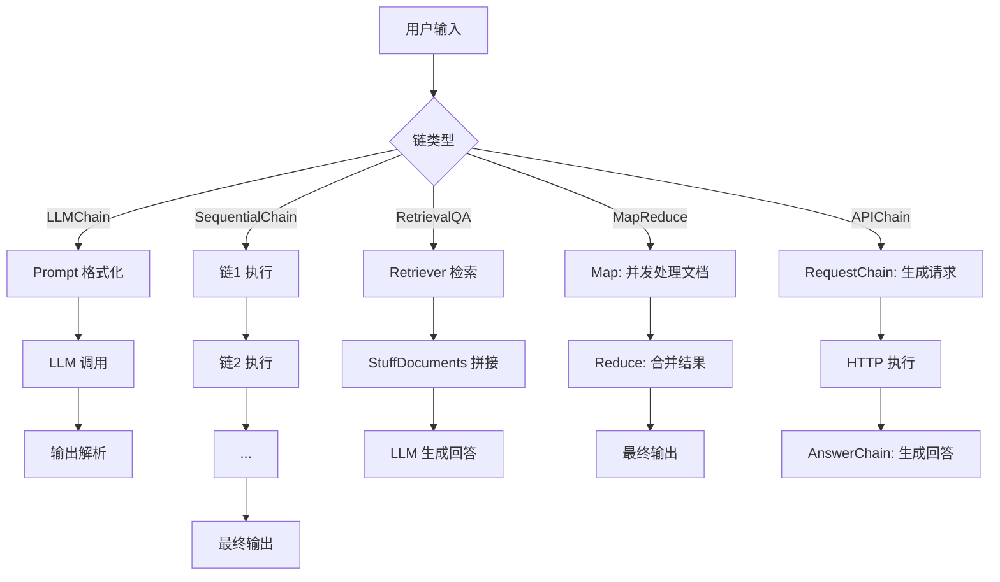

# Chain 编排详解

langchaingo 的 chains 包实现了多种链式编排模式，将 LLM、检索器、文档处理器等组件组合成可复用的处理管线。本文从源码层面深入解析 Chain 接口、核心链实现、选项传递机制和数据流。

---

## 1. Chain 接口

**源码位置**: chains/chains.go:16-27

```go
type Chain interface {
    Call(ctx context.Context, inputs map[string]any, options ...ChainCallOption) (map[string]any, error)
    GetMemory() schema.Memory
    GetInputKeys() []string
    GetOutputKeys() []string
}
```

四个方法职责：

- **Call** (`chains.go:20`): 执行链逻辑，接受输入字典和选项，返回输出字典。不应直接调用，应使用包级 Call/Run/Predict 函数。
- **GetMemory** (`chains.go:22`): 返回链关联的 Memory，用于自动加载和保存对话上下文。
- **GetInputKeys** (`chains.go:24`): 返回链期望的输入键列表，用于输入验证。
- **GetOutputKeys** (`chains.go:26`): 返回链输出的键列表，用于输出验证。

### 包级执行函数

#### Call (`chains.go:30-67`)

标准链执行入口，流程为：
1. 合并输入值和 Memory 加载的变量（`:36-43`）
2. 触发 HandleChainStart 回调（`:46-48`）
3. 验证输入、执行链、验证输出（`:50-88`）
4. 触发 HandleChainEnd 回调（`:58-60`）
5. 保存上下文到 Memory（`:62-64`）

#### Run (`chains.go:92-132`)

简化执行：仅适用于单输入单输出的链。自动从输入键中排除 Memory 提供的键（`:98-110`）。

#### Predict (`chains.go:135-152`)

类似 Run，但接受 map 输入，仅要求单字符串输出。

#### Apply (`chains.go:168-208`)

批量异步执行：对多个输入并发调用链。使用 worker pool 模式，默认 5 个并发 worker（`:154`），通过 channel 分发任务和收集结果。

---

## 2. ChainCallOption 链选项

**源码位置**: chains/options.go:10-68

```go
type chainCallOption struct {
    Model            string
    MaxTokens        int
    Temperature      float64
    StopWords        []string
    StreamingFunc    func(ctx context.Context, chunk []byte) error
    TopK             int
    TopP             float64
    Seed             int
    MinLength        int
    MaxLength        int
    RepetitionPenalty float64
    CallbackHandler  callbacks.Handler
    // 每个 bool 字段都有对应的 set 标志
    modelSet, maxTokensSet, temperatureSet, stopWordsSet bool
    topkSet, toppSet, seedSet, minLengthSet, maxLengthSet bool
    repetitionPenaltySet bool
}
```

每个数值字段都有对应的 `*Set bool` 标志（`:14-18`），用于区分用户显式设置和默认值。这是为了解决 #626 问题：在将 ChainCallOption 转换为 llms.CallOption 时，需要知道用户是否显式设置了某个值。

### GetLLMCallOptions (`options.go:167-219`)

将 ChainCallOption 转换为 llms.CallOption 列表。只转换显式设置过的选项（通过 `*Set` 标志判断）。如果 StreamingFunc 为空但 CallbackHandler 不为空，自动创建 StreamingFunc 调用 HandleStreamingFunc（`:172-177`）。

### 选项函数

| 选项 | 行号 | 说明 |
|------|------|------|
| WithModel | :71 | 设置模型名 |
| WithMaxTokens | :79 | 设置最大令牌数 |
| WithTemperature | :87 | 设置温度 |
| WithStreamingFunc | :95 | 设置流式回调 |
| WithTopK | :102 | 设置 Top-K |
| WithTopP | :110 | 设置 Top-P |
| WithSeed | :118 | 设置确定性种子 |
| WithMinLength | :126 | 设置最小长度 |
| WithMaxLength | :134 | 设置最大长度 |
| WithRepetitionPenalty | :142 | 设置重复惩罚 |
| WithStopWords | :150 | 设置停止词 |
| WithCallback | :158 | 设置回调处理器 |

---

## 3. LLMChain

**源码位置**: chains/llm.go:16-89

LLMChain 是最基础的链，将 Prompt 模板和 LLM 组合在一起。

```go
type LLMChain struct {
    Prompt           prompts.FormatPrompter  // 提示模板
    LLM              llms.Model              // 语言模型
    Memory           schema.Memory           // 对话记忆
    CallbacksHandler callbacks.Handler       // 回调处理器
    OutputParser     schema.OutputParser[any] // 输出解析器
    OutputKey        string                  // 输出键（默认 text）
}
```

### NewLLMChain (`llm.go:32-47`)

创建 LLMChain，默认使用 Simple 输出解析器和 Simple Memory。

### Call 流程 (`llm.go:53-70`)

1. 用输入值格式化提示模板（`:54-57`）
2. 通过 GenerateFromSinglePrompt 调用 LLM（`:59-62`）
3. 用输出解析器解析结果（`:64-67`）
4. 返回以 OutputKey 为键的字典（`:69`）

---

## 4. SequentialChain

**源码位置**: chains/sequential.go:17-211

### SequentialChain (`:19-24`)

顺序执行多个链，前一个链的输出作为后一个链的输入。

```go
type SequentialChain struct {
    chains     []Chain
    inputKeys  []string
    outputKeys []string
    memory     schema.Memory
}
```

NewSequentialChain (`:26-43`) 在创建时执行验证（`:45-96`）：
- 检查 Memory 键不与输入键冲突
- 检查每个链的输入键在已知键中存在
- 检查链的输出键不与已有键重复
- 检查最终输出键在已知键中存在

Call (`:101-113`) 按顺序执行每个链，将前一个链的输出作为下一个链的输入。

### SimpleSequentialChain (`:143-203`)

简化版本，要求所有链都是单输入单输出。输入键固定为 `"input"`，输出键固定为 `"output"`。

---

## 5. APIChain

**源码位置**: chains/api.go:32-174

```go
type APIChain struct {
    RequestChain *LLMChain    // 生成 API 请求的链
    AnswerChain  *LLMChain    // 生成最终回答的链
    Request      HTTPRequest  // HTTP 请求执行器
}
```

### 执行流程 (`api.go:60-106`)

1. 以 temperature=0 执行 RequestChain，生成 API 请求描述（`:61-68`）
2. 从 LLM 输出中提取 JSON（正则匹配，`:75-76`）
3. 解析 JSON 获取 method/url/headers/body（`:79-89`）
4. 执行 HTTP 请求获取响应（`:91-94`）
5. 将原始输入、API 文档和响应传给 AnswerChain 生成最终答案（`:96-105`）

输入键：`"api_docs"`, `"input"`；输出键：`"answer"`。

---

## 6. RetrievalQA

**源码位置**: chains/retrieval_qa.go:21-103

```go
type RetrievalQA struct {
    Retriever             schema.Retriever  // 文档检索器
    CombineDocumentsChain Chain             // 文档组合链
    InputKey              string            // 输入键（默认 "query"）
    ReturnSourceDocuments bool              // 是否返回源文档
}
```

### Call 流程 (`retrieval_qa.go:62-86`)

1. 从输入获取查询字符串（`:63-66`）
2. 用检索器获取相关文档（`:68-71`）
3. 将查询和文档传给 CombineDocumentsChain（`:73-79`）
4. 可选地附加源文档到输出（`:81-83`）

NewRetrievalQAFromLLM (`:53-58`) 便捷构造：用 LoadStuffQA 创建组合链，再与检索器组合。

---

## 7. ConversationalRetrievalQA

**源码位置**: chains/conversational_retrieval_qa.go:18-194

在 RetrievalQA 基础上增加对话历史支持。

```go
type ConversationalRetrievalQA struct {
    Retriever               schema.Retriever
    Memory                  schema.Memory
    CombineDocumentsChain   Chain  // 文档组合链
    CondenseQuestionChain   Chain  // 问题精炼链
    OutputKey               string
    RephraseQuestion        bool   // 是否用精炼后的问题传给组合链
    ReturnGeneratedQuestion bool   // 是否返回精炼后的问题
    InputKey                string
    ReturnSourceDocuments   bool
}
```

### Call 流程 (`:91-140`)

1. 获取查询和聊天历史（`:92-109`）
2. 如果有聊天历史，通过 CondenseQuestionChain 生成独立问题（`:111-114`, `:159-186`）
3. 检索文档（`:116-119`）
4. 根据 RephraseQuestion 决定传原始问题还是精炼问题给组合链（`:121-127`, `:188-194`）

---

## 8. StuffDocuments

**源码位置**: chains/stuff_documents.go:23-97

将所有文档拼接后一次性传给 LLM。

```go
type StuffDocuments struct {
    LLMChain             *LLMChain
    InputKey             string // 默认 "input_documents"
    DocumentVariableName string // 默认 "context"
    Separator            string // 默认 "

"
}
```

Call (`:54-69`) 将文档用分隔符拼接后放入 DocumentVariableName 变量，连同其他输入一起传给 LLMChain。joinDocuments (`:87-97`) 用分隔符拼接文档的 PageContent。

---

## 9. MapReduceDocuments

**源码位置**: chains/map_reduce.go:14-179

```go
type MapReduceDocuments struct {
    LLMChain                   *LLMChain  // Map 阶段链
    ReduceChain                Chain      // Reduce 阶段链
    Memory                     schema.Memory
    ReduceDocumentVariableName string
    LLMChainInputVariableName  string
    MaxNumberOfConcurrent      int  // 默认 5
    InputKey                   string
    ReturnIntermediateSteps    bool
}
```

### Call 流程 (`:59-80`)

1. **Map 阶段** (`:67-70`): 用 Apply 并发对每个文档执行 LLMChain
2. **结果转换** (`:73-76`): 将 Map 结果转为新 Document 列表
3. **Reduce 阶段** (`:78-79`): 用 ReduceChain（通常是 StuffDocuments）合并结果

---

## 10. Conversation 对话链

**源码位置**: chains/conversation.go:18-29

```go
func NewConversation(llm llms.Model, memory schema.Memory) LLMChain
```

便捷构造函数，使用内置对话模板：

```
The following is a friendly conversation between a human and an AI...
Current conversation:
{{.history}}
Human: {{.input}}
AI:
```

输入变量为 `"history"` 和 `"input"`，输出键为 `"text"`。

---

## 11. 其他链

### RefineDocuments (`refine_documents.go:21-171`)

迭代式文档精炼：用第一个文档生成初始回答，然后用每个后续文档逐步精炼。

### QuestionAnswering (`question_answering.go:1-170`)

提供 LoadStuffQA、LoadRefineQA、LoadMapReduceQA、LoadMapRerankQA 便捷加载函数，内置默认 QA 提示模板。

### Summarization (`summarization.go`)

文档摘要链。

### Constitutional (`constitution/`)

宪法链：用原则检查和修正 LLM 输出。

---

## 12. 数据流图


