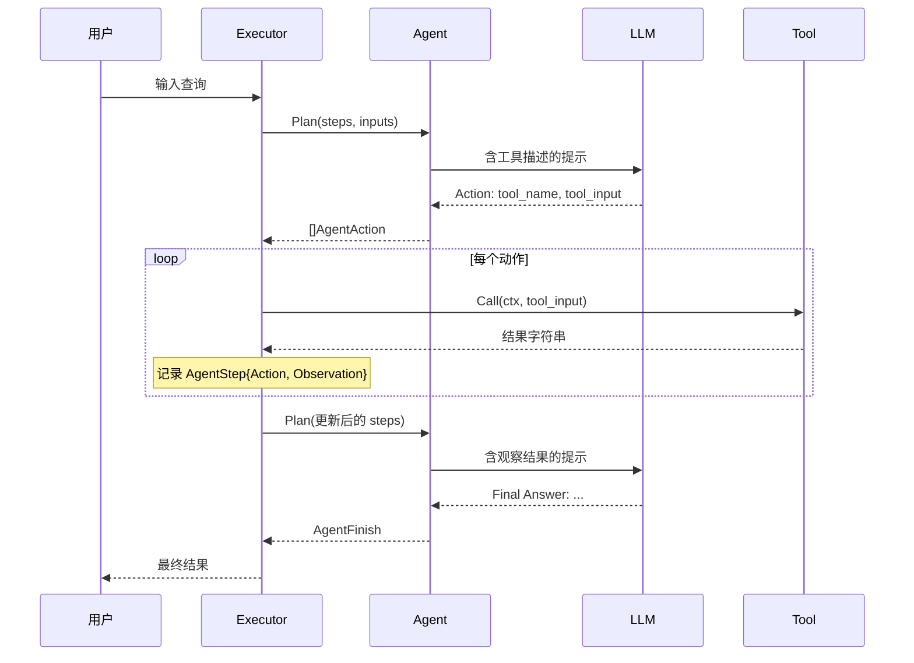

# 工具系统详解

langchaingo 的 tools 包定义了工具接口，并提供多种内置工具实现（搜索引擎、计算器、网页抓取、SQL 数据库等），供 Agent 在决策循环中调用。本文从源码层面深入解析 Tool 接口、内置工具和自定义 Tool 扩展。

---

## 1. Tool 接口

**源码位置**: tools/tool.go:1-10

```go
type Tool interface {
    Name() string
    Description() string
    Call(ctx context.Context, input string) (string, error)
}
```

三个方法：

- **Name** (): 返回工具名称，Agent 通过名称查找和调用工具。Executor 使用大写化映射（executor.go:197），实现大小写不敏感查找。
- **Description** (): 返回工具描述，注入到 Agent 的提示模板中（mrkl_prompt.go:59-66），LLM 根据描述选择合适工具。
- **Call** (): 执行工具逻辑，接受字符串输入，返回字符串结果。Agent 的 doAction 方法（executor.go:138）直接调用此方法。

---

## 2. 内置工具：Calculator

**源码位置**: tools/calculator.go:13-49

```go
type Calculator struct {
    CallbacksHandler callbacks.Handler
}
```

- Name(): 返回 "calculator"
- Description(): 数学表达式求值工具
- Call(): 使用 Starlark 评估器执行数学表达式（calculator.go:38）

错误处理：评估错误不返回 error，而是将错误信息作为字符串返回（calculator.go:40），允许 Agent 理解错误并重试。

---

## 3. 内置工具：SerpAPI (Google 搜索)

**源码位置**: tools/serpapi/serpapi.go:16-77

```go
type Tool struct {
    CallbacksHandler callbacks.Handler
    client           *internal.Client
}
```

- Name(): 返回 "GoogleSearch"
- Description(): Google 搜索包装器，用于回答当前事件问题
- New(): 创建工具，API Key 从 SERPAPI_API_KEY 环境变量读取（serpapi.go:26）
- Call(): 调用内部客户端搜索（serpapi.go:54-76），无结果时返回提示而非错误

---

## 4. 内置工具：DuckDuckGo 搜索

**源码位置**: tools/duckduckgo/ddg.go:17-83

```go
type Tool struct {
    CallbacksHandler callbacks.Handler
    client           *internal.Client
}
```

- Name(): 返回 "DuckDuckGo Search"
- Description(): 免费 Google/SerpAPI 替代方案
- New(maxResults int, userAgent string, opts ...Option): 初始化搜索工具（ddg.go:36-46）
- Call(): 执行搜索（ddg.go:62-83），无结果时返回提示

与 SerpAPI 的区别：无需 API Key，使用 DuckDuckGo 的免费搜索接口。

---

## 5. 内置工具：Wikipedia

**源码位置**: tools/wikipedia/wikipedia.go:23-130

```go
type Tool struct {
    CallbacksHandler callbacks.Handler
    TopK         int    // 搜索结果数（默认 2）
    DocMaxChars  int    // 每篇最大字符数（默认 2000）
    LanguageCode string // 语言代码（默认 "en"）
    UserAgent    string
    httpClient   *http.Client
}
```

- Name(): 返回 "Wikipedia"
- Description(): Wikipedia 包装器，回答关于人物、地点、事件等常识问题
- New(userAgent string, opts ...Option): 创建工具（wikipedia.go:51-64）
- Call(): 搜索 Wikipedia 并返回摘要文本（wikipedia.go:80-130）

---

## 6. 内置工具：SQL Database

**源码位置**: tools/sqldatabase/sql_database.go:47-154

```go
type SQLDatabase struct {
    Engine           Engine // 数据库引擎
    SampleRowsNumber int    // 示例行数（默认 3）
    allTables        []string
}
```

### Engine 接口 (sql_database.go:21-37)

```go
type Engine interface {
    Dialect() string
    Query(ctx context.Context, query string, args ...any) (cols []string, results [][]string, err error)
    TableNames(ctx context.Context) ([]string, error)
    TableInfo(ctx context.Context, tables string) (string, error)
    Close() error
}
```

支持三种数据库引擎：
- PostgreSQL (sqldatabase/postgresql/)
- MySQL (sqldatabase/mysql/)
- SQLite3 (sqldatabase/sqlite3/)

### 核心方法

- NewSQLDatabaseWithDSN(dialect, dsn, ignoreTables) (sql_database.go:76-86): 通过 DSN 创建
- TableInfo(ctx, tables) (sql_database.go:100-124): 返回建表语句 + 示例行
- Query(ctx, query) (sql_database.go:127-138): 执行 SQL 查询返回格式化结果

---

## 7. 内置工具：Web Scraper

**源码位置**: tools/scraper/scraper.go:26-253

```go
type Scraper struct {
    MaxDepth  int
    Parallels int
    Delay     int64
    Blacklist []string
    Async     bool
    MaxPages  int
}
```

- Name(): 返回 "Web Scraper"
- Description(): 扫描 URL 返回网页内容
- New(options ...Options) (scraper.go:45-68): 默认深度 1、并行 2、延迟 3 秒
- Call(): 使用 Colly 爬虫抓取网页（scraper.go:96-253），支持上下文取消

内置黑名单（scraper.go:52-60）：login、signup、signin、register、logout、download、redirect。

---

## 8. 内置工具：Metaphor API

**源码位置**: tools/metaphor/metaphor.go:19-254

```go
type API struct { client *metaphor.Client }
```

- Name(): 返回 "Metaphor API Tool"
- Description(): 神经搜索引擎，支持 Search/FindSimilar/GetContents 三种操作
- NewClient(): 从 METAPHOR_API_KEY 环境变量创建客户端
- Call(): 解析 JSON 输入执行对应操作（metaphor.go:166-187）

输入为 JSON 格式，包含 operation、input 和 reqOptions 字段。

---

## 9. 内置工具：Zapier NLA

**源码位置**: tools/zapier/zapier.go:18-124

```go
type Tool struct {
    CallbacksHandler callbacks.Handler
    client           *internal.Client
    name             string
    description      string
    actionID         string
    params           map[string]string
}
```

- Name(): 返回配置的名称
- Description(): 从模板生成描述（zapier.go:101-124）
- Call(): 通过客户端执行 Zapier Action（zapier.go:81-99）
- New(opts ToolOptions): 创建工具（zapier.go:46-71）

---

## 10. 内置工具：Perplexity AI

**源码位置**: tools/perplexity/perplexity.go:63-143

```go
type Tool struct {
    llm              *openai.LLM
    CallbacksHandler callbacks.Handler
}
```

- Name(): 返回 "PerplexityAI"
- Description(): AI 驱动的搜索引擎
- New(opts ...Option): 通过 OpenAI 兼容接口连接 Perplexity API（perplexity.go:71-103），默认使用 sonar 模型
- Call(): 发送查询并流式收集响应（perplexity.go:116-143）

支持模型：sonar（轻量搜索）、sonar-reasoning（推理）、sonar-deep-research（深度研究）。

---

## 11. 自定义 Tool 示例

实现 Tool 接口即可创建自定义工具：

```go
// 自定义天气查询工具
type WeatherTool struct{}

func (t WeatherTool) Name() string { return "weather" }

func (t WeatherTool) Description() string {
    return "查询指定城市的天气信息。输入应为城市名称。"
}

func (t WeatherTool) Call(ctx context.Context, input string) (string, error) {
    // 调用天气 API
    weather, err := fetchWeather(input)
    if err != nil {
        return "", err
    }
    return fmt.Sprintf("%s: %s, 温度 %.1fC", input, weather.Condition, weather.Temp), nil
}

// 注册到 Agent
tools := []tools.Tool{WeatherTool{}, tools.Calculator{}}
agent := agents.NewOneShotAgent(llm, tools)
executor := agents.NewExecutor(agent)
```

---

## 12. Tool 在 Agent 中的注册和使用

### 注册流程

1. 创建 Tool 列表：`tools := []tools.Tool{tool1, tool2}`
2. 传给 Agent 构造器：Agent 将工具列表保存在 Tools 字段（mrkl.go:55）
3. Agent.GetTools() 返回工具列表（mrkl.go:123-125）

### 运行时使用

1. Executor.Call 构建工具映射（executor.go:55, :190-201）
2. Agent.Plan 决策要调用的工具名和输入（mrkl.go:62-101）
3. Executor.doAction 根据工具名查找并调用（executor.go:120-147）
4. 工具结果作为 Observation 反馈给 Agent（executor.go:143-146）

### 工具名映射

getNameToTool（executor.go:190-201）将工具名转为大写作为 map 键，实现大小写不敏感查找。未找到工具时返回提示信息（executor.go:131-136），而非错误，允许 Agent 重试。

### 提示注入

toolNames（mrkl_prompt.go:47-57）和 toolDescriptions（mrkl_prompt.go:59-66）将工具信息注入 MRKL 提示模板：
- tool_names: 用逗号连接工具名（如 "calculator, GoogleSearch"）
- tool_descriptions: 格式化为 "- name: description" 列表


---

## 13. 工具选择机制详解

### MRKL 提示模板中的工具注入

Agent 使用 MRKL（Modular Reasoning, Knowledge and Language）模式进行工具选择。工具信息通过两个变量注入提示：

1. **tool_names** (mrkl_prompt.go:47-57): 将所有工具名用逗号连接，格式如 `"calculator, GoogleSearch, DuckDuckGo Search"`。LLM 必须从列表中选择工具。

2. **tool_descriptions** (mrkl_prompt.go:59-66): 格式化为 `"- name: description
"` 列表。LLM 根据描述理解工具功能，决定何时调用。

### OpenAI 函数调用中的工具注册

OpenAIFunctionsAgent 使用不同的工具注册机制（openai_functions_agent.go:52-68）：

```go
func (o *OpenAIFunctionsAgent) functions() []llms.FunctionDefinition {
    res := make([]llms.FunctionDefinition, 0)
    for _, tool := range o.Tools {
        res = append(res, llms.FunctionDefinition{
            Name:        tool.Name(),
            Description: tool.Description(),
            Parameters: map[string]any{
                "properties": map[string]any{
                    "__arg1": map[string]string{"title": "__arg1", "type": "string"},
                },
                "required": []string{"__arg1"},
                "type":     "object",
            },
        })
    }
    return res
}
```

每个工具被转为 FunctionDefinition，参数 Schema 统一为 `{"__arg1": string}`。LLM 返回结构化的函数调用而非文本解析。

### 工具结果反馈

工具执行结果通过两种方式反馈给 Agent：

1. **OneShotZeroAgent/ConversationalAgent**: 结果追加到 agent_scratchpad（mrkl.go:127-137），格式为 `"Action: ...
Observation: result"`

2. **OpenAIFunctionsAgent**: 结果转为 ToolChatMessage（openai_functions_agent.go:224-228），与 AIChatMessage（含 ToolCalls）配对，构建完整的对话历史

---

## 14. 工具调用流程图



---

## 15. 工具开发最佳实践

### Description 编写

Description 是 LLM 决定是否调用工具的唯一依据。好的描述应该：

1. 说明工具的功能和使用场景
2. 指明输入格式要求
3. 列出使用限制

示例对比：

```go
// 差的描述
func (t WeatherTool) Description() string { return "天气工具" }

// 好的描述
func (t WeatherTool) Description() string {
    return "查询指定城市的当前天气信息。输入应为城市英文名称，如 Beijing、New York。仅支持查询当前天气，不支持历史或预报数据。"
}
```

### 错误处理

工具的 Call 方法应避免返回 error，而应将错误信息作为字符串返回：

```go
func (t Tool) Call(ctx context.Context, input string) (string, error) {
    result, err := doWork(input)
    if err != nil {
        // 返回错误描述而非 error，让 Agent 理解失败原因
        return fmt.Sprintf("执行失败: %v", err), nil
    }
    return result, nil
}
```

Calculator 工具（calculator.go:40）和 SerpAPI 工具（serpapi.go:62-63）都采用此模式。

### 回调集成

支持 CallbacksHandler 的工具应在其关键操作前后触发回调：

```go
func (t Tool) Call(ctx context.Context, input string) (string, error) {
    if t.CallbacksHandler != nil {
        t.CallbacksHandler.HandleToolStart(ctx, input)
    }
    result, err := doWork(input)
    if err != nil {
        if t.CallbacksHandler != nil {
            t.CallbacksHandler.HandleToolError(ctx, err)
        }
        return "", err
    }
    if t.CallbacksHandler != nil {
        t.CallbacksHandler.HandleToolEnd(ctx, result)
    }
    return result, nil
}
```

所有内置工具（SerpAPI、DuckDuckGo、Wikipedia、Zapier、Perplexity）都遵循此模式。
