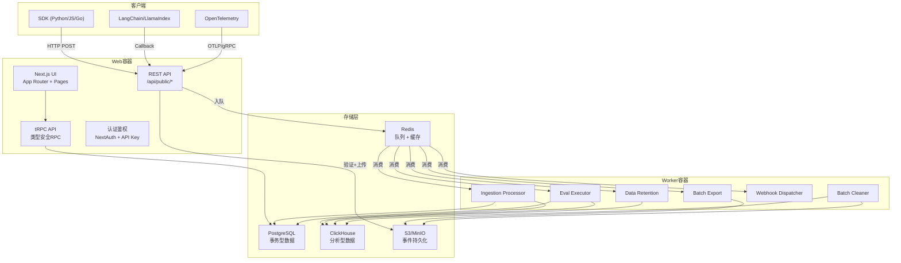
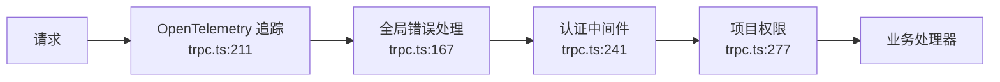
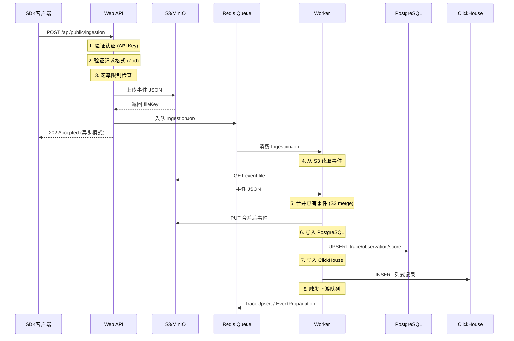
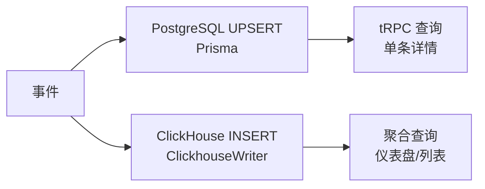
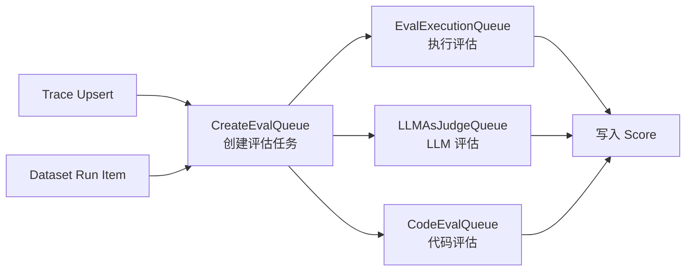
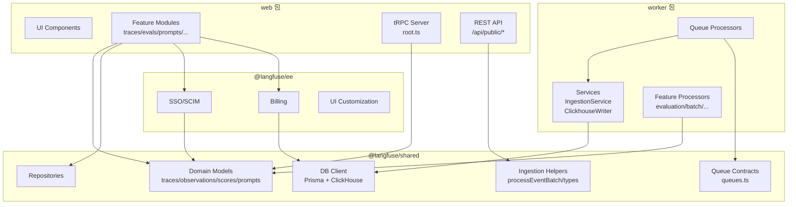

# Langfuse 整体架构

## 1. 系统架构图



## 2. 双容器架构

Langfuse 采用 Web + Worker 双容器部署模式，通过 Docker Compose 编排（`docker-compose.yml:7-88`）：

### 2.1 Web 容器 (`langfuse-web`)

**镜像**：`docker.io/langfuse/langfuse:3`（`docker-compose.yml:72`）

**职责**：
- 用户认证与会话管理（NextAuth.js）
- tRPC 全栈 API（类型安全的前后端通信）
- 公共 REST API（`/api/public/*`，SDK 入口）
- Next.js UI 渲染（App Router + Pages Router）
- 事件摄入的第一跳：验证 → S3 上传 → 入队

**关键模块**：

| 模块 | 路径 | 说明 |
|------|------|------|
| tRPC 上下文 | `web/src/server/api/trpc.ts:43` | 请求上下文创建，注入 session/prisma |
| tRPC 路由 | `web/src/server/api/root.ts:65` | 所有 Router 注册中心（30+ 路由） |
| 事件摄入 | `web/src/pages/api/public/ingestion.ts:50` | SDK 事件入口，验证+上传+入队 |
| 认证 | `web/src/server/auth.ts` | NextAuth 配置 |
| Feature 模块 | `web/src/features/` | 62 个功能模块（traces/evals/prompts 等） |

tRPC 中间件链提供多层保护（`trpc.ts:238-391`）：



### 2.2 Worker 容器 (`langfuse-worker`)

**镜像**：`docker.io/langfuse/langfuse-worker:3`（`docker-compose.yml:8`）

**职责**：
- BullMQ 队列消费者注册与执行
- 事件处理与数据库写入
- 评估执行（LLM-as-Judge / Code Eval）
- 批量导出与数据保留清理
- Webhook/Slack 通知分发

Worker 在 `app.ts:98` 创建 Express 应用，通过 `WorkerManager`（`worker/src/queues/workerManager.ts:20`）统一管理所有 BullMQ Worker 实例，每个 Worker 的注册均通过环境变量开关控制。

```typescript
// worker/src/app.ts:362-374 - Ingestion Queue 注册示例
if (env.QUEUE_CONSUMER_INGESTION_QUEUE_IS_ENABLED === "true") {
  const shardNames = IngestionQueue.getShardNames();
  shardNames.forEach((shardName) => {
    WorkerManager.register(
      shardName as QueueName,
      ingestionQueueProcessorBuilder(true),
      { concurrency: env.LANGFUSE_INGESTION_QUEUE_PROCESSING_CONCURRENCY },
    );
  });
}
```

## 3. 数据流模型

### 3.1 事件摄入流（核心数据路径）



事件摄入的三阶段处理（`web/src/pages/api/public/ingestion.ts:35-49`）：

1. **验证阶段**：认证鉴权、速率限制、请求格式校验
2. **异步处理**：S3 上传 + 入队（默认模式）
3. **同步兜底**：S3/队列不可用时，退回同步处理

`processEventBatch()` 函数（`packages/shared/src/server/ingestion/processEventBatch.ts:99`）统一处理批量事件，被 ingestion API 和 score API 复用。

### 3.2 队列延迟策略

为避免日期边界附近的事件乱序导致数据重复，系统在 UTC 23:45~00:15 之间自动增加队列延迟（`processEventBatch.ts:62-82`）：

```typescript
// processEventBatch.ts:70-71
if ((hours === 23 && minutes >= 45) || (hours === 0 && minutes <= 15)) {
  return env.LANGFUSE_INGESTION_QUEUE_DELAY_MS;
}
```

### 3.3 S3 事件合并

当同一实体（如同一 traceId）收到多次更新时，Worker 从 S3 读取已有事件、与新事件合并后写回 S3，确保：
- 不可变字段（id, project_id, timestamp）不被覆盖（`IngestionService/index.ts:85-100`）
- 可变字段（name, metadata, tags）以最新值为准

## 4. 数据库双写

### 4.1 PostgreSQL（事务型）

负责 ACID 事务场景的数据存储：

| 数据 | 说明 |
|------|------|
| User / Organization / Project | 用户与权限体系 |
| Prompt | 提示版本管理 |
| Dataset / DatasetItem | 评估数据集 |
| EvalTemplate / JobConfiguration | 评估配置 |
| ApiKey | API 密钥管理 |
| AnnotationQueue | 标注队列 |
| Automation / Webhook | 自动化规则 |

Prisma Schema 位于 `packages/shared/prisma/schema.prisma`，模型间关系如 User → OrganizationMembership → ProjectMembership 实现多租户 RBAC。

### 4.2 ClickHouse（分析型）

负责海量时序数据的列式存储与快速聚合：

| 表 | 说明 |
|------|------|
| traces | Trace 时序数据 |
| observations | Observation 时序数据 |
| scores | Score 时序数据 |
| dataset_run_items | Dataset 运行结果 |
| events_full / events_core | 统一事件表（实验性） |
| blob_storage_file_log | S3 文件索引 |

ClickHouse 迁移脚本位于 `packages/shared/clickhouse/migrations/{clustered,unclustered}/`，支持集群和非集群两种部署模式。

### 4.3 双写流程

Ingestion 处理器同时写入两个数据库（`worker/src/services/IngestionService/index.ts`）：



`ClickhouseWriter`（`worker/src/services/ClickhouseWriter/index.ts:32`）采用单例模式，内部维护按表名分类的内存队列，定期批量刷写：

```typescript
// ClickhouseWriter/index.ts:50-59 - 内部队列结构
this.queue = {
  [TableName.Traces]: [],
  [TableName.TracesNull]: [],
  [TableName.Scores]: [],
  [TableName.Observations]: [],
  [TableName.ObservationsBatchStaging]: [],
  [TableName.BlobStorageFileLog]: [],
  [TableName.DatasetRunItems]: [],
  [TableName.EventsFull]: [],
};
```

批量大小和刷写间隔分别由 `LANGFUSE_INGESTION_CLICKHOUSE_WRITE_BATCH_SIZE` 和 `LANGFUSE_INGESTION_CLICKHOUSE_WRITE_INTERVAL_MS` 环境变量控制（`ClickhouseWriter/index.ts:44-45`）。

### 4.4 ClickHouse 读取旁路缓存

Worker 启动时初始化 `ClickhouseReadSkipCache`（`app.ts:122`），在 ClickHouse 数据尚未同步时跳过读取，避免返回过时数据。
## 5. 队列系统

### 5.1 队列总览

所有队列名称定义在 `QueueName` 枚举中（`packages/shared/src/server/queues.ts:324-361`），队列 Payload 的 Zod Schema 定义在同一文件。

| 队列名 | 枚举值 | 用途 | 并发度 |
|--------|--------|------|--------|
| `IngestionQueue` | `ingestion-queue` | 事件摄入处理（S3 合并 + DB 写入） | 可配置 |
| `IngestionSecondaryQueue` | `secondary-ingestion-queue` | 高吞吐项目隔离 | 可配置 |
| `OtelIngestionQueue` | `otel-ingestion-queue` | OTLP 事件摄入 | 可配置 |
| `TraceUpsert` | `trace-upsert` | Trace 更新触发评估创建 | 可配置 |
| `EvaluationExecution` | `evaluation-execution-queue` | 评估执行 | 可配置 |
| `LLMAsJudgeExecution` | `llm-as-a-judge-execution-queue` | LLM-as-Judge 评估 | 可配置 |
| `CodeEvalExecution` | `code-eval-execution-queue` | 代码评估 | 可配置 |
| `BatchExport` | `batch-export-queue` | 批量数据导出 | 1 |
| `DataRetentionQueue` | `data-retention-queue` | 数据保留策略执行 | 1 |
| `BlobStorageIntegrationQueue` | `blobstorage-integration-queue` | S3 批量导出 | 1 |
| `WebhookQueue` | `webhook-queue` | Webhook 通知 | 可配置 |
| `EntityChangeQueue` | `entity-change-queue` | 实体变更通知 | 可配置 |
| `EventPropagationQueue` | `event-propagation-queue` | 事件传播（Events Table） | 1 |
| `NotificationQueue` | `notification-queue` | 站内通知 | 5 |
| `DeadLetterRetryQueue` | `dead-letter-retry-queue` | 死信重试 | 1 |
| `TraceDelete` | `trace-delete` | Trace 删除 | 可配置 |
| `ScoreDelete` | `score-delete` | Score 删除 | 可配置 |
| `DatasetDelete` | `dataset-delete-queue` | Dataset 删除 | 可配置 |
| `ProjectDelete` | `project-delete` | Project 删除 | 可配置 |
| `BatchActionQueue` | `batch-action-queue` | 批量操作 | 1 |
| `ExperimentCreate` | `experiment-create-queue` | 实验创建 | 可配置 |

### 5.2 分片队列

高吞吐队列支持分片，将负载分散到多个 Redis 队列：

```typescript
// worker/src/app.ts:364 - 获取所有分片名
const shardNames = IngestionQueue.getShardNames();
shardNames.forEach((shardName) => {
  WorkerManager.register(shardName as QueueName, processor, { concurrency });
});
```

支持分片的队列包括：`IngestionQueue`、`OtelIngestionQueue`、`TraceUpsertQueue`、`EvalExecutionQueue`、`LLMAsJudgeExecutionQueue`、`CodeEvalExecutionQueue`。

`WorkerManager`（`worker/src/queues/workerManager.ts:20`）为每个 Worker 包装指标采集（请求率、等待时间、队列深度），并通过 `SHARDED_QUEUE_BASE_NAMES`（`shardedQueueRegistry.ts:18`）识别分片队列。

### 5.3 次级队列

部分队列提供 Secondary 队列，将高吞吐项目的流量隔离到独立队列：

- `SecondaryIngestionQueue`（`queues.ts:337`）：隔离高吞吐摄入项目
- `SecondaryEvalExecutionQueue`（`queues.ts:329`）：隔离高吞吐评估项目
- `SecondaryOtelIngestionQueue`（`queues.ts:335`）：隔离高吞吐 OTLP 项目

次级队列项目列表通过 `LANGFUSE_SECONDARY_INGESTION_QUEUE_ENABLED_PROJECT_IDS` 环境变量配置（`ingestionQueue.ts:33`）。

### 5.4 评估队列流程

评估执行分为三个阶段（`worker/src/queues/evalQueue.ts`）：



- `evalJobTraceCreatorQueueProcessor`（`evalQueue.ts:25`）：Trace 更新时创建评估任务
- `evalJobDatasetCreatorQueueProcessor`（`evalQueue.ts:46`）：Dataset 运行时创建评估任务
- `evalJobExecutorQueueProcessorBuilder`：执行评估并写入 Score

### 5.5 队列指标

`WorkerManager.metricWrapper()`（`workerManager.ts:41`）为每个 Worker 自动采集：

- 请求计数（`.request`）
- 等待时间直方图（`.wait_time`）
- 队列深度（`.length`）
- 处理时间（`.duration`）

分片队列的指标采样率由 `LANGFUSE_QUEUE_METRICS_SAMPLE_RATE` 控制，降低高基数指标量（`workerManager.ts:72`）。

### 5.6 队列 Payload 契约

所有队列 Payload 均使用 Zod Schema 定义（`packages/shared/src/server/queues.ts`），确保编译时和运行时类型安全。核心 Payload 定义：

```typescript
// queues.ts:15-29 - Ingestion 事件 Payload
export const IngestionEvent = z.object({
  data: z.object({
    type: z.enum(Object.values(eventTypes)),
    eventBodyId: z.string(),
    fileKey: z.string().optional(),
    skipS3List: z.boolean().optional(),
    forwardToEventsTable: z.boolean().optional(),
  }),
  authCheck: z.object({
    validKey: z.literal(true),
    scope: z.object({ projectId: z.string() }),
  }),
});

// queues.ts:57-62 - Trace Upsert Payload
export const TraceQueueEventSchema = z.object({
  projectId: z.string(),
  traceId: z.string(),
  exactTimestamp: z.date().optional(),
  traceEnvironment: z.string().optional(),
});

// queues.ts:97-101 - Eval 执行 Payload
export const EvalExecutionEvent = z.object({
  projectId: z.string(),
  jobExecutionId: z.string(),
  delay: z.number().nullish(),
});
```

变更队列 Payload 时需同步更新：`queues.ts` Schema → `app.ts` 注册 → producer/consumer 代码 → 测试用例。

## 6. 模块依赖图



依赖方向严格保证：`shared` 不依赖 `web`/`worker`/`ee`，`ee` 仅依赖 `shared`。

## 7. 企业版 (`ee/`)

### 7.1 包结构

企业版功能以独立包形式提供（`ee/`），被 `web` 容器直接引用：

```
ee/
├── src/
│   ├── index.ts          # 企业版导出入口
│   ├── env.ts            # 企业版环境变量
│   └── ee-license-check/ # 许可证校验
└── package.json
```

### 7.2 企业版功能

| 功能 | 模块 | 说明 |
|------|------|------|
| 多租户 SSO | `ee/features/multi-tenant-sso/` | SAML/OIDC SSO 集成 |
| SCIM 用户同步 | `web/src/pages/api/public/scim/` | SCIM 2.0 协议支持 |
| RBAC 增强 | `web/src/features/rbac/` | 细粒度角色权限控制 |
| 计费管理 | `ee/features/billing/` | Stripe 集成、用量计量 |
| 消费告警 | `ee/features/billing/` | 消费阈值告警（`CloudSpendAlertQueue`） |
| 自定义域名 | `ee/features/verified-domains/` | 域名验证与绑定 |
| UI 定制 | `ee/features/ui-customization/` | 品牌 Logo/颜色自定义 |
| 数据遮掩 | `ee/ingestionMasking` | 摄入时的数据脱敏 |

### 7.3 企业版在 Worker 中的体现

Worker 中的企业版功能主要通过专用队列处理器实现：

- `cloudUsageMeteringQueueProcessor`（`app.ts:397`）：用量计量，需 Stripe Key
- `cloudSpendAlertQueueProcessor`（`app.ts:417`）：消费告警，需 Stripe Key
- `meteringDataPostgresExportProcessor`（`app.ts:168`）：计量数据导出

这些处理器通过 `STRIPE_SECRET_KEY` 和 `NEXT_PUBLIC_LANGFUSE_CLOUD_REGION` 环境变量控制启用。
