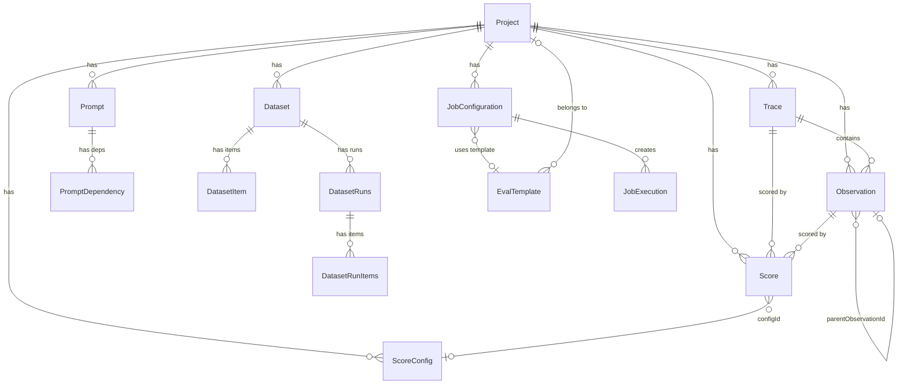

# 数据模型详解

Langfuse 的数据模型分布在三个层级：**Prisma Schema**（PostgreSQL）、**ClickHouse Schema** 和 **Domain 类型**。PostgreSQL 负责事务性写入和配置管理，ClickHouse 负责高吞吐分析查询，Domain 类型（Zod Schema）作为运行时的类型安全层横跨 `web` 和 `worker`。

---

## 1. Trace 模型

Trace 是 LLM 应用的顶层追踪单元，一次完整的用户请求对应一个 Trace。

### Prisma Schema（PostgreSQL）

定义在 `packages/shared/prisma/schema.prisma:326-355`，`LegacyPrismaTrace` 模型：

```prisma
model LegacyPrismaTrace {
  id         String   @id @default(cuid())
  externalId String?  @map("external_id")
  timestamp  DateTime @default(now())
  name       String?
  userId     String?  @map("user_id")
  metadata   Json?
  release    String?
  version    String?
  projectId  String   @map("project_id")
  public     Boolean  @default(false)
  bookmarked Boolean  @default(false)
  tags       String[] @default([])
  input      Json?
  output     Json?
  sessionId  String?  @map("session_id")
  createdAt  DateTime @default(now()) @map("created_at")
  updatedAt  DateTime @default(now()) @updatedAt @map("updated_at")
}
```

### ClickHouse Schema

定义在 `packages/shared/clickhouse/migrations/unclustered/0001_traces.up.sql:1-32`：

```sql
CREATE TABLE traces (
    `id` String,
    `timestamp` DateTime64(3),
    `name` String,
    `user_id` Nullable(String),
    `metadata` Map(LowCardinality(String), String),
    `release` Nullable(String),
    `version` Nullable(String),
    `project_id` String,
    `public` Bool,
    `bookmarked` Bool,
    `tags` Array(String),
    `input` Nullable(String) CODEC(ZSTD(3)),
    `output` Nullable(String) CODEC(ZSTD(3)),
    `session_id` Nullable(String),
    `created_at` DateTime64(3) DEFAULT now(),
    updated_at DateTime64(3) DEFAULT now(),
    `event_ts` DateTime64(3),
    `is_deleted` UInt8,
    INDEX idx_id id TYPE bloom_filter(0.001) GRANULARITY 1,
    INDEX idx_res_metadata_key mapKeys(metadata) TYPE bloom_filter(0.01) GRANULARITY 1,
    INDEX idx_res_metadata_value mapValues(metadata) TYPE bloom_filter(0.01) GRANULARITY 1
) ENGINE = ReplacingMergeTree(event_ts, is_deleted)
  Partition by toYYYYMM(timestamp)
  PRIMARY KEY (project_id, toDate(timestamp))
  ORDER BY (project_id, toDate(timestamp), id);
```

### ClickHouse vs PostgreSQL 关键差异

| 方面 | PostgreSQL (Prisma) | ClickHouse |
|------|---------------------|------------|
| 存储引擎 | PostgreSQL B-Tree | ReplacingMergeTree(event_ts, is_deleted) |
| metadata 类型 | Json | Map(LowCardinality(String), String) |
| input/output | Json | Nullable(String) CODEC(ZSTD(3)) |
| 版本控制 | updatedAt 字段 | event_ts 版本列 + is_deleted 软删除 |
| 分区策略 | 无 | toYYYYMM(timestamp) 按月分区 |
| 索引类型 | B-Tree/GIN | bloom_filter 跳数索引 |
| 适用场景 | 事务写入、配置管理 | 高吞吐分析查询 |

### Domain 类型

定义在 `packages/shared/src/domain/traces.ts:12-31`：

```typescript
// 元数据类型：字符串键到可空 JSON 值的映射
export const MetadataDomain = z.record(
  z.string(),
  jsonSchemaNullable.or(z.undefined()),
);

// Trace 运行时领域模型
export const TraceDomain = z.object({
  id: z.string(),
  name: z.string().nullable(),
  timestamp: z.date(),
  environment: z.string(),
  tags: z.array(z.string()),
  bookmarked: z.boolean(),
  public: z.boolean(),
  release: z.string().nullable(),
  version: z.string().nullable(),
  input: jsonSchema.nullable(),
  output: jsonSchema.nullable(),
  metadata: MetadataDomain,
  createdAt: z.date(),
  updatedAt: z.date(),
  sessionId: z.string().nullable(),
  userId: z.string().nullable(),
  projectId: z.string(),
});
```

---

## 2. Observation 类型体系

Observation 是 Trace 内的具体操作记录。Langfuse 定义了 **10 种 Observation 类型**。

### 枚举定义

`packages/shared/src/domain/observations.ts:5-16`：

```typescript
export const ObservationType = {
  SPAN: "SPAN",             // 通用耗时操作
  EVENT: "EVENT",           // 瞬时事件
  GENERATION: "GENERATION", // LLM 生成调用
  AGENT: "AGENT",           // Agent 执行
  TOOL: "TOOL",             // 工具调用
  CHAIN: "CHAIN",           // 链式调用
  RETRIEVER: "RETRIEVER",   // 检索器
  EVALUATOR: "EVALUATOR",   // 评估器
  EMBEDDING: "EMBEDDING",   // 嵌入生成
  GUARDRAIL: "GUARDRAIL",   // 安全护栏
} as const;
```

Prisma 枚举定义在 `schema.prisma:409-422`，与 Domain 类型一一对应。

### Generation-Like 类型

除 SPAN 和 EVENT 外，其余 8 种类型属于 **Generation-Like**（`observations.ts:137-146`），可能包含 LLM 调用相关的 input/output/model 字段：

```typescript
const GenerationLikeObservationTypes = [
  ObservationType.GENERATION,
  ObservationType.AGENT,
  ObservationType.TOOL,
  ObservationType.CHAIN,
  ObservationType.RETRIEVER,
  ObservationType.EVALUATOR,
  ObservationType.EMBEDDING,
  ObservationType.GUARDRAIL,
] as const;

export const isGenerationLike = (observationType: ObservationType): boolean => {
  return GenerationLikeObservationTypes.includes(observationType as any);
};
```

### Observation 层次结构

Observation 通过 `parentObservationId` 构建树形层次结构（`schema.prisma:367`，`0002_observations.up.sql:6` 均为 `Nullable(String)`）：

```
Trace (root)
+-- SPAN: 用户请求处理
|   +-- RETRIEVER: 文档检索
|   +-- GENERATION: LLM 生成
|       +-- TOOL: 函数调用
+-- EVALUATOR: 质量评估
```

### Observation Level

`observations.ts:32-44`：

```typescript
export const ObservationLevel = {
  DEBUG: "DEBUG",
  DEFAULT: "DEFAULT",
  WARNING: "WARNING",
  ERROR: "ERROR",
} as const;
```

---

## 3. Generation 详解

Generation 承载 LLM 调用的模型、用量和成本信息。

### ClickHouse 新版用量/成本字段

`0002_observations.up.sql:19-23` 及后续迁移：

```sql
-- Map 类型支持任意维度的用量/成本追踪
`provided_usage_details` Map(LowCardinality(String), UInt64),
`usage_details` Map(LowCardinality(String), UInt64),
`provided_cost_details` Map(LowCardinality(String), Decimal64(12)),
`cost_details` Map(LowCardinality(String), Decimal64(12)),
`total_cost` Nullable(Decimal64(12)),
```

迁移 `0031` 新增定价层（`0031_add_usage_pricing_tier_columns.up.sql:1-2`）：

```sql
ALTER TABLE observations ADD COLUMN usage_pricing_tier_id Nullable(String);
ALTER TABLE observations ADD COLUMN usage_pricing_tier_name Nullable(String);
```

迁移 `0033` 新增 Tool Call（`0033_add_tool_call_columns.up.sql:1-3`）：

```sql
ALTER TABLE observations ADD COLUMN tool_definitions Map(String, String) DEFAULT map();
ALTER TABLE observations ADD COLUMN tool_calls Array(String) DEFAULT [];
ALTER TABLE observations ADD COLUMN tool_call_names Array(String) DEFAULT [];
```

### Domain 类型关键字段

`observations.ts:55-103`：

```typescript
export const ObservationSchema = z.object({
  id: z.string(),
  traceId: z.string().nullable(),
  projectId: z.string(),
  environment: z.string(),
  type: ObservationTypeDomain,
  startTime: z.date(),
  endTime: z.date().nullable(),
  parentObservationId: z.string().nullable(),
  model: z.string().nullable(),
  internalModelId: z.string().nullable(),
  modelParameters: jsonSchema.nullable(),
  promptId: z.string().nullable(),
  promptName: z.string().nullable(),
  promptVersion: z.number().nullable(),
  latency: z.number().nullable(),
  timeToFirstToken: z.number().nullable(),
  providedUsageDetails: z.record(z.string(), z.number()),
  usageDetails: z.record(z.string(), z.number()),
  costDetails: z.record(z.string(), z.number()),
  providedCostDetails: z.record(z.string(), z.number()),
  inputCost: z.number().nullable(),
  outputCost: z.number().nullable(),
  totalCost: z.number().nullable(),
  inputUsage: z.number(),
  outputUsage: z.number(),
  totalUsage: z.number(),
  usagePricingTierId: z.string().nullable(),
  usagePricingTierName: z.string().nullable(),
  toolDefinitions: z.record(z.string(), z.string()).nullable(),
  toolCalls: z.array(z.string()).nullable(),
  toolCallNames: z.array(z.string()).nullable(),
});
```

---

## 4. Score 模型

Score 用于对 Trace/Observation 进行评分。

### 数据类型（dataType）

`scores.ts:46-61`：

```typescript
export const ScoreDataTypeArray = [
  "NUMERIC",      // 数值型
  "CATEGORICAL",  // 分类型
  "BOOLEAN",      // 布尔型
  "CORRECTION",   // 修正型（永远不关联 configId）
  "TEXT",         // 文本型（最长 500 字符）
] as const;
```

### 来源（source）

`scores.ts:4-9`：

```typescript
export const ScoreSourceArray = ["API", "EVAL", "ANNOTATION"] as const;
```

- **API**：通过 SDK/REST API 直接创建
- **EVAL**：由自动化评估器产生
- **ANNOTATION**：由人工标注产生，必须关联 configId（CORRECTION 例外，`scores.ts:30-40`）

### ScoreConfig 模型

`schema.prisma:474-504`：

```prisma
model ScoreConfig {
  id          String              @id @default(cuid())
  projectId   String              @map("project_id")
  name        String
  dataType    ScoreConfigDataType @map("data_type")
  isArchived  Boolean             @default(false) @map("is_archived")
  minValue    Float?              @map("min_value")
  maxValue    Float?              @map("max_value")
  categories  Json?               @map("categories")
  description String?
}

enum ScoreConfigDataType { CATEGORICAL; NUMERIC; BOOLEAN; TEXT }
```

### ClickHouse Schema

`0003_scores.up.sql` 及后续迁移综合字段：

```sql
CREATE TABLE scores (
    `id` String, `timestamp` DateTime64(3), `project_id` String,
    `trace_id` String, `observation_id` Nullable(String),
    `name` String, `value` Float64, `source` String,
    `comment` Nullable(String) CODEC(ZSTD(1)),
    `author_user_id` Nullable(String), `config_id` Nullable(String),
    `data_type` String, `string_value` Nullable(String),
    `queue_id` Nullable(String),
    `execution_trace_id` Nullable(String),     -- 迁移 0030
    `long_string_value` String CODEC(ZSTD(3)), -- 迁移 0034
    `created_at` DateTime64(3) DEFAULT now(),
    `updated_at` DateTime64(3) DEFAULT now(),
    event_ts DateTime64(3), `is_deleted` UInt8
) ENGINE = ReplacingMergeTree(event_ts, is_deleted)
  Partition by toYYYYMM(timestamp)
  PRIMARY KEY (project_id, toDate(timestamp), name)
  ORDER BY (project_id, toDate(timestamp), name, id);
```

### 可聚合与可列出的 Score 类型

`scores.ts:148-170`：

```typescript
// 可聚合的 Score 类型（排除 CORRECTION 和 TEXT）
export const AGGREGATABLE_SCORE_TYPES = ["NUMERIC", "BOOLEAN", "CATEGORICAL"];
// 可列出的 Score 类型（排除 CORRECTION）
export const LISTABLE_SCORE_TYPES = ["NUMERIC", "BOOLEAN", "CATEGORICAL", "TEXT"];
```

---

## 5. Prompt 模型

### Prisma Schema

`schema.prisma:759-786`：

```prisma
model Prompt {
  id            String   @id @default(cuid())
  projectId     String   @map("project_id")
  createdBy     String   @map("created_by")
  prompt        Json
  name          String
  version       Int
  type          String   @default("text")  // "text" 或 "chat"
  isActive      Boolean? @map("is_active") // 已废弃
  config        Json     @default("{}") @db.Json
  tags          String[] @default([])
  labels        String[] @default([])
  commitMessage String?  @map("commit_message")
  PromptDependency PromptDependency[]
  @@unique([projectId, name, version])
}
```

### Label 系统

`packages/shared/src/features/prompts/constants.ts:1-16`：

```typescript
export const PRODUCTION_LABEL = "production";    // 生产环境标签
export const LATEST_PROMPT_LABEL = "latest";     // 最新版本标签
export const COMMIT_MESSAGE_MAX_LENGTH = 500;
export const PROMPT_LABEL_MAX_LENGTH = 36;
export const PROMPT_LABEL_REGEX = /^[a-z0-9_\\-.]+$/;
```

### PromptDependency

`schema.prisma:788-806`，支持 Prompt 之间的父子依赖关系：

```prisma
model PromptDependency {
  id          String   @id @default(cuid())
  projectId   String   @map("project_id")
  parentId    String   @map("parent_id")
  parent      Prompt   @relation(fields: [parentId], references: [id], onDelete: Cascade)
  childName   String   @map("child_name")
  childLabel  String?  @map("child_label")
  childVersion Int?    @map("child_version")
}
```

---

## 6. Dataset 模型

### Prisma Schema

`schema.prisma:585-682`：

```prisma
model Dataset {
  id                   String        @default(cuid())
  projectId            String        @map("project_id")
  name                 String
  description          String?
  metadata             Json?
  inputSchema          Json?         @map("input_schema") @db.Json
  expectedOutputSchema Json?         @map("expected_output_schema") @db.Json
  datasetItems         DatasetItem[]
  datasetRuns          DatasetRuns[]
  @@id([id, projectId])
  @@unique([projectId, name])
}
```

### DatasetItem 版本化

`schema.prisma:609-636`，通过 validFrom/validTo 实现：

```prisma
model DatasetItem {
  id                  String         @default(cuid())
  projectId           String         @map("project_id")
  status              DatasetStatus? @default(ACTIVE)
  input               Json?
  expectedOutput      Json?          @map("expected_output")
  metadata            Json?
  sourceTraceId       String?        @map("source_trace_id")
  sourceObservationId String?        @map("source_observation_id")
  datasetId           String         @map("dataset_id")
  validFrom           DateTime       @default(now()) @map("valid_from")
  validTo             DateTime?      @map("valid_to")
  isDeleted           Boolean        @default(false) @map("is_deleted")
  @@id([id, projectId, validFrom])
}

enum DatasetStatus { ACTIVE; ARCHIVED }
```

**版本化机制**：
- 修改 DatasetItem 时，旧版本的 `validTo` 被设置，新版本以新 `validFrom` 插入
- `@@id([id, projectId, validFrom])` 使同一逻辑项可有多个版本
- 查询当前版本：`WHERE validTo IS NULL AND isDeleted = false`

### DatasetRuns 和 DatasetRunItems

`schema.prisma:643-682`：

```prisma
model DatasetRuns {
  id              String            @default(cuid())
  projectId       String            @map("project_id")
  name            String
  description     String?
  metadata        Json?
  datasetId       String            @map("dataset_id")
  datasetRunItems DatasetRunItems[]
  @@id([id, projectId])
  @@unique([datasetId, projectId, name])
}

model DatasetRunItems {
  id            String      @default(cuid())
  projectId     String      @map("project_id")
  datasetRunId  String      @map("dataset_run_id")
  datasetRun    DatasetRuns @relation(...)
  datasetItemId String      @map("dataset_item_id")
  traceId       String      @map("trace_id")
  observationId String?     @map("observation_id")
  @@id([id, projectId])
}
```

---

## 7. Mermaid ER 图 - 核心模型关系



---

## 8. ClickHouse vs PostgreSQL 使用场景总结

| 场景 | PostgreSQL | ClickHouse |
|------|-----------|-----------|
| 配置数据（ScoreConfig, EvalTemplate, JobConfiguration 等） | ✓ 主存储 | ✗ 不存储 |
| 追踪数据（Trace, Observation） | 仅历史兼容 | ✓ 主存储 |
| 评分数据（Score） | 仅历史兼容 | ✓ 主存储 |
| 分析查询 | 受限 | ✓ 高性能 |
| 事务操作 | ✓ ACID | 最终一致性 |
| 实时更新 | ✓ 即时 | ReplacingMergeTree 异步合并 |
| 软删除 | 不支持 | ✓ is_deleted 字段 |
