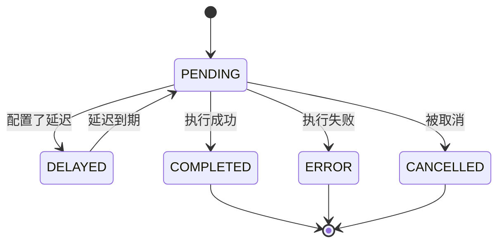
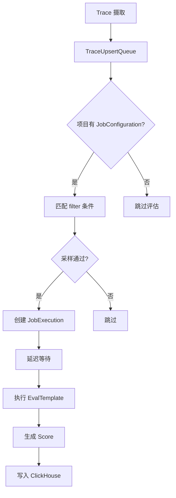

# 评估系统详解

Langfuse 的评估系统提供了自动化和人工两种评估方式，支持 LLM-as-Judge、自定义代码评估、人工标注等多种模式。评估结果以 Score 的形式存储，可与 Trace 和 Observation 关联。

---

## 1. EvalTemplate

**源文件**: `packages/shared/prisma/schema.prisma:916-944`

EvalTemplate 是评估模板的数据库模型，定义了评估的执行方式：

| 字段 | 类型 | 说明 |
|------|------|------|
| `id` | String (cuid) | 主键 |
| `projectId` | String? | 所属项目 ID |
| `name` | String | 模板名称 |
| `version` | Int | 版本号 |
| `prompt` | String? | LLM 提示词模板（LLM_AS_JUDGE 类型使用） |
| `type` | EvalTemplateType | 模板类型：LLM_AS_JUDGE 或 CODE |
| `partner` | String? | 合作方标识（如 ragas） |
| `model` | String? | 使用的 LLM 模型名 |
| `provider` | String? | LLM 提供商 |
| `modelParams` | Json? | 模型参数 |
| `vars` | String[] | 模板变量列表 |
| `outputDefinition` | Json? | 输出定义（输出 schema） |
| `sourceCode` | String? | 自定义代码（CODE 类型使用，最大 262144 字符） |
| `sourceCodeLanguage` | EvalTemplateSourceCodeLanguage? | 代码语言：PYTHON 或 TYPESCRIPT |

唯一约束：`(projectId, name, version)`

### 1.1 EvalTemplateType 枚举

定义在 `schema.prisma:946-949`：

| 值 | 说明 |
|----|------|
| `LLM_AS_JUDGE` | 使用 LLM 作为评判者，通过提示词模板进行评估 |
| `CODE` | 自定义代码评估，支持 Python 和 TypeScript |

---

## 2. JobConfiguration

**源文件**: `packages/shared/prisma/schema.prisma:976-1003`

JobConfiguration 是评估任务配置，定义了何时、如何执行评估：

| 字段 | 类型 | 说明 |
|------|------|------|
| `id` | String (cuid) | 主键 |
| `projectId` | String | 所属项目 ID |
| `jobType` | JobType | 作业类型：EVAL |
| `status` | JobConfigState | 状态：ACTIVE 或 INACTIVE |
| `blockedAt` | DateTime? | 阻塞时间 |
| `blockReason` | EvaluatorBlockReason? | 阻塞原因 |
| `evalTemplateId` | String? | 关联的评估模板 ID |
| `scoreName` | String | 评分名称 |
| `filter` | Json | 过滤条件（定义哪些 Trace/Observation 触发评估） |
| `targetObject` | String | 目标对象类型 |
| `variableMapping` | Json | 变量映射（将 Trace/Observation 字段映射到模板变量） |
| `sampling` | Decimal | 采样率（0..1，控制执行的评估比例） |
| `delay` | Int | 延迟执行时间（毫秒） |
| `timeScope` | String[] | 时间范围：[NEW] 默认仅评估新事件 |

### 2.1 EvaluatorBlockReason 枚举

定义在 `schema.prisma:967-974`：

| 值 | 说明 |
|----|------|
| `LLM_CONNECTION_AUTH_INVALID` | LLM 连接认证无效 |
| `LLM_CONNECTION_MISSING` | LLM 连接缺失 |
| `DEFAULT_EVAL_MODEL_MISSING` | 默认评估模型缺失 |
| `EVAL_MODEL_CONFIG_INVALID` | 评估模型配置无效 |
| `EVAL_MODEL_UNAVAILABLE` | 评估模型不可用 |
| `PROVIDER_ACCOUNT_NOT_READY` | 提供商账号未就绪 |

---

## 3. JobExecution

**源文件**: `packages/shared/prisma/schema.prisma:1013-1050`

JobExecution 是评估执行记录，跟踪每次评估的执行状态：

| 字段 | 类型 | 说明 |
|------|------|------|
| `id` | String (cuid) | 主键 |
| `projectId` | String | 所属项目 ID |
| `jobConfigurationId` | String | 关联的 JobConfiguration ID |
| `jobTemplateId` | String? | 关联的 EvalTemplate ID |
| `status` | JobExecutionStatus | 执行状态 |
| `startTime` | DateTime? | 开始时间 |
| `endTime` | DateTime? | 结束时间 |
| `error` | String? | 错误信息 |
| `jobInputTraceId` | String? | 输入 Trace ID |
| `jobInputObservationId` | String? | 输入 Observation ID |
| `jobInputDatasetItemId` | String? | 输入数据集项 ID |
| `jobOutputScoreId` | String? | 输出 Score ID |
| `executionTraceId` | String? | 执行 Trace ID |

### 3.1 执行状态机

JobExecutionStatus 枚举定义在 `schema.prisma:1005-1011`：



---

## 4. LLM-as-Judge

LLM-as-Judge 是最常用的评估模式。其工作流程为：

1. **模板定义**: 在 EvalTemplate 中定义 prompt 模板，包含变量占位符
2. **模型选择**: 配置 `model` 和 `provider` 字段指定使用的 LLM
3. **变量映射**: 通过 JobConfiguration 的 `variableMapping` 将 Trace/Observation 的字段映射到模板变量
4. **执行**: Worker 使用配置的 LLM 执行评估，生成评分
5. **结果**: 评估结果以 Score 形式存储，关联到对应的 Trace/Observation

提示词模板示例：

```
请评估以下对话的质量。
输入: {{input}}
输出: {{output}}
评分标准: ...
```

---

## 5. Code Eval

自定义代码评估允许用户编写 Python 或 TypeScript 代码来执行评估逻辑：

- `sourceCode` 字段存储评估代码（最大 262144 字符）
- `sourceCodeLanguage` 指定代码语言（PYTHON 或 TYPESCRIPT）
- 代码可以访问 Trace/Observation 的数据，并返回评分结果
- 评估代码在沙箱环境中执行，确保安全性

---

## 6. ScoreConfig

**源文件**: `packages/shared/src/domain/score-configs.ts`

ScoreConfig 定义了评分的配置规则，包括数据类型、范围和分类选项：

### 6.1 四种评分配置类型

ScoreConfigSchema 使用 `z.discriminatedUnion` 按 `dataType` 字段区分四种类型（`score-configs.ts:117-136`）：

| 类型 | dataType | 特有字段 | 说明 |
|------|----------|---------|------|
| NUMERIC | `NUMERIC` | `maxValue`, `minValue` | 数值评分，可设置范围。maxValue 必须大于 minValue |
| CATEGORICAL | `CATEGORICAL` | `categories` | 分类评分，必须提供不重复的标签和数值对 |
| BOOLEAN | `BOOLEAN` | `categories` (固定2项) | 布尔评分，固定分类: True(1) / False(0) |
| TEXT | `TEXT` | 无 | 文本评分，无额外配置 |

### 6.2 公共字段

所有 ScoreConfig 共享以下基础字段（`score-configs.ts:89-97`）：

| 字段 | 类型 | 说明 |
|------|------|------|
| `id` | String | 主键 |
| `name` | String | 配置名称（1-35字符，支持 Unicode 字母/数字/下划线/空格等） |
| `isArchived` | Boolean | 是否已归档 |
| `description` | String? | 描述 |
| `createdAt` | Date | 创建时间 |
| `updatedAt` | Date | 更新时间 |
| `projectId` | String | 所属项目 ID |

### 6.3 分类验证

CATEGORICAL 类型的 `categories` 字段使用 `validateCategories` 函数验证（`score-configs.ts:47-73`）：

- 标签（label）必须唯一
- 数值（value）必须唯一

---

## 7. Annotation Queue

**源文件**: `packages/shared/prisma/schema.prisma:506-574`

Annotation Queue 是人工标注流程的核心组件：

### 7.1 AnnotationQueue

| 字段 | 类型 | 说明 |
|------|------|------|
| `id` | String (cuid) | 主键 |
| `name` | String | 队列名称（项目内唯一） |
| `description` | String? | 描述 |
| `scoreConfigIds` | String[] | 关联的评分配置 ID 列表 |
| `projectId` | String | 所属项目 ID |

### 7.2 AnnotationQueueItem

| 字段 | 类型 | 说明 |
|------|------|------|
| `id` | String (cuid) | 主键 |
| `queueId` | String | 所属队列 ID |
| `objectId` | String | 标注对象 ID |
| `objectType` | AnnotationQueueObjectType | 对象类型：TRACE / OBSERVATION / SESSION |
| `status` | AnnotationQueueStatus | 状态：PENDING / COMPLETED |
| `lockedAt` | DateTime? | 锁定时间 |
| `lockedByUserId` | String? | 锁定用户 ID |
| `annotatorUserId` | String? | 标注者用户 ID |
| `completedAt` | DateTime? | 完成时间 |

### 7.3 AnnotationQueueAssignment

| 字段 | 类型 | 说明 |
|------|------|------|
| `projectId` | String | 项目 ID |
| `userId` | String | 用户 ID |
| `queueId` | String | 队列 ID |

唯一约束：`(projectId, queueId, userId)`

---

## 8. Dataset 评估

Dataset 评估允许在数据集上运行实验并比较结果：

### 8.1 DatasetRuns

**源文件**: `schema.prisma:643-661`

| 字段 | 类型 | 说明 |
|------|------|------|
| `id` | String (cuid) | 主键（与 projectId 组合） |
| `name` | String | 运行名称 |
| `description` | String? | 描述 |
| `metadata` | Json? | 元数据 |
| `datasetId` | String | 关联数据集 ID |
唯一约束：`(datasetId, projectId, name)`

### 8.2 DatasetRunItems

**源文件**: `schema.prisma:663-682`

| 字段 | 类型 | 说明 |
|------|------|------|
| `id` | String (cuid) | 主键（与 projectId 组合） |
| `datasetRunId` | String | 所属运行 ID |
| `datasetItemId` | String | 数据集项 ID |
| `traceId` | String | 关联的 Trace ID |
| `observationId` | String? | 关联的 Observation ID |

### 8.3 摄取流程

DatasetRunItem 通过 `DATASET_RUN_ITEM_CREATE` 事件类型创建（`types.ts:578-594`），在 IngestionService 中处理时（`index.ts:395-487`）：

1. 从 Postgres 查找 DatasetRun 和 DatasetItem 的信息
2. 丰富记录：添加运行名称、描述、元数据，以及数据集项的输入、预期输出、元数据
3. 写入 ClickHouse 的 `DatasetRunItems` 表

---

## 9. 自动化评估

自动化评估由三个核心组件协同工作：



### 9.1 三件套关系

**JobConfiguration + ScoreConfig + EvalTemplate** 构成自动化评估的三件套：

1. **EvalTemplate**: 定义评估的执行方式（LLM 提示词或代码）
2. **JobConfiguration**: 定义评估的触发条件、采样率、延迟等
3. **ScoreConfig**: 定义评分的数据类型和范围，确保评估结果的一致性

三者的关联关系：
- JobConfiguration 通过 `evalTemplateId` 关联 EvalTemplate
- JobConfiguration 通过 `scoreName` 隐式关联同名的 ScoreConfig
- JobExecution 通过 `jobOutputScoreId` 关联最终的 Score

### 9.2 触发流程

当 Trace 写入 ClickHouse 后，IngestionService 会检查项目是否有活跃的 JobConfiguration（`index.ts:706-734`）：

1. 首先通过 `hasNoEvalConfigsCache` 检查缓存，如果项目没有任何 JobConfiguration，直接跳过
2. 如果有，将 Trace ID 推入 `TraceUpsertQueue`
3. TraceUpsert Worker 消费消息后，匹配 filter 条件、采样、延迟等待
4. 创建 JobExecution 并执行评估
5. 评估结果以 Score 形式写入（source 为 EVAL）

