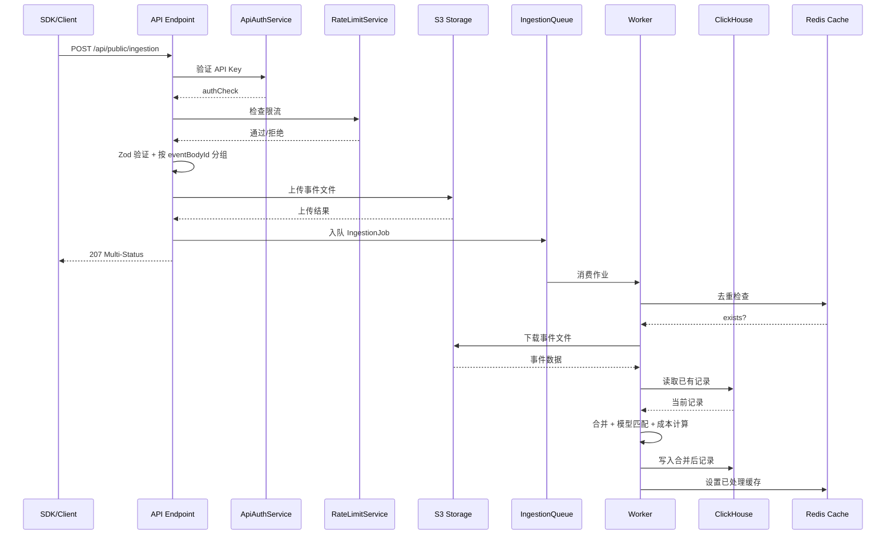

# 摄取管道详解

Langfuse 的摄取管道（Ingestion Pipeline）是整个平台的数据入口，负责接收 SDK 发送的事件、验证、持久化、排队和最终写入 ClickHouse。该管道采用异步架构，通过 S3 作为事件缓存、Redis BullMQ 作为消息队列，实现了高吞吐、可扩展的数据处理能力。

---

## 1. API 端点

**源文件**: `web/src/pages/api/public/ingestion.ts`

### 1.1 请求配置

API 端点对请求体大小有限制，配置为 4.5MB（`ingestion.ts:27-32`）：

```typescript
// 请求体大小限制（ingestion.ts:26-32）
export const config = {
  api: {
    bodyParser: {
      sizeLimit: "4.5mb",
    },
  },
};
```

### 1.2 认证流程

所有摄取请求必须通过认证，流程如下（`ingestion.ts:76-94`）：

1. **API Key 验证**: 通过 `ApiAuthService.verifyAuthHeaderAndReturnScope` 解析 Authorization 请求头，返回 `authCheck` 对象
2. **ProjectId 检查**: 验证 `authCheck.scope.projectId` 是否存在，组织级密钥不允许直接摄取
3. **暂停状态检查**: 如果项目的 `isIngestionSuspended` 为 true，抛出 `ForbiddenError`，提示用量超限

```typescript
// 认证验证核心逻辑（ingestion.ts:76-94）
const authCheck = await new ApiAuthService(prisma, redis)
  .verifyAuthHeaderAndReturnScope(req.headers.authorization);

if (!authCheck.validKey) throw new UnauthorizedError(authCheck.error);
if (!authCheck.scope.projectId) throw new UnauthorizedError("Missing projectId");
if (authCheck.scope.isIngestionSuspended) throw new ForbiddenError("Usage threshold exceeded");
```

### 1.3 限流机制

认证通过后，进入限流检查（`ingestion.ts:104-117`）。使用 `RateLimitService` 对 `ingestion` 操作进行限流。如果限流服务本身出错，采用 **fail-open** 策略（即放行请求而非拒绝），确保可用性。

### 1.4 批量处理与验证

请求体必须符合 `{ batch: unknown[], metadata?: Json }` 格式（`ingestion.ts:119-132`）。使用 Zod 进行验证，验证失败返回 400 错误。验证通过后调用 `processEventBatch` 进入异步处理流水线。API 返回 **207 Multi-Status**（`ingestion.ts:139`）。

### 1.5 Header 传播

请求中的 `x-langfuse-*` 和 `x_langfuse_*` 请求头会被提取并附加到 OpenTelemetry Span 属性中（`ingestion.ts:61-71`），用于链路追踪。

---

## 2. 事件类型

**源文件**: `packages/shared/src/server/ingestion/types.ts`

### 2.1 事件类型枚举

Langfuse 定义了以下事件类型（`types.ts:259-279`）：

| 事件类型 | 字符串值 | 说明 |
|---------|---------|------|
| `TRACE_CREATE` | `trace-create` | 创建 Trace |
| `SCORE_CREATE` | `score-create` | 创建评分 |
| `EVENT_CREATE` | `event-create` | 创建 Event（无时长观察） |
| `SPAN_CREATE` | `span-create` | 创建 Span |
| `SPAN_UPDATE` | `span-update` | 更新 Span |
| `GENERATION_CREATE` | `generation-create` | 创建 Generation（LLM 调用） |
| `GENERATION_UPDATE` | `generation-update` | 更新 Generation |
| `AGENT_CREATE` | `agent-create` | 创建 Agent |
| `TOOL_CREATE` | `tool-create` | 创建 Tool |
| `CHAIN_CREATE` | `chain-create` | 创建 Chain |
| `RETRIEVER_CREATE` | `retriever-create` | 创建 Retriever |
| `EVALUATOR_CREATE` | `evaluator-create` | 创建 Evaluator |
| `EMBEDDING_CREATE` | `embedding-create` | 创建 Embedding |
| `GUARDRAIL_CREATE` | `guardrail-create` | 创建 Guardrail |
| `SDK_LOG` | `sdk-log` | SDK 日志（仅记录，不进一步处理） |
| `DATASET_RUN_ITEM_CREATE` | `dataset-run-item-create` | 创建数据集运行项 |
| `OBSERVATION_CREATE` | `observation-create` | 遗留：创建观察 |
| `OBSERVATION_UPDATE` | `observation-update` | 遗留：更新观察 |

### 2.2 ClickHouse 实体映射

事件类型会被映射为 ClickHouse 中的实体类型（`schemaUtils.ts:17-50`）：

- `TRACE_CREATE` -> `trace`
- 所有观察类事件（SPAN/GENERATION/AGENT/TOOL/CHAIN/RETRIEVER/EVALUATOR/EMBEDDING/GUARDRAIL 及其 CREATE/UPDATE）-> `observation`
- `SCORE_CREATE` -> `score`
- `DATASET_RUN_ITEM_CREATE` -> `dataset_run_item`
- `SDK_LOG` -> `sdk_log`

### 2.3 事件 Schema 工厂

所有事件 Schema 由 `createAllIngestionSchemas` 工厂函数生成（`types.ts:395-755`），支持公开和内部两种模式：

- **公开模式** (`isPublic: true`): 环境名称验证更严格，自动剥离 `langfuse` 前缀，限制为 `a-z0-9-_`，截断至 40 字符
- **内部模式** (`isPublic: false`): 环境名称验证更宽松，用于 Langfuse 内部创建的 trace（如 Prompt 实验）

最终通过 `createIngestionEventSchema(isLangfuseInternal)` 获取对应的 Schema（`types.ts:820-824`）。

### 2.4 Usage 模型

Usage Schema 支持两种格式（`types.ts:30-69`）：

1. **标准格式**: `input`/`output`/`total`/`unit`
2. **OpenAI 格式**: `promptTokens`/`completionTokens`/`totalTokens`（自动转换为标准格式，单位默认为 `TOKENS`）

此外，`UsageDetails` 支持 OpenAI Completion API 和 Response API 两种详细用量格式（`types.ts:108-223`），会自动解析 `prompt_tokens_details` 和 `completion_tokens_details`。

### 2.5 Score 事件数据类型

Score 事件支持 6 种数据类型（`types.ts:528-576`）：

| dataType | 值类型 | 说明 |
|----------|-------|------|
| `NUMERIC` | `number` | 数值评分 |
| `CATEGORICAL` | `string` | 分类评分 |
| `BOOLEAN` | `0 或 1` | 布尔评分 |
| `CORRECTION` | `string` | 修正评分（不可关联 configId） |
| `TEXT` | `string` | 文本评分（最大长度有限制） |
| `undefined` | `string 或 number` | 遗留无类型评分 |

---

## 3. S3 持久化

**源文件**: `packages/shared/src/server/ingestion/processEventBatch.ts`

### 3.1 上传路径

事件按 `eventBodyId` 分组后上传到 S3，路径格式如下（`processEventBatch.ts:237`）：

```
{prefix}/{projectId}/{entityType}/{eventBodyId}/{eventId}.json
```

其中：
- `prefix`: 环境变量 `LANGFUSE_S3_EVENT_UPLOAD_PREFIX`
- `projectId`: 认证范围中的项目 ID
- `entityType`: ClickHouse 实体类型（trace/observation/score/dataset_run_item）
- `eventBodyId`: 事件体中的 `id` 字段（即实体 ID）
- `eventId`: 事件的外层 `id` 字段（即事件 ID，作为文件键）

### 3.2 分组逻辑

同一 `eventBodyId` 的多个事件会被合并为一个 JSON 数组上传到同一个 S3 文件（`processEventBatch.ts:192-221`）。分组键为 `{entityType}-{eventBodyId}`，同一分组内的事件共享一个 S3 文件。

### 3.3 S3 上传容错

S3 上传使用 `Promise.allSettled` 并行上传（`processEventBatch.ts:231-265`）。如果发生 S3 SlowDown 错误，会标记项目以路由到二级队列。如果任何上传失败，整个批次会被拒绝（`processEventBatch.ts:268-272`）。

### 3.4 采样

在入队前，会通过 `isTraceIdInSample` 检查事件是否命中采样（`processEventBatch.ts:300-319`）。未命中的事件直接丢弃，不进入后续处理。

---

## 4. 队列处理

**源文件**: `worker/src/queues/ingestionQueue.ts`

### 4.1 队列架构

摄取队列基于 BullMQ 实现，支持分片（`packages/shared/src/server/redis/ingestionQueue.ts`）：

- **IngestionQueue**: 主摄取队列，分片数由 `LANGFUSE_INGESTION_QUEUE_SHARD_COUNT` 控制
- **SecondaryIngestionQueue**: 二级队列，用于 S3 SlowDown 场景，分片数由 `LANGFUSE_INGESTION_SECONDARY_QUEUE_SHARD_COUNT` 控制
- 分片键为 `{projectId}-{eventBodyId}`，确保同一实体的更新路由到同一分片

队列默认配置（`ingestionQueue.ts:73-82`）：最大重试次数 6，退避策略为指数退避，初始延迟 5 秒。

### 4.2 Worker 处理流程

Worker 收到作业后的处理步骤如下：

#### 步骤 1: 设置追踪属性

将作业 ID、项目 ID、事件体 ID、类型和文件键附加到 OpenTelemetry Span（`ingestionQueue.ts:38-57`）。

#### 步骤 2: 记录 Blob 存储文件日志

如果启用了 `LANGFUSE_ENABLE_BLOB_STORAGE_FILE_LOG`，将文件信息写入 ClickHouse 的 `blob_storage_file_log` 表（`ingestionQueue.ts:62-81`）。

#### 步骤 3: Redis 去重检查

如果启用了 `LANGFUSE_ENABLE_REDIS_SEEN_EVENT_CACHE`，检查该文件键是否在最近 5 分钟内已被处理（`ingestionQueue.ts:84-106`）：

```typescript
// Redis 去重检查（ingestionQueue.ts:89-99）
const key = `langfuse:ingestion:recently-processed:${projectId}:${type}:${eventBodyId}:${fileKey}`;
const exists = await redis.exists(key);
if (exists) { return; // 跳过已处理的事件 }
```

#### 步骤 4: 二级队列路由

检查项目是否需要路由到二级队列（`ingestionQueue.ts:108-133`）：环境变量配置的项目或被 S3 SlowDown 标记的项目。

#### 步骤 5: S3 下载

从 S3 下载所有相关事件文件（`ingestionQueue.ts:149-206`）：

- **快速路径** (`skipS3List=true`): 直接下载已知文件，跳过 S3 列表操作（用于 OTel 观察事件）
- **标准路径**: 先列出 S3 前缀下的所有文件，然后批量并发下载（并发数由 `LANGFUSE_S3_CONCURRENT_READS` 控制）

#### 步骤 6: 设置已处理缓存

下载完成后，将文件键写入 Redis 缓存，TTL 为 5 分钟（`ingestionQueue.ts:241-261`）。

#### 步骤 7: 合并写入

调用 `IngestionService.mergeAndWrite` 进行事件合并和写入（`ingestionQueue.ts:273-285`）。

### 4.3 延迟策略

入队延迟由 `getDelay` 函数控制（`processEventBatch.ts:62-82`）：

- 显式指定延迟时使用指定值
- UTC 23:45 - 00:15 期间使用 `LANGFUSE_INGESTION_QUEUE_DELAY_MS`（避免跨日边界导致重复）
- OTel 来源使用 0 延迟
- 默认使用 `min(5000, LANGFUSE_INGESTION_QUEUE_DELAY_MS)`

---

## 5. IngestionService

**源文件**: `worker/src/services/IngestionService/index.ts`

### 5.1 mergeAndWrite 流程

`mergeAndWrite` 是核心入口方法（`index.ts:148-194`），根据 `eventType` 分发到不同处理器：

| 实体类型 | 处理方法 | 说明 |
|---------|---------|------|
| `trace` | `processTraceEventList` | 处理 Trace 事件 |
| `observation` | `processObservationEventList` | 处理观察事件 |
| `score` | `processScoreEventList` | 处理评分事件 |
| `dataset_run_item` | `processDatasetRunItemEventList` | 处理数据集运行项事件 |

### 5.2 事件合并策略

所有实体类型共享同一合并策略（`index.ts:983-1004`）：

1. **时间排序**: 事件按 `timestamp` 升序排列，CREATE 事件优先于 UPDATE（`toTimeSortedEventList`，`index.ts:1006-1019`）
2. **基线设置**: 以 ClickHouse 中的已有记录作为基线（不可变字段的权威来源）
3. **覆盖合并**: 使用 `overwriteObject` 按时间顺序逐一覆盖，不可变字段不会被覆盖
4. **Schema 验证**: 合并后的记录通过 Zod Schema 验证

不可变字段定义（`index.ts:85-134`）：

| 表 | 不可变字段 |
|----|----------|
| Traces | `id`, `project_id`, `timestamp`, `created_at`, `environment` |
| Scores | `id`, `project_id`, `timestamp`, `trace_id`, `created_at`, `environment` |
| Observations | `id`, `project_id`, `trace_id`, `start_time`, `created_at`, `environment` |
| DatasetRunItems | 所有字段（不接受更新） |

### 5.3 模型匹配与成本计算

观察事件会触发模型匹配和成本计算（`index.ts:1056-1142`）：

1. **模型查找**: 通过 `findModel` 将用户提供的模型名匹配到内部模型记录
2. **用量计算**: 如果用户未提供 usage 且模型支持 tokenization，自动计算 token 数（`getUsageUnits`，`index.ts:1144-1280`）。优先异步方式（`tokenCountAsync`），失败时回退同步方式（`tokenCount`）
3. **成本计算**: 根据 `calculateUsageCosts`（`index.ts:1282-1354`）：用户提供了 cost_details 则直接使用；否则根据模型价格乘以用量计算各维度成本；支持定价层级匹配

### 5.4 Prompt 关联

如果观察事件包含 `promptName` 和 `promptVersion`，会通过 `PromptService` 查找并关联 Prompt（`index.ts:1021-1041`）。

### 5.5 Trace 处理特殊逻辑

Trace 处理有以下额外逻辑（`index.ts:592-735`）：

1. **Session 自动创建**: 如果 Trace 关联了 `sessionId`，自动在 Postgres 中 upsert `trace_sessions` 记录（`index.ts:676-689`）
2. **双写 Staging 表**: 如果 `forwardToEventsTable` 为 true，将 Trace 转换为 Span 格式写入 `ObservationsBatchStaging`（`index.ts:693-702`）
3. **评估队列**: 处理完成后，将 Trace ID 推入 `TraceUpsertQueue` 以触发评估任务（除非缓存确认项目无 JobConfiguration）（`index.ts:706-734`）

### 5.6 ClickHouse 读取

合并前需要从 ClickHouse 读取已有记录（`getClickhouseRecord`，`index.ts:1356-1486`）：

- 通过 `ClickhouseReadSkipCache` 判断是否跳过读取
- 查询使用 `ORDER BY event_ts DESC LIMIT 1 BY id, project_id` 获取最新版本
- 结果通过 `convertTraceReadToInsert` / `convertScoreReadToInsert` / `convertObservationReadToInsert` 转换为 Insert 类型

---

## 6. 去重机制

### 6.1 Redis Seen Cache

Redis 去重缓存用于避免短时间内重复处理同一事件文件。键格式：

```
langfuse:ingestion:recently-processed:{projectId}:{type}:{eventBodyId}:{fileKey}
```

- **写入时机**: Worker 从 S3 下载事件文件后（`ingestionQueue.ts:241-261`）
- **检查时机**: Worker 开始处理前（`ingestionQueue.ts:84-106`）
- **TTL**: 5 分钟（300 秒）
- **控制开关**: `LANGFUSE_ENABLE_REDIS_SEEN_EVENT_CACHE`

### 6.2 ClickHouse 幂等写入

ClickHouse 使用 `ReplacingMergeTree` 引擎，通过 `(id, project_id)` 作为去重键。合并时以 `event_ts` 最大的记录为准，确保最终一致性。

---

## 7. 完整摄取流程时序图


