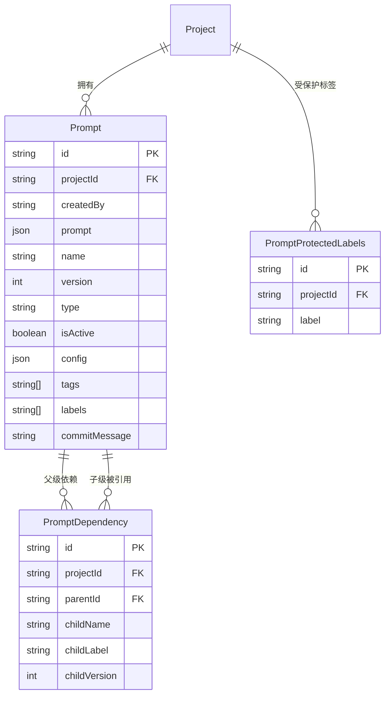

# Prompt 管理详解

Langfuse 的 Prompt 管理系统提供了版本控制、标签管理、依赖解析等功能，支持在代码中通过 SDK 获取 Prompt 并与 LLM 应用集成。

---

## 1. Prompt 模型

**源文件**: `packages/shared/prisma/schema.prisma:759-786`

Prompt 是核心数据模型，每个记录代表一个 Prompt 的一个版本：

| 字段 | 类型 | 说明 |
|------|------|------|
| `id` | String (cuid) | 主键 |
| `projectId` | String | 所属项目 ID |
| `createdBy` | String | 创建者 |
| `prompt` | Json | Prompt 内容（支持文本和聊天格式） |
| `name` | String | Prompt 名称 |
| `version` | Int | 版本号（自动递增） |
| `type` | String | 类型：text（默认）或 chat |
| `isActive` | Boolean? | 是否激活（已废弃，用 labels 替代） |
| `config` | Json | 配置信息（默认 {}） |
| `tags` | String[] | 标签列表 |
| `labels` | String[] | 标签列表（如 production、latest） |
| `commitMessage` | String? | 提交信息 |

唯一约束：`(projectId, name, version)` - 同一项目内同一名称的版本号唯一

---

## 2. 版本管理

### 2.1 自动版本号

创建新 Prompt 时，系统会自动分配下一个版本号。版本号从 1 开始递增，确保同一 `(projectId, name)` 下的版本号连续且唯一。

### 2.2 标签系统

标签（labels）是版本管理的关键机制，支持以下常见标签：

| 标签 | 说明 |
|------|------|
| `production` | 生产环境使用的版本 |
| `latest` | 最新版本 |

标签可以同时指向多个版本，SDK 通过标签获取 Prompt 时会返回最新匹配的版本。

### 2.3 PromptProtectedLabels

**源文件**: `schema.prisma:808-818`

受保护标签模型，防止特定标签被随意使用：

| 字段 | 类型 | 说明 |
|------|------|------|
| `id` | String (cuid) | 主键 |
| `projectId` | String | 项目 ID |
| `label` | String | 受保护的标签名 |

唯一约束：`(projectId, label)`

---

## 3. PromptDependency

**源文件**: `packages/shared/prisma/schema.prisma:788-806`

PromptDependency 定义了 Prompt 之间的父子依赖关系，支持 Prompt 组合和模板嵌套：

| 字段 | 类型 | 说明 |
|------|------|------|
| `id` | String (cuid) | 主键 |
| `projectId` | String | 项目 ID |
| `parentId` | String | 父 Prompt ID |
| `childName` | String | 子 Prompt 名称 |
| `childLabel` | String? | 子 Prompt 标签（按标签引用） |
| `childVersion` | Int? | 子 Prompt 版本（按版本引用） |

### 3.1 依赖解析

PromptService 提供 `buildAndResolvePromptGraph` 方法（`PromptService/index.ts:234-379`）用于递归解析依赖：

1. 从数据库查询父 Prompt 的所有 PromptDependency
2. 根据子 Prompt 的名称 + 标签/版本查找子 Prompt
3. 递归解析子 Prompt 的依赖
4. 使用正则替换 `@@@langfusePrompt:name=...|version=...@@@` 占位符为子 Prompt 的内容
5. 返回解析后的 Prompt 和依赖图

### 3.2 安全限制

- **最大嵌套深度**: 5 层（`MAX_PROMPT_NESTING_DEPTH`，`PromptService/index.ts:18`）
- **循环依赖检测**: 使用 `seen` Set 跟踪已访问的 Prompt，防止无限递归
- **同名称不同版本保护**: 父 Prompt 不能引用同名但不同版本的子 Prompt

### 3.3 缓存机制

PromptService 使用 Redis 缓存（`PromptService/index.ts:20-45`）：

- **缓存键格式**: `prompt:{projectId}:{epoch}:{promptName}:{version|label}`
- **Epoch 机制**: 修改 Prompt 时通过 `invalidateCache` 旋转 epoch token，使所有旧缓存失效
- **TTL**: 由 `LANGFUSE_CACHE_PROMPT_TTL_SECONDS` 控制
- **Epoch TTL**: 7 天（`epochTtlSeconds`）

---

## 4. SDK 使用

### 4.1 Python SDK

```python
from langfuse import Langfuse

langfuse = Langfuse()

# 按名称和标签获取 Prompt
prompt = langfuse.get_prompt("my-prompt", label="production")

# 按名称和版本获取 Prompt
prompt = langfuse.get_prompt("my-prompt", version=3)

# 编译 Prompt（替换变量）
compiled = prompt.compile(variable1="value1", variable2="value2")
```

### 4.2 JS/TS SDK

```typescript
import { Langfuse } from "langfuse";

const langfuse = new Langfuse();

// 按名称和标签获取 Prompt
const prompt = await langfuse.getPrompt("my-prompt", { label: "production" });

// 编译 Prompt
const compiled = prompt.compile({ variable1: "value1" });
```

---

## 5. API 端点

Prompt 的 CRUD 操作通过以下 API 端点提供：

| 方法 | 路径 | 说明 |
|------|------|------|
| GET | `/api/public/prompts` | 列出项目下的 Prompt |
| GET | `/api/public/prompts/:name` | 获取指定名称的 Prompt |
| POST | `/api/public/prompts` | 创建新 Prompt 版本 |
| PATCH | `/api/public/prompts/:name` | 更新 Prompt 标签 |

### 5.1 版本切换

通过更新标签实现版本切换：将 `production` 标签从旧版本移到新版本。这一操作是原子性的，确保 SDK 始终获取到有效的 Prompt。

---

## 6. 与 Chain/Agent 集成

Prompt 管理与 LLM 应用的集成方式：

### 6.1 LangChain 集成

```python
from langfuse.langchain import CallbackHandler
from langfuse import Langfuse

langfuse = Langfuse()
prompt = langfuse.get_prompt("my-chain-prompt")

# 获取 LangChain ChatPromptTemplate
chat_prompt = prompt.get_langchain_chat_prompt()
```

### 6.2 OpenAI 集成

```python
prompt = langfuse.get_prompt("my-chat-prompt")

# 直接获取 OpenAI 格式的消息列表
messages = prompt.compile(user_input="Hello")
response = openai.chat.completions.create(
    model=prompt.config["model"],
    messages=messages,
)
```

### 6.3 自动追踪

在 Generation 事件中，SDK 可以通过 `promptName` 和 `promptVersion` 字段关联 Prompt。IngestionService 会自动查找并关联 Prompt 信息（`index.ts:1021-1041`），将 `prompt_id`、`prompt_name`、`prompt_version` 写入观察记录。

---

## 7. PromptService 详解

**源文件**: `packages/shared/src/server/services/PromptService/index.ts`

### 7.1 查找逻辑

PromptService.getPrompt 方法（`index.ts:47-79`）按以下优先级查找 Prompt：

1. 如果指定 `version`，直接按 `(projectId, name, version)` 查找
2. 如果指定 `label`，按 `(projectId, name, labels contains label)` 查找
3. 两者都不指定则返回 null（记录错误日志）

```typescript
// findPrompt 核心逻辑（index.ts:100-128）
if (version) {
  return prisma.prompt.findFirst({
    where: { projectId, name: promptName, version },
  });
}
if (label) {
  return prisma.prompt.findFirst({
    where: { projectId, name: promptName, labels: { has: label } },
  });
}
```

### 7.2 缓存流程

1. 如果缓存启用，先尝试从 Redis 获取缓存（`getCachedPrompt`，`index.ts:147-162`）
2. 缓存命中直接返回，缓存未命中则查询数据库
3. 查询数据库后写入缓存，TTL 由 `LANGFUSE_CACHE_PROMPT_TTL_SECONDS` 控制
4. 缓存键使用 epoch 机制实现高效失效

### 7.3 缓存失效

`invalidateCache` 方法（`index.ts:177-190`）通过旋转 epoch token 使所有旧缓存键自然过期：

- 旧缓存键不会被显式删除，而是通过 TTL 自然过期
- 新请求会使用新的 epoch 生成新的缓存键
- epoch token 本身的 TTL 为 7 天（`epochTtlSeconds`）

### 7.4 依赖解析详解

`buildAndResolvePromptGraph` 方法（`index.ts:234-379`）的完整流程：

1. 构建依赖图（`PromptGraph`），包含根节点和依赖关系
2. 递归解析每个依赖：
   - 从数据库查找子 Prompt
   - 验证子 Prompt 必须是 text 类型
   - 递归解析子 Prompt 的依赖
   - 使用正则替换占位符

占位符格式（`index.ts:341-349`）：

```
@@@langfusePrompt:name=childName|version=1@@@   // 按版本引用
@@@langfusePrompt:name=childName|label=production@@@   // 按标签引用
```

替换时，子 Prompt 的内容会被 JSON 字符串化后去除首尾引号，然后替换到父 Prompt 中。美元符号（$）会被转义为 $$$$ 以避免正则替换的特殊含义。

---

## 8. 数据模型关系图



---

## 9. Prompt 类型详解

### 9.1 text 类型

最简单的 Prompt 类型，内容为纯文本字符串，支持变量占位符：

```json
{
  "prompt": "请根据以下上下文回答问题：{{context}}\n问题：{{question}}"
}
```

### 9.2 chat 类型

聊天格式的 Prompt，内容为消息数组：

```json
{
  "prompt": [
    { "role": "system", "content": "你是一个有帮助的助手。" },
    { "role": "user", "content": "{{user_input}}" }
  ]
}
```

chat 类型与 OpenAI 的 messages 格式兼容，可以直接用于 `openai.chat.completions.create` 调用。

### 9.3 config 字段

config 字段用于存储 Prompt 的运行时配置，常见的配置项：

```json
{
  "model": "gpt-4",
  "temperature": 0.7,
  "max_tokens": 1000
}
```

SDK 在使用 Prompt 时可以读取这些配置，确保 Prompt 和模型参数的一致性。

