# LLM 记忆层架构深度对比

> 从架构模式、记忆模型、检索策略、一致性模型四个维度深入对比 Mem0、SuperMemory、Memori、memU。

## 1. 架构模式对比

```mermaid
graph TB
    subgraph Mem0["Mem0: 分层事件驱动"]
        M0_APP["应用层"] --> M0_MEM["Memory.add/search"]
        M0_MEM --> M0_LLM["LLM 提取事实"]
        M0_LLM --> M0_VEC["向量存储<br/>Qdrant/Chroma"]
        M0_LLM --> M0_SQL["SQLite<br/>去重+历史"]
        M0_VEC --> M0_RET["混合检索<br/>语义+BM25+实体"]
    end

    subgraph SuperM["SuperMemory: 记忆即服务"]
        SM_APP["应用层"] --> SM_API["REST API"]
        SM_API --> SM_INGEST["多模态摄入<br/>文本/图片/PDF/视频"]
        SM_INGEST --> SM_GRAPH["记忆图谱 DAG<br/>版本化引用"]
        SM_GRAPH --> SM_DB["PostgreSQL + CF KV"]
        SM_DB --> SM_RET["混合 RAG+Memory"]
    end

    subgraph Memori["Memori: Agent-native 透明"]
        ME_APP["应用层"] --> ME_INTERCEPT["透明拦截<br/>OpenAI SDK/LangChain"]
        ME_INTERCEPT --> ME_RECORD["执行轨迹记录"]
        ME_RECORD --> ME_EXTRACT["高级提取<br/>事实+三元组+属性"]
        ME_EXTRACT --> ME_DB["PostgreSQL/MySQL/<br/>SQLite/MongoDB"]
        ME_DB --> ME_RET["向量+词法检索<br/>FAISS"]
    end

    subgraph MemU["memU: 双系统架构"]
        MU_APP["应用层"] --> MU_SYS1["System 1: 快速记忆<br/>文件系统隐喻"]
        MU_APP --> MU_SYS2["System 2: 深度学习<br/>LLM 语义分析"]
        MU_SYS1 --> MU_DB["SQLite/PostgreSQL"]
        MU_SYS2 --> MU_DB
        MU_DB --> MU_RET["RAG向量+LLM双模"]
    end
```



## 2. 记忆模型对比

### 2.1 记忆生命周期

| 阶段 | Mem0 | SuperMemory | Memori | memU |
|------|------|-------------|--------|------|
| **创建** | LLM 从对话中提取事实 | 多模态内容→记忆 DAG | Agent 执行轨迹自动记录 | 主动记忆+被动学习 |
| **存储** | 向量(内容+元数据) + SQLite(去重) | PostgreSQL(结构化) + CF KV(缓存) | 多种 DB 适配(Entity+Fact+KG 表) | 文件系统隐喻(Category/Item/Resource) |
| **更新** | ADD-only (V3)，覆盖旧版本 | 版本化 DAG，自动创建新版本 | 关系更新，冲突自动解决 | 强化计数+衰退打分 |
| **检索** | 语义+BM25关键词+实体链接 | 混合 RAG(retrieve)+Memory(recall) | 向量(FAISS)+词法(BM25) | RAG 向量+LLM 语义 双模 |
| **遗忘** | 手动删除 | 自动遗忘(基于频率和时效) | API 删除 | 自然衰退(计时器) |
| **去重** | SQLite 内容哈希去重 | 语义去重 | 实体+事实去重 | 内容相似度去重 |

### 2.2 数据模型

```
Mem0:
  Memory {
    id, user_id, agent_id, run_id,
    memory: "用户是 Go 开发者",
    hash: "abc123...",
    metadata: {source: "chat", timestamp: ...},
    created_at, updated_at
  }
  → 扁平结构，通过 metadata 和 user_id 维度隔离

SuperMemory:
  MemoryGraph {
    root: MemoryNode(version: 1),
    edges: [
      MemoryNode(version: 2, parent: v1),
      MemoryNode(version: 3, parent: v2, tags: [refined]),
    ]
  }
  → 有向无环图(DAG)，支持版本控制和引用追溯

Memori:
  Entity {id, type, name}
  └── Fact {id, entity_id, predicate, object, confidence}
  └── Attribute {id, entity_id, key, value}
  KnowledgeGraph: Entity ──Fact──→ Entity
  → 关系型三元组，支持图谱查询

memU:
  Category {id, name, description}
  └── Item {id, category_id, title, content, priority}
      └── Resource {id, item_id, content, source, timestamp}
  → 文件系统隐喻，自然组织
```

## 3. 检索策略对比

### 3.1 检索流程

```
Mem0 检索:
  用户查询 → Embedding → 向量相似度(cosine) → BM25 关键词 → 实体链接 → Reranker → Top-K 结果

SuperMemory 检索:
  用户查询 → 混合路由
              ├─ RAG 路径: 向量检索+全文搜索 → 重排序
              └─ Memory 路径: 图遍历(版本化引用) → 相关性评分
           → 合并+去重 → Top-K

Memori 检索:
  用户查询 → FAISS 向量(语义) + BM25(词法) → 联合评分 → 置信度过滤 → Top-K

memU 检索:
  用户查询 → 路径选择
              ├─ System 1(快速): 关键词+文件系统遍历 → 按优先级排序
              └─ System 2(深度): LLM 语义理解 → 向量检索 → 重排序
           → 合并(优先级×相似度×衰退系数) → Top-K
```

### 3.2 检索性能特征

| 指标 | Mem0 | SuperMemory | Memori | memU |
|------|------|-------------|--------|------|
| **语义检索** | ✅ | ✅ | ✅(FAISS) | ✅ |
| **关键词检索** | ✅(BM25) | ✅(全文索引) | ✅(BM25) | ✅(System 1) |
| **实体检索** | ✅(实体链接) | ❌ | ✅(KG 查询) | ❌ |
| **图遍历** | ❌ | ✅(DAG) | ✅(KG) | ❌ |
| **混合策略** | 向量→BM25→实体→Rerank | RAG+Memory 双路 | 向量+词法 联合 | 双系统双模 |
| **重排序** | ✅(Cohere/LLM) | ✅(内置) | ❌ | ✅(LLM) |
| **置信度** | ✅(向量得分) | ✅(版本权重) | ✅(事实置信度) | ✅(衰退系数) |

## 4. 一致性模型

| 维度 | Mem0 | SuperMemory | Memori | memU |
|------|------|-------------|--------|------|
| **写入一致性** | 最终一致(异步 LLM 提取) | 强一致(API 即时) | 最终一致(拦截记录) | 最终一致(异步学习) |
| **读取一致性** | 写入后立即可读 | 即时可读 | 即时可读 | 即时可读 |
| **冲突处理** | ADD-only 覆盖 | 自动版本分叉 | 智能合并 | 强化覆盖 |
| **事务支持** | SQLite 单条事务 | PostgreSQL 事务 | 取决于后端 DB | 取决于后端 DB |
| **多写并发** | user_id 级别锁 | API 级别限流 | Agent 级别队列 | 用户级别合并 |

## 5. 多模态支持

| 模态 | Mem0 | SuperMemory | Memori | memU |
|------|:---:|:---:|:---:|:---:|
| **文本** | ✅ | ✅ | ✅ | ✅ |
| **图片** | ✅(视觉理解) | ✅ | ✅ | ✅ |
| **PDF** | ❌ | ✅ | ❌ | ✅ |
| **视频** | ❌ | ✅ | ✅ | ✅ |
| **音频** | ❌ | ❌ | ✅ | ✅ |
| **网页/URL** | ❌ | ✅ | ❌ | ✅ |
| **代码** | ✅(文本) | ✅(文件) | ✅(执行轨迹) | ✅(文件) |

## 6. 部署模式

```
Mem0:
  嵌入模式: pip install mem0ai → 进程内运行
  服务模式: mem0 serve → REST API → 客户端调用
  Cloud: mem0 cloud → 全托管

SuperMemory:
  Cloud-first: Cloudflare Workers + PostgreSQL
  自部署: 复杂度高（需 CF Workers 运行时）

Memori:
  Cloud: memori.ai API（推荐）
  自部署: Docker + 任意兼容 DB

memU:
  Cloud: memu cloud API
  自部署: pip install memu + PostgreSQL/SQLite
```

## 7. 选型总结

| 如果你需要... | 推荐 | 原因 |
|--------------|:---:|------|
| **最成熟的 OSS 方案** | Mem0 | 57.7k stars，社区最活跃 |
| **零代码入侵** | Memori | 透明拦截，不改代码 |
| **记忆版本管理** | SuperMemory | DAG 版本化 |
| **知识图谱** | Memori | Entity/Fact/KG 关系型 |
| **记忆衰退** | memU | 自然衰退+强化计数 |
| **多模态处理** | SuperMemory | PDF/视频/网页全支持 |
| **TypeScript 优先** | SuperMemory | Cloud-first TS |
| **Python 优先** | Mem0 或 Memori | 生态最成熟 |
| **MCP 集成** | SuperMemory 或 memU | 内置 MCP Server |
| **tRPC-Agent-Go 集成** | Mem0(API) 或 SuperMemory(MCP) | 通过 Tool/MCP |
