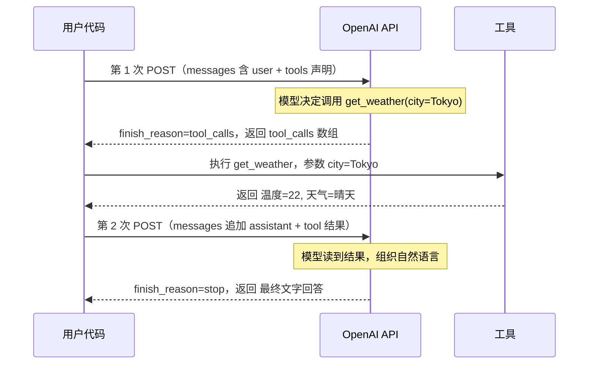

# Function Calling 机制

> **进阶篇核心章节。** [入门篇 03](./getting-started/03-core-params.md) 你学的 `response_format`、`stop` 等参数，都是「单轮」控制。Function Calling 是让模型**主动发起动作**的机制——它是所有 Agent 框架（ADK、LangChain、Agents SDK）能做工具调用的底层协议。
>
> **本节你将学到**：tools 怎么声明、模型怎么决定调用、结果怎么回传、流式下怎么拼装、工具失败怎么重试、以及一个完整可运行的 Agent 循环。
>
> **一句话比喻**：没有 Function Calling，模型只能「背菜单」（凭记忆编答案）；有了它，模型能「打电话叫外卖」（发起真实动作、拿到真实结果再回答）。

Function Calling 让 LLM 输出结构化的函数调用请求——客户端执行后发回结果。**模型不执行函数，只产出调用请求；真正执行的是你的代码。** 这是结构化的回合协议，不是远程调用。

::: tip 关键认知
模型**永远不直接执行**你的代码。它只是说「我想调用 `get_weather("Tokyo")`」——执行权完全在你手里。这意味着你可以加权限校验、限流、人工确认、模拟返回，模型管不着。
:::

## 1. 协议流程

```
轮次 1: user msg → POST /v1/chat/completions（含 tools 声明）
         ↓
轮次 1 响应: assistant msg, finish_reason="tool_calls", 含 tool_calls 数组
         ↓
客户端执行工具
         ↓
轮次 2: 追加 tool role msg → POST /v1/chat/completions
         ↓
轮次 2 响应: assistant msg, finish_reason="stop", 自然语言回复
```

每次工具调用需要额外一次 HTTP 往返。框架负责管理这些往返循环。

### 序列图：一次完整工具调用



::: tip 看图记住三点
1. **两个 POST**：工具调用 = 至少 2 次 API 请求（第一次拿调用请求，第二次拿最终回答）。
2. **三种消息**：第二次请求的 messages 数组里，必须依次有 `user` → `assistant(含 tool_calls)` → `tool(含结果)`，缺一不可。
3. **执行权在你**：中间「执行工具」那一步完全离线，OpenAI 服务器不参与。
:::

## 2. Tools 声明

```json
{
  "tools": [
    {
      "type": "function",
      "function": {
        "name": "get_weather",
        "description": "Get current weather for a location",
        "strict": true,
        "parameters": {
          "type": "object",
          "properties": {
            "city": {
              "type": "string",
              "description": "City name, e.g. Tokyo"
            },
            "unit": {
              "type": "string",
              "enum": ["celsius", "fahrenheit"],
              "description": "Temperature unit"
            }
          },
          "required": ["city"],
          "additionalProperties": false
        }
      }
    }
  ]
}
```

### Function 定义字段

| 字段 | 必填 | 说明 |
|------|------|------|
| `name` | ✅ | 函数名（字母+数字+下划线+连字符，最大 64 字符） |
| `description` | 推荐 | 工具描述——LLM 据此决定是否调用 |
| `strict` | ❌ | `true` 时强制参数符合 JSON Schema 且禁止 additionalProperties |
| `parameters` | ❌ | JSON Schema 对象。无参数函数可省略 |

### description 最佳实践

```
✅ "Get the current weather for a city. Returns temperature, humidity, and conditions."
❌ "Get weather"
✅ "Search the user database by name. Returns id, email, and role. Do not guess names."
❌ "Search users"
```

## 3. tool_choice 控制

| 值 | 含义 | 使用场景 |
|----|------|----------|
| `"auto"` | 默认，模型决定 | 通用 |
| `"none"` | 禁止调用任何工具 | 纯对话 |
| `"required"` | 必须调用至少一个工具 | 强制工具交互 |
| `{"type":"function","function":{"name":"x"}}` | 强制调用指定工具 | 精确控制 |

```json
// 强制使用 get_weather
{"tool_choice": {"type": "function", "function": {"name": "get_weather"}}}

// 允许模型选择但禁止某些工具——不在 tools 数组里声明即可
```

## 4. parallel_tool_calls

```json
{
  "parallel_tool_calls": false
}
```

设为 `false` 禁止模型并行调用多个工具——每次只调用一个。**默认 `true`**。

适用场景：
- 工具之间有依赖关系
- 需要确定性顺序
- Token 预算紧张（并行调用生成更多 token）

## 5. 模型返回 tool_calls

```json
{
  "choices": [{
    "message": {
      "role": "assistant",
      "content": null,
      "tool_calls": [
        {
          "id": "call_abc123def456",
          "type": "function",
          "function": {
            "name": "get_weather",
            "arguments": "{\"city\":\"Tokyo\",\"unit\":\"celsius\"}"
          }
        }
      ]
    },
    "finish_reason": "tool_calls"
  }]
}
```

### tool_call 字段

| 字段 | 说明 |
|------|------|
| `id` | 全球唯一标识（`call_` 前缀，28 字符） |
| `type` | 恒为 `"function"` |
| `function.name` | 要调用的函数名 |
| `function.arguments` | **JSON 字符串**（不是对象！需手动 `JSON.parse()`） |

### content 状态

- `content: null` — 只有工具调用，无文本
- `content: "Let me check..."` — 可能包含过渡文本（告知用户正在工作）

始终检查 `tool_calls` 是否存在——不依赖 `content` 是否为 null。

## 6. 发回工具结果

```json
{
  "messages": [
    {"role": "user", "content": "What is the weather?"},
    {
      "role": "assistant",
      "content": null,
      "tool_calls": [{
        "id": "call_abc123",
        "type": "function",
        "function": {"name": "get_weather", "arguments": "{\"city\":\"Tokyo\"}"}
      }]
    },
    {
      "role": "tool",
      "tool_call_id": "call_abc123",
      "content": "{\"temperature\":22,\"condition\":\"sunny\",\"humidity\":45}"
    }
  ]
}
```

### tool role 消息

| 字段 | 必填 | 说明 |
|------|------|------|
| `role` | ✅ | 必须 `"tool"` |
| `tool_call_id` | ✅ | 对应 target tool_call 的 `id` |
| `content` | ✅ | 字符串（建议 JSON 便于模型解析） |

### 内容长度

工具结果计入 `prompt_tokens`。过长结果会消耗大量 token 甚至超出 context window。

```python
MAX_RESULT_CHARS = 5000

def truncate(result: str) -> str:
    if len(result) > MAX_RESULT_CHARS:
        return result[:MAX_RESULT_CHARS] + "\n...(truncated)"
    return result
```

## 7. 并行 Tool Call 处理

```json
// 一次返回两个 tool call
{
  "tool_calls": [
    {"id": "call_1", "function": {"name": "get_weather", "arguments": "{\"city\":\"Tokyo\"}"}},
    {"id": "call_2", "function": {"name": "get_time", "arguments": "{\"timezone\":\"Asia/Tokyo\"}"}}
  ]
}
```

**规则**：所有结果在**一个请求**中发回——不能分批发：

```json
{
  "messages": [
    ...,
    {"role": "assistant", "content": null, "tool_calls": [call_1, call_2]},
    {"role": "tool", "tool_call_id": "call_1", "content": "22°C"},
    {"role": "tool", "tool_call_id": "call_2", "content": "14:30"}
  ]
}
```

## 8. Strict 模式（strict: true）

```json
{
  "function": {
    "name": "get_weather",
    "strict": true,
    "parameters": {
      "type": "object",
      "properties": {"city": {"type": "string"}},
      "required": ["city"],
      "additionalProperties": false
    }
  }
}
```

### strict 模式约束

**强制要求**：
- `additionalProperties: false`（必须是 `false`，不能是 `true` 或未设置）
- 所有 `properties` 字段的 `required` 必须完整列出
- 所有字段必须在 `required` 中

**不支持**：
- `anyOf` / `oneOf` / `allOf`
- 嵌套深层的 schema
- 递归 schema
- `additionalProperties: true`
- 可选字段

### strict vs non-strict

```
strict=true:  模型保证输出符合 schema。适合生产环境。但 schema 受限。
strict=false: 模型尽力但不保证。适合快速原型或复杂 schema。
```

### strict 模式的边界（容易踩的坑）

strict 不是万能保险，有两种情况**保证会失效**：

1. **微调模型 + 并行调用**：当你用 fine-tuned 模型，且模型在**同一回合**发出**多个** tool_call 时，OpenAI 官方明确说 strict 模式会**自动禁用**——这一次调用的参数不再保证符合 schema。
2. **Chat Completions 默认非 strict**：本 API 默认 `strict: false`，必须显式写 `strict: true` 才生效。（新出的 Responses API 行为相反，会尽量自动归一化为 strict，别把两者记混了。）

::: warning 生产建议
即使开了 strict，也**始终在代码里 `try/except` 解析 `arguments`**——为微调场景和未来 API 行为变化兜底。
:::

## 9. 流式 Function Calling

[流式协议篇](./03-streaming.md) 讲过 `stream: true` 下文本是 `delta.content` 一段段推送的。Function Calling 在流式下**更复杂**：tool_calls 也会分片到达，需要按 `index` 累加拼装。

### 为什么流式 tool call 更麻烦

文本流：`delta.content` 每次来一小段字符串，直接拼接即可。

工具调用流：模型可能**同时**发起多个 tool_call（并行调用），它们的参数**交错**到达。你必须按 `index` 分组累加，否则会拼错。

### delta 结构

每个 chunk 里的 `delta.tool_calls` 是数组，每个元素带：

| 字段 | 出现时机 | 含义 |
|------|---------|------|
| `index` | **每个 delta 都有** | 标识这是第几个工具调用（0、1、2...） |
| `id` | 仅**该 index 的第一个** delta | 工具调用 ID（`call_xxx`） |
| `type` | 仅第一个 delta | 恒为 `"function"` |
| `function.name` | 仅第一个 delta | 函数名 |
| `function.arguments` | **每个 delta 都可能有** | 参数片段，需累加拼接 |

::: tip 核心规则
**按 `index` 分组**，把每个 index 下的 `arguments` 片段**字符串拼接**起来。`id` / `name` / `type` 只在首个 delta 出现，取一次即可。
:::

### 真实 delta 序列示例

模型要并行调用 `get_weather("Tokyo")` 和 `get_time("Asia/Tokyo")`，流式 chunks 大致长这样：

```
data: {"choices":[{"delta":{"tool_calls":[{"index":0,"id":"call_AAA","type":"function","function":{"name":"get_weather","arguments":""}}]}}]}

data: {"choices":[{"delta":{"tool_calls":[{"index":0,"function":{"arguments":"{\"city"}}]}}]}

data: {"choices":[{"delta":{"tool_calls":[{"index":0,"function":{"arguments":"\":\"Tokyo\"}"}}]}}]}

data: {"choices":[{"delta":{"tool_calls":[{"index":1,"id":"call_BBB","type":"function","function":{"name":"get_time","arguments":""}}]}}]}

data: {"choices":[{"delta":{"tool_calls":[{"index":1,"function":{"arguments":"{\"tz\":\"Asia/Tokyo\"}"}}]}}]}

data: [DONE]
```

注意：
- `index:0` 的 arguments 被**拆成两段**（`{"city` 和 `":"Tokyo"}`），必须拼接
- `index:1` 的 id/name 只在它自己的首个 delta 出现
- 两个工具的 delta **可能交错**（这里没交错，但别假设顺序）

### 拼装代码

```python
final_tool_calls = {}  # key=index, value=累加中的 tool_call

for chunk in stream:
    delta = chunk["choices"][0]["delta"]
    if "tool_calls" not in delta:
        continue

    for tc in delta["tool_calls"]:
        idx = tc["index"]

        # 该 index 首次出现：初始化结构
        if idx not in final_tool_calls:
            final_tool_calls[idx] = {
                "id": tc.get("id"),
                "type": tc.get("type"),
                "function": {"name": None, "arguments": ""},
            }

        # 累加（id/name 只在首个 delta 有，有值才覆盖）
        if tc.get("id"):
            final_tool_calls[idx]["id"] = tc["id"]
        if tc.get("type"):
            final_tool_calls[idx]["type"] = tc["type"]
        fn = tc.get("function", {})
        if fn.get("name"):
            final_tool_calls[idx]["function"]["name"] = fn["name"]
        if fn.get("arguments"):
            final_tool_calls[idx]["function"]["arguments"] += fn["arguments"]

# 流结束后，按 index 排序得到完整 tool_calls 列表
tool_calls = [final_tool_calls[i] for i in sorted(final_tool_calls)]
for tc in tool_calls:
    args = json.loads(tc["function"]["arguments"])  # 拼好的完整 JSON
    print(tc["function"]["name"], args)
```

::: warning 流式下别忘 `include_usage`
流式默认不返回 `usage`，要算 token 需加 `stream_options: {"include_usage": true}`（见 [Token 篇](./getting-started/02-tokens.md#stream-options-流式时拿-token-用量)）。
:::


```python
import json

def function_calling_loop(
    messages: list,
    tools: list,
    model: str = "gpt-4o",
    max_turns: int = 10,
) -> str:
    """完整 function calling 循环，不依赖任何框架"""

    for turn in range(max_turns):
        response = call_api(
            model=model,
            messages=messages,
            tools=tools,
            tool_choice="auto",
        )
        choice = response["choices"][0]

        # 正常完成
        if choice["finish_reason"] == "stop":
            return choice["message"].get("content", "")

        # 工具调用
        if choice["finish_reason"] == "tool_calls":
            msg = choice["message"]

            # 追加 assistant 消息（含 tool_calls）
            messages.append({
                "role": "assistant",
                "content": msg.get("content"),
                "tool_calls": msg["tool_calls"],
            })

            # 执行工具并追加结果
            for tc in msg["tool_calls"]:
                func_name = tc["function"]["name"]
                args = json.loads(tc["function"]["arguments"])
                result = execute_tool(func_name, args)

                messages.append({
                    "role": "tool",
                    "tool_call_id": tc["id"],
                    "content": json.dumps(result, ensure_ascii=False),
                })

            continue  # 继续循环

        # 安全拒绝
        if choice["finish_reason"] == "content_filter":
            return None

        # 长度截断
        if choice["finish_reason"] == "length":
            return choice["message"].get("content", "")

    raise Exception(f"Exceeded max turns ({max_turns})")
```

## 10. 错误处理与重试

工具执行不可能永远成功——API 超时、参数无效、权限不足、外部服务挂了。**关键原则：把错误信息当成「正常结果」回传给模型，让它自己决定怎么办。**

### 核心原则：错误走 tool content，不走 HTTP 错误码

::: danger 最常见的错误做法
工具执行失败时，**不要**直接抛异常中断整个 Agent 循环，也**不要**给 OpenAI API 返回 4xx/5xx——那是你的请求格式错了才会触发。
:::

正确做法：把错误信息（人能读的字符串）写进 `tool` message 的 `content`，模型会读到「调用失败」并自动调整——改参数、换工具、或告诉用户做不到。

```python
# ✅ 正确：把错误当结果回传
try:
    result = call_real_api(**args)
    content = json.dumps(result)
except requests.Timeout:
    content = json.dumps({"error": "timeout", "msg": "API 在 3 秒内没响应"})
except ValueError as e:
    content = json.dumps({"error": "invalid_args", "msg": str(e)})

messages.append({
    "role": "tool",
    "tool_call_id": tc["id"],
    "content": content,   # 错误信息也走这里
})
```

### 模型看到错误后会怎样

- **改参数重试**：模型发现「city 参数 Tokyo 拼错」会换个写法再调
- **换工具**：发现 `get_weather` 总失败，可能改用 `search_web`
- **如实报告**：判断无法解决时，回复用户「我无法获取天气数据」

### 三种典型错误处理策略

| 错误类型 | 回传内容 | 是否继续循环 |
|---------|---------|-------------|
| 工具内部失败（超时、API 挂） | `{"error":"timeout","msg":"..."}` | ✅ 让模型决定 |
| 参数非法（你校验失败） | `{"error":"invalid_args","msg":"city 不能为空"}` | ✅ 让模型修正 |
| 工具根本不存在 | `{"error":"unknown_tool"}` | ✅ 模型会换路子 |

::: tip 给模型的错误信息要具体
不要只回 `"error"`，要写清**错在哪**：`"city 参数 Tokyo 未找到，请用英文全名如 Tokyo, Japan"`。信息越具体，模型自我修复越快。
:::

### 防御性措施

```python
MAX_RETRIES_PER_TOOL = 3
MAX_TOTAL_TURNS = 15

tool_call_counts = {}  # 跟踪每个 tool_call_id 的重试次数

for turn in range(MAX_TOTAL_TURNS):
    # ... 调 API 拿 tool_calls ...

    for tc in tool_calls:
        attempt = tool_call_counts.get(tc["id"], 0)
        if attempt >= MAX_RETRIES_PER_TOOL:
            content = json.dumps({"error": "max_retries_exceeded"})
        else:
            tool_call_counts[tc["id"]] = attempt + 1
            content = execute_with_handling(tc)  # 内部 try/except
        messages.append({"role":"tool","tool_call_id":tc["id"],"content":content})
```

::: warning 必须设上限
模型偶尔会**死循环**（反复用同样的错误参数调同一个工具）。务必设 `MAX_TOTAL_TURNS`（如 15）和单工具重试上限，超限强行终止。
:::

## 11. 从零实现 Function Calling 循环（完整可运行）

下面是一个**可直接 `python` 运行**的完整 Agent 循环，不依赖任何框架。它定义两个真实工具（模拟天气查询 + 真实计算器），用工具注册表 dispatch，含错误处理和多轮循环。

### 工具注册表 + 实现

```python
import json
import os
import requests

# ---- 工具实现（真实代码，dispatch 表）----
def get_weather(city: str, unit: str = "celsius") -> dict:
    """模拟天气查询（实际项目替换成真 API）"""
    # 演示错误处理：故意让某些城市失败
    if city.lower() in ("atlantis", "xx"):
        return {"error": "city_not_found", "msg": f"找不到城市 {city}，请用英文全名"}
    return {"city": city, "temperature": 22, "unit": unit, "condition": "sunny"}

def calculate(expression: str) -> dict:
    """真实计算器：执行数学表达式"""
    try:
        allowed = "0123456789+-*/(). "
        if not all(c in allowed for c in expression):
            return {"error": "invalid_chars", "msg": "只允许数字和 + - * / ( )"}
        result = eval(expression, {"__builtins__": {}}, {})  # 受限求值
        return {"expression": expression, "result": result}
    except Exception as e:
        return {"error": "eval_failed", "msg": str(e)}

# 工具注册表：name -> (callable, arg_schema)
TOOL_REGISTRY = {
    "get_weather": (get_weather, ["city", "unit"]),
    "calculate":   (calculate,   ["expression"]),
}
```

### tools 声明（发给 API 的 schema）

```python
TOOLS = [
    {
        "type": "function",
        "function": {
            "name": "get_weather",
            "description": "查询指定城市的当前天气。返回温度、天气状况。",
            "parameters": {
                "type": "object",
                "properties": {
                    "city": {"type": "string", "description": "城市英文名，如 Tokyo, Beijing"},
                    "unit": {"type": "string", "enum": ["celsius", "fahrenheit"], "description": "温度单位"},
                },
                "required": ["city"],
                "additionalProperties": False,
            },
        },
    },
    {
        "type": "function",
        "function": {
            "name": "calculate",
            "description": "计算数学表达式，支持 + - * / 和括号。如 '2*(3+4)'。",
            "parameters": {
                "type": "object",
                "properties": {
                    "expression": {"type": "string", "description": "数学表达式"},
                },
                "required": ["expression"],
                "additionalProperties": False,
            },
        },
    },
]
```

### Agent 循环主逻辑

```python
def call_api(messages, tools, model="gpt-4o-mini"):
    """封装 API 调用"""
    resp = requests.post(
        "https://api.openai.com/v1/chat/completions",
        headers={
            "Content-Type": "application/json",
            "Authorization": f"Bearer {os.environ['OPENAI_API_KEY']}",
        },
        json={"model": model, "messages": messages, "tools": tools, "tool_choice": "auto"},
        timeout=30,
    )
    resp.raise_for_status()
    return resp.json()

def execute_tool(name: str, args: dict) -> str:
    """从注册表取函数执行，错误转成字符串返回（不抛异常）"""
    if name not in TOOL_REGISTRY:
        return json.dumps({"error": "unknown_tool", "msg": f"工具 {name} 不存在"})
    fn, _ = TOOL_REGISTRY[name]
    try:
        return json.dumps(fn(**args), ensure_ascii=False)
    except Exception as e:
        return json.dumps({"error": "exec_failed", "msg": str(e)})

def agent_loop(user_query: str, max_turns: int = 10) -> str:
    """完整 Agent 循环：不依赖任何框架"""
    messages = [
        {"role": "system", "content": "你是个助手，可以查天气和做计算。遇到错误要如实告知用户。"},
        {"role": "user", "content": user_query},
    ]

    for turn in range(max_turns):
        print(f"\n----- 第 {turn+1} 轮 -----")
        response = call_api(messages, TOOLS)
        choice = response["choices"][0]
        msg = choice["message"]
        finish = choice["finish_reason"]

        # 终止条件 1：正常完成
        if finish == "stop":
            return msg.get("content", "")

        # 终止条件 2/3：被截断或拦截
        if finish in ("length", "content_filter"):
            return f"[{finish}] {msg.get('content', '')}"

        # 工具调用分支
        if finish == "tool_calls" and msg.get("tool_calls"):
            # 1. 追加 assistant 消息（含 tool_calls，原样保留）
            messages.append({
                "role": "assistant",
                "content": msg.get("content"),
                "tool_calls": msg["tool_calls"],
            })

            # 2. 逐个执行工具，结果用 tool 消息回传
            for tc in msg["tool_calls"]:
                fn_name = tc["function"]["name"]
                args = json.loads(tc["function"]["arguments"])  # 注意是字符串
                print(f"调用工具: {fn_name}({args})")
                result = execute_tool(fn_name, args)
                print(f"结果: {result[:80]}")
                messages.append({
                    "role": "tool",
                    "tool_call_id": tc["id"],
                    "content": result,
                })
            continue  # 进入下一轮，让模型读结果

    return f"[超过最大轮数 {max_turns}]"

# ---- 运行 ----
if __name__ == "__main__":
    # 试试多工具场景：模型会先查天气、再算单位换算
    answer = agent_loop("东京天气怎么样？把它换算成华氏度（公式：F = C*9/5+32）")
    print("\n===== 最终回答 =====")
    print(answer)
```

### 运行后你会看到

```
----- 第 1 轮 -----
调用工具: get_weather({'city': 'Tokyo', 'unit': 'celsius'})
结果: {"city": "Tokyo", "temperature": 22, "unit": "celsius", "condition": "sunny"}

----- 第 2 轮 -----
调用工具: calculate({'expression': '22*9/5+32'})
结果: {"expression": "22*9/5+32", "result": 71.6}

----- 第 3 轮 -----

===== 最终回答 =====
东京现在 22°C（晴天），换算成华氏度是 71.6°F。
```

::: tip 这个循环涵盖了 Function Calling 的所有要点
- 工具注册表（`TOOL_REGISTRY`）—— 真实项目的标准做法
- tools schema（`TOOLS`）—— 发给 API 的声明
- 三种 `finish_reason` 处理（`stop` / `length`+`content_filter` / `tool_calls`）
- assistant 消息原样追加（含 tool_calls）
- 按序执行 + tool 消息回传
- 错误转成 content（`execute_tool` 内 try/except）
- 多轮循环 + 上限保护

ADK-Go、LangChain 的 Agent 内部循环，本质上就是这段代码的封装版。理解了它，框架就不再是黑盒。
:::

## 12. 常见问题

**Q：content 为 null 但有 tool_calls 怎么处理？**

A：这是最常见的模式——模型认为只需要调用工具。追加 `{"role": "assistant", "content": null, "tool_calls": [...]}` 到 messages，然后执行工具。

**Q：工具调用失败如何通知模型？**

A：将错误信息写入 `tool` role 的 `content` 字段——不要用 HTTP 错误码。模型看到错误字符串会尝试修正参数或换工具。（详见 [§10 错误处理](#_10-错误处理与重试)）

**Q：多个 tool call 之间有依赖怎么办？**

A：设置 `parallel_tool_calls: false` 强制顺序调用。或者在一个函数内部处理依赖关系。

**Q：description 有多重要？**

A：**极其重要**。`description` 是 LLM 决定是否调用工具的唯一信息源。不好的 description = 工具从不被调用或参数传错。

## 13. 关于 Responses API（一句话）

OpenAI 2025 年推出的 [Responses API](https://platform.openai.com/docs/api-reference/responses) 也支持 Function Calling，schema 更扁平（不需要 `function:` 包装层）、strict 模式默认行为不同、还新增了 `tool_search`（延迟加载大量工具）、namespaces（工具分组）等特性。新项目可参考官方迁移指南。**本文聚焦 Chat Completions 协议本身**，它是所有兼容提供商（DeepSeek/Kimi/Qwen 等）和大多数现有框架的通用底层。

## 动手实验

1. **跑通完整示例**：把 §11 的代码存为 `agent.py`，设好 `OPENAI_API_KEY`，运行看到三轮交互输出。
2. **触发错误重试**：把 user_query 改成"亚特兰蒂斯（Atlantis）的天气"，观察模型收到 `city_not_found` 错误后怎么自我修复。
3. **加流式**：把 `agent_loop` 改成 `stream: true`，按 §9 的方法拼装 tool_calls delta，对比非流式版本的差异。
4. **加新工具**：在 `TOOL_REGISTRY` 加一个 `get_current_time(timezone)`，让模型能回答"东京现在几点"。

## 速查表

| 概念 | 关键点 |
|------|--------|
| `tools` | 声明数组，`{type:"function",function:{name,description,parameters,strict}}` |
| `tool_calls` 响应 | `finish_reason` 变 `tool_calls`，`arguments` 是 **JSON 字符串**需 parse |
| 回传结果 | 追加 assistant(含 tool_calls) + `role:"tool"` + `tool_call_id` 匹配 |
| `tool_choice` | `auto`(默认) / `none` / `required` / `{type,function:{name}}` 强制 |
| `parallel_tool_calls` | 默认 true，false 时每轮 ≤1 个调用 |
| `strict:true` | 强制 schema 一致，要求 `additionalProperties:false` + 全字段 required |
| 流式拼装 | 按 `index` 分组累加 `arguments`，首个 delta 含 id/name |
| 错误处理 | 错误写进 tool content（不用 HTTP 错误码），让模型自修复 |
| 循环上限 | 必设 `max_turns`，防模型死循环 |
