# tRPC-Agent-Go 架构图与流程图全集

> 本文通过 11 幅 Mermaid 图完整呈现 tRPC-Agent-Go 的系统架构、核心流程与数据流。

---

## 1. 整体系统架构

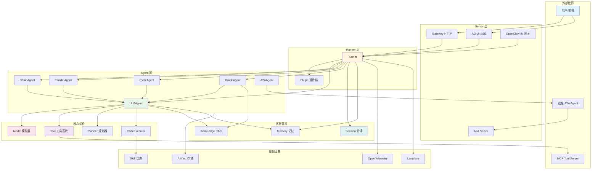

---

## 2. 请求完整生命周期

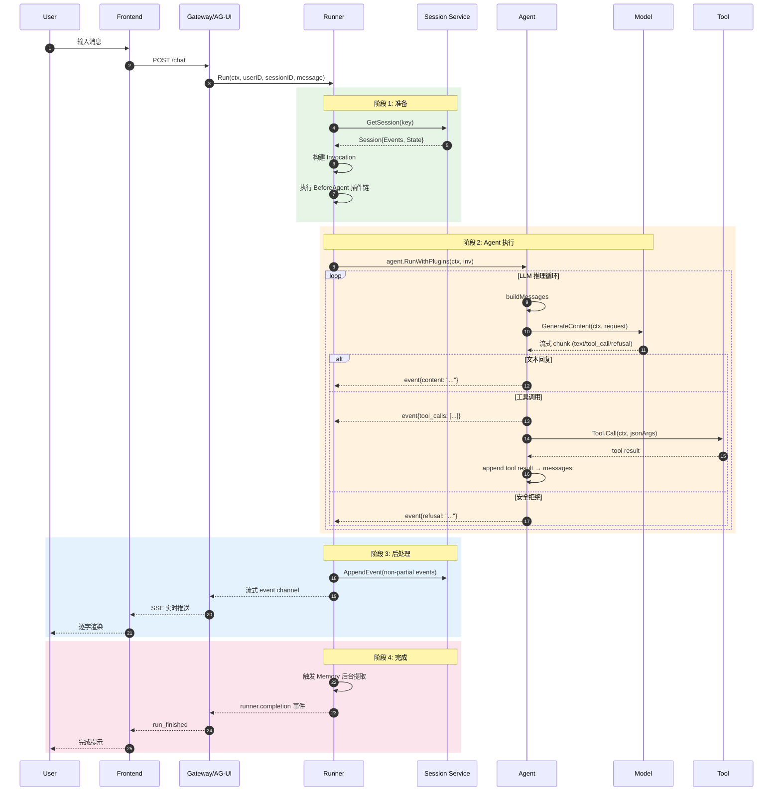

---

## 3. LLMAgent 执行循环

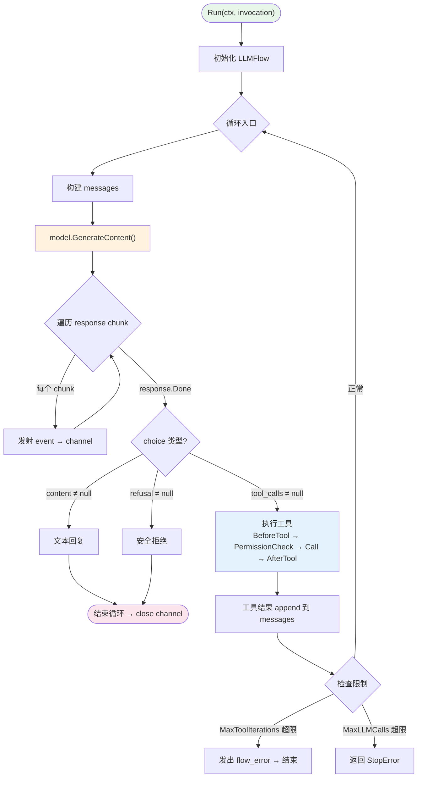

---

## 4. 事件系统数据流

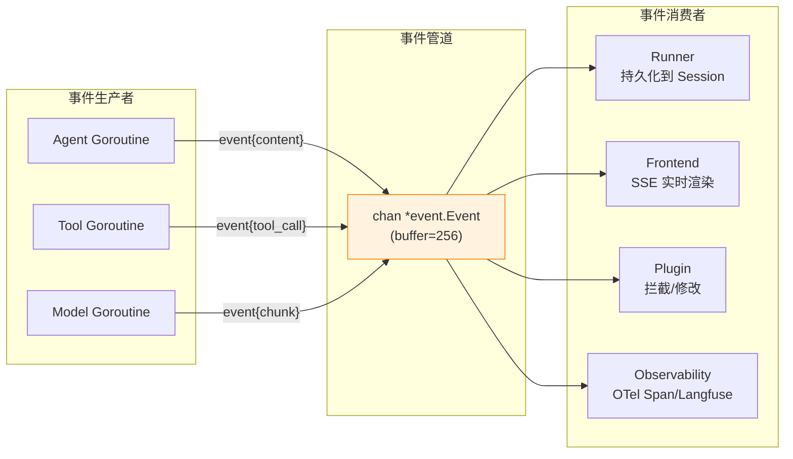

---

## 5. Multi-Agent 编排模式

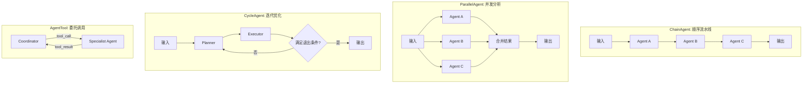

---

## 6. Graph Agent — BSP 执行引擎

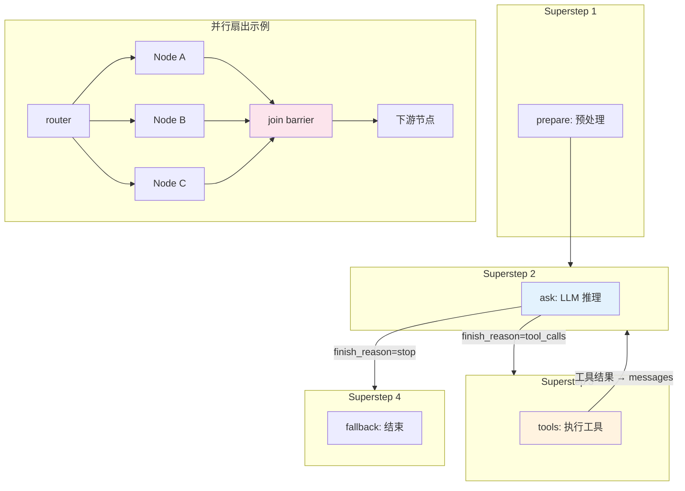

---

## 7. Memory + Session 记忆系统

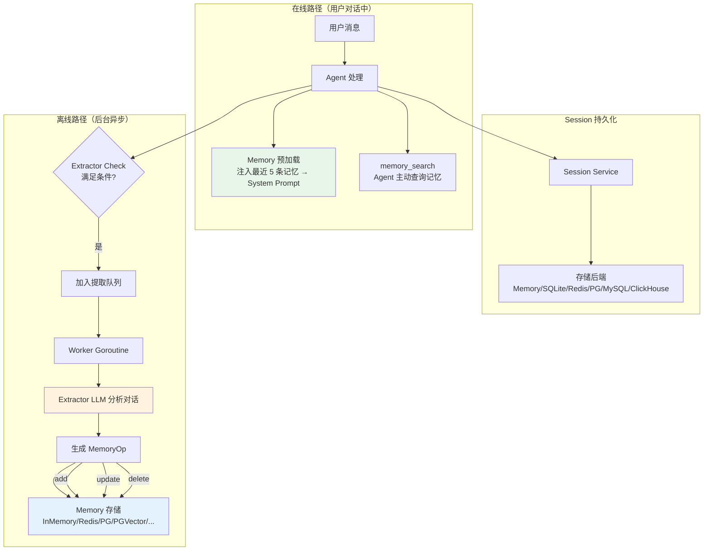

---

## 8. Knowledge RAG 知识检索

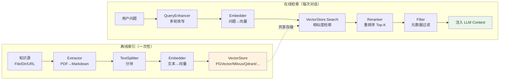

---

## 9. MCP 协议集成

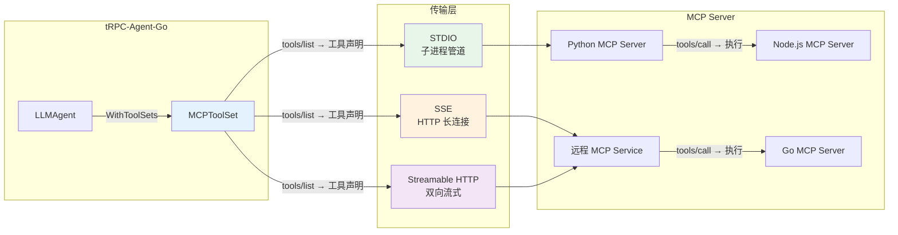

---

## 10. 三协议协作：AG-UI + A2A + MCP

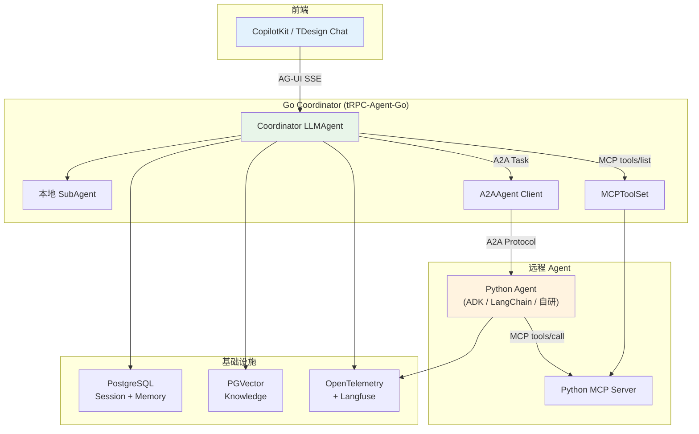

---

## 11. 生产部署架构

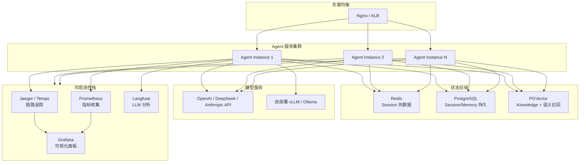

---

## 图例说明

| 颜色 | 含义 |
|------|------|
| 绿色 | 入口/开始节点 |
| 橙色 | 核心处理节点 |
| 蓝色 | 数据存储/传输 |
| 粉色 | 安全/边界节点 |
| 紫色 | 扩展/插件 |

## 关键数据流汇总

| 数据流 | 来源 → 目标 | 承载内容 |
|--------|------------|----------|
| **用户消息** | Frontend → Runner.Run() | 用户输入的文本/多模态内容 |
| **Event 事件流** | Agent → Runner → Frontend | LLM 文本/工具调用/状态变更 |
| **Session 持久化** | Runner → Session Service → DB | 完整对话历史 |
| **Memory 提取** | Runner → Extractor → Memory DB | 用户画像/偏好/事实 |
| **Knowledge 检索** | Agent → VectorStore → LLM Context | 相关文档片段 |
| **A2A 任务** | Coordinator → 远程 Agent | 跨框架 Agent 协作 |
| **MCP 工具调用** | Agent → MCP Server → Tool Result | 外部工具能力 |
