# 各模块结构图全集 — 源码·实战·原理

> 本文以 15 幅 Mermaid 类图/结构图/流程序列图，逐模块展开 tRPC-Agent-Go v1.10.0 的完整内部结构，可作为阅读源码的导航地图。

---

## 1. 顶层类关系总图

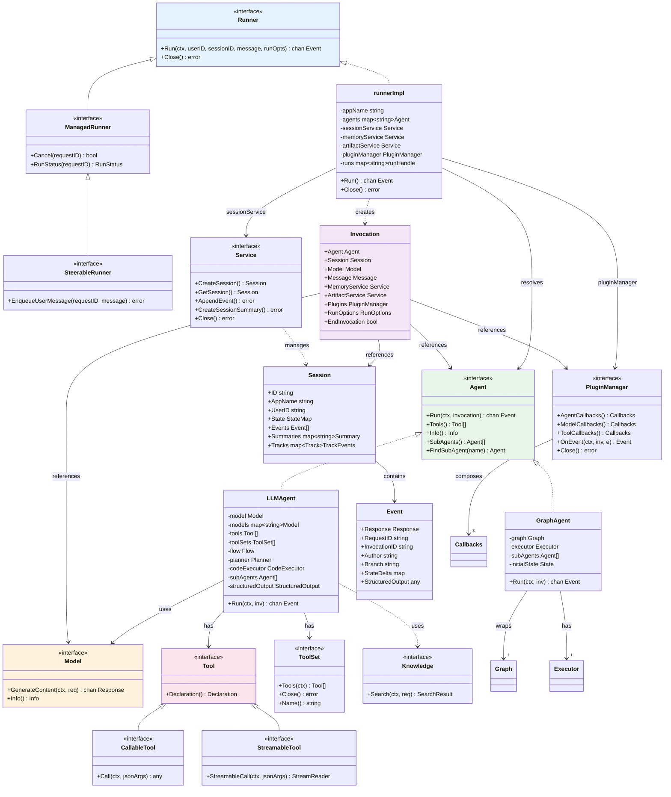

---

## 2. Agent 系统 — LLMAgent 内部结构

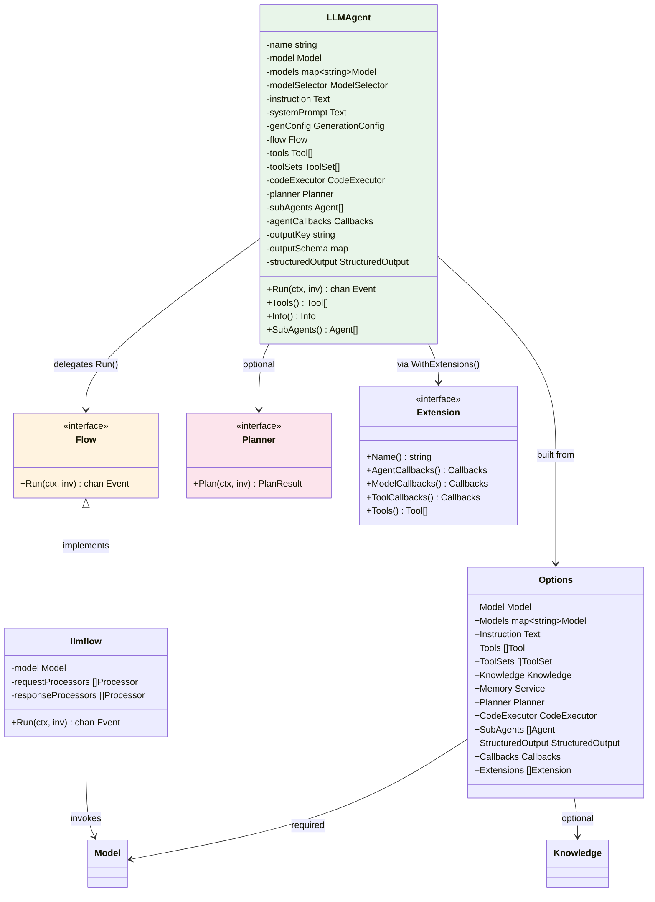

---

## 3. GraphAgent — 图 Agent 结构

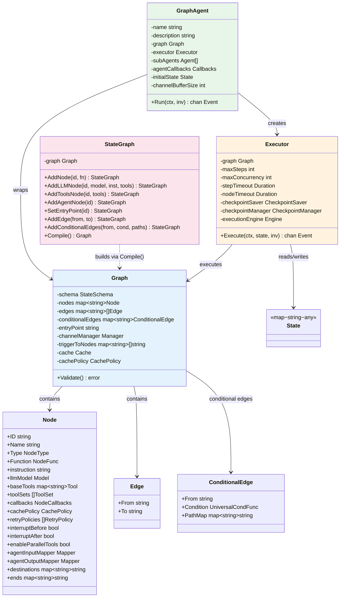

---

## 4. Node 节点类型枚举

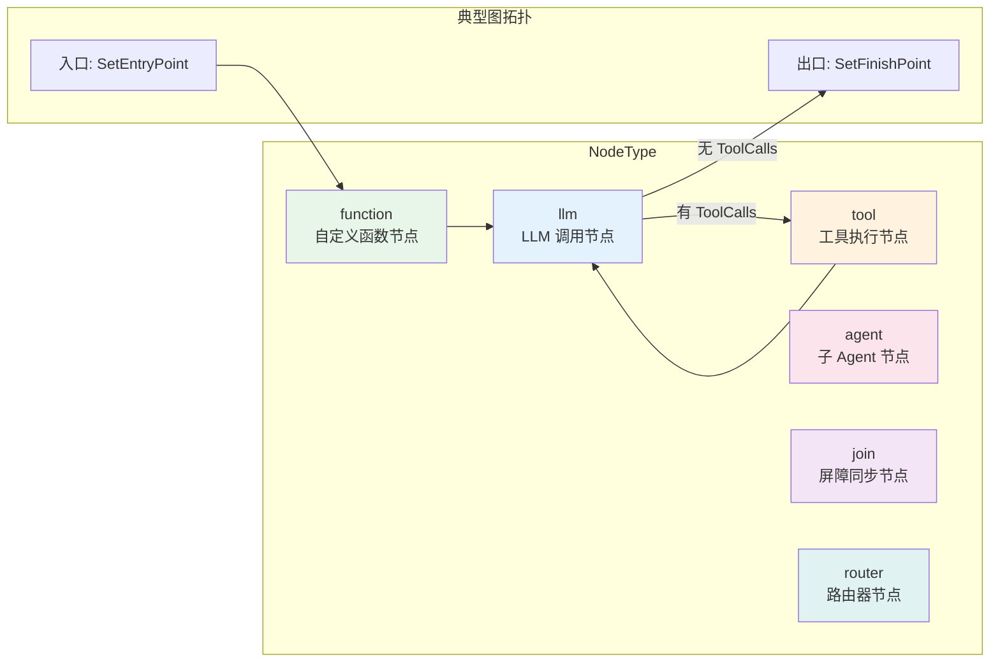

---

## 5. Runner 执行流程序列图

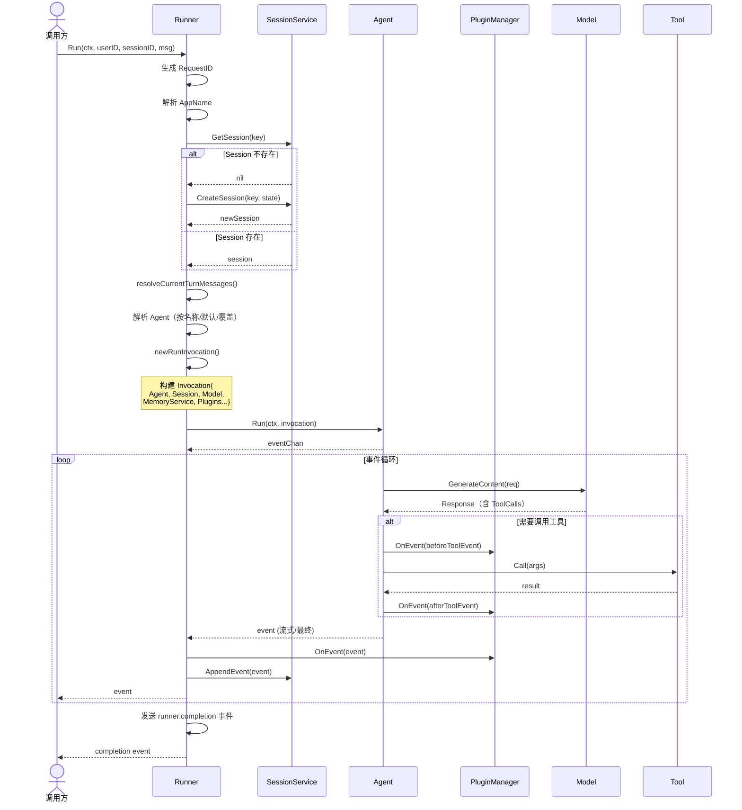

---

## 6. Model 层完整类型

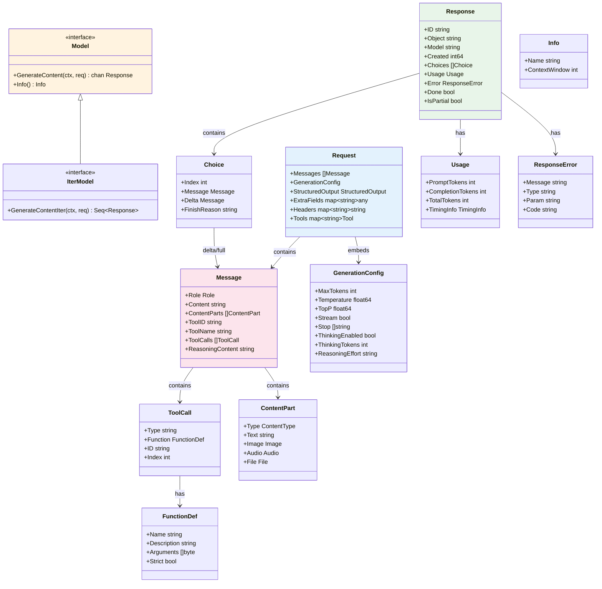

---

## 7. Tool 系统完整层次

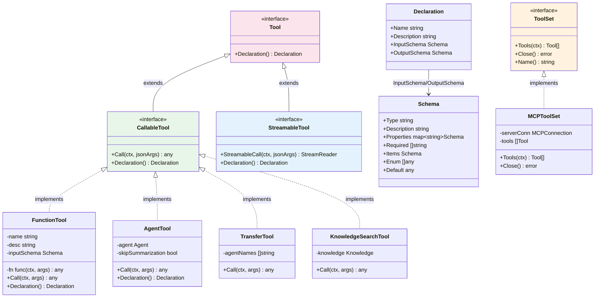

---

## 8. Session 系统 — Service 与后端

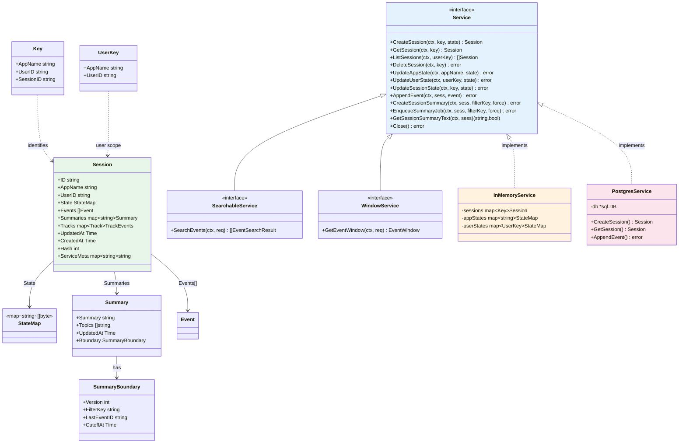

---

## 9. Memory 系统 — 双模式与后端

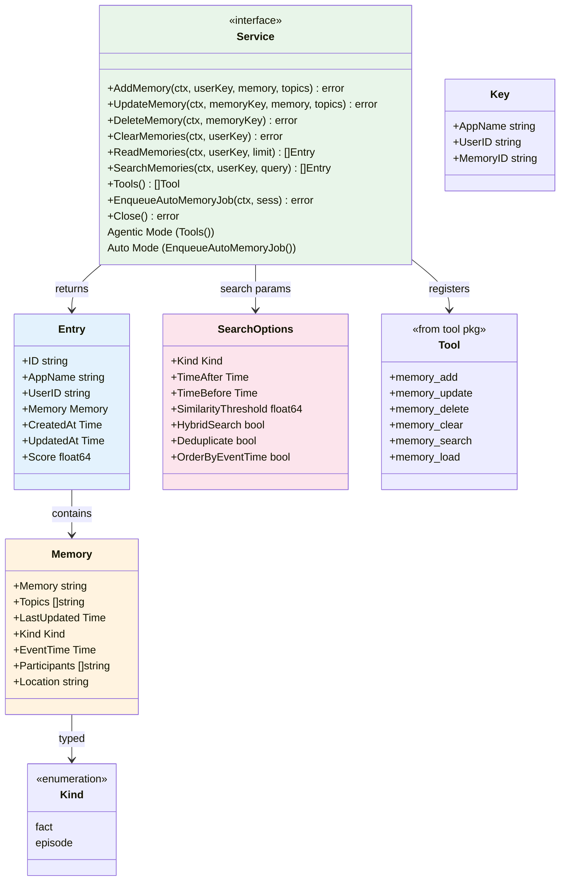

---

## 10. Memory 后端一览

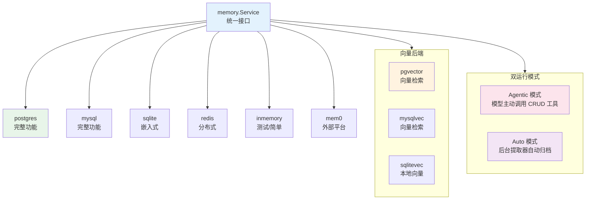

---

## 11. Knowledge/RAG 管线

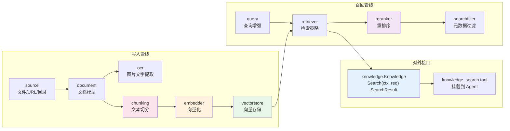

---

## 12. Event 系统 — 事件结构与流转

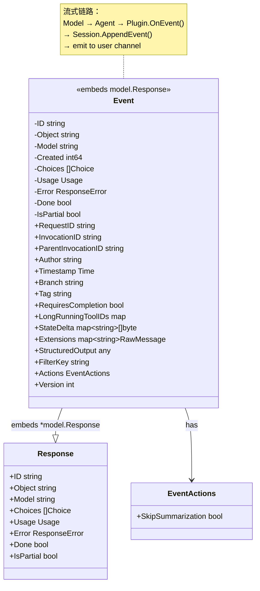

---

## 13. 事件流时序

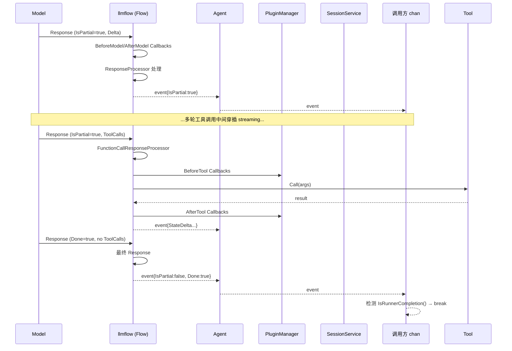

---

## 14. Plugin 系统 — 注册与执行

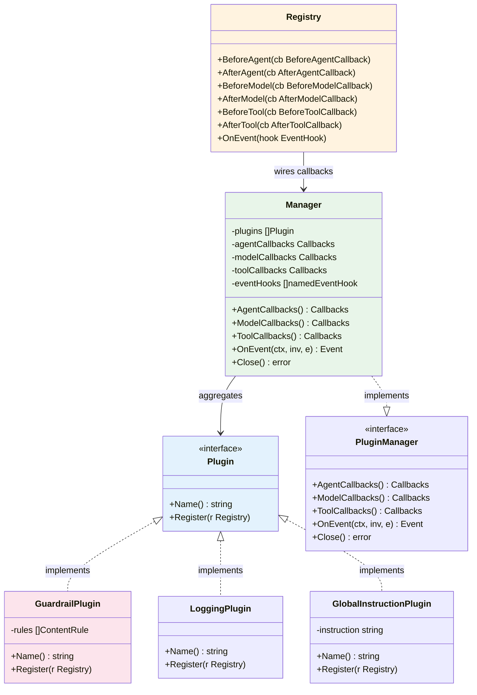

---

## 15. Server 层 — 三种服务协议

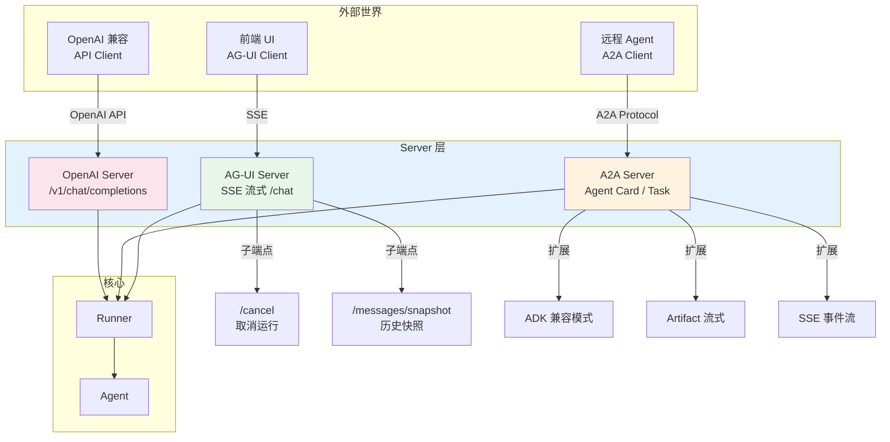

---

## 附录：全模块速查表

| 模块 | 核心接口 | 关键 Struct | 子包数 |
|------|---------|------------|--------|
| **agent** | `Agent`, `PluginManager` | `Invocation`, `Info`, `RunOptions` | ~15 |
| **llmagent** | (实现 Agent) | `LLMAgent`, `Options` | - |
| **graphagent** | (实现 Agent) | `GraphAgent` | - |
| **runner** | `Runner`, `ManagedRunner`, `SteerableRunner` | `runnerImpl`, `RunStatus` | - |
| **model** | `Model`, `IterModel` | `Request`, `Response`, `Message` | ~9 |
| **tool** | `Tool`, `CallableTool`, `StreamableTool`, `ToolSet` | `Declaration`, `Schema` | ~16 |
| **session** | `Service` | `Session`, `Key`, `Summary` | ~8 |
| **memory** | `Service` | `Entry`, `Memory`, `SearchOptions` | ~10 |
| **knowledge** | `Knowledge` | `SearchRequest`, `SearchResult` | ~11 |
| **graph** | (StateGraph 流式 API) | `Graph`, `Node`, `Edge`, `Executor` | ~1 |
| **event** | (值类型) | `Event`, `EventActions` | - |
| **plugin** | `Plugin` | `Manager`, `Registry` | ~8 |
| **server** | `agui.Server`, `a2a.Server` | - | ~3 |
