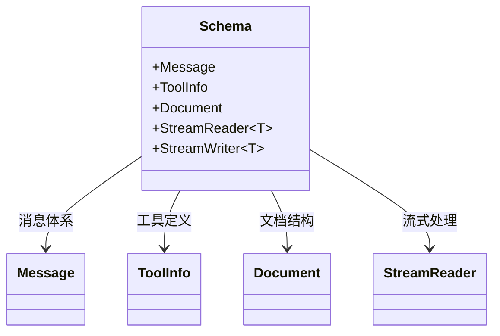
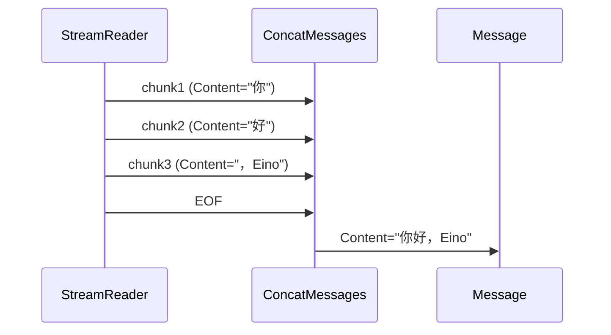

# Schema 层详解

Schema 层是 Eino 框架的数据基石，定义了消息（Message）、工具（Tool）、文档（Document）和流（Stream）四大核心数据结构。所有组件接口均围绕这些类型构建。



## 1. Message 体系

> 源码位置：`schema/message.go`

### 1.1 RoleType 角色类型

`RoleType` 定义了消息的四种角色（`schema/message.go:108-119`）：

| 常量 | 值 | 说明 |
|------|-----|------|
| `User` | `"user"` | 用户输入消息 |
| `Assistant` | `"assistant"` | 模型返回消息 |
| `System` | `"system"` | 系统提示消息 |
| `Tool` | `"tool"` | 工具调用结果消息 |

### 1.2 Message 结构体

`Message` 是 Eino 中最核心的数据结构，承载模型输入输出（`schema/message.go:497-531`）：

```go
// 纯文本消息
msg := &schema.Message{
    Role:    schema.User,
    Content: "什么是 Eino？",
}

// 多模态用户输入
msg := &schema.Message{
    Role: schema.User,
    UserInputMultiContent: []schema.MessageInputPart{
        {Type: schema.ChatMessagePartTypeText, Text: "描述这张图片"},
        {Type: schema.ChatMessagePartTypeImageURL, Image: &schema.MessageInputImage{
            MessagePartCommon: schema.MessagePartCommon{
                URL: ptr("https://example.com/cat.jpg"),
            },
            Detail: schema.ImageURLDetailHigh,
        }},
    },
}
```

核心字段一览：

| 字段 | 类型 | 说明 |
|------|------|------|
| `Role` | `RoleType` | 消息角色 |
| `Content` | `string` | 纯文本内容 |
| `MultiContent` | `[]ChatMessagePart` | **已废弃**，旧版多模态 |
| `UserInputMultiContent` | `[]MessageInputPart` | 用户多模态输入 |
| `AssistantGenMultiContent` | `[]MessageOutputPart` | 模型多模态输出 |
| `ToolCalls` | `[]ToolCall` | 助手的工具调用请求 |
| `ToolCallID` | `string` | 工具结果关联的调用 ID |
| `ToolName` | `string` | 工具名称 |
| `ResponseMeta` | `*ResponseMeta` | 响应元数据 |
| `ReasoningContent` | `string` | 推理思考过程 |
| `Extra` | `map[string]any` | 扩展信息 |

### 1.3 ToolCall 与 FunctionCall

模型发起工具调用时，`ToolCall` 描述调用细节（`schema/message.go:132-144`）：

```go
type ToolCall struct {
    Index    *int           // 流式合并时标识同一次调用的分片
    ID       string         // 调用唯一标识
    Type     string         // 类型，默认 "function"
    Function FunctionCall   // 函数调用信息
    Extra    map[string]any
}

type FunctionCall struct {  // line 123-128
    Name      string // 函数名
    Arguments string // JSON 格式参数
}
```

### 1.4 ResponseMeta 与 TokenUsage

`ResponseMeta` 收集模型响应的元信息（`schema/message.go:447-455`）：

```go
type ResponseMeta struct {
    FinishReason string      // "stop"/"length"/"tool_calls" 等
    Usage        *TokenUsage
    LogProbs     *LogProbs
}

type TokenUsage struct {  // line 534-545
    PromptTokens            int
    CompletionTokens        int
    TotalTokens             int
    PromptTokenDetails      PromptTokenDetails
    CompletionTokensDetails CompletionTokensDetails
}
```

### 1.5 多模态输入

用户向模型传递多模态内容使用 `MessageInputPart`（`schema/message.go:207-229`）：

```go
type MessageInputPart struct {
    Type             ChatMessagePartType
    Text             string
    Image            *MessageInputImage
    Audio            *MessageInputAudio
    Video            *MessageInputVideo
    File             *MessageInputFile
    ToolSearchResult *ToolSearchResult
    Extra            map[string]any
}
```

所有多模态媒介类型均嵌入 `MessagePartCommon`（`schema/message.go:159-173`），提供 `URL`、`Base64Data`、`MIMEType` 统一字段。

### 1.6 多模态输出

模型返回多模态内容使用 `MessageOutputPart`（`schema/message.go:268-294`）：

```go
type MessageOutputPart struct {
    Type          ChatMessagePartType
    Text          string
    Image         *MessageOutputImage
    Audio         *MessageOutputAudio
    Video         *MessageOutputVideo
    Reasoning     *MessageOutputReasoning  // 推理模型输出
    Extra         map[string]any
    StreamingMeta *MessageStreamingMeta    // 流式元数据
}
```

`MessageOutputReasoning`（`schema/message.go:249-256`）捕获推理模型的思考过程和加密签名。

### 1.7 消息构造函数

Eino 提供便捷的消息构造函数（`schema/message.go:1104-1155`）：

```go
// 系统消息
sysMsg := schema.SystemMessage("你是一个 Eino 助手")

// 用户消息
userMsg := schema.UserMessage("什么是 Eino？")

// 助手消息（可带工具调用）
asstMsg := schema.AssistantMessage("结果如下", nil)

// 工具结果消息
toolMsg := schema.ToolMessage(`{"temp": 25}`, "call_abc123",
    schema.WithToolName("get_weather"))
```

### 1.8 模板与格式化

#### FormatType

消息模板支持三种格式化方式（`schema/message.go:96-105`）：

| 格式 | 说明 |
|------|------|
| `FString` | Python 风格格式化 `{variable}`，基于 PEP 3101 |
| `GoTemplate` | Go 标准模板 `{{.variable}}` |
| `Jinja2` | Jinja2 模板 `` |

#### MessagesTemplate 接口

```go
// line 572-574
type MessagesTemplate interface {
    Format(ctx context.Context, vs map[string]any, formatType FormatType) ([]*Message, error)
}
```

`Message` 和 `MessagesPlaceholder` 均实现此接口。

#### MessagesPlaceholder

`MessagesPlaceholder` 在模板中占位，运行时替换为消息列表（`schema/message.go:594-599`）：

```go
// 构建对话模板
tpl := prompt.FromMessages(
    schema.SystemMessage("你是 Eino 助手"),
    schema.MessagesPlaceholder("history", false), // 占位符
    schema.UserMessage("{query}"),
)

// 格式化时注入变量
msgs, err := tpl.Format(ctx, map[string]any{
    "history": []*schema.Message{
        {Role: schema.User, Content: "Eino 是什么？"},
        {Role: schema.Assistant, Content: "Eino 是一个 LLM 应用框架"},
    },
    "query": "如何使用？",
})
```

### 1.9 流式合并函数

Eino 提供了一系列合并函数，将流式分片合并为完整数据：

| 函数 | 说明 |
|------|------|
| `ConcatMessages(msgs)` | 合并同角色的消息流（`schema/message.go:1643`） |
| `ConcatMessageArray(mas)` | 合并消息数组流（`schema/message.go:91`） |
| `ConcatToolResults(chunks)` | 合并工具结果流（`schema/message.go:1177`） |
| `ConcatMessageStream(s)` | 从 StreamReader 消费并合并（`schema/message.go:1841`） |

```go
// 典型用法：流式接收后合并
var msgs []*schema.Message
for {
    chunk, err := stream.Recv()
    if errors.Is(err, io.EOF) { break }
    msgs = append(msgs, chunk)
}
merged, err := schema.ConcatMessages(msgs)
```

`ConcatMessages` 内部处理：Content 文本拼接、ToolCalls 按 Index 合并、多模态分片归并、TokenUsage 取最大值。



---

## 2. Tool Schema

> 源码位置：`schema/tool.go`

### 2.1 ToolInfo

`ToolInfo` 描述一个可调用工具的元信息（`schema/tool.go:128-143`）：

```go
type ToolInfo struct {
    Name         string         // 工具唯一名称
    Desc         string         // 工具描述（含 few-shot 示例可提高准确度）
    Extra        map[string]any
    *ParamsOneOf                // 参数描述（nil 表示无参数）
}
```

### 2.2 ParamsOneOf：两种参数描述方式

`ParamsOneOf` 支持两种参数定义方式（`schema/tool.go:275-280`），二选一使用：

```go
// 方式一：轻量级 ParameterInfo（覆盖常见场景）
params := schema.NewParamsOneOfByParams(map[string]*schema.ParameterInfo{
    "city": {Type: schema.String, Desc: "城市名", Required: true},
    "unit": {Type: schema.String, Desc: "温度单位", Enum: []string{"C", "F"}},
})

// 方式二：完整 JSON Schema（支持 anyOf/oneOf/$defs 等高级特性）
jsonSchema := &jsonschema.Schema{}
params := schema.NewParamsOneOfByJSONSchema(jsonSchema)
```

### 2.3 ParameterInfo

`ParameterInfo` 描述工具的单个参数（`schema/tool.go:245-258`）：

```go
type ParameterInfo struct {
    Type      DataType                  // 参数类型
    ElemInfo  *ParameterInfo            // 数组元素类型
    SubParams map[string]*ParameterInfo // 对象子参数
    Desc      string                    // 参数描述
    Enum      []string                  // 枚举值
    Required  bool                      // 是否必需
}
```

`DataType` 常量（`schema/tool.go:37-44`）：`Object`、`Number`、`Integer`、`String`、`Array`、`Null`、`Boolean`。

### 2.4 ToolChoice

`ToolChoice` 控制模型如何使用工具（`schema/tool.go:50-65`）：

| 常量 | 值 | 对应 OpenAI | 说明 |
|------|-----|-------------|------|
| `ToolChoiceForbidden` | `"forbidden"` | `none` | 禁止调用工具 |
| `ToolChoiceAllowed` | `"allowed"` | `auto` | 模型自行决定 |
| `ToolChoiceForced` | `"forced"` | `required` | 必须调用工具 |

`AgenticToolChoice`（`schema/tool.go:67-78`）为 Agentic 模型提供更精细的控制，支持指定允许/强制的工具列表，包含 `AllowedTool`、`AllowedMCPTool`、`AllowedServerTool` 三种工具引用方式。

### 2.5 ToolResult 与多模态工具输出

```go
// ToolArgument: 工具调用参数 (line 470-473)
type ToolArgument struct {
    Text string // JSON 格式参数
}

// ToolResult: 多模态工具输出 (line 478-482)
type ToolResult struct {
    Parts []ToolOutputPart
}
```

`ToolOutputPart`（`schema/tool.go:441-466`）支持文本、图片、音频、视频、文件和工具搜索结果六种内容类型，满足工具返回多模态数据的需求。

